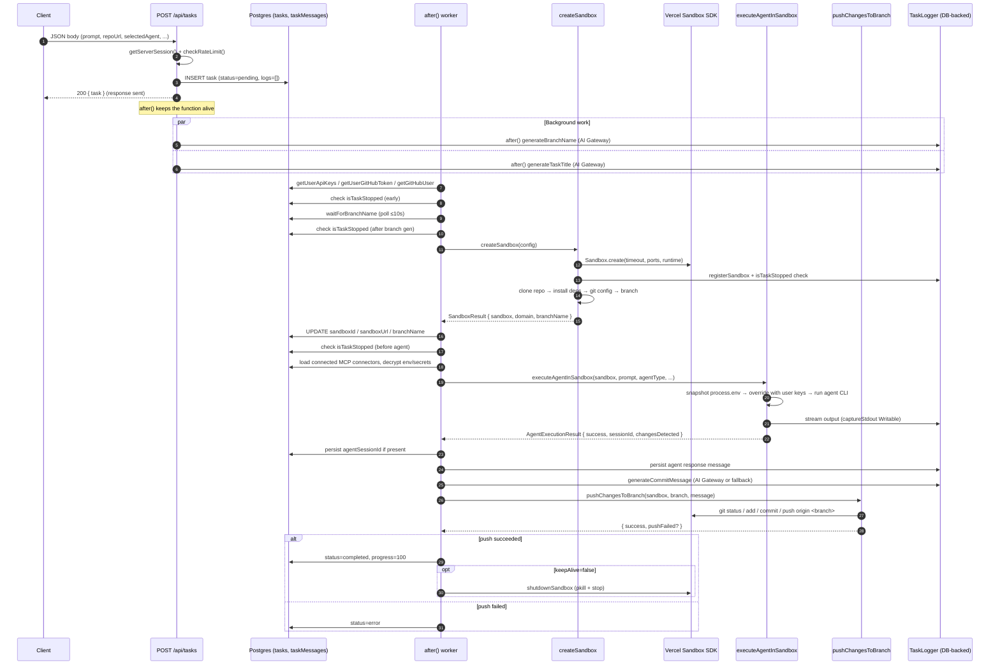

# Runtime Flow: Request → Sandbox → Agent → Push

This page traces a single task from the moment a client posts to `POST /api/tasks` through to the moment the agent's work is pushed back to GitHub. It explains why each phase exists, who owns it, where state lives, and — most importantly — every checkpoint where a user-initiated stop is honored.

All source paths below are relative to the repository root.

## High-level shape

A task is a long-lived piece of work. The HTTP request that creates it returns immediately with a `pending` task row, and the rest of the lifecycle happens **after** the response is sent. This is the single most important architectural fact about the runtime flow, because it determines why so much of the code lives inside `after(...)` callbacks and why session-scoped state (cookies, API keys) must be loaded *before* entering those callbacks.



The diagram above is the canonical happy path. Every other path is a variation on it: a timeout, a cancellation, a missing API key, or an agent that reports `success=false`.

## Phase 1 — POST /api/tasks (synchronous)

`POST /api/tasks` lives in [`app/api/tasks/route.ts`](repo://app/api/tasks/route.ts). Its job is narrow: validate the request, insert a `pending` row, and return that row. Anything beyond that is deferred.

The handler does the following in order, all before sending the response:

1. **Authenticate** via `getServerSession()` and return `401` if there is no session.
2. **Rate-limit** via `checkRateLimit(session.user.id)`, which combines `tasksToday` (rows created today) and `userMessagesToday` (user messages sent today). On rejection it returns `429` with the daily total and reset time.
3. **Validate the body** with `insertTaskSchema.parse(...)`, supplying defaults (`status='pending'`, `progress=0`, `logs=[]`) and using either the client-provided `id` or a new 12-character `generateId(12)`.
4. **Insert the task** into Postgres and capture the returned row as `newTask`.
5. **Snapshot the credentials** the worker will need (`getUserApiKeys`, `getUserGitHubToken`, `getGitHubUser`, `getMaxSandboxDuration`) — this must happen *before* `after()` because session cookies are not available inside the background callback.
6. **Return** `NextResponse.json({ task: newTask })`.

Two `after()` callbacks are scheduled at this stage for non-blocking AI enrichment:

- `generateBranchName` (`app/api/tasks/route.ts:94-155`) — calls `lib/utils/branch-name-generator.ts`. If `AI_GATEWAY_API_KEY` is missing it logs and returns; otherwise it calls the gateway, writes `branchName` back to the row, and falls back to `createFallbackBranchName(taskId)` on failure.
- `generateTaskTitle` (`app/api/tasks/route.ts:158-211`) — same shape as the branch generator but writes to `title`, with `createFallbackTitle(prompt)` as the fallback.

### Why `after()` matters

The third `after()` (`app/api/tasks/route.ts:223-243`) is the one that runs the actual task. The comment in the source is explicit:

> CRITICAL: Wrap in after() to ensure Vercel doesn't kill the function after response. Without this, serverless functions terminate immediately after sending the response.

`after()` from `next/server` schedules work that continues running **after** the response is flushed but before the serverless instance is frozen. This is the only reason a task that may take many minutes can live inside a Next.js route handler. Two practical consequences flow from this:

- All I/O the worker needs (API keys, GitHub token, GitHub user) **must** be resolved before `after()` is called. Inside the callback, cookies and request-scoped state are gone.
- Errors thrown inside `after()` are not surfaced to the client; they are logged with `console.error` and the `TaskLogger` is responsible for persisting them to the `tasks` row.

## Phase 2 — processTaskWithTimeout → processTask

The `after()` callback calls `processTaskWithTimeout(newTask.id, ...)` with all of the previously captured parameters. From here on, the flow is split across three helpers:

- [`processTaskWithTimeout`](repo://app/api/tasks/route.ts#L252-L332) — enforces the `maxDuration` ceiling using a `Promise.race` between `processTask(...)` and a `setTimeout` reject. It also schedules a "Task is approaching timeout" warning one minute before the deadline and clears both timers on completion or failure.
- [`processTask`](repo://app/api/tasks/route.ts#L366-L736) — the actual work pipeline.
- `isTaskStopped(taskId)` — a tiny `SELECT status FROM tasks WHERE id=?` helper that the pipeline polls. It returns `true` iff the row's `status` is `'stopped'`; the comment notes it swallows errors and returns `false` to avoid aborting the worker when the DB is briefly unavailable.

`processTask` opens with bookkeeping that runs in this exact order:

1. `logger.updateStatus('processing', ...)` and `logger.updateProgress(10, ...)`.
2. Insert the user's prompt into `taskMessages` (`role='user'`).
3. **First `isTaskStopped` checkpoint** — before doing anything else. If the row is already `'stopped'`, log it and return.
4. `waitForBranchName(taskId, 10000)` — poll for up to 10 seconds for the AI-generated branch name to land. **Second `isTaskStopped` checkpoint** fires after the wait.
5. `logger.updateProgress(15, 'Creating sandbox environment')` and `detectPortFromRepo(repoUrl, githubToken)` so the sandbox is created with the right port exposed.
6. Call `createSandbox(...)` with a rich `SandboxConfig` and two callbacks: `onProgress(progress, message)` (wired to `logger.updateProgress`) and `onCancellationCheck()` (wired to `isTaskStopped`).

### Where the sandbox URL, sandbox ID, and branch land

On a successful `createSandbox`, `processTask` writes back `sandboxId`, `sandboxUrl`, and (only if no AI branch name was ready) `branchName` to the `tasks` row at `app/api/tasks/route.ts:518`. This is the moment the UI gains a `sandboxUrl` it can render.

Immediately after, a **third `isTaskStopped` checkpoint** runs at `app/api/tasks/route.ts:521`. If the task has been stopped, the sandbox is shut down via `shutdownSandbox(sandboxResult.sandbox)` and the worker returns.

## Phase 3 — createSandbox

[`lib/sandbox/creation.ts`](repo://lib/sandbox/creation.ts) is the largest file in the runtime flow. It is responsible for everything that happens between the empty sandbox and the moment the agent CLI starts. Its contract is `Promise<SandboxResult>`, where `SandboxResult` may include `{ success: false, cancelled: true }` to signal a cancellation distinct from a failure.

The sequence inside `createSandbox` is:

1. **Cancellation check** at `creation.ts:52` — if `onCancellationCheck()` returns `true`, return `{ success: false, cancelled: true }` immediately.
2. **Env validation** via `validateEnvironmentVariables(selectedAgent, githubToken, apiKeys)` (`lib/sandbox/config.ts`). This rejects the request early if the chosen agent's API key (`AI_GATEWAY_API_KEY` for Claude/Codex, `CURSOR_API_KEY` for Cursor, `GEMINI_API_KEY` for Gemini, either `AI_GATEWAY_API_KEY` or `ANTHROPIC_API_KEY` for OpenCode) is missing, if no GitHub token is available, or if any of `SANDBOX_VERCEL_TEAM_ID`, `SANDBOX_VERCEL_PROJECT_ID`, `SANDBOX_VERCEL_TOKEN` is unset.
3. **Authenticated repo URL** via `createAuthenticatedRepoUrl(repoUrl, githubToken)`, which embeds the token as the username and `x-oauth-basic` as the password for `github.com` URLs only.
<!-- openwiki: broken internal link [../../concepts/sandbox-lifecycle.md] file "../../concepts/sandbox-lifecycle.md" does not exist. Fix the href or restore the target, then delete this comment. -->
4. **Sandbox creation** via `Sandbox.create({ teamId, projectId, token, timeout, ports, runtime: 'node22', resources: { vcpus: 4 } })`. On success the sandbox is immediately `registerSandbox(taskId, sandbox, keepAlive)`'d (see [Sandbox Lifecycle](../../concepts/sandbox-lifecycle.md)) and a **second cancellation check** runs at `creation.ts:106`.
5. **Clone** the repo to `/vercel/sandbox/project` with `git clone --depth 1 <authenticatedUrl> <PROJECT_DIR>`. `PROJECT_DIR` is exported from `lib/sandbox/commands.ts`.
6. **Detect project type and install dependencies** (only if `installDependencies !== false`):
   - If `package.json` is found, call `detectPackageManager(sandbox, logger)` to choose between `npm`/`pnpm`/`yarn`. If pnpm or yarn isn't already installed, install it globally with `npm install -g`. Then `installDependencies(sandbox, packageManager, logger)`. If the chosen manager fails and isn't npm, retry with npm. **Cancellation check** runs after dependency install at `creation.ts:230`.
   - If `requirements.txt` is found, install pip (via `get-pip.py` or `apt-get install python3-pip`) and run `python3 -m pip install -r requirements.txt`. Errors here are logged but do not abort — the sandbox is still usable.
<!-- openwiki: broken internal link [../../concepts/sandbox-lifecycle.md] file "../../concepts/sandbox-lifecycle.md" does not exist. Fix the href or restore the target, then delete this comment. -->
7. **Auto-start dev server** if `package.json` has a `dev` script and `installDependencies` is true. Port is `3000` for Next.js or `5173` for Vite. Vite projects get a `sed`-based patch to `vite.config.js` to set `server.host: true`, and the local file is added to `~/.gitignore_global` so the change never gets committed. Next.js 16 projects get an extra `--webpack` flag. The dev command runs in `detached: true` mode with two `Writable` streams (see [Sandbox Lifecycle](../../concepts/sandbox-lifecycle.md)) that prefix each captured line with `[SERVER]` and forward it through `logger.info`.
8. **Browser install** if `enableBrowser` is true: install Fedora/Chromium dependencies via `sudo dnf install -y` in groups, run `sudo ldconfig`, install `agent-browser` globally, run `agent-browser install` to download Chromium, and write a skill file (`SKILL.md` for Claude, `AGENTS.md` for Gemini/Codex/OpenCode, `.cursor/rules/*.mdc` for Cursor, `.github/copilot-instructions.md` for Copilot) describing the agent-browser CLI.
9. **Git config** (`user.name`, `user.email`) using the GitHub user's name and a `username@users.noreply.github.com` email (or fallbacks `Coding Agent` / `agent@example.com`). If the repo has no commits, seed a `README.md`, create a `main` branch, and `git push -u origin main`.
10. **Branch resolution** (`creation.ts:840-978`). If `preDeterminedBranchName` is set, the code checks `git show-ref --verify` locally, then `git ls-remote --heads origin`, and either checks out the existing branch, fetches and checks out the remote, or creates it. Otherwise it falls back to `agent/<timestamp>-<id>`.

<!-- openwiki: broken internal link [../../concepts/sandbox-lifecycle.md] file "../../concepts/sandbox-lifecycle.md" does not exist. Fix the href or restore the target, then delete this comment. -->
`createSandbox` returns `{ success: true, sandbox, domain, branchName }` on success or `{ success: false, cancelled: true }` / `{ success: false, error }` on failure. `domain` is `sandbox.domain(devPort)` — see [Sandbox Lifecycle](../../concepts/sandbox-lifecycle.md) for the SDK semantics.

## Phase 4 — executeAgentInSandbox

After `createSandbox` succeeds and the **third `isTaskStopped` checkpoint** passes (`app/api/tasks/route.ts:521`), `processTask` prepares for the agent:

<!-- openwiki: broken internal link [../../concepts/agent-system.md] file "../../concepts/agent-system.md" does not exist. Fix the href or restore the target, then delete this comment. -->
- Loads `connectors` for the current user, filters by `status='connected'`, decrypts `env` and `oauthClientSecret` via `lib/crypto.ts`'s `decrypt`, and stores the resulting IDs in `tasks.mcpServerIds`. See [Agent System & MCP Connectors](../../concepts/agent-system.md) for the connector shape.
- **Sanitizes the prompt**: replaces backticks with `'`, strips `$` and `\`, and prefixes any line starting with `-` with a leading space to keep it from being parsed as a CLI option.
- Generates an `agentMessageId` (used by streaming agents to update a single `taskMessages` row in place).
- Calls `executeAgentInSandbox(sandbox, sanitizedPrompt, selectedAgent, logger, selectedModel, mcpServers, undefined /* onCancellationCheck */, apiKeys, undefined /* isResumed */, undefined /* sessionId */, taskId, agentMessageId)`.

[`executeAgentInSandbox`](repo://lib/sandbox/agents/index.ts#L18-L159) is the dispatcher. Its contract is `AgentExecutionResult`:

```ts
{ success: boolean; output?: string; agentResponse?: string;
  cliName?: string; changesDetected?: boolean; error?: string;
  streamingLogs?: unknown[]; logs?: LogEntry[]; sessionId?: string }
```

The dispatcher has a very specific lifecycle:

1. **Cancellation check** at `agents/index.ts:39` — the optional `onCancellationCheck` callback is the canonical way to interrupt an agent. `processTask` does not pass one for the initial run, but follow-up messages can.
2. **GitHub token** for `copilot` — lazy-loaded via `await import('@/lib/github/user-token')` to avoid pulling the GitHub client when it isn't needed.
<!-- openwiki: broken internal link [../../concepts/agent-system.md] file "../../concepts/agent-system.md" does not exist. Fix the href or restore the target, then delete this comment. -->
3. **Temp-env-var pattern** (`agents/index.ts:57-75`): the current values of `OPENAI_API_KEY`, `GEMINI_API_KEY`, `CURSOR_API_KEY`, `ANTHROPIC_API_KEY`, `AI_GATEWAY_API_KEY`, `GH_TOKEN`, `GITHUB_TOKEN` are snapshotted into `originalEnv`. Then any user-supplied keys are written into `process.env`. The `try/finally` at `agents/index.ts:149-158` restores the originals — this is critical because the worker process is shared across tasks and a leak would give one user's keys to the next user. See [Agent System & MCP Connectors](../../concepts/agent-system.md) for the rationale.
4. **Switch on `agentType`**: `'claude' | 'codex' | 'copilot' | 'cursor' | 'gemini' | 'opencode'`. Each module exports `execute<Type>InSandbox(...)` with a slightly different signature; the dispatcher threads the relevant subset through.

For `claude` specifically ([`lib/sandbox/agents/claude.ts`](repo://lib/sandbox/agents/claude.ts)):

- `installClaudeCLI` checks for `which claude`, and if missing runs `curl -fsSL https://claude.ai/install.sh | bash`. Then it writes `~/.config/claude/config.json` with `api_key`, `api_base_url: 'https://ai-gateway.vercel.sh'`, and `default_model: <selectedModel || 'claude-sonnet-4-5'>`.
- MCP servers (if any) are added with `claude mcp add ... --transport http` for remote and `claude mcp add -- ...` for local STDIO. Local servers can pass through `--env KEY=VALUE` pairs. The API key is injected via the `ANTHROPIC_API_KEY` / `ANTHROPIC_BASE_URL` env-var prefix.
- The instruction is executed with `claude --model "<model>" --dangerously-skip-permissions --output-format stream-json --verbose "<sanitizedPrompt>"`. `--resume` is appended when `isResumed` is true.
- The CLI runs `detached: true`. A `Writable` stream parses each `stream-json` line, accumulates assistant text and tool calls, and updates the `taskMessages` row identified by `agentMessageId` in real time.
- A loop at `claude.ts:428` polls every 1 second until `isCompleted` flips (a `result` JSON line), then runs `git status --porcelain` to populate `changesDetected`.

The result is returned to `processTask`, which persists `agentSessionId` (used by follow-up runs to resume Cursor/Claude sessions) and saves the agent's response message.

## Phase 5 — pushChangesToBranch → DB finalization

When `agentResult.success === true`:

1. `logger.success('Agent execution completed')` and `logger.info('Code changes applied successfully')`.
2. Persist `agentResult.agentResponse` into `taskMessages` (`role='agent'`).
3. Generate a commit message via `lib/utils/commit-message-generator.ts` (AI Gateway if available, else `createFallbackCommitMessage(prompt)`).
4. Call [`pushChangesToBranch(sandbox, branchName, commitMessage, logger)`](repo://lib/sandbox/git.ts#L5-L73). The function:
   - Runs `git status --porcelain`. Empty output means no changes; it returns `{ success: true }` early.
   - Otherwise runs `git add .`, then `git commit -m <message>`, then `git push origin <branch>`.
   - On a push failure with `Permission` / `access_denied` / `403` in the stderr it logs a permission hint and returns `{ success: true, pushFailed: true }` — the local commit still exists, and the caller decides what to do.
5. Branch on `keepAlive`:
<!-- openwiki: broken internal link [../../concepts/sandbox-lifecycle.md] file "../../concepts/sandbox-lifecycle.md" does not exist. Fix the href or restore the target, then delete this comment. -->
   - **`keepAlive: true`** — leave the sandbox running for follow-up messages. The dev server is already started, and `Sandbox.get(sandboxId)` from any later request can reconnect. See [Sandbox Lifecycle](../../concepts/sandbox-lifecycle.md).
   - **`keepAlive: false`** — `unregisterSandbox(taskId)` (clears the in-memory map) and `shutdownSandbox(sandbox)` (pkill `node`/`python`/`npm`/`yarn`/`pnpm`, then `sandbox.stop()`). `shutdownSandbox` is best-effort: Vercel also garbage-collects sandboxes after their timeout.
6. If `pushResult.pushFailed === true`, set `status='error'` and throw — the worker catches this and goes to the error path. Otherwise set `status='completed'` and `progress=100`.

## The error path

`processTask`'s outer `try/catch` (`app/api/tasks/route.ts:706-735`) handles anything thrown from the pipeline. On any error:

1. If a sandbox exists and `keepAlive === false`, `unregisterSandbox(taskId)` and `shutdownSandbox(sandbox)`. If `keepAlive === true`, the sandbox is left alive so the user can retry.
2. `logger.error('Error occurred during task processing')` and `logger.updateStatus('error', errorMessage)`.

The `processTaskWithTimeout` layer adds its own timeout branch: when the `setTimeout` reject wins the `Promise.race`, it logs "Task execution timed out" via the logger and sets `status='error'` with the timeout message. The "approaching timeout" warning timer is cleared in both the success and error branches.

## Cancellation checkpoints (the full list)

The runtime flow has **five** distinct cancellation checkpoints. They are easy to miss because they look identical (a single `if (await isTaskStopped(taskId))` line), but they fire at materially different stages:

| # | File / line | Fires after… |
|---|-------------|--------------|
| 1 | `app/api/tasks/route.ts:420` | Status set to `processing`, user message saved. Before `waitForBranchName`. |
| 2 | `app/api/tasks/route.ts:429` | `waitForBranchName` completes (or 10s elapses). Before `createSandbox`. |
| 3 | `app/api/tasks/route.ts:473` (inside `createSandbox` via `onCancellationCheck`) | `Sandbox.create` returns, `registerSandbox` ran. Before clone. |
| 4 | `app/api/tasks/route.ts:489` | `createSandbox` returns success. Before agent execution. |
| 5 | `app/api/tasks/route.ts:521` | Sandbox URL/ID/branch persisted. Before agent execution (a duplicate guard after the post-`createSandbox` cancellation). |

Additional `onCancellationCheck` calls happen **inside** `createSandbox` itself:

- `lib/sandbox/creation.ts:52` — before any work.
- `lib/sandbox/creation.ts:106` — right after `Sandbox.create` succeeds.
- `lib/sandbox/creation.ts:230` — after Node.js dependency install.
- `lib/sandbox/creation.ts:501` — before git config.

And one more at the entry of `executeAgentInSandbox` (`lib/sandbox/agents/index.ts:39`) — although `processTask` does not pass an `onCancellationCheck` for the initial run, the dispatcher itself still honors a callback if supplied.

Every checkpoint follows the same pattern: it checks `tasks.status === 'stopped'`, logs a static "Task was stopped at <stage>" message, performs whatever local cleanup is possible (e.g., `shutdownSandbox`), and returns without throwing — the task ends as `stopped`, not as `error`.

The "stopped" status is set by `PATCH /api/tasks/:taskId` with `body.action === 'stop'` ([`app/api/tasks/[taskId]/route.ts:62`](repo://app/api/tasks/[taskId]/route.ts#L62-L99)). That handler rejects the stop with `400` if the task is not currently `processing`, then writes `status='stopped'`, `error='Task was stopped by user'`, and `completedAt`, and calls `killSandbox(taskId)` from the in-memory registry. The HTTP response returns immediately; the worker discovers the status change at its next checkpoint.

## State and storage

Throughout the flow, the `tasks` row is the single source of truth for state:

<!-- openwiki: broken internal link [../../concepts/sandbox-lifecycle.md] file "../../concepts/sandbox-lifecycle.md" does not exist. Fix the href or restore the target, then delete this comment. -->
- **Sandbox reachability** is split between two stores: `sandboxId` and `sandboxUrl` are persisted on `tasks` (so any future request can call `Sandbox.get(sandboxId)`), while a process-local `Map<taskId, Sandbox>` in `lib/sandbox/sandbox-registry.ts` holds the live reference for the current serverless execution. The follow-up endpoint `/api/tasks/[taskId]/start-sandbox` reconnects via the persisted `sandboxId`. See [Sandbox Lifecycle](../../concepts/sandbox-lifecycle.md).
- **Logs** are written via `TaskLogger` (`lib/utils/task-logger.ts`). Every `logger.info/command/error/success/updateProgress/updateStatus` call appends a `LogEntry` to `tasks.logs` JSONB. Failures inside the logger are swallowed — the comment in `task-logger.ts:51` is explicit: "Don't throw — we don't want logging failures to break the main process."
- **Messages** are in a separate `taskMessages` table. `executeAgentInSandbox` is given an `agentMessageId` so streaming agents can update a single row in place rather than appending one log entry per token.
- **Agent session** is persisted as `tasks.agentSessionId` when the agent returns one. This is what `/api/tasks/[taskId]/continue` uses with `--resume` for follow-up turns.

## Cross-cutting concerns

- **Re-entrancy**: because the worker can be killed by a sandbox timeout even after `agentResult.success === true`, the `finally` block in `executeAgentInSandbox` restores `process.env` regardless of outcome.
<!-- openwiki: broken internal link [../../operations/security-and-redaction.md] file "../../operations/security-and-redaction.md" does not exist. Fix the href or restore the target, then delete this comment. -->
- **Log redaction**: `lib/utils/logging.ts`'s `redactSensitiveInfo` is applied to every command and output before it reaches `TaskLogger`. Per `AGENTS.md`, the primary defense is static log strings — redaction is a backup. See [Security Policy & Log Redaction Rules](../../operations/security-and-redaction.md).
- **Timeouts**: the SDK-level `timeout` is the sandbox lifetime in minutes (`maxDuration` from the request, capped by the user's `maxSandboxDuration` setting and the `MAX_SANDBOX_DURATION` env var default). The route-level `Promise.race` in `processTaskWithTimeout` fires the user-facing timeout error and sets `status='error'`. They are independent: a sandbox can also be shut down by Vercel when its lifetime elapses, in which case commands start failing.
<!-- openwiki: broken internal link [../../concepts/tasks-lifecycle.md] file "../../concepts/tasks-lifecycle.md" does not exist. Fix the href or restore the target, then delete this comment. -->
- **PR creation** is *not* part of this flow. The push goes to a branch; PR open/merge lives in `/api/tasks/[taskId]/pr` and `/api/tasks/[taskId]/merge-pr` and is documented under [Task Lifecycle](../../concepts/tasks-lifecycle.md).

## What to read next

<!-- openwiki: broken internal link [../../concepts/tasks-lifecycle.md] file "../../concepts/tasks-lifecycle.md" does not exist. Fix the href or restore the target, then delete this comment. -->
- [Task Lifecycle & Status Model](../../concepts/tasks-lifecycle.md) — the `tasks` row, statuses, and soft-delete semantics.
<!-- openwiki: broken internal link [../../concepts/sandbox-lifecycle.md] file "../../concepts/sandbox-lifecycle.md" does not exist. Fix the href or restore the target, then delete this comment. -->
- [Sandbox Lifecycle](../../concepts/sandbox-lifecycle.md) — the `Sandbox.get()` reconnect path and the `keepAlive` flag's two effects.
<!-- openwiki: broken internal link [../../concepts/agent-system.md] file "../../concepts/agent-system.md" does not exist. Fix the href or restore the target, then delete this comment. -->
- [Agent System & MCP Connectors](../../concepts/agent-system.md) — the dispatcher, the temp-env-var pattern, and the connector shape.
<!-- openwiki: broken internal link [../../systems/agent-implementations.md] file "../../systems/agent-implementations.md" does not exist. Fix the href or restore the target, then delete this comment. -->
- [Agent Implementations](../../systems/agent-implementations.md) — per-agent auth requirements, MCP support, and resumption.
<!-- openwiki: broken internal link [../../workflows/create-and-run-task.md] file "../../workflows/create-and-run-task.md" does not exist. Fix the href or restore the target, then delete this comment. -->
- [Create and Run Task](../../workflows/create-and-run-task.md) — the user-facing workflow this page implements.
