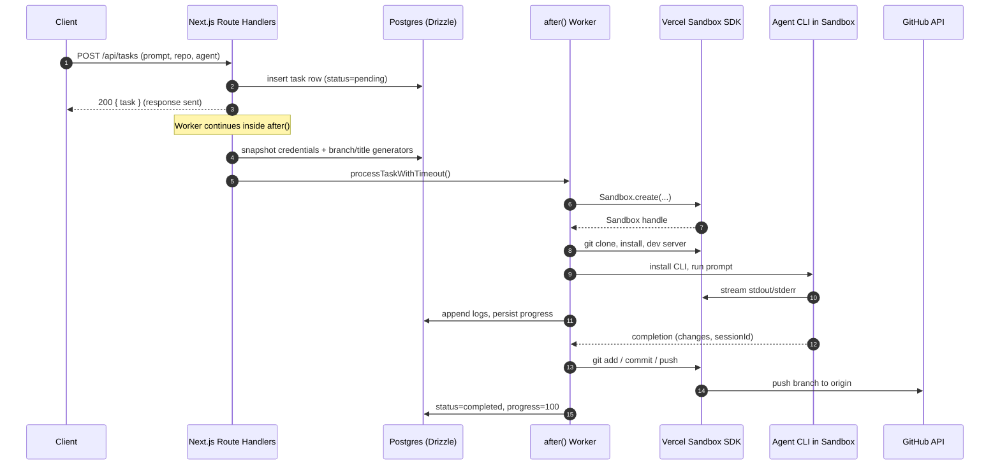
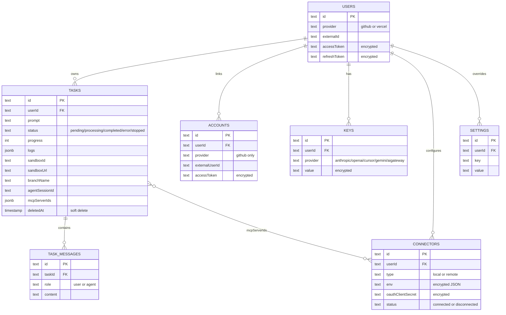

# System Overview

The **Coding Agent Template** is a Next.js 15 (App Router) application that turns a natural-language prompt into a working code change on a real branch. A user signs in, picks a repository and an agent CLI, and a background worker spins up a remote sandbox, runs the agent, and pushes the resulting commits to GitHub.

This page gives the one-screen mental model: where requests come from, what they touch, and which subsystems own which responsibilities. For the step-by-step walkthrough of a single task, see [Runtime Flow: Request → Sandbox → Agent → Push](./runtime-flow.md).

## Request path

A complete interaction has three layers:

1. **Client (React + Jotai)** — pages under `app/` and `app/[owner]/` read tasks via `GET /api/tasks`, create tasks via `POST /api/tasks`, and stream updates via polling the same endpoint.
2. **Next.js route handlers (`app/api/**`)** — every mutation authenticates with `getServerSession()`, enforces rate limits, validates input with Zod, writes the database, and returns. The heavy work is delegated to `after()` callbacks that keep the serverless function alive past the HTTP response.
3. **Sandbox + agent workers** — `lib/sandbox/creation.ts` and `lib/sandbox/agents/*` run inside `after()` against the Vercel Sandbox SDK. The sandbox is the boundary; the worker process never reads files from the user's machine.

The single most important architectural fact is that the **HTTP response is sent before the work begins**. Everything long-running happens inside `after()`, which is the only reason a multi-minute task can live inside a Next.js route handler. See `app/api/tasks/route.ts` for the canonical example, and [Runtime Flow](./runtime-flow.md) for the full phased walkthrough.

## Data path

The state lives in two places that are deliberately kept in sync:

- **Postgres is the source of truth** for tasks, logs, messages, and per-user credentials. The schema lives in [`lib/db/schema.ts`](repo://lib/db/schema.ts) and the lazy-initialized client in [`lib/db/client.ts`](repo://lib/db/client.ts) is a `Proxy` that opens a single `postgres-js` connection on first use.
- **The `tasks` row is the contract** between the synchronous API and the asynchronous worker. The route handler inserts a `pending` row; the worker mutates `status`, `progress`, `logs`, `sandboxId`, `sandboxUrl`, `branchName`, `agentSessionId`, `mcpServerIds`, and `completedAt` as the lifecycle progresses. Every UI page that watches a task polls the row.
- **Live sandbox handles are not in the DB.** A process-local `Map<taskId, Sandbox>` in [`lib/sandbox/sandbox-registry.ts`](repo://lib/sandbox/sandbox-registry.ts) holds the live reference for the current serverless execution; a later request can call `Sandbox.get(sandboxId)` to reconnect. See [Sandbox Lifecycle](../concepts/sandbox-lifecycle.md).
- **All credentials are encrypted at rest.** OAuth tokens, API keys, and MCP connector `env` blobs are stored as `aes-256-cbc` ciphertext (see [`lib/crypto.ts`](repo://lib/crypto.ts)) and only decrypted on the server, immediately before being passed to a sandbox.
- **Logs are a JSONB column on `tasks`.** Every `TaskLogger` call reads the row, appends, and writes it back. `taskMessages` holds the user/agent conversation, kept separate from execution logs because streaming agents update a single message row in place.

## Subsystems

| Subsystem | Primary location | Responsibility |
|-----------|------------------|----------------|
| Routing & UI | `app/**` | App Router pages, server components, client state in Jotai atoms (`lib/atoms/*.ts`). |
| Auth & sessions | `lib/session/*`, `app/api/auth/**`, `lib/auth/*` | OAuth with GitHub and/or Vercel; JWE-signed session cookies; user upsert with credential encryption. |
| Tasks API | `app/api/tasks/**` | CRUD for tasks, rate limiting, stop action, follow-ups, PR creation/merge. |
| Task worker | `app/api/tasks/route.ts` (`processTask`/`processTaskWithTimeout`) | The `after()` pipeline that drives a task from `pending` to terminal state. |
| Sandbox lifecycle | `lib/sandbox/creation.ts`, `lib/sandbox/commands.ts`, `lib/sandbox/sandbox-registry.ts`, `lib/sandbox/git.ts` | Create Vercel Sandbox, clone repo, install deps, branch, push, shutdown. |
| Agent dispatch | `lib/sandbox/agents/index.ts` | Switch on agent type, snapshot/restore `process.env`, route to the right CLI wrapper. |
| Agent implementations | `lib/sandbox/agents/{claude,codex,copilot,cursor,gemini,opencode}.ts` | Per-CLI install, auth, prompt execution, streaming output capture. |
| MCP connectors | `lib/sandbox/agents/*`, `app/api/connectors/**`, `connectors` table | Load user connectors, decrypt env, inject into agent invocation. |
| API keys | `lib/api-keys/*`, `app/api/api-keys/**`, `keys` table | Per-user provider keys with system-env fallback. |
| GitHub client | `lib/github/*` | Octokit instance, repo/PR/commit operations, OAuth-as-account. |
| Vercel client | `lib/vercel-client/*` | Vercel user, team, and project API helpers. |
| Logging & redaction | `lib/utils/task-logger.ts`, `lib/utils/logging.ts` | DB-backed per-task logger and `redactSensitiveInfo` for credentials. |
| Settings & rate limit | `lib/db/settings.ts`, `lib/utils/rate-limit.ts` | Per-user overrides for `maxMessagesPerDay` and `maxSandboxDuration`. |
| UI components | `components/**` | Task sidebar, chat, terminal, file browser, diff viewer, logs pane, repo pages. |

### Auth & sessions

Two OAuth providers are supported, gated by `NEXT_PUBLIC_AUTH_PROVIDERS`:

- **Vercel** — first-class sign-in via `app/api/auth/callback/vercel`. The `arctic` OAuth2 client exchanges the code, `createSession()` fetches the Vercel user (`lib/vercel-client/user.ts`) and `upsertUser()` records them with an encrypted access token. `saveSession()` writes a JWE (`lib/jwe/encrypt.ts`) into a 1-year `HttpOnly` cookie.
- **GitHub** — either as a primary sign-in (`createGitHubSession` in `lib/session/create-github.ts`) or as a **linked account** on top of an existing Vercel user (`app/api/auth/github/signin`). The latter stores a row in the `accounts` table so the user has one internal ID and two OAuth credentials.

`getServerSession()` is `cache()`-wrapped (`lib/session/get-server-session.ts`) so repeated reads inside the same request hit the cookie only once. `getUserGitHubToken()` (`lib/github/user-token.ts`) checks the linked GitHub account first and falls back to a GitHub primary sign-in.

### Tasks API

The tasks API is the public surface for the worker. Notable endpoints:

- `GET /api/tasks` — list the current user's non-deleted tasks, newest first (`app/api/tasks/route.ts:26-46`).
- `POST /api/tasks` — authenticate, rate-limit (`checkRateLimit`), validate with `insertTaskSchema`, insert `pending` row, schedule two `after()` AI enrichment jobs (branch name, title), snapshot credentials, and hand off to `processTaskWithTimeout` in a third `after()` callback (`app/api/tasks/route.ts:48-250`).
- `GET/PATCH/DELETE /api/tasks/[taskId]` — single-task read, `PATCH` for `action: 'stop'` (which sets `status='stopped'` and calls `killSandbox(taskId)`), `DELETE` for soft delete via `deletedAt` (`app/api/tasks/[taskId]/route.ts`).
- `DELETE /api/tasks?action=...` — bulk soft delete by terminal status (`completed`/`failed`/`stopped`).
- `GET /api/sandboxes` — list tasks with a non-null `sandboxId` so the UI can show "running" sandboxes (`app/api/sandboxes/route.ts`).

Rate limiting is enforced per UTC day against `tasks.createdAt` + `taskMessages` (user role) for the authenticated user; the cap is `MAX_MESSAGES_PER_DAY` from `lib/constants.ts` unless overridden in the per-user `settings` table.

### Task worker

`processTask` is the only place the lifecycle is driven. It opens with cancellation, branch-name wait, sandbox creation, MCP connector load, prompt sanitization, agent execution, commit message generation, push, and `keepAlive` handling. Every stage updates `tasks` rows via `TaskLogger` so the UI can stream progress without a websocket. The full five-cancellation-checkpoint layout is documented in [Runtime Flow](./runtime-flow.md#cancellation-checkpoints-the-full-list).

The `processTaskWithTimeout` wrapper races the pipeline against a `setTimeout(maxDuration minutes)` reject. It also schedules a one-minute-before-deadline warning log and clears both timers on success, error, or timeout. Timeout rejection sets `status='error'` with a user-visible message; it is independent of the Vercel Sandbox's own lifetime.

### Sandbox lifecycle

The sandbox is the unit of isolation. `createSandbox` in [`lib/sandbox/creation.ts`](repo://lib/sandbox/creation.ts) performs (in order):

1. Env validation (`validateEnvironmentVariables` in `lib/sandbox/config.ts`) — the chosen agent's API key, a GitHub token, and the three `SANDBOX_VERCEL_*` server-side credentials.
2. `createAuthenticatedRepoUrl(repoUrl, githubToken)` — embeds the GitHub token as the username and `x-oauth-basic` as the password for `github.com` URLs only.
3. `Sandbox.create({ teamId, projectId, token, timeout, ports, runtime: 'node22', resources: { vcpus: 4 } })` and immediate `registerSandbox(taskId, sandbox)`.
4. `git clone --depth 1` into `/vercel/sandbox/project` (the `PROJECT_DIR` constant from `lib/sandbox/commands.ts`).
5. Optional dependency install — `detectPackageManager` picks `pnpm`/`yarn`/`npm` from lockfiles; Python projects install `requirements.txt` via `pip`.
6. Optional dev-server auto-start — detects `package.json` scripts and Vite vs Next.js vs Next.js 16, applies host patches, and runs detached with two `Writable` streams that prefix every line with `[SERVER]`.
7. Optional `agent-browser` install (Fedora Chromium dependencies via `dnf`, then `npm install -g agent-browser`, then `agent-browser install`) and an agent-specific skill file under `.claude/skills/`, `.gemini/`, `.cursor/rules/`, `.github/copilot-instructions.md`, or `AGENTS.md`.
8. Git config (`user.name`, `user.email`), branch resolution (AI branch → local → remote → new), and creation of an empty-repo seed when needed.

`pushChangesToBranch` (`lib/sandbox/git.ts`) is the symmetric closing step. It shells out to `git status --porcelain`, `git add .`, `git commit -m <message>`, and `git push origin <branch>`. A permission-denied push returns `{ success: true, pushFailed: true }` — the local commit still exists, and the caller decides whether to treat that as an error. `shutdownSandbox` is a best-effort `pkill` of node/python/npm/yarn/pnpm; Vercel garbage-collects the sandbox itself when its `timeout` expires.

### Agent dispatch

`executeAgentInSandbox` (`lib/sandbox/agents/index.ts`) is the single dispatcher. It:

1. Checks `onCancellationCheck` if one was passed.
2. Lazy-imports `getUserGitHubToken` only when the agent is `copilot`.
3. Snapshots `OPENAI_API_KEY`/`GEMINI_API_KEY`/`CURSOR_API_KEY`/`ANTHROPIC_API_KEY`/`AI_GATEWAY_API_KEY`/`GH_TOKEN`/`GITHUB_TOKEN` into `originalEnv`, applies the per-task keys, and **restores** them in a `finally` so the worker process never leaks one user's keys to the next user.
4. `switch`es on `agentType` (`'claude' | 'codex' | 'copilot' | 'cursor' | 'gemini' | 'opencode'`) and delegates to the matching module.

Each module exports `execute<Type>InSandbox(sandbox, instruction, logger, selectedModel?, mcpServers?, isResumed?, sessionId?, taskId?, agentMessageId?)`. Claude and Codex stream JSON output and update a single `taskMessages` row identified by `agentMessageId`. See [Agent System & MCP Connectors](../concepts/agent-system.md) for per-agent auth requirements and resumption.

### MCP connectors

Connectors are user-owned MCP server definitions ([`connectors` table](repo://lib/db/schema.ts#L184-L211)). The `app/api/connectors` route lists them with their `env` and `oauthClientSecret` decrypted for the response. The task worker loads only `status='connected'` connectors, decrypts their env on the server, and persists the IDs into `tasks.mcpServerIds` so the UI can render which MCP servers were attached. Each agent implementation is responsible for translating the connector into its CLI's `mcp add` invocation (HTTP for remote, STDIO with `--env` for local). See [Agent System & MCP Connectors](../concepts/agent-system.md).

### API keys

The `keys` table stores one row per user per provider (`anthropic`, `openai`, `cursor`, `gemini`, `aigateway`). `getUserApiKeys()` (`lib/api-keys/user-keys.ts`) starts from the system env values and overlays any encrypted per-user key it finds. This is what `POST /api/tasks` passes into the worker as the `apiKeys` parameter and what the dispatcher writes into `process.env` before invoking an agent.

### GitHub client

`lib/github/client.ts` exposes `getOctokit()` (per-user), `getGitHubUser()`, and `createPullRequest()`/`mergePullRequest()` used by `app/api/tasks/[taskId]/pr` and `/merge-pr` (out of scope here, but worth knowing the PR/merge endpoints are separate from the runtime flow). The Octokit instance is created fresh per call with the user's decrypted GitHub token.

## State, lifecycle, and invariants

- **A task's row is its lifecycle.** Status transitions are `pending → processing → (completed | error | stopped)`. `error` and `stopped` are both terminal but mean different things: `stopped` is a clean user cancellation with `error='Task was stopped by user'`; `error` is any failure from the worker. `deletedAt` is the soft-delete tombstone for `DELETE`.
- **`stopped` is cooperative.** `PATCH /api/tasks/:id` flips `status='stopped'` and calls `killSandbox(taskId)`. The worker's five `isTaskStopped` checkpoints (plus four inside `createSandbox` and one at `executeAgentInSandbox`) are what actually unwind the work — the kill is best-effort and only stops the live process; the DB check is the authoritative stop signal.
- **The `tasks.logs` JSONB column is append-only** during the worker. It is read by the `LogsPane` UI and pruned only via task deletion.
- **`agentSessionId` is the resumption handle.** Cursor and Claude return a session id when they finish; `/api/tasks/[taskId]/continue` reuses it with `--resume` so follow-up messages keep state.
- **`mcpServerIds` is the connector audit trail.** It captures which MCP servers were wired into the agent at execution time, independent of whether the user has since deleted or disconnected them.

## Failure semantics

| Failure | Where it surfaces | Outcome |
|---------|-------------------|---------|
| Unauthenticated request | API handler | `401` |
| Rate limit exceeded | `checkRateLimit` | `429` with reset time |
| Missing agent API key | `validateEnvironmentVariables` | `status='error'` with specific message |
| Sandbox `Sandbox.create` fails | `creation.ts` | `status='error'`; no cleanup needed |
| `git clone` fails | `creation.ts:130` | `status='error'`; sandbox left for inspection |
| `git push` denied | `git.ts:58` | `status='error'` despite local commit |
| Agent exits non-zero | `processTask` catch | `status='error'`; sandbox torn down unless `keepAlive` |
| `setTimeout` wins the race | `processTaskWithTimeout` | `status='error'` with timeout message |
| User clicks Stop | `PATCH /api/tasks/:id` | `status='stopped'`; sandbox killed via registry |

The `processTask` outer `try/catch` and the dispatcher's `finally` together guarantee that:

- `process.env` is always restored, even on throw.
- The sandbox is torn down on error unless `keepAlive` is true.
- The DB ends in exactly one of `completed`/`error`/`stopped` for any worker exit.

## Extension points

- **New agent CLI** — add `lib/sandbox/agents/<name>.ts` exporting `execute<Type>InSandbox`, then add the case to the dispatcher in `lib/sandbox/agents/index.ts` and the validation rule in `lib/sandbox/config.ts`. Extend `AgentType` and the `selected_agent` enum in the `tasks` schema.
- **New MCP connector type** — connectors are generic `local`/`remote`; new transports are encoded in `connector.command` / `connector.baseUrl` and the per-agent `mcp add` translation. No schema change needed.
- **New per-task flag** — extend `tasks`, `insertTaskSchema`, `selectTaskSchema`, `SandboxConfig`, and `processTask` in `app/api/tasks/route.ts`. Validate at the boundary; default in the Zod schema so old clients keep working.
- **New lifecycle phase** — add a new `after()` callback in `POST /api/tasks` that runs before the worker, persist the result on the task row, and add a checkpoint that polls for it the same way `waitForBranchName` does.

## Configuration and operations

<!-- openwiki: broken internal link [../operations/env-vars.md] file "../operations/env-vars.md" does not exist. Fix the href or restore the target, then delete this comment. -->
See [Environment Variables](../operations/env-vars.md) for the full list. The page-specific rule is that no source code in this repo logs or documents the **values** of `SANDBOX_VERCEL_TOKEN`, `JWE_SECRET`, `ENCRYPTION_KEY`, `POSTGRES_URL`, or per-user API keys — only the keys themselves and what they're for. Logging follows `AGENTS.md`: all `logger.*` and `console.*` calls in user-facing paths use static strings; `redactSensitiveInfo` (`lib/utils/logging.ts`) is a backup that masks common credential patterns.

Per-user overrides live in the `settings` table and are read by `getMaxMessagesPerDay` and `getMaxSandboxDuration` in `lib/db/settings.ts`. `MAX_MESSAGES_PER_DAY` (default `5`) gates `POST /api/tasks` and follow-up messages combined; `MAX_SANDBOX_DURATION` (default `300` minutes) caps `maxDuration` per request.

## What to read next

- [Runtime Flow: Request → Sandbox → Agent → Push](./runtime-flow.md) — the phased walkthrough of one task.
- [Task Lifecycle & Status Model](../concepts/tasks-lifecycle.md) — the `tasks` row, statuses, and soft-delete semantics.
- [Sandbox Lifecycle](../concepts/sandbox-lifecycle.md) — the `Sandbox.get()` reconnect path and the `keepAlive` flag's two effects.
- [Agent System & MCP Connectors](../concepts/agent-system.md) — the dispatcher, the temp-env-var pattern, and the connector shape.
- [Auth & Sessions](../concepts/auth-and-sessions.md) — JWE session cookies and the GitHub-as-linked-account flow.
