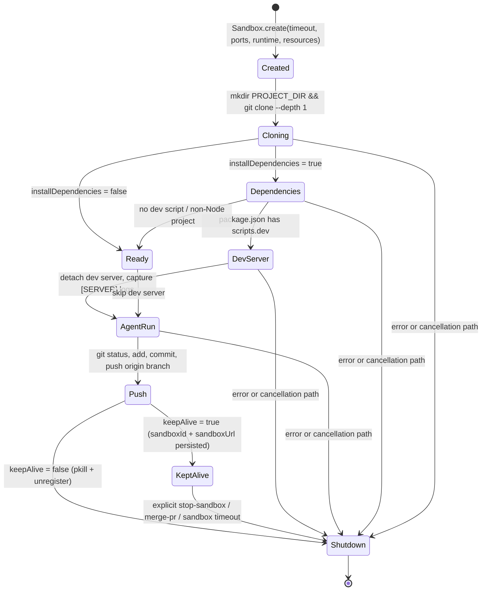

# Sandbox Lifecycle

A "sandbox" is a Vercel Sandbox instance — a remote Node 22 VM provisioned through the `@vercel/sandbox` SDK — that clones a user's repo, installs dependencies, runs the agent CLI, hosts the dev server, and then is either torn down or parked for follow-up work. This page is the single place that ties together `lib/sandbox/creation.ts`, `lib/sandbox/git.ts`, `lib/sandbox/sandbox-registry.ts`, `app/api/tasks/[taskId]/start-sandbox/route.ts`, `app/api/tasks/[taskId]/stop-sandbox/route.ts`, and the per-task `keepAlive` flag.

For the step-by-step runtime context (where this fits between `POST /api/tasks` and `pushChangesToBranch`), see [Runtime Flow: Request → Sandbox → Agent → Push](../architecture/runtime-flow.md). For the per-task status model, see [Task Lifecycle](../concepts/tasks-lifecycle.md).

## High-level phases

Every sandbox moves through the same phases, regardless of which agent runs inside it:



*Diagram: the lifecycle phases a sandbox passes through, with the keepAlive fork between `Push` and the two shutdown paths.*

## Phase 1 — Creation

`createSandbox` in [`lib/sandbox/creation.ts`](repo://lib/sandbox/creation.ts#L47-L52) is the canonical builder. It is called from two places:

- `app/api/tasks/route.ts` (`processTask`) when a new task starts.
<!-- openwiki: broken internal link [#phase-5--reconnect] heading anchor "phase-5--reconnect" does not exist in /openwiki/concepts/sandbox-lifecycle.md. Fix the href or restore the target, then delete this comment. -->
- `app/api/tasks/[taskId]/continue/route.ts` when a follow-up message arrives and `Sandbox.get()` did not yield a live sandbox — see [Phase 5 — Reconnect](#phase-5--reconnect).

Internally, `createSandbox`:

1. Calls the `onCancellationCheck` callback (lines 52) and returns `{ success: false, cancelled: true }` immediately if the task has been stopped. This is the earliest cancellation checkpoint and is the reason `processTask` registers the callback before calling `createSandbox`.
2. Calls `validateEnvironmentVariables` ([`lib/sandbox/config.ts`](repo://lib/sandbox/config.ts#L1-L67)). This rejects the request if `SANDBOX_VERCEL_TEAM_ID`, `SANDBOX_VERCEL_PROJECT_ID`, or `SANDBOX_VERCEL_TOKEN` is missing, if the GitHub token is missing, or if the chosen agent's required API key (`AI_GATEWAY_API_KEY`, `CURSOR_API_KEY`, `GEMINI_API_KEY`, or one of `AI_GATEWAY_API_KEY` / `ANTHROPIC_API_KEY` for OpenCode) is unset.
3. Computes `timeoutMs = parseInt(timeout) * 60_000` (defaulting to 1 hour). The `timeout` value is derived from `task.maxDuration` (capped by `getMaxSandboxDuration(userId)` which itself defaults to `MAX_SANDBOX_DURATION` from the env). **`timeout` is independent of `keepAlive`** — the comment at [creation.ts:73-75](repo://lib/sandbox/creation.ts#L73-L75) is explicit: *"keepAlive only controls whether we shutdown after task completion."*
4. Calls `Sandbox.create({ teamId, projectId, token, timeout: timeoutMs, ports, runtime: 'node22', resources: { vcpus: 4 } })` ([creation.ts:82-90](repo://lib/sandbox/creation.ts#L82-L90)).
5. **Immediately registers** the returned `Sandbox` via `registerSandbox(taskId, sandbox, keepAlive)` ([creation.ts:103](repo://lib/sandbox/creation.ts#L103)). This is intentional: even if a later step fails, the in-memory registry has a reference that `killSandbox(taskId)` can call `sandbox.stop()` on.
6. Runs the second `onCancellationCheck` ([creation.ts:106](repo://lib/sandbox/creation.ts#L106)).

The start-sandbox endpoint ([`app/api/tasks/[taskId]/start-sandbox/route.ts`](repo://app/api/tasks/[taskId]/start-sandbox/route.ts)) is a second, narrower entry point that creates a sandbox when `keepAlive=true` but no live sandbox currently exists for the task. It guards itself with `if (!task.keepAlive) return 400 'Keep-alive is not enabled for this task'` ([start-sandbox/route.ts:38-40](repo://app/api/tasks/[taskId]/start-sandbox/route.ts#L38-L40)), verifies that any existing `sandboxId`/`sandboxUrl` does not respond to a `Sandbox.get() + echo` probe, and otherwise builds a fresh `Sandbox.create` exactly like `createSandbox` does.

## Phase 2 — Cloning

The sandbox is created with **no source attached** at the SDK level; the repo is cloned manually inside the sandbox. `Sandbox.create`'s `source` parameter is supported but unused here — `lib/sandbox/creation.ts` instead runs:

```bash
mkdir -p /vercel/sandbox/project         # PROJECT_DIR, exported from lib/sandbox/commands.ts
git clone --depth 1 <authenticatedRepoUrl> /vercel/sandbox/project
```

The authenticated URL comes from `createAuthenticatedRepoUrl` ([`lib/sandbox/config.ts`](repo://lib/sandbox/config.ts#L69-L86)), which embeds the GitHub token as the username and `x-oauth-basic` as the password for `github.com` URLs only. Non-GitHub URLs are returned unchanged. The `--depth 1` flag is what keeps the clone fast — the full git history is not needed because every agent run ends with a fresh `git push` and a deterministic branch name.

After cloning, `createSandbox` configures git (`user.name`/`user.email` from the GitHub user, with `Coding Agent` / `agent@example.com` fallbacks), creates a `main` branch with a stub `README.md` if the repo is empty, and resolves the working branch (`preDeterminedBranchName` from the AI-generated name, or a `agent/<timestamp>-<id>` fallback). See [creation.ts:774-978](repo://lib/sandbox/creation.ts#L774-L978).

## Phase 3 — Dependencies

If `installDependencies !== false`, `createSandbox` probes for `package.json` and `requirements.txt` ([creation.ts:173-174](repo://lib/sandbox/creation.ts#L173-L174)) and runs the appropriate install path.

**Node projects.** `detectPackageManager(sandbox, logger)` ([`lib/sandbox/package-manager.ts`](repo://lib/sandbox/package-manager.ts#L6-L29)) picks between `pnpm`/`yarn`/`npm` by inspecting lock files in priority order (`pnpm-lock.yaml`, `yarn.lock`, `package-lock.json`, defaulting to `npm`). If `pnpm` or `yarn` is not on the sandbox image, `createSandbox` installs it globally with `npm install -g <pm>` and falls back to `npm` if that fails ([creation.ts:185-219](repo://lib/sandbox/creation.ts#L185-L219)). The install itself is delegated to `installDependencies(sandbox, packageManager, logger)` ([package-manager.ts:32-83](repo://lib/sandbox/package-manager.ts#L32-L83)) which runs `pnpm install --frozen-lockfile` / `yarn install --frozen-lockfile` / `npm install --no-audit --no-fund`. A failed install with a non-npm manager is retried with `npm` ([creation.ts:236-249](repo://lib/sandbox/creation.ts#L236-L249)).

**Python projects.** `python3 -m pip --version` is checked; if pip is missing it is bootstrapped from `get-pip.py` (with `apt-get install -y python3-pip` as a secondary fallback) and then `python3 -m pip install -r requirements.txt` is run. Pip failures are logged but do not abort — the sandbox is still usable.

After this phase, `createSandbox` runs another `onCancellationCheck` ([creation.ts:230](repo://lib/sandbox/creation.ts#L230)).

## Phase 4 — Dev server

If `package.json` has a `scripts.dev` entry, `createSandbox` auto-starts the dev server in **detached mode** with captured `stdout`/`stderr` streams. The sequence ([creation.ts:347-462](repo://lib/sandbox/creation.ts#L347-L462)):

1. Detects Vite (`vite` in `dependencies` or `devDependencies`) and switches the port to `5173` (default remains `3000`).
2. Patches Vite to allow sandbox hosts — two parallel paths:
   - The original path writes a `sed`-based patch to the existing `vite.config.js` and gitignores it via `~/.gitignore_global` ([creation.ts:354-403](repo://lib/sandbox/creation.ts#L354-L403)).
   - The start-sandbox path writes a separate `vite.sandbox.config.js` that calls `mergeConfig(userConfig, { server: { host: '0.0.0.0', strictPort: false, allowedHosts: undefined } })` and launches the dev command with `--config vite.sandbox.config.js --host 0.0.0.0` ([start-sandbox/route.ts:194-237](repo://app/api/tasks/[taskId]/start-sandbox/route.ts#L194-L237)).
3. Detects Next.js 16 (`next` version string starts with `16.` / `^16.` / `~16.`) and appends `--webpack` to the dev command. (See [`lib/sandbox/agents/claude.ts`](repo://lib/sandbox/agents/claude.ts) for why Turbopack is undesirable in this environment.)
4. Starts the dev server via `sandbox.runCommand({ cmd: 'sh', args: ['-c', 'cd /vercel/sandbox/project && <devCommand>'], detached: true, stdout: captureServerStdout, stderr: captureServerStderr })`. The two `Writable` streams split each chunk on `\n`, prefix `[SERVER]`, and forward each non-empty line to `TaskLogger.info`.
5. Waits 3 seconds for the server to bind, then resolves `domain = sandbox.domain(devPort)` — the public URL the browser preview uses.

The agent run starts after this and uses the same `sandbox` reference. The dev server stays up for the duration of the agent's work so the user can preview the changes live.

## Phase 5 — Reconnect (`Sandbox.get()`)

After the original handler returns, the in-memory `Map<taskId, Sandbox>` in [`lib/sandbox/sandbox-registry.ts`](repo://lib/sandbox/sandbox-registry.ts) is no longer authoritative — the serverless function that populated it is frozen. To run follow-up work, the next request must reconnect through `Sandbox.get(sandboxId)`. The DB columns `tasks.sandboxId` and `tasks.sandboxUrl` ([`lib/db/schema.ts`](repo://lib/db/schema.ts#L99-L101)) are the durable link.

Every endpoint that talks to the sandbox outside the original request follows the same shape:

```ts
const sandbox = getSandbox(taskId) ?? await Sandbox.get({
  sandboxId: task.sandboxId,
  teamId:    process.env.SANDBOX_VERCEL_TEAM_ID!,
  projectId: process.env.SANDBOX_VERCEL_PROJECT_ID!,
  token:     process.env.SANDBOX_VERCEL_TOKEN!,
})
```

The in-memory registry is consulted first as a fast path (it is populated while the same serverless execution is alive), and `Sandbox.get()` is the cross-execution fallback. Examples:

- [Terminal](repo://app/api/tasks/[taskId]/terminal/route.ts#L42-L66): `getSandbox(taskId)` then `Sandbox.get(...)` on miss, before running the user's command.
- [Continue](repo://app/api/tasks/[taskId]/continue/route.ts#L169-L190): tries `Sandbox.get(...)` first when `task.sandboxId && task.keepAlive`, and only falls back to creating a new sandbox if that throws.
- [Sandbox health](repo://app/api/tasks/[taskId]/sandbox-health/route.ts#L40-L45): reuses `Sandbox.get` to probe whether the sandbox is still alive, then probes `task.sandboxUrl` for dev-server reachability.
- [File operations](repo://app/api/tasks/[taskId]/files/route.ts), [autocomplete](repo://app/api/tasks/[taskId]/autocomplete/route.ts), [diff](repo://app/api/tasks/[taskId]/diff/route.ts), [terminal](repo://app/api/tasks/[taskId]/terminal/route.ts), [LSP](repo://app/api/tasks/[taskId]/lsp/route.ts), [sync-changes](repo://app/api/tasks/[taskId]/sync-changes/route.ts), [restart-dev](repo://app/api/tasks/[taskId]/restart-dev/route.ts), and many more all reuse the same two-store pattern.

## Phase 6 — Push

After the agent finishes, [`pushChangesToBranch`](repo://lib/sandbox/git.ts#L5-L73) inside the sandbox runs `git status --porcelain` (no-op if empty), then `git add .`, then `git commit -m <message>`, then `git push origin <branch>`. A push failure that contains `Permission`, `access_denied`, or `403` in the stderr is logged but reported as `{ success: true, pushFailed: true }` — the local commit is still there, and the caller decides what to do (typically setting `status='error'` and surfacing "Unable to push changes to repository"). This function lives next to `shutdownSandbox` and is the only place the sandbox does Git work after the agent.

## Phase 7 — Shutdown

There are three shutdown paths, and they are not interchangeable.

### Path A — Worker-initiated shutdown (the common path)

When `keepAlive === false` and `agentResult.success === true`, the worker in `processTask` ([app/api/tasks/route.ts:674-683](repo://app/api/tasks/route.ts#L674-L683)) or in the continue handler ([continue/route.ts:405-414](repo://app/api/tasks/[taskId]/continue/route.ts#L405-L414)) runs:

```ts
unregisterSandbox(taskId)
const shutdownResult = await shutdownSandbox(sandbox)
```

`unregisterSandbox(taskId)` removes the entry from the in-memory `Map`. [`shutdownSandbox`](repo://lib/sandbox/git.ts#L75-L100) is best-effort: it runs `pkill -f node|python|npm|yarn|pnpm` inside the sandbox to take down the dev server and any leftover agent processes, then returns `{ success: true }`. The comment in the function is explicit: *"Vercel Sandbox automatically shuts down after timeout / No explicit shutdown method available in current SDK."* So the actual teardown relies on Vercel's SDK-side garbage collection once the sandbox is no longer referenced from a live `Sandbox` object.

The same pattern is used in the error branches ([app/api/tasks/route.ts:710-727](repo://app/api/tasks/route.ts#L710-L727) and [continue/route.ts:447-453](repo://app/api/tasks/[taskId]/continue/route.ts#L447-L453)) so a failed task still cleans up unless `keepAlive=true` (see [The `keepAlive` flag](#the-keepalive-flag)).

### Path B — User-initiated stop (`killSandbox`)

`PATCH /api/tasks/:taskId` with `body.action === 'stop'` ([app/api/tasks/[taskId]/route.ts:62-110](repo://app/api/tasks/[taskId]/route.ts#L62-L110)) rejects with `400` if the task is not `processing`, writes `status='stopped'` to the DB, and calls `killSandbox(taskId)` from the registry. [`killSandbox`](repo://lib/sandbox/sandbox-registry.ts#L25-L60) removes the entry from the in-memory `Map` and then `await sandbox.stop()`. Because this path is only meaningful inside the same serverless execution that holds the live reference, it is most useful when the worker is still running; the user-facing effect is just to flip `status` to `stopped` and let the worker's next `onCancellationCheck` checkpoint unwind. There is also a fallback in `killSandbox`: if the task id is not in the registry, it kills the **first** (oldest) registered sandbox — a comment explains this handles "Try Again" cases where a new task id is created but the old sandbox is still registered.

### Path C — Explicit endpoint (`POST /api/tasks/:taskId/stop-sandbox`)

[`stop-sandbox/route.ts`](repo://app/api/tasks/[taskId]/stop-sandbox/route.ts) is the only place outside the worker that performs a full, deliberate teardown of a kept-alive sandbox:

```ts
const sandbox = await Sandbox.get({
  sandboxId: task.sandboxId,
  teamId, projectId, token,
})
await sandbox.stop()
unregisterSandbox(taskId)
// then UPDATE tasks SET sandboxId = null, sandboxUrl = null
```

This is the SDK-level `sandbox.stop()`, not the `pkill`-based `shutdownSandbox`. It is the right path when the user is done with a kept-alive sandbox and wants the resources released immediately rather than waiting for the SDK-side timeout to elapse.

### Path D — After PR merge

[`merge-pr/route.ts`](repo://app/api/tasks/[taskId]/merge-pr/route.ts#L57-L72) calls `Sandbox.get` + `sandbox.stop()` + `unregisterSandbox` after a successful merge, then clears `sandboxId` and `sandboxUrl` and sets `completedAt`. The `keepAlive` flag is **not** consulted here — merging the PR is a definitive end of life for the sandbox even if the user had asked for it to be kept alive for further follow-ups. This is the only path that combines `Sandbox.stop()` with `completedAt`.

### Path E — SDK-side timeout

When none of the above fire (e.g. the user stops interacting with the task entirely), the SDK's `timeout` parameter — set to `maxDuration * 60_000` ms — bounds the lifetime. Vercel garbage-collects the sandbox once it elapses; subsequent `Sandbox.get()` calls fail and `sandbox-health` reports `status: 'stopped'`. The timeout value is derived solely from `task.maxDuration` / `getMaxSandboxDuration(userId)` and is **never** controlled by `keepAlive`.

## The dual persistence model

There are exactly two stores that know about a sandbox, and they have different lifetimes:

| Store | Source | Lifetime | Purpose |
| --- | --- | --- | --- |
| `Map<taskId, Sandbox>` | `lib/sandbox/sandbox-registry.ts` | Single serverless execution | Fast path for `getSandbox(taskId)` inside the worker / `killSandbox(taskId)` while the worker is still alive |
| `tasks.sandboxId` + `tasks.sandboxUrl` (text columns on the `tasks` row) | `lib/db/schema.ts` | Persistent | Reconnect via `Sandbox.get(sandboxId)` from any later request (continue, terminal, file ops, health, restart-dev, merge-pr, stop-sandbox) |

The two are written together: `createSandbox` calls `registerSandbox(taskId, sandbox, keepAlive)` right after `Sandbox.create` ([creation.ts:103](repo://lib/sandbox/creation.ts#L103)), and the caller (`processTask`) persists `sandboxId` + `sandboxUrl` to the DB after `createSandbox` returns successfully ([app/api/tasks/route.ts:518](repo://app/api/tasks/route.ts#L518)). They are also cleared together — `processTask` writes both to `null` only on the `keepAlive=false` success path and on the error path that calls `unregisterSandbox`.

The two stores' lifetimes diverge in three places worth knowing about:

- **Cross-request hot path.** When `keepAlive=true`, the in-memory map dies at the end of the worker execution but the DB columns survive. The next request (continue, terminal, file ops) sees `task.sandboxId` is non-null, calls `Sandbox.get(...)`, and rehydrates.
- **`Sandbox.get()` may fail.** When it does (sandbox expired, never reachable, or the SDK returned a "no longer exists" error), every caller has to decide what to do. `start-sandbox/route.ts:45-72` clears the DB columns and creates a new sandbox; `continue/route.ts:192-243` falls back to a fresh `createSandbox(...)`; `terminal/route.ts:62-65` returns `500 'Failed to connect to sandbox'`. There is no general retry layer — each endpoint owns this fallback.
- **`killSandbox` is local-only.** Because it operates on the in-memory map, it cannot reach a sandbox the worker has already released; the practical effect of a stop request after the worker has finished is just to flip `status='stopped'` and rely on the SDK timeout to garbage-collect.

## The `keepAlive` flag

`keepAlive` is a boolean on the `tasks` row (`tasks.keepAlive`, default `false`, see [`lib/db/schema.ts`](repo://lib/db/schema.ts#L88)). The header instruction flags two effects, and they are **distinct** — there is exactly one thing the flag controls, and one thing it does **not** control:

1. **Shutdown after completion (the effect it has).** When `keepAlive=true`, the worker leaves the sandbox running after `pushChangesToBranch` returns. Specifically, `processTask` skips the `unregisterSandbox + shutdownSandbox` pair ([app/api/tasks/route.ts:669-672](repo://app/api/tasks/route.ts#L669-L672)) and the continue handler does the same ([continue/route.ts:402-404](repo://app/api/tasks/[taskId]/continue/route.ts#L402-L404)). The error branches honor the same flag ([app/api/tasks/route.ts:712-714](repo://app/api/tasks/route.ts#L712-L714), [continue/route.ts:447-449](repo://app/api/tasks/[taskId]/continue/route.ts#L447-L449)) so a failed task can be retried against the same sandbox.
2. **Sandbox lifetime / timeout (the effect it does not have).** The `timeout` parameter passed to `Sandbox.create` is `maxDuration * 60_000` ms (`maxDuration` itself comes from `task.maxDuration` or `getMaxSandboxDuration(userId)` or `MAX_SANDBOX_DURATION`). The flag plays no role in computing this number. Concretely, a kept-alive sandbox is still bounded by the SDK's own timeout, after which Vercel garbage-collects it; conversely, a `keepAlive=false` sandbox is not given any shorter timeout — it simply gets `unregisterSandbox` + best-effort `pkill` at the end of the task.

The comment in [`lib/sandbox/creation.ts:73-75`](repo://lib/sandbox/creation.ts#L73-L75) is the canonical statement: *"Use the specified timeout (maxDuration) for sandbox lifetime. keepAlive only controls whether we shutdown after task completion."*

The flag also gates the start-sandbox endpoint: `POST /api/tasks/:taskId/start-sandbox` rejects with `400 'Keep-alive is not enabled for this task'` when `task.keepAlive` is false, so a user cannot use that endpoint to spin up an additional sandbox for a task that was not opted into keep-alive at creation time. And in `continue/route.ts`, the `Sandbox.get` reconnect path is only attempted when `task.keepAlive` is true; if it is false, the continue handler skips the reconnect and always creates a fresh sandbox ([continue/route.ts:169-190](repo://app/api/tasks/[taskId]/continue/route.ts#L169-L190) vs. [continue/route.ts:192-243](repo://app/api/tasks/[taskId]/continue/route.ts#L192-L243)).

## Where sandboxId and sandboxUrl come from

Both columns are populated once `createSandbox` returns successfully:

- `sandboxId` is `sandbox.sandboxId` from the SDK (e.g. from `Sandbox.create` in `creation.ts:99` or `start-sandbox/route.ts:110`).
- `sandboxUrl` is `sandbox.domain(devPort)` — set inside `createSandbox` ([creation.ts:460](repo://lib/sandbox/creation.ts#L460)) or inside the start-sandbox endpoint ([start-sandbox/route.ts:297](repo://app/api/tasks/[taskId]/start-sandbox/route.ts#L297)). If no dev server is auto-started, `creation.ts:472-475` falls back to `sandbox.domain(devPort)` for the default port.

For follow-up requests, `sandboxUrl` is the URL the browser preview iframe loads; `sandbox-health` (`sandbox-health/route.ts`) pings the same URL with a 5-second `AbortSignal` to decide whether the dev server is `running` / `starting` / `stopped` / `error`. `terminal/route.ts` and the file-operation routes use `sandboxId` to call `Sandbox.get` and then run commands inside the sandbox.

## Failure modes and invariants

- **`Sandbox.create` failure.** Wrapped in a try/catch in `creation.ts:140-163` that maps `ETIMEDOUT` / `TimeoutError` to a specific "Sandbox creation timed out after 5 minutes" message. Anything else rethrows after `logger.error('Sandbox creation failed')`.
- **Clone failure.** Throws `Failed to clone repository to project directory` ([creation.ts:131](repo://lib/sandbox/creation.ts#L131)). The caller catches it and tears down via Path A above.
- **Dependency install failure.** Logged but does not abort for both Node and Python paths, with a fallback to `npm` for non-npm Node projects.
- **Dev server start failure.** Treated as fatal only if the dev server was supposed to be auto-started. `creation.ts:463-468` catches `package.json` parse errors and logs `Could not parse package.json, skipping auto-start of dev server` instead of failing the whole sandbox.
- **`Sandbox.get()` failure on reconnect.** Each caller has its own fallback: `start-sandbox` clears the DB and creates fresh; `continue` does the same; `terminal`/`files`/`diff`/etc. return `500` to the client. There is no shared retry helper.
- **Stale registry entry pointing to a dead sandbox.** `killSandbox` ([sandbox-registry.ts:25-60](repo://lib/sandbox/sandbox-registry.ts#L25-L60)) catches the SDK's `stop()` rejection and treats it as `success: true` ("Sandbox may already be stopped, that's okay"). `start-sandbox/route.ts:46-72` runs a `Sandbox.get + echo test` probe to detect a dead sandbox and clears the DB columns before creating a new one.
- **Cancellation.** Cancellation checks fire at five phases inside the worker (see [Runtime Flow](../architecture/runtime-flow.md#cancellation-checkpoints-the-full-list)). When one fires, the worker either returns early or — if a sandbox was already created — calls `shutdownSandbox` directly. A cancelled task ends as `status='stopped'`, not `status='error'`.

## Extension points

- **New port to expose.** Add it to the `ports` array passed to `Sandbox.create` in `creation.ts:87` (default `[3000, 5173]`) and `start-sandbox/route.ts:105`. If the port is conditional, also extend `detectPortFromRepo` ([`lib/sandbox/port-detection.ts`](repo://lib/sandbox/port-detection.ts)) so the start-sandbox path picks it up.
- **New package manager.** Add a case to `detectPackageManager` ([package-manager.ts:6-29](repo://lib/sandbox/package-manager.ts#L6-L29)) and to `installDependencies` ([package-manager.ts:32-83](repo://lib/sandbox/package-manager.ts#L32-L83)). If the manager is not on the sandbox image, add a global-install path in `creation.ts:185-219`.
- **New shutdown signal.** If a new place needs to tear down a sandbox without going through the SDK timeout, reuse Path C (`Sandbox.get + sandbox.stop + unregisterSandbox + clear DB columns`) — that is the pattern in `stop-sandbox/route.ts` and `merge-pr/route.ts`.
- **New long-lived interaction that needs the sandbox.** Add the `getSandbox(taskId) ?? Sandbox.get(...)` preamble at the top of the new route's handler so it works both inside the original execution and across reconnects.
- **Make `keepAlive` actually extend timeout.** Today `keepAlive` does not affect `timeout`. If a future change wants `keepAlive=true` to give the sandbox a longer SDK lifetime, the change must be made in `createSandbox` and `start-sandbox/route.ts` where `timeoutMs` is computed — and the comment at `creation.ts:73-75` should be updated to reflect the new contract.
