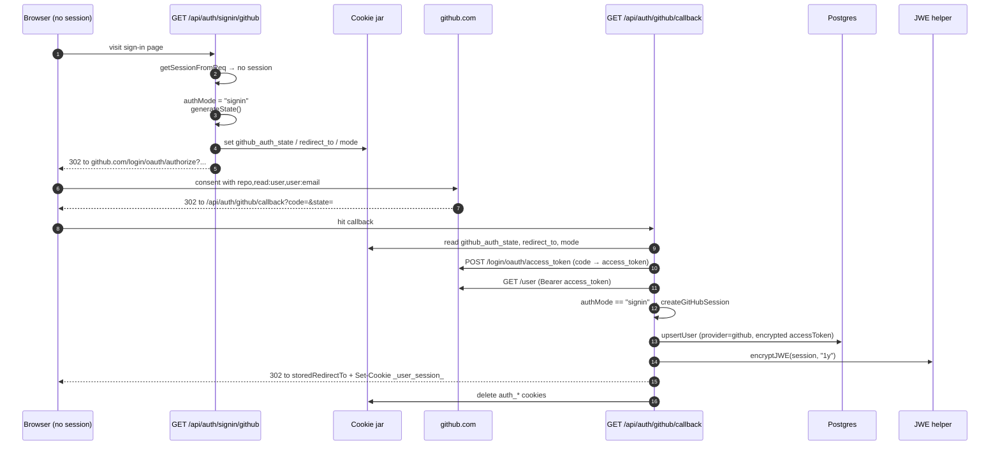
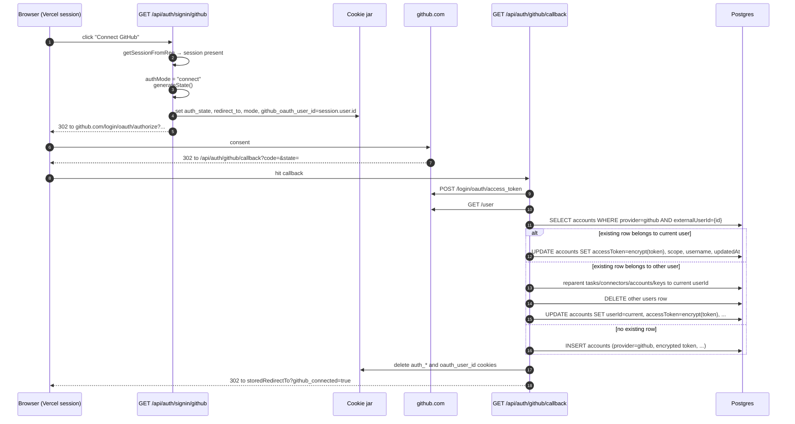

# GitHub OAuth

GitHub plays a dual role in the auth subsystem: it can be the user's *primary* identity (sign in with GitHub) or a *linked* identity attached to a Vercel-primary user (connect GitHub from the profile). Both paths share a single OAuth app registration and a single callback route, but they diverge inside `app/api/auth/github/callback/route.ts` based on a mode cookie. For the broader concept of how the two providers fit together (the JWE session cookie, the `users`/`accounts` split, the link lifecycle) see [Authentication & Sessions](../concepts/auth-and-sessions.md). For the cryptographic primitive used to protect stored GitHub tokens see [Encryption & Log Redaction](../concepts/encryption-and-redaction.md).

## App registration and required scopes

A single GitHub OAuth app backs both flows. Registration is documented in `README.md` under "GitHub OAuth App": register the app at <https://github.com/settings/developers>, set the authorization callback URL to `${ORIGIN}/api/auth/github/callback`, and copy the credentials into the environment.

| Variable | Visibility | Purpose |
| --- | --- | --- |
| `NEXT_PUBLIC_GITHUB_CLIENT_ID` | Client-exposed (`NEXT_PUBLIC_` prefix) | OAuth client ID read by the sign-in route to build the authorize URL |
| `GITHUB_CLIENT_SECRET` | Server-only | Used by the callback and revoke routes to exchange the code and to revoke the token at sign-out |

`GET /api/auth/signin/github` and `GET /api/auth/github/signin` redirect to `/?error=github_not_configured` if `NEXT_PUBLIC_GITHUB_CLIENT_ID` is unset; the callback returns `500 GitHub OAuth not configured` if either variable is missing.

The authorize URL always requests the same three scopes — concatenated as `repo,read:user,user:email` in the `scope` query parameter — because every GitHub-using feature (creating repositories, listing orgs, opening pull requests, accessing the authenticated user profile) needs at least one of them:

- `repo` — full read/write access to private and public repositories, which the agent needs to push branches and open PRs.
- `read:user` — read profile metadata (`login`, `name`, `avatar_url`, numeric `id`).
- `user:email` — read email addresses, used as a fallback when the public profile does not expose one.

The flow is plain OAuth 2.0 authorization code without PKCE. CSRF protection is provided by `state`, generated with `arctic`'s `generateState()` and stored in a short-lived cookie that the callback re-reads before completing the exchange.

## Route surface

GitHub authentication lives under two URL trees that exist in parallel:

| Route | Method | Purpose |
| --- | --- | --- |
| `app/api/auth/signin/github/route.ts` | `GET` | New unified entrypoint. Picks `signin` vs `connect` based on whether a session already exists. |
| `app/api/auth/github/signin/route.ts` | `GET`, `POST` | Legacy connect-only entrypoint. Requires an existing Vercel session; either redirects (GET) or returns the authorize URL in JSON (POST). |
| `app/api/auth/github/callback/route.ts` | `GET` | Handles both modes. Branches on the `github_auth_mode` cookie value. |
| `app/api/auth/github/status/route.ts` | `GET` | Returns `{ connected, username, connectedAt }` for the current session. |
| `app/api/auth/github/disconnect/route.ts` | `POST` | Removes the linked GitHub account row. Refuses when `session.authProvider === 'github'`. |

The new `GET /api/auth/signin/github` is the entrypoint that the sign-in UI should call. The `app/api/auth/github/signin` routes are kept for back-compat with any client code or bookmarks that still reference them; both still write only the `github_oauth_*` cookie set, which the callback also tolerates.

## Cookie contract: unified vs legacy

Two cookie naming conventions coexist because the callback was extended (rather than replaced) when the unified signin/connect entrypoint was introduced. The presence of `github_auth_mode` is what distinguishes the new path from the legacy one — the callback uses that cookie to decide which cookie names to look for:

| Cookie | Unified mode (`github_auth_mode` set) | Legacy mode (no mode cookie) |
| --- | --- | --- |
| State | `github_auth_state` | `github_oauth_state` |
| Post-auth target | `github_auth_redirect_to` | `github_oauth_redirect_to` |
| Mode flag | `github_auth_mode` ∈ {`signin`, `connect`} | — (implicit `connect`) |
| Connecting user ID | `github_oauth_user_id` | `github_oauth_user_id` |

All four cookies are `HttpOnly`, `SameSite=Lax`, `Secure` in production, with a 10-minute TTL. The short TTL is the safety net for users who start the OAuth dance and never finish it: the cookies self-destruct even if the callback never runs.

The unified entrypoint's connect path appends a `github_connected=true` query parameter to the post-auth redirect URL; `components/home-page-content.tsx` reads it after the redirect and surfaces a toast, then strips the parameter from the URL so a page refresh does not re-trigger the toast.

## The sign-in flow



The sign-in flow is the simpler of the two. `app/api/auth/signin/github/route.ts` detects "no current session" via `getSessionFromReq`, sets `github_auth_mode = signin`, and redirects to `https://github.com/login/oauth/authorize?...`. On the callback:

1. The route validates `state` against the cookie and the post-auth redirect target.
2. It exchanges the `code` at `https://github.com/login/oauth/access_token` (JSON body, JSON response). A non-OK response or a missing `access_token` returns 400.
3. It fetches the GitHub profile at `https://api.github.com/user` with a `Bearer` header.
4. Because `github_auth_mode === 'signin'`, it calls `createGitHubSession(accessToken, scope)` in `lib/session/create-github.ts`, which:
   - Fetches `/user` again to capture `login`, `id`, `name`, `avatar_url`, `email`.
   - Falls back to `/user/emails` when `email` is null on the public profile, preferring the primary verified address.
   - Calls `upsertUser({ provider: 'github', externalId, accessToken: encrypt(accessToken), refreshToken: undefined, scope, ... })` from `lib/db/users.ts`. The encrypted token lands on `users.accessToken`; `refreshToken` is undefined because GitHub's standard OAuth flow does not issue refresh tokens.
   - Returns a `Session` whose `authProvider` is `'github'`.
5. The callback calls `saveSession(response, session)`, which appends the JWE cookie and a 302 to the stored post-auth target, then deletes the three `github_auth_*` cookies.

## The connect flow

The connect flow is what `getSessionFromReq` recognizes as "user already has a session" — typically a Vercel-primary user. The difference is that the callback, instead of creating a session, encrypts the new access token with AES-256-CBC (`encrypt(token)` from `lib/crypto.ts`) and writes it into the `accounts` table on the existing internal user.



After exchanging the code and fetching the GitHub profile, the callback switches on three sub-cases (see `app/api/auth/github/callback/route.ts#L148-L210`):

1. **Same user, reconnecting.** The `(accounts.provider, accounts.externalUserId)` lookup matches a row whose `userId` equals the connecting user's `users.id`. The callback `UPDATE`s the row's `accessToken`, `scope`, `username`, and `updatedAt` in place.
2. **Conflict: GitHub identity belongs to another internal user.** The lookup matches a row whose `userId` is a *different* `users.id`. This is the account-merge path: the callback issues four `UPDATE`s that reparent every row owned by the old user (`tasks`, `connectors`, `accounts`, `keys`) onto the connecting user's `users.id`, deletes the now-empty old `users` row, then updates the existing `accounts` row's `userId` and token. The merged user's own `users.accessToken` is never touched, because their primary identity (typically Vercel) is unaffected. The destructive merge is intentional but irreversible; it is what prevents a single real-world GitHub identity from spawning multiple internal users.
3. **Fresh link.** No matching `accounts` row exists. The callback inserts a new row with `id = nanoid()`, the encrypted token, the GitHub numeric ID (as a string), the granted scope, and the GitHub `login` as `username`.

The unique index `(userId, provider)` on `accounts` guarantees there is at most one GitHub link per internal user. The provider column is hard-coded to `'github'` in the schema, so the database itself rejects any other value.

## Status, disconnect, and the session guard

`GET /api/auth/github/status` returns one of three shapes:

- `{ connected: false }` when there is no session or no linked/primary GitHub identity.
- `{ connected: true, username, connectedAt }` when an `accounts` row exists for the current user with `provider = 'github'`.
- `{ connected: true, username, connectedAt }` when the user's primary `users` row has `provider = 'github'` (they signed in with GitHub).

The two-bucket check is what lets the UI show the same "Connected as …" badge whether GitHub is the primary identity or a linked one.

`POST /api/auth/github/disconnect` removes the linked account by deleting the `accounts` row whose `userId` matches the current session and whose `provider` is `'github'`. It refuses (400) when `session.authProvider === 'github'` because removing the primary identity would leave the user signed in to a session with no underlying `users.accessToken`, i.e. with no way to act on their own behalf. The component layer (`components/auth/sign-out.tsx`) only renders the Disconnect menu item when `authProvider === 'vercel'`, so the route handler's guard is a second line of defense rather than the user-facing rule.

## Token storage and at-rest encryption

Both flows hand the plaintext access token to `encrypt(...)` from `lib/crypto.ts` before it touches Postgres. The primitive is AES-256-CBC with a 16-byte random IV drawn per call; the wire format is `<iv_hex>:<ciphertext_hex>` and the key is the 32-byte `ENCRYPTION_KEY` (a 64-character hex string). For GitHub:

| Storage surface | Encryption site | Decryption site |
| --- | --- | --- |
| `users.accessToken` (sign-in primary) | `lib/session/create-github.ts` via `upsertUser` | `lib/session/get-oauth-token.ts`, `lib/github/user-token.ts` |
| `accounts.accessToken` (connect link) | `app/api/auth/github/callback/route.ts` (connect branch) | `lib/session/get-oauth-token.ts`, `lib/github/user-token.ts` |

`refreshToken` is always `undefined` for GitHub because the standard GitHub OAuth flow does not issue one; the schema column is nullable, so the absence is represented by SQL `NULL` rather than an empty ciphertext.

`lib/github/user-token.ts`'s `getUserGitHubToken(req?)` is the canonical reader:

```ts
const session = req ? await getSessionFromReq(req) : await getServerSession()
// 1. Look in accounts (linked path)
const account = await db.select({ accessToken: accounts.accessToken })
  .from(accounts)
  .where(and(eq(accounts.userId, session.user.id), eq(accounts.provider, 'github')))
// If found → return decrypt(account.accessToken)
// 2. Fall back to users (primary path)
const user = await db.select({ accessToken: users.accessToken })
  .from(users)
  .where(and(eq(users.id, session.user.id), eq(users.provider, 'github')))
// If found → return decrypt(user.accessToken)
// Otherwise → return null
```

This is the same "accounts first, users fallback" lookup that `lib/session/get-oauth-token.ts` does for the more general `getOAuthToken(userId, 'github')`, but it returns just the plaintext string. The thin return type is what lets `lib/github/client.ts`'s `getOctokit()` feed the token directly into `@octokit/rest`'s `auth` field without unpacking a structured object. Callers that use the token include `app/api/github/{orgs,repos,user,user-repos,verify-repo}/route.ts`, `app/api/github/repos/create/route.ts`, `app/api/tasks/route.ts`, `app/api/tasks/[taskId]/continue/route.ts`, `app/api/tasks/[taskId]/start-sandbox/route.ts`, `app/api/api-keys/check/route.ts`, and the agent dispatcher at `lib/sandbox/agents/index.ts`, which injects the token into the sandbox.

## Environment and operations surface

| Variable | Used by | Failure when missing |
| --- | --- | --- |
| `NEXT_PUBLIC_GITHUB_CLIENT_ID` | `/api/auth/signin/github`, `/api/auth/github/signin`, `/api/auth/github/callback` (build URL), `/api/auth/github/disconnect` | Sign-in routes redirect to `/?error=github_not_configured`; callback returns 500 |
| `GITHUB_CLIENT_SECRET` | `/api/auth/github/callback` (code exchange) | Callback returns 500 `GitHub OAuth not configured` |
| `ENCRYPTION_KEY` | `lib/crypto.ts` (called from `lib/session/create-github.ts` and the callback's connect branch) | `encrypt` throws with the `openssl rand -hex 32` hint; both flows fail before the token hits the database |

There is no client-side check for the GitHub variables beyond the redirect; the UI is rendered as if GitHub is configured and only learns otherwise when the round-trip fails. This is why the `NEXT_PUBLIC_` prefix is acceptable on `GITHUB_CLIENT_ID` — the secret itself never leaves the server.

## Failure and edge-case behavior

- **Missing `NEXT_PUBLIC_GITHUB_CLIENT_ID`.** `GET /api/auth/signin/github` redirects to `/?error=github_not_configured`. The legacy `GET /api/auth/github/signin` does the same; `POST` returns 500 JSON.
- **Missing or mismatched `state`.** The callback returns `400 Invalid OAuth state` for every mode (unified `signin`, unified `connect`, legacy `connect`). For `connect` it additionally requires `github_oauth_user_id`.
- **Bad token exchange.** Non-OK from `https://github.com/login/oauth/access_token`, or an OK response without `access_token`, returns 400. The error body includes `tokenData.error_description` when present.
- **Missing profile data.** `createGitHubSession` returns `undefined` if `/user` is non-OK, and the callback returns 500. An empty `email` triggers a fallback to `/user/emails`; if that also fails, the session is created with a null email rather than failing.
- **Account merge.** The connect branch's conflict case is destructive: every row owned by the other internal user is reparented and the other `users` row is deleted. There is no undo. This is intentional (one internal user per real-world GitHub identity) but is the kind of merge a deployer should be aware of before turning on GitHub auth alongside a populated Vercel-auth deployment.
- **Disconnecting the primary.** `/api/auth/github/disconnect` returns 400 `Cannot disconnect primary authentication method` when `session.authProvider === 'github'`.
- **Decryption failure.** `decrypt` throws; `getUserGitHubToken` catches it, logs the error, and returns `null`, so the calling route returns 401/empty data rather than 500.

## Extension points

- **Adding a third OAuth scope.** Edit the `scope: 'repo,read:user,user:email'` literal in `app/api/auth/signin/github/route.ts` and in `app/api/auth/github/signin/route.ts` (GET and POST). The granted scope is persisted on `accounts.scope` for linked accounts and on `users.scope` for primaries; downstream code reads it as an opaque string.
- **Adding refresh-token support.** GitHub's OAuth app can be configured to issue refresh tokens; once enabled, thread the `refresh_token` field from `tokenData` through `createGitHubSession` and `upsertUser` (the storage path already accepts it). `getUserGitHubToken` and `getOAuthToken` already decrypt `accounts.refreshToken` when present, so callers do not need to change.
- **Making the connect entrypoint the only one.** When no clients depend on `/api/auth/github/signin`, delete that route and the legacy `github_oauth_*` cookie branches in the callback. The unified mode is the long-term path; the legacy tolerance exists only so a deploy mid-OAuth does not break already-started user flows.
- **Adding a second linked provider.** Extend the `accounts.provider` enum in `lib/db/schema.ts`, add a parallel entrypoint route, and generalize the connect branch of the callback. The connect-mode cookie contract (`auth_mode`, `auth_state`, `auth_redirect_to`, `oauth_user_id`) is provider-agnostic and can be reused.
