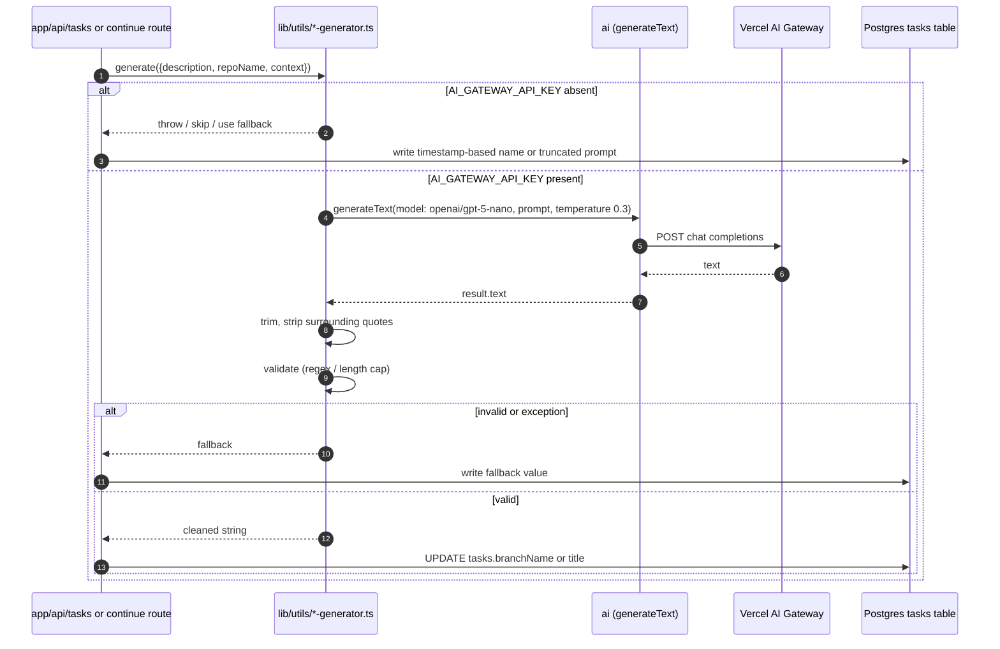

# Vercel AI Gateway

The template integrates with the [Vercel AI Gateway](https://vercel.com/docs/ai-gateway) in two distinct ways that share a single credential (`AI_GATEWAY_API_KEY`) and, in most agent paths, a single gateway host:

1. **In-process text generation via AI SDK 5.** The three small utilities under `lib/utils/` (`branch-name-generator.ts`, `commit-message-generator.ts`, `title-generator.ts`) call `generateText` from the `ai` package with the model id `'openai/gpt-5-nano'`. The model string is the AI Gateway's "provider/model" routing syntax; the SDK forwards the request to the gateway using `AI_GATEWAY_API_KEY` (resolved via `process.env`) as the bearer credential. These calls power the task-creation enrichments that run before and after a sandbox is spun up.
2. **Sandbox-side CLI routing.** The Claude Code CLI and the OpenAI Codex CLI run *inside* the Vercel Sandbox and are configured to send their API traffic to `https://ai-gateway.vercel.sh` (Claude) or `https://ai-gateway.vercel.sh/v1` (Codex). The same `AI_GATEWAY_API_KEY` is exposed to those CLIs via the standard provider env vars (`ANTHROPIC_API_KEY` / `ANTHROPIC_BASE_URL` for Claude; a generated `~/.codex/config.toml` for Codex), so a single credential can drive both the in-process generators and the agent CLIs.

The gateway URL is therefore the only outbound AI surface the template depends on for Claude execution, and one of two possible surfaces for Codex execution (the other being direct OpenAI when the configured key starts with `sk-` rather than `vck_`).

## Credential surface and per-user override

`AI_GATEWAY_API_KEY` is the single credential the integration reads. It is read from three places in priority order:

1. The per-user `keys` row with `provider = 'aigateway'` (provider enum declared in `lib/db/schema.ts`), surfaced through `getUserApiKeys()` in `lib/api-keys/user-keys.ts` and decrypted with `lib/crypto.ts`'s `decrypt`.
2. The system environment variable `process.env.AI_GATEWAY_API_KEY`.
3. For agent execution only, the `apiKeys.AI_GATEWAY_API_KEY` value passed into `executeAgentInSandbox` and overlaid onto `process.env` by the temp-env-var pattern in `lib/sandbox/agents/index.ts`.

The two-layer model (system fallback + per-user override) means a deploy without `AI_GATEWAY_API_KEY` set globally will still let users run tasks if they have added their own key in profile settings, and a deploy with the global key set will let unauthenticated or not-yet-configured users run as well — provided no per-user row exists. The validation gate at `lib/sandbox/config.ts:validateEnvironmentVariables` reads from both layers and accepts the request if either is present.

<!-- openwiki: mermaid parse failed and this diagram was converted to a text fence so it does not break rendering. Fix the diagram source and restore the mermaid fence. Parser error: Heuristic: an unescaped angle bracket inside a label breaks rendering; rephrase the label. -->
```text
flowchart LR
    Caller["Caller<br/>(route handler or agent dispatcher)"]
    Env["process.env.AI_GATEWAY_API_KEY<br/>(system)"]
    UserKeys["keys table<br/>provider = aigateway<br/>value = encrypt(plaintext)"]
    Decrypt["lib/crypto.ts decrypt"]
    GetKeys["getUserApiKeys()"]
    Overlay["agents/index.ts temp-env-var"]
    Consumer["Consumer<br/>(generator / Claude / Codex)"]

    Caller -->|"apiKeys arg"| Overlay
    Overlay -->|"override process.env"| Env
    Caller -->|"system fallback"| Env
    Caller -->|"per-user lookup"| GetKeys
    GetKeys --> UserKeys
    UserKeys --> Decrypt
    Decrypt --> Consumer
    Env --> Consumer
```

*Diagram: AI_GATEWAY_API_KEY resolution. The dispatcher's temp-env-var block writes the per-user value into `process.env` before the per-CLI wrappers read it, and restores the original on the way out so concurrent tasks in the same Node process cannot leak keys.*

## In-process generators (AI SDK 5)

The three generators share the same skeleton: a `process.env.AI_GATEWAY_API_KEY` precondition, an AI SDK 5 `generateText` call with the model string `'openai/gpt-5-nano'` and `temperature: 0.3`, a strip-quotes/whitespace cleanup, a length-or-regex validation, and a fallback function for the failure path.



*Diagram: shared control flow for the three generators. The exact validation rule and fallback shape differs per generator (see below), but every generator's first action is the `AI_GATEWAY_API_KEY` check.*

### Branch name generator (`lib/utils/branch-name-generator.ts`)

`generateBranchName({ description, repoName, context })` is invoked from `app/api/tasks/route.ts` inside an `after(async () => { ... })` callback so the task row is returned to the client before the gateway round-trip completes.

- **Precondition.** If `process.env.AI_GATEWAY_API_KEY` is missing, the function `throw`s. The caller catches that error and falls back to `createFallbackBranchName(taskId)`, which produces `agent/<ISO-timestamp>-<first 8 chars of taskId>`.
- **Prompt.** A short instruction asks for a single Git branch name, with explicit constraints: lowercase letters/numbers/hyphens only, under 50 characters, conventional prefixes (`feature/`, `fix/`, `chore/`, `docs/`) when appropriate. The prompt echoes `description`, optional `repoName`, and optional `context` (which the task route sets to `'<selectedAgent> agent task'`).
- **Model.** `openai/gpt-5-nano`, `temperature: 0.3`.
- **Cleanup.** `result.text.trim().replace(/^["']|["']$/g, '')` strips surrounding quotes and whitespace.
- **Conflict-free suffix.** A 6-character alphanumeric hash from `nanoid`'s `customAlphabet('0-9A-Za-z', 6)` is appended as `<base>-<hash>` to guarantee uniqueness across simultaneous task creations.
- **Validation.** The base name must match `^[a-z0-9-\/]+$`. Any other character set throws, and the route's outer `catch` writes `createFallbackBranchName(taskId)` into `tasks.branchName` and logs `Using fallback branch name`. Total length must remain ≤ 50 characters after the hash is appended, or the function throws the same way.
- **Fallback.** `createFallbackBranchName(taskId)` is purely timestamp-based and is also the path taken when the route's `after()` callback observes `AI_GATEWAY_API_KEY` missing *before* even calling the generator (`app/api/tasks/route.ts:97`).

### Title generator (`lib/utils/title-generator.ts`)

`generateTaskTitle({ prompt, repoName, context })` runs in its own `after(async () => { ... })` callback, structurally identical to the branch-name path but writing `tasks.title`.

- **Precondition.** Missing `AI_GATEWAY_API_KEY` causes `throw`. The caller skips the call when the env var is absent (`app/api/tasks/route.ts:161`) and otherwise falls back to `createFallbackTitle(prompt)`.
- **Model.** Same as the branch-name generator: `openai/gpt-5-nano`, `temperature: 0.3`.
- **Constraints in the prompt.** ≤ 60 characters, sentence case, no quotes or special formatting, returns ONLY the title.
- **Validation.** A length > 60 is truncated to 57 characters plus `...`.
- **Fallback.** `createFallbackTitle(prompt)` uses the prompt verbatim when ≤ 60 chars, otherwise truncates to 57 + `...`.

### Commit message generator (`lib/utils/commit-message-generator.ts`)

`generateCommitMessage({ description, repoName, context })` is called from two places, both inside the success path of a task run:

- `app/api/tasks/route.ts:651` after a fresh `processTask` succeeds and before `pushChangesToBranch`.
- `app/api/tasks/[taskId]/continue/route.ts:381` after a follow-up run succeeds, also before pushing.

The route layer wraps the call in a `try` and on any error (including the precondition `throw`) calls `createFallbackCommitMessage(prompt)`.

- **Model.** `openai/gpt-5-nano`, `temperature: 0.3`.
- **Constraints in the prompt.** ≤ 72 characters (conventional commit length), imperative mood, sentence case, no quotes, formatting, or line breaks, no sensitive information.
- **Validation.** Messages > 72 chars are truncated to 69 + `...`.
- **Fallback.** `createFallbackCommitMessage(description)` returns the description verbatim when ≤ 72 chars, otherwise truncates to 69 + `...`. Crucially the *route* layer chooses between AI generation and the fallback: in `app/api/tasks/route.ts:651`, when `process.env.AI_GATEWAY_API_KEY` is unset the route goes straight to `createFallbackCommitMessage(prompt)` and never calls the SDK.

## Sandbox-side CLI routing

The two CLIs that route through the gateway differ in how their config is generated: Claude Code reads a JSON file in `~/.config/claude/`, while Codex reads a TOML file in `~/.codex/`. Both are written by `runCommandInSandbox` after the CLI is installed.

### Claude Code

`installClaudeCLI` in `lib/sandbox/agents/claude.ts:63-186` writes `~/.config/claude/config.json` with three keys: `api_key`, `api_base_url: 'https://ai-gateway.vercel.sh'`, and `default_model` (the `selectedModel` argument, defaulting to `'claude-sonnet-4-5'`). The same key is then re-injected as an env-var prefix on every Claude invocation:

<!-- openwiki: mermaid parse failed and this diagram was converted to a text fence so it does not break rendering. Fix the diagram source and restore the mermaid fence. Parser error: Heuristic: an unescaped angle bracket inside a label breaks rendering; rephrase the label. -->
```text
sequenceDiagram
    autonumber
    participant Agent as lib/sandbox/agents/claude.ts
    participant SB as Vercel Sandbox
    participant CC as claude CLI
    participant GW as ai-gateway.vercel.sh

    Agent->>SB: runCommand curl -fsSL https://claude.ai/install.sh | bash
    Agent->>SB: mkdir -p $HOME/.config/claude
    Agent->>SB: cat > ~/.config/claude/config.json
    Note over SB: {api_key, api_base_url:"https://ai-gateway.vercel.sh",<br/>default_model:selectedModel or claude-sonnet-4-5}
    Agent->>SB: ANTHROPIC_API_KEY=... ANTHROPIC_BASE_URL=... claude ...
    SB->>CC: claude --model M --dangerously-skip-permissions --output-format stream-json --verbose "..."
    CC->>GW: POST chat (gateway routes to Anthropic)
    GW-->>CC: stream-json frames
    CC-->>SB: result line + assistant text + tool_use
```

*Diagram: Claude Code inside the sandbox. The `~/.config/claude/config.json` carries the persistent settings; the per-invocation `ANTHROPIC_API_KEY`/`ANTHROPIC_BASE_URL` prefix ensures the runtime sees the gateway even when MCP servers are also being added (`claude mcp add` is invoked with the same prefix).*

Specifics worth keeping in mind:

- **MCP additions go through the same env-var prefix.** Both local (`claude mcp add "<name>" -- <command>`) and remote (`claude mcp add --transport http "<name>" "<url>"`) `claude mcp add` invocations are wrapped in `ANTHROPIC_API_KEY="${apiKey}" ANTHROPIC_BASE_URL="${baseUrl}"`, which is what lets `claude mcp list` resolve correctly afterwards.
- **Auth verification.** After the config file is written, the installer runs `ANTHROPIC_API_KEY=${apiKey} ANTHROPIC_BASE_URL=${baseUrl} claude --version` and logs success or `Warning: Claude CLI authentication could not be verified`.
- **Per-task invocation.** `executeClaudeInSandbox` (`lib/sandbox/agents/claude.ts:188-467`) re-declares `aiGatewayBaseUrl = 'https://ai-gateway.vercel.sh'` and prefixes every Claude call (including `claude mcp list` and the final `claude --model ... --dangerously-skip-permissions --output-format stream-json --verbose ...` line) with the same env vars. A `--resume "<sessionId>"` or `--resume` suffix is added when the run is a follow-up.
- **Missing key path.** When `AI_GATEWAY_API_KEY` is unset at install time the function logs `Warning: AI_GATEWAY_API_KEY not found, Claude CLI may not work` and still returns `{ success: true }`. The next call into `executeClaudeInSandbox` then returns `{ success: false, error: 'AI_GATEWAY_API_KEY environment variable is required but not found', cliName: 'claude', changesDetected: false }`. Validation at `lib/sandbox/config.ts:15` rejects the request earlier with the friendlier `AI_GATEWAY_API_KEY is required for Claude CLI` message.

### OpenAI Codex CLI

Codex takes the more elaborate path because it accepts two credential formats. `executeCodexInSandbox` in `lib/sandbox/agents/codex.ts:79-110` classifies the key before configuring anything:

- `vck_` prefix → Vercel AI Gateway path.
- `sk-` prefix → OpenAI direct path (no gateway; the key is forwarded as-is to `https://api.openai.com/v1`).

Anything else returns `{ success: false, error: 'Invalid API key format. Expected to start with "sk-" (OpenAI) or "vck_" (Vercel)...' }` without writing a config.

The two configurations share a common scaffold but diverge in the provider block:

<!-- openwiki: mermaid parse failed and this diagram was converted to a text fence so it does not break rendering. Fix the diagram source and restore the mermaid fence. Parser error: Heuristic: an unescaped angle bracket inside a label breaks rendering; rephrase the label. -->
```text
flowchart TD
    K["process.env.AI_GATEWAY_API_KEY"]
    K --> C{"starts with<br/>vck_ or sk-?"}
    C -->|"neither"| ERR["return error:<br/>Invalid API key format"]
    C -->|"vck_"| VCFG["vercel-ai-gateway provider<br/>base_url = https://ai-gateway.vercel.sh/v1<br/>env_key = AI_GATEWAY_API_KEY<br/>wire_api = chat"]
    C -->|"sk-"| OCFG["openai provider<br/>base_url = https://api.openai.com/v1<br/>env_key = AI_GATEWAY_API_KEY<br/>wire_api = responses"]
    VCFG --> TOML["~/.codex/config.toml"]
    OCFG --> TOML
    TOML --> INV["codex exec --dangerously-bypass-approvals-and-sandbox<br/>or codex resume --last"]
    INV --> ENV["envPrefix: AI_GATEWAY_API_KEY, HOME, CI"]
```

*Diagram: Codex CLI key classification. The wire API differs (`chat` vs `responses`) because the AI Gateway's OpenAI-compatible surface uses the chat completions endpoint, while the OpenAI direct path uses the newer responses endpoint.*

The full config scaffold includes the `[debug]` block (`log_requests = true`) for both branches and any user-supplied `[mcp_servers.*]` entries appended after the provider block. Local MCP servers write a `command = "..."` / `args = [...]` / `env = {...}` block; remote servers write a `url = "..."` (with `bearer_token` when an OAuth client secret is set) and trigger `experimental_use_rmcp_client = true` at the top of the file when *any* server is `type = 'remote'`.

The actual CLI invocation always runs through `runInProject(sandbox, 'sh', ['-c', fullCommand])` with the env prefix `AI_GATEWAY_API_KEY="${process.env.AI_GATEWAY_API_KEY}" HOME="/home/vercel-sandbox" CI="true"` appended to the `codex exec --dangerously-bypass-approvals-and-sandbox "..."` (or `codex resume --last` for follow-ups) command. The same env prefix is what makes the gateway reachable from inside the sandbox at runtime, independent of which `wire_api` the config chose.

**Missing key path.** `executeCodexInSandbox` returns `{ success: false, error: 'AI Gateway API key not found. Please set AI_GATEWAY_API_KEY environment variable.', cliName: 'codex', changesDetected: false }` immediately when the env var is unset, *before* the format check. As with Claude, `validateEnvironmentVariables` in `lib/sandbox/config.ts:23` surfaces the same requirement earlier with the user-facing message `AI_GATEWAY_API_KEY is required for Codex CLI. Please add your API key in your profile.`

## Fallback paths when `AI_GATEWAY_API_KEY` is absent

The integration has four materially different fallback shapes, and confusing them is the easiest way to break a deploy that omits the key:

| Surface | Behavior with key missing | Behavior with key present, generation fails |
| --- | --- | --- |
| Branch name (in `after()` at `app/api/tasks/route.ts:94-155`) | Skip generator entirely, write `createFallbackBranchName(taskId)` (`agent/<ISO>-<taskId slice>`). | Same fallback is written by the outer `catch`. |
| Task title (in `after()` at `app/api/tasks/route.ts:158-211`) | Skip generator entirely, write `createFallbackTitle(prompt)` (truncate at 60). | Same fallback on error. |
| Commit message (`app/api/tasks/route.ts:651` and `continue/route.ts:381`) | Route layer chooses `createFallbackCommitMessage(prompt)` directly, never calling the SDK. | Same fallback on error inside the SDK call. |
| Claude agent (`executeClaudeInSandbox` + `validateEnvironmentVariables`) | `validateEnvironmentVariables` rejects with `AI_GATEWAY_API_KEY is required for Claude CLI`; if validation is bypassed, `executeClaudeInSandbox` returns `{ success: false, error: 'AI_GATEWAY_API_KEY environment variable is required but not found' }`. | N/A — once the key is present the gateway is the only outbound surface; CLI-level auth failures fall through to the per-run try/catch. |
| Codex agent (`executeCodexInSandbox` + `validateEnvironmentVariables`) | `validateEnvironmentVariables` rejects with `AI_GATEWAY_API_KEY is required for Codex CLI`; if validation is bypassed, `executeCodexInSandbox` returns `{ success: false, error: 'AI Gateway API key not found...' }`. | Format check (must be `sk-` or `vck_`) returns `{ success: false, error: 'Invalid API key format...' }`. |

In every case the *user-facing* message references `AI_GATEWAY_API_KEY` (or `AI Gateway API key`) so an operator sees the same name regardless of which surface rejected.

## Validation gate and agent allowlist

`lib/sandbox/config.ts:validateEnvironmentVariables` is the canonical place where the AI Gateway key is required for an agent run. It reads from both `apiKeys` and `process.env` and returns a string of human-readable errors:

- `selectedAgent === 'claude'` → `AI_GATEWAY_API_KEY` is required.
- `selectedAgent === 'codex'` → `AI_GATEWAY_API_KEY` is required.
- `selectedAgent === 'opencode'` → either `AI_GATEWAY_API_KEY` *or* `ANTHROPIC_API_KEY` is required (OpenCode accepts either; AI Gateway covers the GPT model path).
- `selectedAgent === 'gemini'` → `GEMINI_API_KEY` is required (no gateway involvement).
- `selectedAgent === 'cursor'` → `CURSOR_API_KEY` is required (no gateway involvement).
- `selectedAgent === 'copilot'` → handled outside the AI Gateway entirely, using the user's GitHub token via `getUserGitHubToken()`.

The dispatcher's temp-env-var block (`lib/sandbox/agents/index.ts:57-75` and the matching `finally` at `:149-158`) snapshots and restores the seven env vars `OPENAI_API_KEY`, `GEMINI_API_KEY`, `CURSOR_API_KEY`, `ANTHROPIC_API_KEY`, `AI_GATEWAY_API_KEY`, `GH_TOKEN`, `GITHUB_TOKEN`. `AI_GATEWAY_API_KEY` is therefore scoped per-task the same way the provider-specific keys are — a per-user key from `getUserApiKeys()` overlays onto `process.env` for the duration of the agent call and is restored before the next task runs in the same Node process.

## Why the gateway

For Claude specifically, using `https://ai-gateway.vercel.sh` as `ANTHROPIC_BASE_URL` keeps the Claude Code CLI's existing config schema (`api_key`, `api_base_url`, `default_model`) usable while letting the gateway handle routing, observability, and rate-limit reporting against Anthropic. For Codex, choosing the gateway path (`vck_` key, `wire_api = "chat"`) puts the OpenAI-compatible surface behind the same gateway endpoint and avoids hand-rolling a request shape the gateway can already proxy. The `sk-` key path remains available for operators who want to bypass the gateway and talk to `api.openai.com` directly — the config writes the OpenAI provider block and uses `wire_api = "responses"` for that case.
