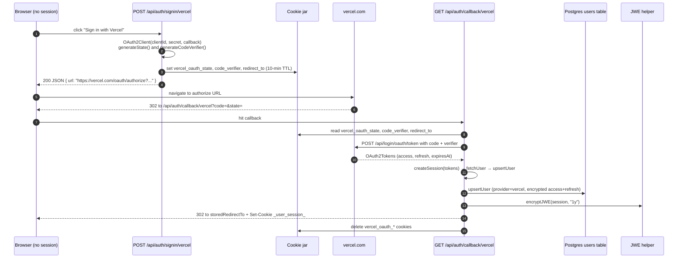

# Vercel OAuth

Vercel is one of the two primary identity providers in the auth subsystem and is always the *primary* identity when it is used — Vercel cannot be attached as a linked `accounts` row. The flow uses the OAuth 2.0 authorization code grant with PKCE (S256) via the `arctic` library's `OAuth2Client`, because `arctic` does not ship a Vercel adapter and Vercel's token endpoint is not the `https://oauth2.googleapis.com/token`-shaped default the library expects. For the broader concept of how Vercel and GitHub identities interact inside the JWE-encrypted session cookie see [Authentication & Sessions](../concepts/auth-and-sessions.md). For the at-rest encryption primitive used to protect stored Vercel tokens see [Encryption & Log Redaction](../concepts/encryption-and-redaction.md). The GitHub counterpart is documented in [GitHub OAuth](./github-oauth.md).

## App registration and required scopes

A Vercel integration backs the sign-in flow. Registration is described in `README.md` under "Vercel OAuth App":

1. Open the Vercel Dashboard → Settings → Integrations → Create.
2. Set the redirect URL to `${ORIGIN}/api/auth/callback/vercel` (e.g. `http://localhost:3000/api/auth/callback/vercel` for local development). Production deployments must add the production callback URL too.
3. Copy the client ID and client secret into the environment.

| Variable | Visibility | Purpose |
| --- | --- | --- |
| `NEXT_PUBLIC_VERCEL_CLIENT_ID` | Client-exposed (`NEXT_PUBLIC_` prefix) | OAuth client ID read by the sign-in route to build the authorize URL |
| `VERCEL_CLIENT_SECRET` | Server-only | Used by the callback to exchange the code and by sign-out to revoke the token |

Unlike GitHub, the Vercel sign-in start route does not guard against a missing `NEXT_PUBLIC_VERCEL_CLIENT_ID`: it constructs the `OAuth2Client` with an empty string and the failure surfaces downstream when the user reaches Vercel's authorize page. The callback has no explicit guard either, so a misconfigured deploy fails at the `validateAuthorizationCode` step and returns 400.

The authorize URL is built without any explicit scope list. `app/api/auth/signin/vercel/route.ts:15` calls `createAuthorizationURLWithPKCE` with `[]` as the scopes argument and an inline comment (`Vercel uses default scopes`) explains why: Vercel grants the integration's full configured permission set by default, and the template relies on that default. There is no `scope` column populated on the resulting `users` row — `lib/session/create.ts:26` explicitly passes `scope: undefined` for that reason.

The flow is OAuth 2.0 authorization code with PKCE using the S256 challenge method. CSRF protection is provided by `state`, generated with `arctic`'s `generateState()` and stored in a short-lived cookie that the callback re-reads before completing the exchange. The PKCE verifier is generated with `generateCodeVerifier()` and stored alongside `state`; the verifier and the post-auth `next` URL are the third and fourth cookies the start route writes.

## Route surface

Vercel authentication lives under three URL trees that share a single session cookie but each serve a different consumer:

| Route | Method | Purpose |
| --- | --- | --- |
| `app/api/auth/signin/vercel/route.ts` | `POST` | Start the flow. Generates `state` + PKCE verifier, returns the authorize URL as JSON for the client to navigate to. |
| `app/api/auth/callback/vercel/route.ts` | `GET` | Handles the Vercel redirect. Validates `state`, exchanges the code via `validateAuthorizationCode`, calls `createSession`, writes the JWE cookie, and redirects to the post-auth target. |
| `app/api/auth/info/route.ts` | `GET` | Returns the current session's user info. For Vercel users, rehydrates from the stored token to refresh profile data on every page load. |
| `app/api/vercel/teams/route.ts` | `GET` | Lists the user's Vercel scopes (personal account + team memberships) for the project-creation flow. |

The start route is intentionally a `POST` (whereas the GitHub start route is a `GET` redirect) because the PKCE handshake returns the authorize URL to a client that has to perform a navigation. The canonical client is `lib/session/redirect-to-sign-in.ts`, which `POST`s to `/api/auth/signin/vercel?next=<current path>`, reads `{ url }` from the JSON response, and sets `window.location = url`.

The callback route is asymmetric in a second way too: it returns a 302 with the post-auth `Location` header *before* `createSession` runs. This lets the route append the `Set-Cookie` header for the JWE session to the same response that performs the navigation, so the browser receives a single round-trip after Vercel's redirect.

## The sign-in flow



*Diagram: the Vercel PKCE sign-in flow. The start route returns the authorize URL as JSON (POST), the callback exchanges the code at Vercel's bespoke token endpoint, and a single 302 response carries both the `Set-Cookie` for the new JWE session and the post-auth redirect.*

Step by step, the callback (`app/api/auth/callback/vercel/route.ts`) does the following:

1. Reads `code`, `state`, and the three stored cookies (`vercel_oauth_state`, `vercel_oauth_code_verifier`, `vercel_oauth_redirect_to`). If any of `code`, `state`, the stored state, the stored verifier, or the stored `redirect_to` is missing, the route returns 400. State mismatch is the CSRF guard.
2. Constructs an `OAuth2Client` with `NEXT_PUBLIC_VERCEL_CLIENT_ID` + `VERCEL_CLIENT_SECRET` + the absolute callback URL.
3. Calls `client.validateAuthorizationCode('https://vercel.com/api/login/oauth/token', code, storedVerifier)`. The hard-coded token URL is what makes the route work despite `arctic` not shipping a Vercel adapter. Any thrown error is logged and returns 400.
4. Builds a 302 `Response` whose `Location` header is the stored `redirect_to`. This response object is the one that will be returned; the session is attached to it before the function exits.
5. Calls `createSession({ accessToken, expiresAt, refreshToken })` from `lib/session/create.ts`. This is where the user row is created or updated and the access token is fetched from Vercel.
6. If `createSession` returns `undefined` the route returns 500 with body `Failed to create session`. The 302 `Response` constructed in step 4 is discarded.
7. Otherwise calls `saveSession(response, session)` to append the `Set-Cookie` header for `_user_session_` to the 302 response, then deletes the three `vercel_oauth_*` cookies via `cookieStore.delete(...)` and returns the response.

## Token exchange and the `fetchUser` fallback

`createSession` in `lib/session/create.ts` does not trust that Vercel's primary `/v2/user` endpoint will always be reachable, so it falls back to a second endpoint when the first returns non-200:

<!-- openwiki: mermaid parse failed and this diagram was converted to a text fence so it does not break rendering. Fix the diagram source and restore the mermaid fence. Parser error: Heuristic: an unescaped angle bracket inside a label breaks rendering; rephrase the label. -->
```text
flowchart TD
    A["createSession(tokens)"] --> B["fetchUser(accessToken)"]
    B --> C["GET api.vercel.com/v2/user<br/>Bearer access_token"]
    C -->|"200"| P["parse payload"]
    C -->|"non-200"| D["GET vercel.com/api/www/user<br/>Bearer access_token"]
    D -->|"200"| P
    D -->|"non-200"| X["return undefined<br/>(session creation fails)"]
    P --> Q["normalize shape:<br/>either { user } envelope or bare user"]
    Q --> U["upsertUser(provider=vercel,<br/>externalId = user.uid or user.id,<br/>encrypt(accessToken),<br/>encrypt(refreshToken),<br/>username, email, name,<br/>avatarUrl = vercel.com/api/www/avatar/?u=username)"]
    U --> S["return Session with authProvider=vercel"]
```

*Diagram: the dual-endpoint `fetchUser` fallback. Both endpoints are hit with the same `Bearer` header and the same `cache: 'no-store'` semantics; the response shape differs (envelope vs bare) and the parser handles both.*

The two endpoints differ in their response envelope. `api.vercel.com/v2/user` returns a bare `VercelUser` object, while `vercel.com/api/www/user` wraps it under a `user` key. The parser in `lib/vercel-client/user.ts:27` handles both with `'user' in data && data.user ? data.user : 'username' in data ? data : undefined`. If neither shape matches, the function logs `No user data in response` and returns `undefined`, which causes `createSession` to return `undefined` and the callback to return 500.

`fetchUser` is also called from the second major consumer of the Vercel token, `app/api/vercel/teams/route.ts`, where it runs in parallel with `fetchTeams` and supplies the personal-account entry of the `scopes` list returned to the client.

## `fetchTeams` and the personal-account 403

`fetchTeams` in `lib/vercel-client/teams.ts` is the second half of the Vercel user lookup. It is a single `fetch` to `https://api.vercel.com/v2/teams` with `cache: 'no-store'` and the same `Bearer` header:

- **HTTP 200** → the JSON body's `teams` field is returned. A missing or null `teams` field is normalized to `[]`.
- **HTTP 403** → the function logs `User does not have team access (this is normal for personal accounts)` and returns `[]`. This is *expected* for users who have not been added to any Vercel team — the endpoint enforces team membership rather than the user's OAuth grant, and the template treats the failure as "no teams" rather than as an error. This is the only call site that distinguishes 403 from "real" failures.
- **Any other non-200** → the function logs the status and body and returns `undefined`, which is then treated as a 500 by `app/api/vercel/teams/route.ts:24` (`Failed to fetch user info`).

`app/api/vercel/teams/route.ts` is the route that surfaces the union of `fetchUser` + `fetchTeams` to the client. It returns a flat `scopes` list whose first entry is the personal account and whose remaining entries are the team memberships, each tagged with `type: 'personal' | 'team'`. The 401/500 contract is provider-aware: the route requires `session.authProvider === 'vercel'` (a GitHub-primary user has no Vercel token to look up teams with) and returns 401 if `getOAuthToken(session.user.id, 'vercel')` returns null.

## Token storage and at-rest encryption

`createSession` encrypts the Vercel access and refresh tokens with `lib/crypto.ts`'s `encrypt(...)` before passing them to `upsertUser`. The primitive is AES-256-CBC with a 16-byte random IV drawn per call; the wire format is `<iv_hex>:<ciphertext_hex>` and the key is the 32-byte `ENCRYPTION_KEY` (a 64-character hex string). For Vercel:

| Storage surface | Encryption site | Decryption site |
| --- | --- | --- |
| `users.accessToken` (primary) | `lib/session/create.ts` via `upsertUser` | `lib/session/get-oauth-token.ts` |
| `users.refreshToken` (primary, when present) | `lib/session/create.ts` via `upsertUser` | `lib/session/get-oauth-token.ts` |

Unlike GitHub, Vercel's standard OAuth flow can issue refresh tokens, and `createSession` threads them through when `tokens.hasRefreshToken()` is true at the callback. The schema's `users.refreshToken` column is nullable so the absence (e.g. if Vercel chose not to issue one) is represented by SQL `NULL` rather than an empty ciphertext.

`upsertUser` in `lib/db/users.ts` is the single function that creates or finds the internal `users.id` for a given `(provider, externalId)` pair after the callback successfully exchanges the code. It runs three checks in order:

1. **Same primary exists.** If a `users` row already matches `(provider, externalId)`, treat this as a returning sign-in. Update `accessToken`, `refreshToken`, `scope`, profile fields, `updatedAt`, and `lastLoginAt`, and return the existing `users.id`.
2. **GitHub already linked to a different user.** (Skipped for Vercel because the second check is `if (provider === 'github')`.)
3. **No match anywhere.** Generate a new `nanoid()` and insert a fresh `users` row carrying the supplied encrypted tokens and profile fields.

The Vercel path therefore has only two outcomes: returning sign-in (case 1) or first-time sign-in (case 3). The "GitHub reconnect merges a Vercel user" path described in [Authentication & Sessions](../concepts/auth-and-sessions.md) does not apply to a Vercel primary — the only Vercel row that can exist per real-world Vercel identity is the one created by the first sign-in.

The internal `users.id` returned by `upsertUser` is what lands in the JWE session payload as `user.id`. Downstream code (the task worker, the GitHub account-linking flow, the Vercel project creator) treats all users uniformly by this internal id, regardless of whether their primary identity is Vercel or GitHub.

## Session creation and the JWE cookie

`createSession` returns a `Session` object with `authProvider: 'vercel' as const` and a `user` block whose `avatar` is the synthetic URL `https://vercel.com/api/www/avatar/?u=${user.username}`. The function does *not* set the cookie itself — it returns the session object and the callback is responsible for handing it to `saveSession(response, session)`.

`saveSession` in `lib/session/create.ts` is identical in shape to the GitHub counterpart in `lib/session/create-github.ts` and uses the same `SESSION_COOKIE_NAME = '_user_session_'` constant. The cookie value is a JWE produced by `lib/jwe/encrypt.ts` with `alg: 'dir'`, `enc: 'A256GCM'`, a `1y` expiration, and the symmetric key from `process.env.JWE_SECRET` (base64url-decoded). The attributes on the `Set-Cookie` header are `Path=/`, `HttpOnly`, `SameSite=Lax`, `Max-Age=1y`, and `Secure` only in production. Passing `undefined` to `saveSession` emits an immediate-expiry `Set-Cookie`, which is how `/api/auth/signout` clears the session.

## Refreshing the session: `/api/auth/info`

`GET /api/auth/info` is the route that every page load hits to populate the global session atom in `components/auth/session-provider.tsx`. Its contract depends on the auth provider of the current session:

- **GitHub primary (`authProvider === 'github'`)** → return the existing session verbatim, do not re-fetch anything.
- **Vercel primary** → rehydrate the session from the stored token. The route reads the encrypted token via `getOAuthToken(userId, 'vercel')` (which decrypts with `lib/crypto.ts`) and re-runs `createSession({ accessToken, expiresAt })`. This refreshes profile data (avatar, name, email) on every page load, which is how a user who updates their Vercel profile sees the change reflected without re-signing-in.
- **No session** → return `{ user: undefined }`.

The refresh matters in practice because Vercel profiles (specifically `name` and `email`) can drift, and the JWE cookie was sealed at sign-in time. By always rehydrating from the live token the route ensures the UI shows current data while still keeping the cookie itself cheap to verify (the JWE is only decrypted once per request, not refreshed in place).

`saveSession` is then called on the response so the refreshed `user` block is re-encrypted and re-issued. The route picks the right `saveSession` based on `session.authProvider`: the GitHub `saveSession` for GitHub users, the Vercel `saveSession` for everyone else (including the no-session case, which emits the immediate-expiry cookie that clears any stale `_user_session_` value).

## Project creation: `createProject`

`lib/vercel-client/projects.ts` exposes a single helper, `createProject(accessToken, teamId, params)`, that wraps the official `@vercel/sdk` package. It is the only outbound Vercel API call in the project that is not part of the auth handshake. The function accepts:

- `accessToken` — the decrypted Vercel OAuth access token.
- `teamId` — the team id for a Vercel team, *or* the user id for a personal account. (The Vercel API treats both as an "account id" that scopes the request.)
- `params.name`, `params.gitRepository` (with `type: 'github'` and `repo: 'owner/repo'`), `params.framework` — the project fields.

The SDK call is `vercel.projects.createProject({ teamId, requestBody })`. The function swallows all errors, logs them, and returns `undefined`. A 403 in particular is logged with `Permission denied - user may need proper team permissions in Vercel` but is otherwise indistinguishable from other failures at the call site — callers must check for `undefined` and fall back accordingly.

This helper exists separately from the auth flow because it needs the decrypted Vercel access token at request time, not at sign-in time. Callers reach it through the same `getOAuthToken(session.user.id, 'vercel')` indirection that `/api/vercel/teams` and `/api/auth/info` use, so rotating the stored token via the Vercel reauth path automatically takes effect for project creation.

## Environment and operations surface

| Variable | Used by | Failure when missing |
| --- | --- | --- |
| `NEXT_PUBLIC_VERCEL_CLIENT_ID` | `/api/auth/signin/vercel`, `/api/auth/callback/vercel`, `/api/auth/signout` | Sign-in route constructs an `OAuth2Client` with empty strings; failure surfaces at the `validateAuthorizationCode` step in the callback (returns 400) or at the revoke step in sign-out |
| `VERCEL_CLIENT_SECRET` | `/api/auth/callback/vercel` (code exchange), `/api/auth/signout` (revoke) | Same as above; no explicit guard |
| `JWE_SECRET` | `lib/jwe/encrypt.ts`, `lib/jwe/decrypt.ts` | JWE helpers throw `Missing JWE secret`; both `createSession`'s `saveSession` call and the JWE decrypt path inside `getSessionFromCookie` fail before the response is built |
| `ENCRYPTION_KEY` | `lib/crypto.ts` (called from `lib/session/create.ts` via `upsertUser`) | `encrypt` throws with the `openssl rand -hex 32` hint; sign-in fails before the token hits the database |

There is no client-side check for the Vercel variables beyond the implicit guard. This is why the `NEXT_PUBLIC_` prefix is acceptable on `VERCEL_CLIENT_ID` — the secret itself never leaves the server.

## Failure and edge-case behavior

- **Missing `code`, `state`, or stored cookies at the callback.** Returns 400. The `vercel_oauth_*` cookies are *not* deleted in this branch, so a retry has a chance to succeed once the cookies are set.
- **State mismatch.** Treated identically to the "missing state" case: returns 400, cookies preserved.
- **Bad code exchange.** `validateAuthorizationCode` throws; the error is logged and 400 is returned.
- **`createSession` returns `undefined`.** The route returns 500 `Failed to create session`. The 302 `Response` is discarded; the cookies are not deleted. The user lands on a 500 page; a subsequent visit to the sign-in start route will start a fresh flow.
- **`fetchUser` returns `undefined`.** Same as the previous case: `createSession` returns `undefined` because it cannot resolve a profile.
- **`fetchTeams` returns 403.** Logged and treated as `[]`; the route returns the personal-account scope only.
- **`fetchTeams` returns any other non-200.** Logged and the function returns `undefined`. The route returns 500 `Failed to fetch Vercel teams` for the entire call, not just the teams half.
- **JWE decrypt failure.** `decryptJWE` swallows the error and returns `undefined`. Callers treat that as "not signed in", so a tampered or expired cookie degrades to an anonymous request rather than a 500.
- **Corrupt encrypted token.** `decrypt` throws. `getOAuthToken` catches it, logs `Error fetching OAuth token`, and returns `null`, so the calling route returns 401 (see `/api/vercel/teams`).
- **Sign-out.** `/api/auth/signout` calls `POST https://vercel.com/api/login/oauth/token/revoke` with a form-urlencoded `token=<accessToken>` body and HTTP Basic auth built from `NEXT_PUBLIC_VERCEL_CLIENT_ID`:`VERCEL_CLIENT_SECRET`. The revoke response is not parsed; a failure only logs and the local cookie is cleared regardless. After revocation the route returns `{ url }` for the client to navigate to and uses `saveSession(response, undefined)` to write the immediate-expiry `Set-Cookie`.

## Extension points

- **Switching to a non-default scope set.** Replace the `[]` literal in `app/api/auth/signin/vercel/route.ts:15` with the desired Vercel scope ids. The granted scope is *not* persisted on the `users` row today (`lib/session/create.ts:26` passes `scope: undefined`); if scope needs to be queryable, thread the granted value through `createSession` and into the `users.scope` column.
- **Adding refresh-token usage at the wire level.** `lib/session/get-oauth-token.ts` already decrypts and returns `refreshToken` for Vercel; the only missing piece is a refresh helper that runs the `validateAuthorizationCode`-style exchange with the refresh token when an outbound Vercel API call returns 401. That would let long-lived sessions survive access-token expiry.
- **Adding a second linked provider.** Vercel currently cannot be linked — it is only ever a primary. If a "Vercel as link" use case appeared, the change set would mirror the GitHub connect path: extend `accounts.provider` enum, add a connect-mode entrypoint, and have `upsertUser`'s GitHub-only branch learn a Vercel branch.
- **Adding a second consumer of the Vercel client.** All outbound Vercel API calls go through `lib/vercel-client/*`; new consumers should import from there rather than `fetch`ing `vercel.com` directly. The dual-endpoint `fetchUser` fallback is the only one with non-obvious shape handling and should be reused rather than re-implemented.
