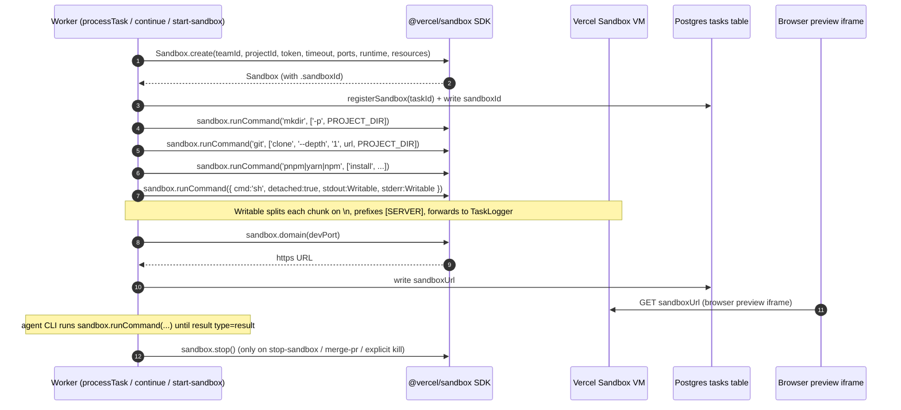

# Integration: Vercel Sandbox

The app provisions an ephemeral Linux VM per task through the `@vercel/sandbox` SDK (declared in [`package.json`](repo://package.json#L42) as `"@vercel/sandbox": "^0.0.21"`). The SDK exposes a `Sandbox` class with two static factories (`Sandbox.create`, `Sandbox.get`) and four instance methods the codebase actually uses (`runCommand`, `domain`, `stop`, and the readonly `sandboxId` accessor). Every file under `lib/sandbox/` imports the SDK the same way — `import { Sandbox } from '@vercel/sandbox'` ([`lib/sandbox/creation.ts:1`](repo://lib/sandbox/creation.ts#L1), [`lib/sandbox/commands.ts:1`](repo://lib/sandbox/commands.ts#L1), [`lib/sandbox/git.ts:1`](repo://lib/sandbox/git.ts#L1), [`lib/sandbox/sandbox-registry.ts:1`](repo://lib/sandbox/sandbox-registry.ts#L1), [`lib/sandbox/agents/claude.ts:1`](repo://lib/sandbox/agents/claude.ts#L1)).

For the per-phase narrative (creation → cloning → dependencies → dev server → agent → push → shutdown) see [Sandbox Lifecycle](../concepts/sandbox-lifecycle.md). For the request-level orchestration that calls into these modules, see [Sandbox Orchestration](../systems/sandbox-orchestration.md). For the env-var contract beyond the three SDK credentials, see [Environment Variables](../operations/environment-variables.md).

## SDK surface used by this app

The codebase touches five SDK call sites. The naming convention is consistent: the **static** `Sandbox.create` / `Sandbox.get` are capitalized, and the **instance** `sandbox.runCommand` / `sandbox.domain` / `sandbox.stop` / `sandbox.sandboxId` are lowercase.

| Call | Where defined in this codebase | Lifecycle role |
| --- | --- | --- |
| `Sandbox.create({...})` | [`lib/sandbox/creation.ts:99`](repo://lib/sandbox/creation.ts#L99); also [`app/api/tasks/[taskId]/start-sandbox/route.ts:91`](repo://app/api/tasks/[taskId]/start-sandbox/route.ts#L91) (uses `source`) | Provision a new VM |
<!-- openwiki: broken internal link [#reconnect-pattern-sandboxget] heading anchor "reconnect-pattern-sandboxget" does not exist in /openwiki/integrations/vercel-sandbox.md. Fix the href or restore the target, then delete this comment. -->
| `Sandbox.get({...})` | Every reconnecting API route — see [Reconnect pattern](#reconnect-pattern-sandboxget) | Re-attach to an existing VM across serverless executions |
| `sandbox.runCommand(...)` | [`lib/sandbox/commands.ts:27, 75, 85`](repo://lib/sandbox/commands.ts#L27) (positional); [`lib/sandbox/creation.ts:448`](repo://lib/sandbox/creation.ts#L448), [`lib/sandbox/agents/claude.ts:415`](repo://lib/sandbox/agents/claude.ts#L415), [`start-sandbox/route.ts:285`](repo://app/api/tasks/[taskId]/start-sandbox/route.ts#L285), [`terminal/route.ts:74`](repo://app/api/tasks/[taskId]/terminal/route.ts#L74) (options object) | Execute processes inside the VM |
| `sandbox.domain(port)` | [`lib/sandbox/creation.ts:460, 474`](repo://lib/sandbox/creation.ts#L460); [`start-sandbox/route.ts:297`](repo://app/api/tasks/[taskId]/start-sandbox/route.ts#L297) | Public URL for a forwarded VM port |
| `sandbox.stop()` | [`lib/sandbox/sandbox-registry.ts:49`](repo://lib/sandbox/sandbox-registry.ts#L49); [`stop-sandbox/route.ts:44`](repo://app/api/tasks/[taskId]/stop-sandbox/route.ts#L44); [`merge-pr/route.ts:66`](repo://app/api/tasks/[taskId]/merge-pr/route.ts#L66) | Tear the VM down |

`Sandbox` is also the type used everywhere a sandbox reference is passed around — `commands.ts`, `creation.ts`, `git.ts`, `package-manager.ts`, `sandbox-registry.ts`, all six agent adapters under `agents/`, and `lib/sandbox/types.ts` (`SandboxConfig`/`SandboxResult`).

## Provisioning — `Sandbox.create`

`Sandbox.create` is called from exactly two places:

- [`createSandbox`](repo://lib/sandbox/creation.ts#L99) — the canonical new-task builder. The payload built at lines 82–90 is:

  ```ts
  const sandboxConfig = {
    teamId: process.env.SANDBOX_VERCEL_TEAM_ID!,
    projectId: process.env.SANDBOX_VERCEL_PROJECT_ID!,
    token: process.env.SANDBOX_VERCEL_TOKEN!,
    timeout: timeoutMs,
    ports: defaultPorts,                  // [3000, 5173] by default
    runtime: config.runtime || 'node22',
    resources: { vcpus: config.resources?.vcpus || 4 },
  }
  ```

  Note that the `source` option is **not** set — the repo is cloned manually inside the sandbox via `mkdir -p /vercel/sandbox/project && git clone --depth 1 <authed-url> /vercel/sandbox/project` ([creation.ts:115-127](repo://lib/sandbox/creation.ts#L115)). The reason is the app needs to embed a GitHub PAT into the clone URL (`createAuthenticatedRepoUrl` in [`config.ts:69`](repo://lib/sandbox/config.ts#L69)) which the SDK's `source.git.url` path does not provide.

- [`POST /api/tasks/:taskId/start-sandbox`](repo://app/api/tasks/[taskId]/start-sandbox/route.ts#L91) — the keep-alive rehydration endpoint. It **does** pass `source`:

  ```ts
  source: task.repoUrl && task.branchName
    ? { type: 'git' as const, url: task.repoUrl, revision: task.branchName, depth: 1 }
    : undefined,
  ```

  This endpoint also detects the dev-server port from the repo (`detectPortFromRepo`) before calling `Sandbox.create`, so its `ports` array is the single detected port (`[port]`) rather than the default `[3000, 5173]`.

The `timeout` value passed in both call sites is `task.maxDuration * 60 * 1000` ms (or `MAX_SANDBOX_DURATION` / user-scoped `getMaxSandboxDuration` as fallbacks). The `keepAlive` flag does **not** influence this number — see [Sandbox Lifecycle → The keepAlive flag](../concepts/sandbox-lifecycle.md#the-keepalive-flag) for the canonical statement.

`Sandbox.create` errors are caught at [`creation.ts:140-163`](repo://lib/sandbox/creation.ts#L140) and translated into either a `Sandbox creation timed out after 5 minutes` message (when `error.code === 'ETIMEDOUT'`, `error.name === 'TimeoutError'`, or the message contains `'timeout'`) or a rethrow after `logger.error('Sandbox creation failed')`.

## Reconnect pattern — `Sandbox.get`

`Sandbox.get` is the cross-execution reconnect primitive. The in-memory `Map<taskId, Sandbox>` in [`lib/sandbox/sandbox-registry.ts`](repo://lib/sandbox/sandbox-registry.ts#L9) is local to a single serverless execution; once that function returns, the map dies. Any later request (continue, terminal, file ops, health, restart-dev, merge-pr, stop-sandbox, sync-changes, autocomplete, lsp, project-files, save-file, create-file/folder, delete-file, file-content, file-operation, reset-changes, discard-file-changes, diff) has to re-attach by `sandboxId`. The canonical shape — repeated in ~20 routes — is:

```ts
const sandbox = await Sandbox.get({
  sandboxId: task.sandboxId,
  teamId: process.env.SANDBOX_VERCEL_TEAM_ID!,
  projectId: process.env.SANDBOX_VERCEL_PROJECT_ID!,
  token: process.env.SANDBOX_VERCEL_TOKEN!,
})
```

Concrete examples:

- [`terminal/route.ts:56-61`](repo://app/api/tasks/[taskId]/terminal/route.ts#L56) — fast path via `getSandbox(taskId)` first, then `Sandbox.get` on miss.
- [`continue/route.ts:173-178`](repo://app/api/tasks/[taskId]/continue/route.ts#L173) — tries `Sandbox.get` first when `task.keepAlive` is true; on failure falls back to a fresh `createSandbox(...)` ([continue/route.ts:192-243](repo://app/api/tasks/[taskId]/continue/route.ts#L192)).
- [`start-sandbox/route.ts:47-52`](repo://app/api/tasks/[taskId]/start-sandbox/route.ts#L47) — uses `Sandbox.get` plus an `echo test` to decide whether to clear the DB columns and create a new sandbox, or refuse with `400 'Sandbox is already running'`.
- [`sandbox-health/route.ts:40-45`](repo://app/api/tasks/[taskId]/sandbox-health/route.ts#L40) — uses `Sandbox.get` purely as a liveness probe, then falls back to a 5 s `fetch(task.sandboxUrl)` to determine whether the **dev server** (not just the VM) is up.
- [`stop-sandbox/route.ts:36-41`](repo://app/api/tasks/[taskId]/stop-sandbox/route.ts#L36) and [`merge-pr/route.ts:59-64`](repo://app/api/tasks/[taskId]/merge-pr/route.ts#L59) — `Sandbox.get` followed by `sandbox.stop()`.

`Sandbox.get` failures are treated differently per caller — `start-sandbox` clears the DB and creates fresh; `continue` falls back to `createSandbox`; `terminal` and the file-operation routes return `500` to the client. There is no shared retry helper; each route owns its own recovery.

## Running processes — `sandbox.runCommand`

`sandbox.runCommand` is invoked in two distinct signatures across the codebase. The split is meaningful because the SDK's stdout/stderr model depends on which form is used.

### Positional form — `sandbox.runCommand(command, args)`

Used by the convenience wrappers in [`lib/sandbox/commands.ts`](repo://lib/sandbox/commands.ts). The result has `exitCode`, `stdout` (a function returning a `Promise<string>`), and `stderr` (same shape) — no streaming:

```ts
const result = await sandbox.runCommand(command, args)
let stdout = ''
let stderr = ''
try { stdout = await (result.stdout as () => Promise<string>)() } catch {}
try { stderr = await (result.stderr as () => Promise<string>)() } catch {}
return { success: result.exitCode === 0, exitCode: result.exitCode, output: stdout, error: stderr, command: fullCommand }
```

Three functions wrap this form:

- [`runCommandInSandbox(sandbox, command, args)`](repo://lib/sandbox/commands.ts#L21) — direct call, returns a `CommandResult` with `output` (stdout) and `error` (stderr) joined with `command` echoed back.
- [`runInProject(sandbox, command, args)`](repo://lib/sandbox/commands.ts#L66) — wraps in `sh -c "cd /vercel/sandbox/project && <command>"` after shell-escaping every argument. This is the workhorse for every git/file operation: `git status`, `git config`, `git checkout`, `cat package.json`, `npm install`, `python3 -m pip install`, etc.
- [`runStreamingCommandInSandbox(sandbox, command, args, options)`](repo://lib/sandbox/commands.ts#L78) — same plumbing as `runCommandInSandbox` but emits each stdout chunk through `options.onStdout` and each parsed JSON line through `options.onJsonLine` before returning.

The two try/catch blocks around `stdout()`/`stderr()` exist because some SDK paths return a function that throws when called; the wrappers treat that as an empty stream rather than failing the whole command.

### Options-object form — `sandbox.runCommand({ cmd, args, cwd, sudo, detached, stdout, stderr })`

Used wherever the caller needs to pass flags the positional form does not support:

| Caller | Notable flags |
| --- | --- |
| [`creation.ts:448-454`](repo://lib/sandbox/creation.ts#L448) — detached dev server | `detached: true`, `stdout: captureServerStdout`, `stderr: captureServerStderr` |
| [`agents/claude.ts:415-423`](repo://lib/sandbox/agents/claude.ts#L415) — Claude CLI with streaming | `sudo: false`, `detached: true`, `cwd: PROJECT_DIR`, `stdout: captureStdout`, `stderr: captureStderr` |
| [`start-sandbox/route.ts:285-291`](repo://app/api/tasks/[taskId]/start-sandbox/route.ts#L285) — rehydrated dev server | `detached: true`, `stdout: captureServerStdout`, `stderr: captureServerStderr` |
| [`terminal/route.ts:74-78`](repo://app/api/tasks/[taskId]/terminal/route.ts#L74) — user-typed terminal command | `cwd: PROJECT_DIR` (no streams) |

All four share the same shape `cmd: 'sh', args: ['-c', '<the actual command>']` so that shell features (pipes, redirection, variable interpolation, command substitution) are preserved.

## Public URL — `sandbox.domain(port)`

`sandbox.domain(port)` returns the public HTTPS URL the SDK exposes for a port the VM is listening on. There are exactly three call sites:

- [`creation.ts:460`](repo://lib/sandbox/creation.ts#L460) — immediately after the dev-server detached `runCommand` returns, the code waits `3000 ms` (`setTimeout`) for the dev server to bind, then captures `domain = sandbox.domain(devPort)`.
- [`creation.ts:474`](repo://lib/sandbox/creation.ts#L474) — fallback: if no dev script was detected and the `domain` variable is still unset, the code resolves `domain = sandbox.domain(devPort)` for the default port (`3000`, or `5173` for Vite projects detected via `dependencies.vite || devDependencies.vite` at [`creation.ts:341`](repo://lib/sandbox/creation.ts#L341)).
- [`start-sandbox/route.ts:297`](repo://app/api/tasks/[taskId]/start-sandbox/route.ts#L297) — the same 3-second wait followed by `sandboxUrl = sandbox.domain(port)` after the rehydrated dev server starts.

The returned URL is the value persisted to `tasks.sandboxUrl` and is what the browser preview iframe loads.

## Teardown — `sandbox.stop`

`sandbox.stop()` is the SDK-level shutdown primitive. It is **not** the same as `shutdownSandbox` in [`lib/sandbox/git.ts:75`](repo://lib/sandbox/git.ts#L75) — the latter is a best-effort `pkill -f node|python|npm|yarn|pnpm` inside the VM and explicitly documents that *"Vercel Sandbox automatically shuts down after timeout / No explicit shutdown method available in current SDK"* ([git.ts:91-94](repo://lib/sandbox/git.ts#L91)). The SDK's `stop()` does exist and is used in three places:

- [`sandbox-registry.ts:49`](repo://lib/sandbox/sandbox-registry.ts#L49) — inside `killSandbox(taskId)`, which removes the in-memory entry first, then `await sandbox.stop()` inside a try/catch that treats any rejection as success ("Sandbox may already be stopped, that's okay").
- [`stop-sandbox/route.ts:44`](repo://app/api/tasks/[taskId]/stop-sandbox/route.ts#L44) — explicit `POST /api/tasks/:taskId/stop-sandbox` handler. After `sandbox.stop()`, it `unregisterSandbox(taskId)` and clears both `tasks.sandboxId` and `tasks.sandboxUrl`.
- [`merge-pr/route.ts:66`](repo://app/api/tasks/[taskId]/merge-pr/route.ts#L66) — after a successful PR merge, the route does `Sandbox.get + sandbox.stop + unregisterSandbox`, then clears `sandboxId`/`sandboxUrl` and sets `completedAt`. The `keepAlive` flag is **not** consulted here — merging the PR is treated as definitive end-of-life.

The SDK timeout set at `Sandbox.create` time is the ultimate safety net for sandboxes that are never explicitly stopped (e.g. the user abandons the task entirely); Vercel garbage-collects the VM once it elapses.

## Writable-stream pattern for the detached dev server

The dev server is launched with `detached: true` so it keeps running after the `runCommand` promise resolves — the worker needs the VM live while the agent edits files. Because the call returns immediately, the only way to see what the dev server is logging is to attach `Writable` streams to the SDK's stdout/stderr and pipe each chunk through `TaskLogger.info`. The same pattern appears in three places (the two callers listed above plus the keep-alive start path) and is implemented identically:

```ts
import { Writable } from 'stream'

const captureServerStdout = new Writable({
  write(chunk: Buffer | string, _encoding: BufferEncoding, callback: (error?: Error | null) => void) {
    const lines = chunk
      .toString()
      .split('\n')
      .filter((line) => line.trim())
    for (const line of lines) {
      logger.info(`[SERVER] ${line}`).catch(() => {})
    }
    callback()
  },
})

const captureServerStderr = new Writable({
  write(chunk: Buffer | string, _encoding: BufferEncoding, callback: (error?: Error | null) => void) {
    // identical body — both streams prefix [SERVER] in this app
    const lines = chunk.toString().split('\n').filter((line) => line.trim())
    for (const line of lines) {
      logger.info(`[SERVER] ${line}`).catch(() => {})
    }
    callback()
  },
})

await sandbox.runCommand({
  cmd: 'sh',
  args: ['-c', `cd ${PROJECT_DIR} && ${fullDevCommand}`],
  detached: true,
  stdout: captureServerStdout,
  stderr: captureServerStderr,
})

// Wait for the dev server to bind, then resolve the public URL.
await new Promise((resolve) => setTimeout(resolve, 3000))
domain = sandbox.domain(devPort)
```

Source: [`creation.ts:422-461`](repo://lib/sandbox/creation.ts#L422). The stream's `write` callback **must** call `callback()` so the SDK can flush the next chunk; the `logger.info(...).catch(() => {})` swallows the rejected promise that would otherwise surface as an `unhandledRejection` if `TaskLogger` were to throw. Each non-empty line is prefixed with `[SERVER]` so the UI can distinguish dev-server logs from agent CLI logs. The Claude adapter ([`agents/claude.ts:310-405`](repo://lib/sandbox/agents/claude.ts#L310)) reuses the same pattern for a different purpose — its `captureStdout` parses each chunk as `stream-json` and updates the `taskMessages` row in the DB as the agent emits text and tool_use blocks.

## Required environment variables

The SDK requires three credentials on every call. They are listed in the one-click deploy URL ([`lib/constants.ts:9`](repo://lib/constants.ts#L9)) and validated up front by [`validateEnvironmentVariables`](repo://lib/sandbox/config.ts#L51) before `Sandbox.create` is reached:

| Env var | Purpose |
| --- | --- |
| `SANDBOX_VERCEL_TEAM_ID` | Identifies the Vercel team that owns the project the sandbox runs under |
| `SANDBOX_VERCEL_PROJECT_ID` | Identifies the Vercel project the sandbox is billed against |
| `SANDBOX_VERCEL_TOKEN` | API token used to authenticate every `Sandbox.create`, `Sandbox.get`, and `sandbox.stop` call |

A missing value at validation time surfaces as one of `'SANDBOX_VERCEL_TEAM_ID is required for sandbox creation'`, `'SANDBOX_VERCEL_PROJECT_ID is required for sandbox creation'`, `'SANDBOX_VERCEL_TOKEN is required for sandbox creation'` ([config.ts:51-61](repo://lib/sandbox/config.ts#L51)), and the request throws before reaching the SDK. The same three values are passed to every `Sandbox.get` call across the API surface; the route-handler pattern (`process.env.SANDBOX_VERCEL_TOKEN!`) is identical everywhere. `lib/utils/logging.ts:25-30` also has dedicated regexes that redact the token if either env-var name appears in a logged command string.

## The two identifiers persisted to the DB

The SDK surfaces exactly two values that the database needs to keep across serverless executions. Both are written to `tasks` ([`lib/db/schema.ts:99-101`](repo://lib/db/schema.ts#L99)):

```ts
sandboxId: text('sandbox_id'),
sandboxUrl: text('sandbox_url'),
```

- **`sandbox.sandboxId`** — opaque SDK identifier, read in [`app/api/tasks/route.ts:508`](repo://app/api/tasks/route.ts#L508), [`start-sandbox/route.ts:110`](repo://app/api/tasks/[taskId]/start-sandbox/route.ts#L110), and [`continue/route.ts:238`](repo://app/api/tasks/[taskId]/continue/route.ts#L238). It is the argument to every `Sandbox.get({ sandboxId })` call. This column survives across serverless executions and is the durable handle for "which VM does this task own."

- **`sandbox.domain(port)`** — public HTTPS URL, written into `tasks.sandboxUrl` by `processTask` after `createSandbox` returns ([creation.ts:980-985](repo://lib/sandbox/creation.ts#L980)), by the keep-alive start path ([start-sandbox/route.ts:306-310](repo://app/api/tasks/[taskId]/start-sandbox/route.ts#L306)), and by the continue path ([continue/route.ts:235-242](repo://app/api/tasks/[taskId]/continue/route.ts#L235)). The browser preview iframe loads this URL, and `sandbox-health` pings it with a 5-second `AbortSignal.timeout(5000)` to distinguish `running` / `starting` / `stopped` ([sandbox-health/route.ts:54-95](repo://app/api/tasks/[taskId]/sandbox-health/route.ts#L54)).

Together, `sandboxId` is the "control plane" identifier (how the app reaches the VM) and `sandboxUrl` is the "data plane" identifier (how the browser reaches the dev server). The dual-store pattern (in-memory `Map<taskId, Sandbox>` plus these two DB columns) is documented in detail at [Sandbox Lifecycle → The dual persistence model](../concepts/sandbox-lifecycle.md#the-dual-persistence-model).

## End-to-end call sequence

The diagram below shows how the five SDK calls compose during a new task with a `package.json` dev script and a kept-alive sandbox. Agent-specific `runCommand` calls (Claude/Codex/Cursor/etc.) are omitted to keep the focus on the SDK surface.



*Diagram: how `Sandbox.create`, `sandbox.runCommand`, `sandbox.domain`, and `sandbox.stop` compose for one task; `Sandbox.get` is the cross-execution reconnect form of `Sandbox.create`.*

## Failure modes and invariants

- **`Sandbox.create` timeout.** A `ETIMEDOUT` / `TimeoutError` / message-contains-`'timeout'` error is translated to a 5-minute-user-facing message at [`creation.ts:151-155`](repo://lib/sandbox/creation.ts#L151). Other errors rethrow after `logger.error`.
- **`Sandbox.get` stale handle.** When the VM has already been garbage-collected, `Sandbox.get` throws. `start-sandbox` and `continue` treat this as "create fresh"; `terminal`, `files`, `diff`, `lsp`, etc. return `500`. There is no shared retry helper.
- **`sandbox.stop()` on a dead VM.** `killSandbox` and the merge-pr/stop-sandbox routes catch the rejection and proceed (treat the call as a no-op rather than failing the parent operation).
- **`runCommand` stream exceptions.** Both `result.stdout` and `result.stderr` in the positional form are wrapped in try/catch ([`commands.ts:33-43`](repo://lib/sandbox/commands.ts#L33), [`commands.ts:90-127`](repo://lib/sandbox/commands.ts#L90)) because the SDK returns them as `() => Promise<string>` and the function may throw.
- **`Writable` must call its callback.** The dev-server `Writable.write` implementations always invoke `callback()` even when `logger.info(...)` is fire-and-forget; failing to do so would deadlock the SDK's stream pump.
- **Cancellation.** The five `onCancellationCheck` checkpoints inside `createSandbox` are the SDK-level cancellation surface — the worker checks `task.status` before each phase and returns `{ success: false, cancelled: true }` rather than calling any SDK teardown directly.

## Extension points

- **New SDK option.** Pass it through `SandboxConfig` ([`lib/sandbox/types.ts:4`](repo://lib/sandbox/types.ts#L4)) and read it in both `Sandbox.create` call sites ([`creation.ts:82-90`](repo://lib/sandbox/creation.ts#L82) and [`start-sandbox/route.ts:91-108`](repo://app/api/tasks/[taskId]/start-sandbox/route.ts#L91)). Remember that `start-sandbox` passes a `source` while `creation.ts` does not.
- **New port to expose.** Add it to the `ports` array in both call sites and (if conditional) extend [`detectPortFromRepo`](repo://lib/sandbox/port-detection.ts) so the start-sandbox path picks it up.
- **New dev-server variant.** Reuse the `Writable` capture pattern verbatim; replace `captureServerStdout`/`captureServerStderr` with your own `Writable` if you need JSON parsing or different prefixes. The detached `runCommand` call is the only contract.
- **New reconnecting route.** Copy the `getSandbox(taskId) ?? Sandbox.get({ sandboxId, teamId, projectId, token })` preamble so the route works inside the original execution and across reconnects. Pick the recovery strategy (`clear DB + create fresh` vs. `return 500`) that matches the existing sibling route.
- **New teardown signal.** Use the `Sandbox.get + sandbox.stop + unregisterSandbox + clear DB columns` shape from `stop-sandbox/route.ts` and `merge-pr/route.ts`. Do not call `sandbox.stop()` directly without also clearing the DB columns — leaving a stale `sandboxId` will cause the next `Sandbox.get` to throw.
