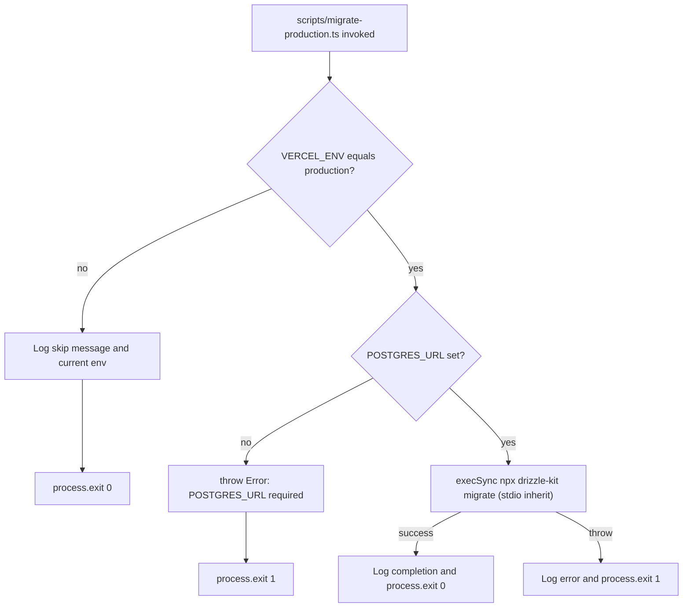
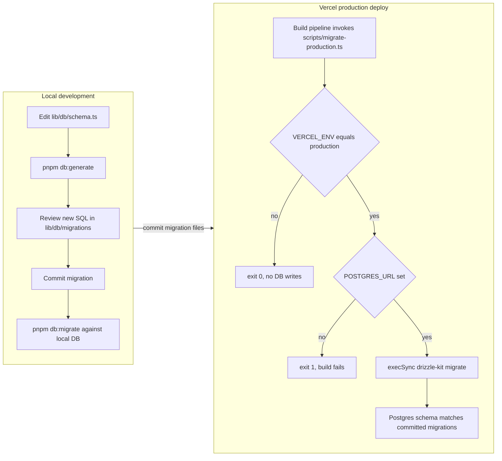

# Database Migrations

This page documents the schema migration pipeline for the application's PostgreSQL database (Neon in production). Migrations are authored as ordered SQL files generated by drizzle-kit, committed to the repository, and applied locally during development via npm scripts. In production, scripts/migrate-production.ts invokes the same drizzle-kit migrator behind a VERCEL_ENV=production guard so that schema changes ride along with each deploy.

For the table definitions these migrations build up, see Database Schema. For the runtime database client and how it lazily opens a postgres connection, see lib/db/client.ts.

## Configuration: drizzle.config.ts

drizzle.config.ts at the repository root is the single source of truth for migration generation. It pins the schema source, the output directory, the SQL dialect, and the database URL:

```ts
import { defineConfig } from 'drizzle-kit'

export default defineConfig({
  schema: './lib/db/schema.ts',
  out: './lib/db/migrations',
  dialect: 'postgresql',
  dbCredentials: {
    url: process.env.POSTGRES_URL!,
  },
})
```

Four behaviors follow from this file:

- **schema** - drizzle-kit reads the Drizzle schema from lib/db/schema.ts when computing diffs during generate or push.
- **out** - generated migration SQL files and the meta directory are written into lib/db/migrations and committed alongside the schema.
- **dialect: 'postgresql'** - the generated SQL targets PostgreSQL (the Neon database in production). The journal format is version 7 (see lib/db/migrations/meta/_journal.json).
- **dbCredentials.url** - uses process.env.POSTGRES_URL via a non-null assertion. POSTGRES_URL is therefore required for any drizzle-kit command that needs a live database (migrate, push, studio); generate does not need it because it only diffs against the schema source.

POSTGRES_URL is the same connection string the runtime db client (lib/db/client.ts) uses, and it is provided automatically when deploying to Vercel via the Neon integration declared in vercel-template.json.

## The migrations directory

lib/db/migrations is committed to the repository and currently contains 22 ordered migrations (0000 through 0021):

- One SQL file per migration, named NNNN_slug.sql (for example, 0000_hard_harry_osborn.sql, 0021_lovely_lizard.sql). The numeric prefix is the application order; the suffix is a drizzle-kit-generated label and is not meaningful.
- A meta directory containing:
  - _journal.json - the migration journal. It declares version "7", dialect "postgresql", and one entry per migration with its index, tag, and creation timestamp. drizzle-kit consults this journal to decide which migrations still need to run.
  - One NNNN_snapshot.json per migration, capturing the full schema state after that migration applies. drizzle-kit uses the latest snapshot when computing the next diff.

The first migration, 0000_hard_harry_osborn.sql, creates the original tasks table. Subsequent migrations add columns (for example, 0021_lovely_lizard.sql adds enable_browser boolean DEFAULT false to tasks), introduce new tables (such as the users, accounts, keys, connectors, and settings tables added in 0010_concerned_exodus.sql), and rewrite existing data - for example, 0002_optimal_black_bird.sql converts the tasks.logs column from a text array to a jsonb of structured log entries.

The SQL files use Drizzle's `---> statement-breakpoint` marker to separate statements inside a single migration; this is the standard drizzle-kit format and is parsed when the migration runs.

## Local development: npm scripts

package.json exposes four migration-related scripts that map directly to drizzle-kit subcommands:

| Script             | Command                | Purpose                                                                                                                                                                |
| ------------------ | ---------------------- | ---------------------------------------------------------------------------------------------------------------------------------------------------------------------- |
| pnpm db:generate   | drizzle-kit generate   | Diff lib/db/schema.ts against the latest snapshot and emit a new numbered SQL file in lib/db/migrations. No database connection required.                              |
| pnpm db:migrate    | drizzle-kit migrate    | Apply any unapplied migrations from lib/db/migrations to the database pointed at by POSTGRES_URL.                                                                       |
| pnpm db:push       | drizzle-kit push       | Push the current lib/db/schema.ts directly to the database without writing a migration. Intended for fast iteration or for wiping local state (pnpm db:push --force). |
| pnpm db:studio     | drizzle-kit studio     | Open the Drizzle Studio GUI against the database pointed at by POSTGRES_URL.                                                                                          |

The README's setup sequence is pnpm db:generate followed by pnpm db:push for first-run schema creation on a fresh local database. In practice, the workflow for adding a column or table is: edit lib/db/schema.ts, run pnpm db:generate to produce a new SQL file under lib/db/migrations, review the generated SQL, commit it, and then run pnpm db:migrate locally.

## Production: scripts/migrate-production.ts

scripts/migrate-production.ts is a thin Node script that wraps drizzle-kit migrate behind a strict environment guard so that schema changes apply as part of a production deploy but never accidentally run during preview builds, local development, or CI dry runs. Its behavior is entirely driven by environment variables:



### The VERCEL_ENV guard

The script's first statement is the production check:

```ts
if (process.env.VERCEL_ENV !== 'production') {
  console.log('Skipping database migrations - not in production environment')
  console.log(`  Current environment: ${process.env.VERCEL_ENV || 'local'}`)
  process.exit(0)
}
```

VERCEL_ENV is a Vercel-provided environment variable that takes the values production, preview, or development. By hard-gating on the string 'production', the script no-ops (exit code 0) on:

- local developer machines (where VERCEL_ENV is unset),
- Vercel preview deployments (where VERCEL_ENV=preview),
- Vercel development deployments (where VERCEL_ENV=development),
- CI runners that do not explicitly set VERCEL_ENV=production.

This is the safety boundary: the script can be wired into a build hook that runs on every Vercel deployment, and only production deployments will actually touch the database schema.

### The POSTGRES_URL guard

Inside the production branch, the script explicitly re-verifies POSTGRES_URL:

```ts
if (!process.env.POSTGRES_URL) {
  throw new Error('POSTGRES_URL environment variable is required')
}
```

This is a defense-in-depth check on top of the runtime db client, which throws the same error in lib/db/client.ts. Without POSTGRES_URL, drizzle-kit would fail with a less obvious error; the explicit guard produces a clear failure message that surfaces in the Vercel build log.

### Invoking drizzle-kit

The actual migration runs via child_process.execSync:

```ts
execSync('npx drizzle-kit migrate', {
  stdio: 'inherit',
  env: process.env,
})
```

Three properties matter here:

- **stdio: 'inherit'** - the child's stdout and stderr stream into the parent process, so the migration output appears inline in the Vercel build log. Operators watching the deploy can see which migrations were applied.
- **env: process.env** - the full process environment (including POSTGRES_URL) is forwarded to the child so drizzle-kit can resolve drizzle.config.ts.
- **execSync** - the migration is synchronous relative to the script; any thrown error is caught by the surrounding try/catch, logged with console.error, and converted to process.exit(1) so Vercel marks the build as failed.

A successful run logs completion and exits 0; a thrown error logs the error and exits 1.

## Local vs. production: side-by-side



The two paths share the same set of committed SQL files in lib/db/migrations. The difference is who applies them: developers run pnpm db:migrate themselves; production relies on the guarded runner so the schema stays in sync with the code on every deploy.

## Failure modes and invariants

- **Drift between committed migrations and schema.** Because drizzle-kit migrate reads the journal and applies only unapplied entries, re-running the script on a database that already has the latest schema is a no-op. However, hand-edits to a committed SQL file would cause subsequent generate runs to produce divergent SQL and are not supported.
- **Stale snapshots.** Each meta/NNNN_snapshot.json is regenerated by pnpm db:generate and is required for future diffs to compute correctly. Deleting or skipping snapshots will break generation but does not affect migrate, which only needs the journal and the SQL files.
- **Missing POSTGRES_URL in production.** The script's explicit check ensures the deploy fails loudly rather than attempting to migrate against an empty URL.
- **Preview branches.** Preview deployments (where VERCEL_ENV=preview) skip migrations entirely. If a preview deployment needs a different schema than production, that schema change must either already exist in the migration set or be applied to a non-production database by some other means.

## Related pages

- [Database Schema](../systems/database-schema.md) - the tables and columns these migrations build up.
- [Environment Variables and Secrets](../operations/environment-variables.md) - where POSTGRES_URL is documented and how it is provisioned by the Neon integration.
