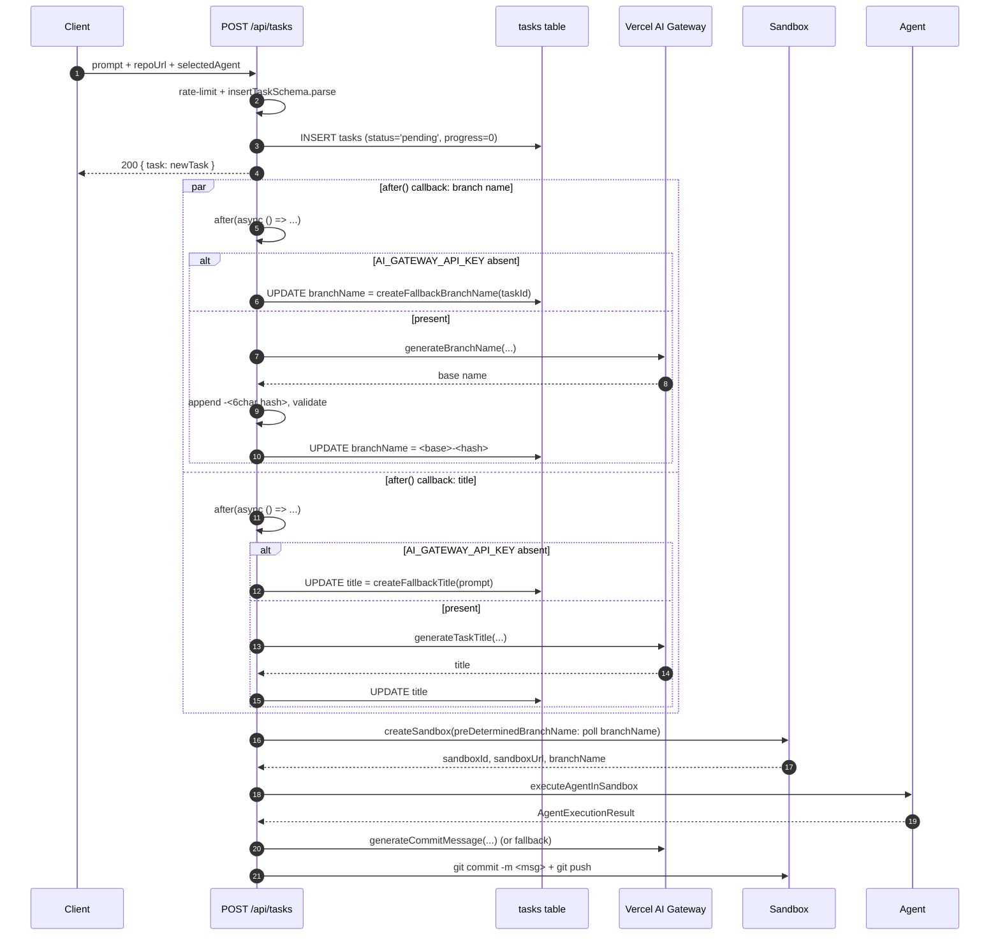

# AI Content Generation (Branch Names, Commit Messages, Titles)

Three small generators under `lib/utils/` translate a user prompt into the three pieces of metadata that ride along with every task row: the Git branch name (e.g. `feature/user-auth-aB3xZ9`), the commit message for the final `git push` (e.g. `Add user authentication`), and the short title shown in the UI list (e.g. `Add user authentication`). All three share the same skeleton — an `AI_GATEWAY_API_KEY` precondition, an AI SDK 5 `generateText` call against the model id `'openai/gpt-5-nano'` with `temperature: 0.3`, a strip-quotes/whitespace cleanup, a length validation, and a deterministic fallback function that runs without any AI key at all.

This page documents the three generators themselves, the route-layer `after()` wiring that lets `POST /api/tasks` return the new task row immediately without waiting on a gateway round-trip, and the two-layer fallback story (route-level skip + generator-level catch). For how the AI Gateway key is resolved from the per-user `keys` row and `process.env` before it reaches the generators, see [Environment Variables & Secrets](../operations/environment-variables.md). For the sandbox-side counterpart that routes the Claude and Codex CLIs through the same gateway, see [Vercel AI Gateway](../integrations/vercel-ai-gateway.md).

## The shared skeleton

Every generator exports one async AI function and one synchronous fallback function, both of which return a plain string:

| Generator | Async AI function | Sync fallback | Writes to | Length cap |
| --- | --- | --- | --- | --- |
| Branch name ([`lib/utils/branch-name-generator.ts`](repo://lib/utils/branch-name-generator.ts)) | `generateBranchName({ description, repoName?, context? })` | `createFallbackBranchName(taskId)` | `tasks.branchName` | 50 chars total |
| Commit message ([`lib/utils/commit-message-generator.ts`](repo://lib/utils/commit-message-generator.ts)) | `generateCommitMessage({ description, repoName?, context? })` | `createFallbackCommitMessage(description)` | `git commit -m "..."` | 72 chars |
| Task title ([`lib/utils/title-generator.ts`](repo://lib/utils/title-generator.ts)) | `generateTaskTitle({ prompt, repoName?, context? })` | `createFallbackTitle(prompt)` | `tasks.title` | 60 chars |

The two non-obvious bits of the shared skeleton:

1. **Model id.** `model: 'openai/gpt-5-nano'` is the AI Gateway's "provider/model" routing syntax. The `ai` package's `generateText` resolves the `openai` provider, reads `AI_GATEWAY_API_KEY` from `process.env`, and POSTs to the gateway with that key as the bearer token. The same credential is read by both the per-user override path (`getUserApiKeys()` in `lib/api-keys/user-keys.ts`) and the system env path; the generators see whichever the route layer left in place.
2. **Cleanup + validation.** After `result.text` returns, every generator runs `.trim().replace(/^["']|["']$/g, '')` to strip surrounding quotes and whitespace, then applies a length-cap (or regex for the branch name). On any failure — missing key, gateway error, invalid output — the function throws or returns the synchronous fallback.

The branch name generator is the only one that adds a uniqueness suffix, the only one that throws on validation failure (the route's outer `catch` writes the fallback), and the only one that uses the [`nanoid`](https://github.com/ai/nanoid) package (`customAlphabet('0-9A-Za-z', 6)`) to ensure simultaneous task creations do not collide.

## Branch name generator

[`generateBranchName`](repo://lib/utils/branch-name-generator.ts#L10-L71) takes a `BranchNameOptions` record and returns a `<base>-<6char-hash>` string, e.g. `feature/user-auth-aB3xZ9`:

- **Precondition.** `process.env.AI_GATEWAY_API_KEY` must be present. If absent, the function throws `'AI_GATEWAY_API_KEY environment variable is required'` ([`L13-L15`](repo://lib/utils/branch-name-generator.ts#L13-L15)). The caller is responsible for the fallback; the generator never calls into its own `createFallbackBranchName`.
- **Prompt.** A short instruction asks for one Git branch name with explicit constraints: lowercase letters / numbers / hyphens only, under 50 characters, conventional prefixes (`feature/`, `fix/`, `chore/`, `docs/`) when appropriate. The prompt echoes `description`, optional `repoName`, and optional `context` (which the task route sets to `'<selectedAgent> agent task'`).
- **Model and temperature.** `openai/gpt-5-nano`, `temperature: 0.3`. Lower temperature keeps the model close to conventional Git branch naming rather than inventing surprising output.
- **Cleanup.** `result.text.trim().replace(/^["']|["']$/g, '')` ([`L48`](repo://lib/utils/branch-name-generator.ts#L48)).
- **Suffix.** A 6-character alphanumeric hash from [`nanoid`](https://github.com/ai/nanoid)'s `customAlphabet('0-9A-Za-z', 6)` is appended as `<base>-<hash>` ([`L50-L54`](repo://lib/utils/branch-name-generator.ts#L50-L54)) so two simultaneous tasks with identical prompts still produce different branches.
- **Validation.** The base name must match `^[a-z0-9-\/]+$`. Any other character set throws `'Generated branch name contains invalid characters'` and the route's outer `catch` writes `createFallbackBranchName(taskId)` into the `tasks.branchName` column. Total length must remain ≤ 50 characters *after* the hash is appended, or the function throws the same way ([`L57-L64`](repo://lib/utils/branch-name-generator.ts#L57-L64)).

[`createFallbackBranchName(taskId)`](repo://lib/utils/branch-name-generator.ts#L73-L76) is purely deterministic and has no AI dependency:

```ts
const timestamp = new Date().toISOString().replace(/[:.]/g, '-').slice(0, -5)
return `agent/${timestamp}-${taskId.slice(0, 8)}`
```

The result has the shape `agent/2026-09-14T13-12-47-1a2b3c4d` — an ISO timestamp with `:` and `.` replaced by `-` (then trimmed of the trailing milliseconds), followed by the first 8 characters of the task id. It is also the name the sandbox itself falls back to when no `preDeterminedBranchName` is supplied (see [Sandbox fallback branch name](#sandbox-fallback-branch-name) below).

## Commit message generator

[`generateCommitMessage`](repo://lib/utils/commit-message-generator.ts#L9-L62) takes a `CommitMessageOptions` record and returns a single-line conventional-commit message. It is called only on the success path of an agent run, just before `pushChangesToBranch`:

- **Precondition.** Same `AI_GATEWAY_API_KEY` check; missing key throws.
- **Prompt.** Asks for a single conventional commit message: under 72 characters, imperative mood, sentence case, no quotes/formatting/line breaks, no sensitive information (no user IDs, file paths, or credentials).
- **Model and temperature.** `openai/gpt-5-nano`, `temperature: 0.3`.
- **Cleanup.** Same `trim()` + strip-surrounding-quotes step.
- **Validation.** A message longer than 72 characters is truncated to 69 + `...` ([`L51-L54`](repo://lib/utils/commit-message-generator.ts#L51-L54)) — the function does *not* throw on long output.
- **Internal fallback.** If the `generateText` call throws (network error, gateway error), the function catches and returns `createFallbackCommitMessage(description)` ([`L57-L61`](repo://lib/utils/commit-message-generator.ts#L57-L61)). This is in addition to the route-layer `try/catch` that does the same thing.

[`createFallbackCommitMessage(description)`](repo://lib/utils/commit-message-generator.ts#L64-L72) returns the description verbatim when it is already ≤ 72 characters, otherwise truncates to 69 + `...`. Unlike the branch name path, the route layer for commit messages also chooses between AI and fallback at the entry point — when `process.env.AI_GATEWAY_API_KEY` is unset, [`app/api/tasks/route.ts:651`](repo://app/api/tasks/route.ts#L651-L659) and [`app/api/tasks/[taskId]/continue/route.ts:381`](repo://app/api/tasks/[taskId]/continue/route.ts#L381-L389) skip the SDK call entirely and call `createFallbackCommitMessage(prompt)` directly.

## Task title generator

[`generateTaskTitle`](repo://lib/utils/title-generator.ts#L9-L60) takes a `TitleGenerationOptions` record and returns a short title suitable for the tasks list UI. It is structurally the simplest of the three — the prompt is named `systemPrompt` inside the function but passed as `prompt` to `generateText`, since the SDK only requires a string input:

- **Precondition.** Same `AI_GATEWAY_API_KEY` check; missing key throws.
- **Prompt.** Asks for a single title: under 60 characters, sentence case, no quotes or special formatting, descriptive but concise.
- **Model and temperature.** `openai/gpt-5-nano`, `temperature: 0.3`.
- **Cleanup.** Same `trim()` + strip-surrounding-quotes step.
- **Validation.** A title longer than 60 characters is truncated to 57 + `...` ([`L50-L52`](repo://lib/utils/title-generator.ts#L50-L52)).
- **Internal fallback.** Same shape as the commit message generator: on `generateText` failure the function returns `createFallbackTitle(prompt)` ([`L55-L59`](repo://lib/utils/title-generator.ts#L55-L59)).

[`createFallbackTitle(prompt)`](repo://lib/utils/title-generator.ts#L62-L70) returns the prompt verbatim when it is already ≤ 60 characters, otherwise truncates to 57 + `...`.

## Non-blocking dispatch via `after()`

The task-creation flow in [`app/api/tasks/route.ts`](repo://app/api/tasks/route.ts#L48-L250) inserts a `tasks` row at `status='pending'`, schedules three pieces of work in [`next/server`](https://nextjs.org/docs/app/api-reference/functions/after)'s `after()` callback, and returns the new row to the client before any of those callbacks complete. This is what lets the client get an instant response even though the gateway round-trip and the agent run are still in progress:



*Diagram: how the three generators fit into `POST /api/tasks`. The branch-name and title callbacks run in parallel after the response is sent; the commit-message generator runs synchronously on the agent-success path. The response is sent before any of these complete.*

Two `after()` callbacks ([`L94-L155`](repo://app/api/tasks/route.ts#L94-L155) and [`L158-L211`](repo://app/api/tasks/route.ts#L158-L211)) own the branch-name and title updates respectively. Both share the same shape:

1. Skip the SDK call entirely when `process.env.AI_GATEWAY_API_KEY` is unset — log `'AI_GATEWAY_API_KEY not available, skipping AI ... generation'` and return.
2. Otherwise call the generator and `UPDATE tasks SET <column> = ... WHERE id = taskId`.
3. On any error from the generator (network, validation, length), the outer `catch` writes `createFallbackBranchName(taskId)` or `createFallbackTitle(prompt)` to the DB and logs `'Using fallback ...'`.

The reason the route layer checks `AI_GATEWAY_API_KEY` *before* calling the generator is that the generator's own precondition throws — and while the throw is caught by the `try/catch`, calling it just to immediately fall back would spend a round-trip on an env-var check that JavaScript can do synchronously.

## Waiting for the AI branch name

Because the agent run needs a branch name but the branch name is being generated asynchronously in `after()`, `processTask` ([`app/api/tasks/route.ts:426`](repo://app/api/tasks/route.ts#L425-L438)) polls the DB for up to 10 seconds before falling through:

```ts
async function waitForBranchName(taskId: string, maxWaitMs: number = 10000): Promise<string | null> {
  const startTime = Date.now()
  while (Date.now() - startTime < maxWaitMs) {
    const [task] = await db.select().from(tasks).where(eq(tasks.id, taskId))
    if (task?.branchName) return task.branchName
    await new Promise((resolve) => setTimeout(resolve, 500))
  }
  return null
}
```

The poller re-reads the `tasks` row every 500 ms and returns as soon as `tasks.branchName` is non-null. After 10 seconds it returns `null` and the task continues without a pre-determined name. `waitForBranchName` is also interrupted by [`isTaskStopped`](repo://app/api/tasks/route.ts#L356-L364) if the user cancels the task during the wait.

### Sandbox fallback branch name

When `waitForBranchName` returns `null`, the sandbox-creation path in [`lib/sandbox/creation.ts`](repo://lib/sandbox/creation.ts#L956-L978) generates its own deterministic branch name rather than asking the generator again:

```ts
const timestamp = new Date().toISOString().replace(/[:.]/g, '-').slice(0, -5)
const suffix = generateId()
branchName = `agent/${timestamp}-${suffix}`
```

The shape `agent/<ISO>-<randomId>` mirrors `createFallbackBranchName` but uses a fresh `generateId()` suffix instead of slicing the task id. After sandbox creation the route only writes `tasks.branchName` if no AI-generated value was seen ([`L513-L516`](repo://app/api/tasks/route.ts#L513-L516)), so an AI name that lands *after* the 10-second wait is never overwritten.

## Caller summary

| Generator | Caller | Wrapping | Skip-when-no-key at route layer | Internal fallback on error |
| --- | --- | --- | --- | --- |
| Branch name | [`app/api/tasks/route.ts:94`](repo://app/api/tasks/route.ts#L94-L155) | `after(async () => …)` | Yes — log and return | Route-level `catch` writes `createFallbackBranchName(taskId)` |
| Title | [`app/api/tasks/route.ts:158`](repo://app/api/tasks/route.ts#L158-L211) | `after(async () => …)` | Yes — log and return | Route-level `catch` writes `createFallbackTitle(prompt)` |
| Commit message | [`app/api/tasks/route.ts:651`](repo://app/api/tasks/route.ts#L651-L663) and [`app/api/tasks/[taskId]/continue/route.ts:381`](repo://app/api/tasks/[taskId]/continue/route.ts#L381-L393) | Synchronous, inside `try/catch` | Yes — calls `createFallbackCommitMessage(prompt)` directly | Route-level `catch` writes `createFallbackCommitMessage(prompt)`; the generator also has its own internal fallback on `generateText` failure |

Two things stand out from this table:

- **Branch name and title are the only generators wrapped in `after()`.** The commit message cannot be deferred — it has to land before `pushChangesToBranch`, which is itself the last step of the success path.
- **The commit message is the only generator whose fallback path is invoked by the route when the key is *missing* (not just on error).** Branch name and title are skipped at the route level, leaving `tasks.branchName` / `tasks.title` as `null` until either the SDK succeeds or the generator throws — in which case the fallback runs. For commit messages, an absent key is the same as an error path from the caller's perspective.

## Fallback semantics

The three fallback functions are deterministic and have no `AI_GATEWAY_API_KEY` dependency, so a deployment without the key still produces usable (if uglier) names and messages:

| Function | Input | Output shape | When invoked |
| --- | --- | --- | --- |
| `createFallbackBranchName(taskId)` | task id | `agent/<ISO-with-dashes>-<first 8 of taskId>` | Route-level skip when no key; route-level catch when generator throws; sandbox-level fallback when `waitForBranchName` times out. |
| `createFallbackCommitMessage(description)` | description | description verbatim (≤ 72) or `<69 chars>...` | Route-level choice when no key; route-level catch when generator throws; generator-internal catch on `generateText` failure. |
| `createFallbackTitle(prompt)` | prompt | prompt verbatim (≤ 60) or `<57 chars>...` | Route-level catch when generator throws; generator-internal catch on `generateText` failure. |

The branch name fallback uses a timestamp prefix (`agent/`) that the AI output normally would not produce (AI branches typically use `feature/`, `fix/`, etc.) — this gives a visual signal in `git branch --list` and in PR titles that the name came from the deterministic path rather than the gateway. The commit message and title fallbacks, by contrast, use the user's prompt as-is, so the only signal that the AI path was skipped is the absence of capitalisation / imperative-mood polish.

## Extending the generators

When adding a new AI-content generator (for example a PR title or a test-summary line), three patterns from the existing modules should be preserved:

1. **Mirror the AI function's name (`generateXxx`) and the fallback's name (`createFallbackXxx`).** Both must be exported so callers can pick between them.
2. **Keep the fallback synchronous and side-effect-free.** It runs from inside `after()` callbacks and inside request handlers; making it async would change the calling shape and could break the timeout-sensitive branch-name poller.
3. **Reuse the route-level skip pattern.** Checking `AI_GATEWAY_API_KEY` *before* calling the AI function avoids a needless round-trip when the key is known to be absent, and keeps the generator's own throw semantics for genuine errors (network failure, invalid output).

The `repoName` and `context` parameters are deliberately optional across all three generators. New generators should follow the same shape so the route layer can build the input record uniformly.
