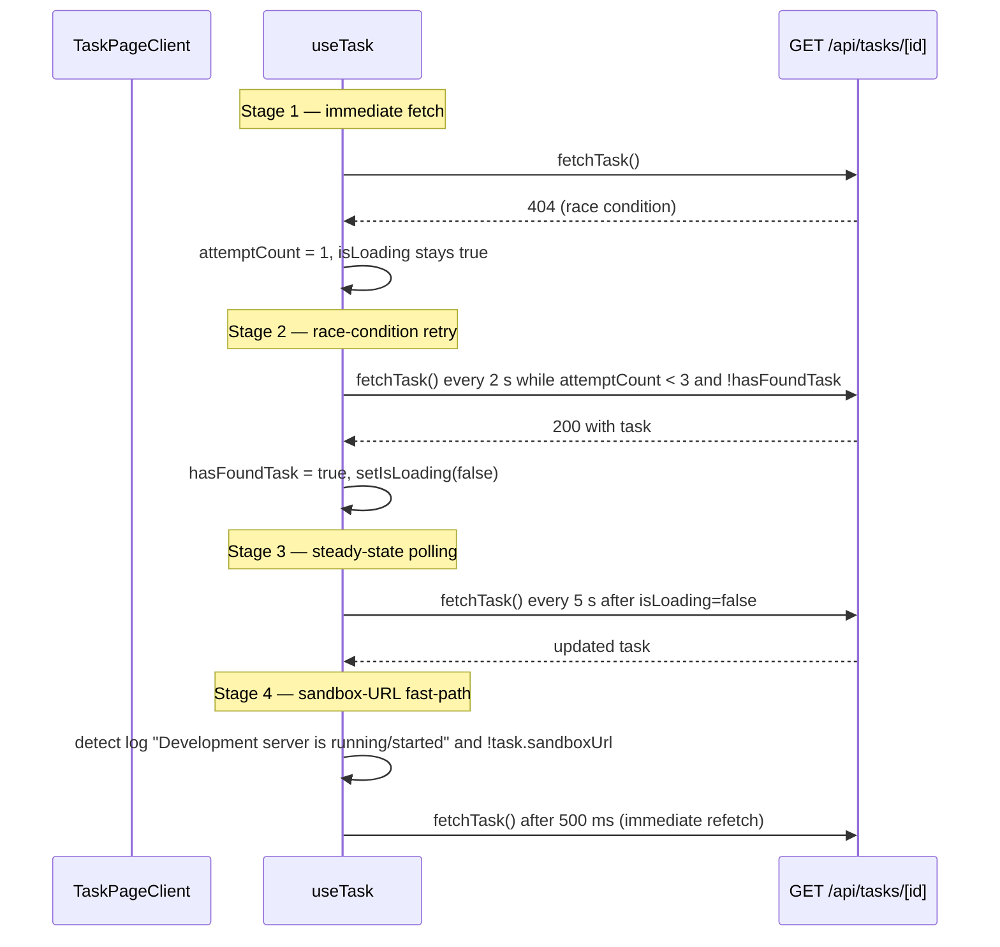

# Client State (Jotai, Cookies, Hooks)

This page describes how the browser side of the application holds and synchronises
state. Three independent mechanisms cover the surface area:

1. **Jotai atoms** — in-memory shared state for cross-component UI concerns
   (session info, dialog wizards, per-task file-browser caches, persisted form
   drafts).
2. **`lib/utils/cookies.ts`** — a `js-cookie`-backed utility for UI preferences
   that must survive a reload and be readable during SSR.
3. **`lib/hooks/use-task.ts`** — the React hook that polls `GET /api/tasks/[id]`
   for a single task page, with deliberate retry logic to survive the
   POST→navigation race.

These are wired into a fixed provider stack in [`app/layout.tsx`](../../app/layout.tsx)
and a server-first bootstrap in
[`components/app-layout-wrapper.tsx`](../../components/app-layout-wrapper.tsx)
that pre-reads cookies before hydration.

## Provider stack and bootstrap order

[`app/layout.tsx`](../../app/layout.tsx#L33-L46) mounts providers in a deliberate
order so that each layer can rely on the layers beneath it:

```tsx
<JotaiProvider>
  <ThemeProvider attribute="class" defaultTheme="system" enableSystem disableTransitionOnChange>
    <SessionProvider />
    <AppLayoutWrapper>{children}</AppLayoutWrapper>
    <Toaster />
  </ThemeProvider>
</JotaiProvider>
```

- `JotaiProvider` ([`components/providers/jotai-provider.tsx`](../../components/providers/jotai-provider.tsx))
  is a one-line wrapper around Jotai's `<Provider>`; it scopes the atom store to
  the request so server and client stores never collide.
- `SessionProvider` ([`components/auth/session-provider.tsx`](../../components/auth/session-provider.tsx))
  is a render-less client component that fetches `/api/auth/info` and
  `/api/auth/github/status` on mount, on every 60 s interval, and on every
  `focus` event, then writes the results into the `sessionAtom` and
  `githubConnectionAtom` atoms (see below).
- `AppLayoutWrapper` ([`components/app-layout-wrapper.tsx`](../../components/app-layout-wrapper.tsx))
  is a server component that reads `sidebar-width` and `sidebar-open` cookies
  via `next/headers` and forwards them to the client `AppLayout` so the sidebar
  renders at the right width without a flash of incorrect width.

<!-- openwiki: mermaid parse failed and this diagram was converted to a text fence so it does not break rendering. Fix the diagram source and restore the mermaid fence. Parser error: Heuristic: an unescaped angle bracket inside a label breaks rendering; rephrase the label. -->
```text
flowchart TD
    Root["app/layout.tsx RootLayout"] --> JP["JotaiProvider<br/>jotai Provider scope"]
    JP --> TP["ThemeProvider<br/>next-themes"]
    TP --> SP["SessionProvider<br/>no DOM output"]
    TP --> ALW["AppLayoutWrapper (server)<br/>reads sidebar cookies"]
    ALW --> AL["AppLayout (client)<br/>sidebar + TasksContext + polls /api/tasks every 5s"]
    AL --> Kids["page tree (task-form, file-browser, task-chat...)"]
    SP -.writes.-> SAtom["sessionAtom / githubConnectionAtom"]
    ALW -.hydrates.-> SW["sidebar-width, sidebar-open cookies"]
    Kids -.consume.-> SAtom
    Kids -.read/write.-> Cookies["js-cookie prefs (1-year, SameSite=Strict)"]
```

## Jotai atoms

All atoms live in `lib/atoms/` and are grouped by concern. They fall into two
flavours:

- **Plain `atom()`** — volatile, in-memory only; lost on reload.
- **`atomWithStorage(key, default)`** — persisted to `localStorage` under the
  given key, so the value survives a reload and is shared across tabs.
- **`atomFamily(factory)`** — a factory that returns a distinct atom per key
  (used to give every task its own chat-input or file-browser atom).

### Session and GitHub connection

[`lib/atoms/session.ts`](../../lib/atoms/session.ts)

```ts
export const sessionAtom = atom<SessionUserInfo>({ user: undefined })
export const sessionInitializedAtom = atom(false)
```

`SessionUserInfo` ([`lib/session/types.ts`](../../lib/session/types.ts#L1-L4))
holds `user` and `authProvider`. `sessionInitializedAtom` flips to `true` once
`SessionProvider` has either succeeded or failed so consumers can distinguish
"not yet fetched" from "no session".

[`lib/atoms/github-connection.ts`](../../lib/atoms/github-connection.ts)

```ts
export interface GitHubConnection { connected: boolean; username?: string; connectedAt?: Date }
export const githubConnectionAtom = atom<GitHubConnection>({ connected: false })
export const githubConnectionInitializedAtom = atom(false)
```

The same pattern: a "value" atom plus a separate "initialised" flag. The two
atoms are written in parallel by `SessionProvider` so the UI does not flash a
"disconnected" state during the first fetch.

`SessionProvider` triggers a `fetchAll()` refresh on three cadences
([`components/auth/session-provider.tsx`](../../components/auth/session-provider.tsx#L43-L59)):

- **Immediate** on mount.
- **Every 60 s** via `setInterval`.
- **On every `window` `focus` event** (returning to a tab pulls a fresh session
  and GitHub-connection status).

`SignOut` ([`components/auth/sign-out.tsx`](../../components/auth/sign-out.tsx#L44-L66))
optimistically writes `sessionAtom = { user: undefined }` and
`githubConnectionAtom = { connected: false }` after the network call succeeds so
the header updates instantly instead of waiting for the next provider refresh.

### Task-form drafts

[`lib/atoms/task.ts`](../../lib/atoms/task.ts)

```ts
export const taskPromptAtom = atomWithStorage('task-prompt', '')
export const taskChatInputAtomFamily = atomFamily((taskId: string) =>
  atomWithStorage(`task-chat-input-${taskId}`, ''),
)
```

- `taskPromptAtom` keeps whatever the user is typing in the new-task textarea so
  the draft survives a route change or accidental refresh.
- `taskChatInputAtomFamily` keys by `taskId` so the half-typed follow-up
  message in `/tasks/[id]` persists independently for every task page
  ([`components/task-chat.tsx`](../../components/task-chat.tsx#L65)).

### File-browser state (per task)

[`lib/atoms/file-browser.ts`](../../lib/atoms/file-browser.ts) holds a
`FileBrowserState` per task inside a single `Record<taskId, FileBrowserState>`
atom. The state has four `ViewModeData` slots (`local`, `remote`, `all`,
`all-local`), each with files, a tree, expanded folders, and a
`fetchAttempted` flag, plus a top-level `loading` and `error`.

[`getTaskFileBrowserState(taskId)`](../../lib/atoms/file-browser.ts#L59-L73)
returns a derived atom with a read (returns this task's slice or a
`structuredClone` of the default) and a write (merges a `Partial<FileBrowserState>`
into the record). [`components/file-browser.tsx`](../../components/file-browser.tsx#L99-L100)
memoises it per `taskId` and binds it through `useAtom`, so multiple files
open to the same task share one slice.

### Connector dialog (state machine)

[`lib/atoms/connector-dialog.ts`](../../lib/atoms/connector-dialog.ts) is the
most elaborate state slice — it encodes the three-view dialog
(`list | presets | form`) plus the per-form fields and several write-only
"action" atoms that mutate multiple values in one call:

| Atom                                  | Role                                                       |
| ------------------------------------- | ---------------------------------------------------------- |
| `connectorDialogOpenAtom`             | Open/closed                                                |
| `connectorDialogViewAtom`             | Current view: `list \| presets \| form`                    |
| `editingConnectorAtom`                | `Connector \| null` — distinguishes add vs edit             |
| `selectedPresetAtom`                  | `PresetConfig \| null` selected in the presets view        |
| `serverTypeAtom`                      | `'local' \| 'remote'`                                      |
| `envVarsAtom`                         | `Array<{ key, value }>`                                    |
| `visibleEnvVarsAtom`                  | `Set<number>` of env-var indices currently revealed        |
| `isEditingAtom` (derived)             | `!!editingConnectorAtom`                                   |
| `resetDialogStateAtom` (write-only)   | Clears all of the above to defaults                         |
| `setEditingConnectorActionAtom`       | Seeds state from an existing `Connector` and switches to form |
| `startAddingConnectorAtom`            | Clears state and switches to `presets`                     |
| `selectPresetActionAtom`              | Applies a `PresetConfig` and switches to `form`            |
| `addCustomServerAtom`                 | Skips presets, jumps to `form`                             |
| `goBackFromFormAtom`                  | Form → presets when adding, form → list when editing      |
| `goBackFromPresetsAtom`               | Presets → list                                            |
| `onSuccessActionAtom`                 | Post-submit reset back to `list`                           |
| `clearPresetActionAtom`               | Drop preset while keeping the form                         |

`components/connectors/manage-connectors.tsx` binds them via `useAtom`,
`useAtomValue`, and `useSetAtom` ([line 129-144](../../components/connectors/manage-connectors.tsx#L129-L144))
and invokes the action atoms to transition between dialog screens.

### Agent selection

[`lib/atoms/agent-selection.ts`](../../lib/atoms/agent-selection.ts) persists
the user's last coding-agent and last model-per-agent in localStorage so the
dropdowns reopen on the user's last choice:

```ts
export const lastSelectedAgentAtom = atomWithStorage<string | null>('last-selected-agent', null)
export const lastSelectedModelAtomFamily = atomFamily((agent: string) =>
  atomWithStorage<string | null>(`last-selected-model-${agent}`, null),
)
```

[`components/task-form.tsx`](../../components/task-form.tsx#L171) seeds
`selectedAgent` from `lastSelectedAgentAtom` and
[`line 269`](../../components/task-form.tsx#L269) creates a per-agent
`savedModelAtom` so the saved model is scoped to the agent that was active when
it was selected.

### GitHub repo cache

[`lib/atoms/github-cache.ts`](../../lib/atoms/github-cache.ts) caches GitHub
metadata in localStorage so the repo selector can render instantly on repeat
visits:

```ts
export const githubOwnersAtom = atomWithStorage<GitHubOwner[] | null>('github-owners', null)
export const githubReposAtomFamily = atomFamily((owner: string) =>
  atomWithStorage<GitHubRepo[] | null>(`github-repos-${owner}`, null),
)
```

Each owner gets its own slot via `atomFamily`; the create-repo flow
([`app/repos/new/page.tsx`](../../app/repos/new/page.tsx#L150-L152)) removes
`github-repos-<owner>` after a successful create so the selector refreshes on
return to the home page.

### Multi-repo selection

[`lib/atoms/multi-repo.ts`](../../lib/atoms/multi-repo.ts)

```ts
export const multiRepoModeAtom = atom<boolean>(false)
export const selectedReposAtom = atom<SelectedRepo[]>([])
```

`multiRepoModeAtom` is volatile (it tracks the current form session), while
`selectedReposAtom` is also volatile and lives only as long as the home page
mount.

### Newly created repo handoff

[`lib/atoms/newly-created-repo.ts`](../../lib/atoms/newly-created-repo.ts)
provides `newlyCreatedRepoAtom = atomWithStorage('newly-created-repo', null)`,
the canonical handoff channel between `/repos/new` and `/`. The create page
writes to `localStorage` directly under the same key
([`app/repos/new/page.tsx`](../../app/repos/new/page.tsx#L147)), and the home
page reads and clears it on mount
([`components/home-page-content.tsx`](../../components/home-page-content.tsx#L97-L116)).
`newlyCreatedRepoAtom` itself is unused in the page tree today — the inline
localStorage read in `home-page-content` predates it and works — but the atom
remains the documented localStorage contract.

## Cookies utility (`lib/utils/cookies.ts`)

[`lib/utils/cookies.ts`](../../lib/utils/cookies.ts) wraps [`js-cookie`](https://github.com/js-cookie/js-cookie)
and exposes one get/set pair per UI preference. All writes use the same
convention:

```ts
Cookies.set(KEY, value, { expires: 365, sameSite: 'strict' })
```

That is, **a 1-year expiry and `SameSite=Strict`**. Validated setters reject
out-of-range values (sidebar width 200-600 px, logs-pane height 100-600 px,
max-duration 1-30 min, etc.) before writing.

| Cookie                    | Type    | Default | Notes                                                                                  |
| ------------------------- | ------- | ------- | -------------------------------------------------------------------------------------- |
| `sidebar-width`           | number  | 288     | Sidebar pixel width; SSR-readable via `getSidebarWidthFromCookie`                      |
| `sidebar-open`            | boolean | false   | Saved only on desktop (>=1024 px)                                                      |
| `logs-pane-height`        | number  | 200     | Resizable logs pane at the bottom of the task page                                     |
| `logs-pane-collapsed`     | boolean | true    | Logs pane starts collapsed                                                             |
| `install-dependencies`    | boolean | false   | Task-form checkbox default                                                             |
| `max-duration`            | number  | 5       | Sandbox max duration in minutes; bounded 1-30                                          |
| `keep-alive`              | boolean | false   | Whether the sandbox outlives the task                                                  |
| `selected-owner`          | string  | ""      | Last selected GitHub owner; cleared when empty                                         |
| `selected-repo`           | string  | ""      | Last selected GitHub repo; cleared when empty                                          |
| `show-files-pane`         | boolean | true    | Task-page layout toggle                                                                |
| `show-code-pane`          | boolean | true    | Task-page layout toggle                                                                |
| `show-preview-pane`       | boolean | false   | Task-page layout toggle                                                                |
| `show-chat-pane`          | boolean | true    | Task-page layout toggle                                                                |
| `enable-browser`          | boolean | false   | Enable in-sandbox browser                                                              |
| `files_pane_width`        | number  | 250     | Pane pixel width; 150-600                                                               |
| `code_pane_width`         | number  | 0       | `0` means flex; non-negative                                                            |
| `preview_pane_width`      | number  | 0       | `0` means flex; non-negative                                                            |
| `chat_pane_width`         | number  | 300     | 200-600                                                                                |

### SSR vs client reads

Cookie reads come in two flavours:

- **Client-only** getters (`getSidebarWidth`, `getLogsPaneHeight`, …) check
  `typeof window === 'undefined'` and fall back to the default if no
  `js-cookie` API is available.
- **SSR parsers** (`getSidebarWidthFromCookie`, `getSidebarOpenFromCookie`)
  take a raw `Cookie` header string and parse it manually so the
  server-rendered markup matches the cookie.

[`components/app-layout-wrapper.tsx`](../../components/app-layout-wrapper.tsx#L9-L28)
uses the SSR parsers via `next/headers` to set the initial sidebar state and
also detects mobile from the user agent header so the sidebar never opens on a
phone on first paint.

<!-- openwiki: mermaid parse failed and this diagram was converted to a text fence so it does not break rendering. Fix the diagram source and restore the mermaid fence. Parser error: Heuristic: an unescaped angle bracket inside a label breaks rendering; rephrase the label. -->
```text
sequenceDiagram
    participant SSR as Server (layout.tsx)
    participant Wrapper as AppLayoutWrapper
    participant Client as AppLayout (client)
    participant Cookie as js-cookie
    Note over SSR,Wrapper: First request
    SSR->>Wrapper: render with cookies()/headers()
    Wrapper->>Wrapper: getSidebarWidthFromCookie(cookieString)
    Wrapper->>Wrapper: detect mobile via User-Agent
    Wrapper->>Client: <AppLayout initialSidebarWidth=... initialSidebarOpen=... initialIsMobile=...>
    Client->>Cookie: getSidebarWidth() (window present, hydrates)
    Note over Client,Cookie: Subsequent edits
    Client->>Cookie: setSidebarWidth(newWidth) (1-year, SameSite=Strict)
    Client->>Cookie: setSidebarOpen(newOpen) (desktop only, >=1024 px)
```

## `useTask(taskId)` polling hook

[`lib/hooks/use-task.ts`](../../lib/hooks/use-task.ts) powers
`components/task-page-client.tsx` and runs a three-stage polling schedule so
the task page reacts to server progress without WebSockets.



The stages are visible in the source:

1. **Immediate fetch**
   ([L57](../../lib/hooks/use-task.ts#L57)) — the hook fires `fetchTask()`
   synchronously on mount.
2. **Race-condition retry** ([L61-L69](../../lib/hooks/use-task.ts#L61-L69)) —
   while the task has not been found and fewer than three attempts have run, a
   `setInterval` retries every **2 s**. This covers the common case where the
   client navigates to `/tasks/[id]` before the `POST /api/tasks` insert has
   completed.
3. **Steady-state polling** ([L74-L83](../../lib/hooks/use-task.ts#L74-L83)) —
   once `isLoading` is false (either the task was found or the attempt budget
   was exhausted), a separate `setInterval` polls every **5 s**.
4. **Dev-server fast-path** ([L86-L103](../../lib/hooks/use-task.ts#L86-L103)) —
   when `task.sandboxUrl` is still missing but the logs already contain
   `'Development server is running'` or `'Development server started'`
   (strings emitted by
   [`lib/sandbox/creation.ts`](../../lib/sandbox/creation.ts#L456) and
   [`start-sandbox`](../../app/api/tasks/[taskId]/start-sandbox/route.ts#L293)),
   the hook schedules an immediate `fetchTask()` after 500 ms so the preview
   iframe attaches as soon as the URL is published. A `pendingSandboxRefetchRef`
   ensures the fast-path fires only once per pending URL.

404 handling has the same attempt threshold ([L23-L31](../../lib/hooks/use-task.ts#L23-L31)):
the error `'Task not found'` is only surfaced after `attemptCount >= 3`
(unless the task was found in the meantime, in which case `hasFoundTaskRef`
locks the success state). During the retry window, the page remains in its
`isLoading` skeleton, so the user never sees a false "Task not found" flash.

The hook returns `{ task, isLoading, error, refetch }`. `refetch` is the
underlying `fetchTask`, exposed for callers that need to invalidate
immediately after a user action (for example, after creating a follow-up
message).

## Related pages

- [Authentication & Sessions](../concepts/auth-and-sessions.md) — where the
  session cookie and OAuth cookies are issued.
- [Task Lifecycle & Status Model](../concepts/tasks-lifecycle.md) — the
  task row schema that `useTask` polls and that the sidebar's 5 s refresh
  re-reads.
- [Live Editor Surface](./live-editor-surface.md) — the per-task
  `fileBrowserStateFamily` is consumed by the file-browser panel.
