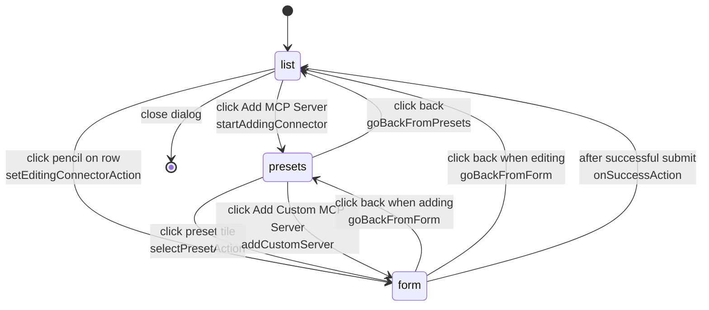

# Connectors (MCP Servers)

A *connector* is a user-owned Model Context Protocol (MCP) server definition: a small named record that names a tool provider (Browserbase, Linear, Notion, …) and carries the transport (STDIO command or remote URL) plus any secret it needs. The platform treats every supported MCP server as one of two shapes — `local` (STDIO) or `remote` (HTTP/SSE) — and renders the same row in two different ways. Secrets (`oauthClientSecret`, `env`) are encrypted at rest with AES-256-CBC and only decrypted on the server at the two read sites: the connector-management API and the task worker that hands them to the agent CLI.

For the runtime side — how the decrypted array flows through the dispatcher and how each per-CLI wrapper translates it into its native `mcp add` invocation — see [Agent System & MCP Connectors](../concepts/agent-system.md) and [Agent Implementations](./agent-implementations.md). For the cipher primitive, see [Encryption & Log Redaction](../concepts/encryption-and-redaction.md).

## Overview

Five components cooperate:

- **`connectors` table** in [`lib/db/schema.ts`](repo://lib/db/schema.ts#L184-L211) — one row per user-defined MCP server, FK to `users.id` with `ON DELETE CASCADE`.
- **`lib/actions/connectors.ts`** — `'use server'` exports for `createConnector`, `updateConnector`, `toggleConnectorStatus`, `deleteConnector`, and `getConnectors`. Each mutator validates with Zod, encrypts the secret fields, and uses an `AND (id, userId)` filter so a caller can never touch another user's row.
- **`/api/connectors` `GET`** at [`app/api/connectors/route.ts`](repo://app/api/connectors/route.ts) — the read path the UI uses, which returns decrypted rows so the dialog can render existing env-var pairs in plaintext to their owner.
- **`ConnectorsProvider`** at [`components/connectors-provider.tsx`](repo://components/connectors-provider.tsx) — a React context that fetches `/api/connectors` on mount and exposes `connectors`, `refreshConnectors`, `isLoading` to any descendant component.
- **`ConnectorDialog`** at [`components/connectors/manage-connectors.tsx`](repo://components/connectors/manage-connectors.tsx) — a three-view dialog (`list → presets → form`) backed by the Jotai state machine in [`lib/atoms/connector-dialog.ts`](repo://lib/atoms/connector-dialog.ts). Mounted from `components/task-form.tsx` behind an "MCP Servers" button.

<!-- openwiki: mermaid parse failed and this diagram was converted to a text fence so it does not break rendering. Fix the diagram source and restore the mermaid fence. Parser error: Heuristic: an unescaped angle bracket inside a label breaks rendering; rephrase the label. -->
```text
flowchart LR
    UI["ConnectorDialog<br/>components/connectors/manage-connectors.tsx"]
    A1["createConnector<br/>server action"]
    A2["updateConnector"]
    A3["toggleConnectorStatus"]
    A4["deleteConnector"]
    DB[("connectors table<br/>env and oauthClientSecret<br/>encrypted at rest")]
    API["GET /api/connectors<br/>app/api/connectors/route.ts"]
    CTX["ConnectorsProvider<br/>components/connectors-provider.tsx"]
    TW["Task worker<br/>app/api/tasks/route.ts<br/>app/api/tasks/[taskId]/continue/route.ts"]
    DSP["executeAgentInSandbox<br/>lib/sandbox/agents/index.ts"]
    CLI["agent CLI<br/>claude / codex / copilot /<br/>cursor / gemini / opencode"]

    UI -->|form submit| A1 & A2 & A3 & A4
    A1 & A2 & A3 & A4 -->|encrypt env and secret| DB
    UI -.->|fetch on mount| API
    API -->|decrypt env and secret| DB
    API --> CTX
    CTX --> UI
    TW -->|SELECT status=connected<br/>decrypt env and secret| DB
    TW -->|mcpServers: Connector array| DSP
    DSP -->|write config file<br/>or run claude mcp add| CLI
```

*Diagram: the create path on the left, the read path through the API in the middle, and the runtime path from the task worker to the agent CLI on the right.*

## Schema: the `connectors` table

The `connectors` table is defined in [`lib/db/schema.ts`](repo://lib/db/schema.ts#L184-L211). It is materialized by migration [`0006_nostalgic_skullbuster.sql`](repo://lib/db/migrations/0006_nostalgic_skullbuster.sql) (initial creation, remote-only fields), broadened by [`0007_lethal_hitman.sql`](repo://lib/db/migrations/0007_lethal_hitman.sql) (adds `type`, `command`, `args`, `env`), narrowed by [`0008_last_adam_destine.sql`](repo://lib/db/migrations/0008_last_adam_destine.sql) (drops `args`, since the platform uses a single `command` string), repointed at users by [`0010_concerned_exodus.sql`](repo://lib/db/migrations/0010_concerned_exodus.sql) (adds `user_id`, FK with cascade), and finally retyped by [`0011_outstanding_punisher.sql`](repo://lib/db/migrations/0011_outstanding_punisher.sql) (`env` from `jsonb` to `text` so it can hold an encrypted blob).

| Column | Type | Notes |
| --- | --- | --- |
| `id` | `text PRIMARY KEY` | Generated via `nanoid()` at insert time by the create action. |
| `user_id` | `text NOT NULL` | FK to `users.id` with `ON DELETE CASCADE`. |
| `name` | `text NOT NULL` | Display name; shown verbatim in the dialog and the task header. |
| `description` | `text` | Optional; truncated in the row card. |
| `type` | `text NOT NULL` | Enum `'local' \| 'remote'`, default `'remote'`. Selects which fields the UI shows and which per-CLI wrapper path runs. |
| `base_url` | `text` | Remote MCP endpoint. Validated as a URL when present by `insertConnectorSchema`. |
| `oauth_client_id` | `text` | Optional; mapped to an `X-Client-ID` header by the agent wrappers. |
| `oauth_client_secret` | `text` | Encrypted. Stored as the `iv:ciphertext` wire format from `lib/crypto.ts`. |
| `command` | `text` | Local STDIO executable + args, in a single shell-style string. |
| `env` | `text` | Encrypted JSON. Stored as a string column (after migration 0011) holding the encrypted serialization of `Record<string, string>`. |
| `status` | `text NOT NULL` | Enum `'connected' \| 'disconnected'`, default `'disconnected'`. The task worker filters on this — only `'connected'` rows reach the sandbox. |
| `created_at` / `updated_at` | `timestamp` | Auto-stamped on insert; `updatedAt` is also written by `updateConnector`. |

### Two shapes, one row

The `type` enum partitions the row into two largely disjoint shapes:

- **`local` (STDIO).** `command` holds the executable and any arguments in one shell-style string (e.g. `npx -y @playwright/mcp@latest`). `env`, if present, is the JSON encoding of a `Record<string, string>` of variables to inject into the spawned process. `base_url` is not used.
- **`remote` (HTTP/SSE).** `baseUrl` is the upstream MCP endpoint. Optional `oauthClientId` / `oauthClientSecret` are translated by the agent wrappers into HTTP request headers. `command` is not used.

Both shapes can carry `env` (a local Playwright run may want `DEBUG=1`; a remote server rarely does, but the column is unrestricted). Both shapes can carry an `oauth_client_id`; only `remote` is documented to use it.

### The Zod schemas

Three Zod schemas govern the write/read contract:

- **`insertConnectorSchema`** in [`lib/db/schema.ts`](repo://lib/db/schema.ts#L213-L230) — the validator `createConnector` and `updateConnector` both call. Treats `baseUrl` as `z.string().url()` when present, `env` as `z.record(z.string(), z.string())` (the plaintext form), `type` as a default-`'remote'` enum, and `status` as a default-`'disconnected'` enum.
- **`selectConnectorSchema`** — describes the row shape after it has been stored. Notably, `env` is `z.string().nullable()` here, because by the time the row comes back from Postgres it is an encrypted blob, not a record. This is the contract that `Connector` (the inferred type) exposes to every consumer; clients convert to a `Record` only after decryption.
- **`Connector` / `InsertConnector` type aliases** — both are exported from the schema module and consumed across the codebase: the agents read it as `typeof connectors.$inferSelect`, the Jotai state in `lib/atoms/connector-dialog.ts` imports the public `Connector` type.

## Server actions: `lib/actions/connectors.ts`

All four mutators are server actions (`'use server'`). They share a pattern:

1. `getServerSession()` and reject with `{ success: false, message: 'Unauthorized' }` when no user is signed in.
2. Pull string fields from the submitted `FormData` (`name`, `description`, `type`, `baseUrl`, `oauthClientId`, `oauthClientSecret`, `command`) plus the JSON-serialized `env` blob.
3. Validate the assembled object with `insertConnectorSchema.parse(...)`. A `ZodError` is caught, flattened into a `Record<string, string>` keyed by the first path element, and returned as `{ success: false, message: 'Validation failed', errors: fieldErrors }` so the form can render per-field errors.
4. Always filter with `and(eq(connectors.id, …), eq(connectors.userId, session.user.id))` so a caller cannot reach another user's row.
5. Call `revalidatePath('/')` so the connectors context refetches on the next render.

### `createConnector(_, formData)`

Inserts a new row. Generates the `id` via `nanoid()` and **always sets `status: 'connected'`** on insert — the user has just gone through the flow of typing the credentials, so the new row is expected to be live. Encrypts `oauthClientSecret` with `encrypt(...)` (only if present) and serializes the `env` object through `JSON.stringify` before encrypting the result. Returns `{ success: true, message: 'Connector created successfully' }` or a Zod-flattened error map.

### `updateConnector(_, formData)`

Updates the row identified by the `id` field on the `FormData`. The same encryption rules as `createConnector` apply, so re-saving an existing connector re-encrypts whatever `oauthClientSecret` / `env` the form supplied. The `updatedAt` column is bumped explicitly. Because the action treats every call as a full rewrite of the secret columns, an empty `oauthClientSecret` field on edit means "leave the existing ciphertext as-is" — the action only calls `encrypt` when the field is non-empty. The `env` field is rewritten only when the form supplied a non-empty JSON object, otherwise it stays as it was.

### `toggleConnectorStatus(id, status)`

Two-argument server action (no `FormData`): the UI calls it directly from the `Switch` toggle in the list view. Filters on both `id` and `userId`, sets `status` to the new value (`'connected'` or `'disconnected'`), and revalidates `/`. Returns a `{ success, message }` pair; the dialog toasts on either path.

This is the only mutator that does not encrypt or decrypt anything — `status` is plaintext.

### `deleteConnector(id)`

Two-argument server action (no `FormData`): called from the `AlertDialog` "Delete MCP Server" confirmation in the form view. Filters on both `id` and `userId` and removes the row. There is no soft delete; the row is gone, and any `tasks.mcpServerIds` array that referenced it becomes a dangling ID list (the UI renders MCP server names by fetching the current set of connectors and intersecting with the IDs, so a deleted connector simply disappears from the task header without erroring).

### `getConnectors()`

Not used by the UI (the dialog fetches `/api/connectors` directly), but it is the server-side twin of the API route: identical decryption logic, identical `{ success, data | error }` envelope. Kept as a server action so a future server-component consumer can pull the decrypted list without going through HTTP.

## Read path: `GET /api/connectors`

The only read endpoint. Returns `{ success: true, data: Connector[] }` with `oauthClientSecret` and `env` already decrypted:

```ts
const userConnectors = await db.select().from(connectors).where(eq(connectors.userId, session.user.id))

const decryptedConnectors = userConnectors.map((connector) => ({
  ...connector,
  oauthClientSecret: connector.oauthClientSecret ? decrypt(connector.oauthClientSecret) : null,
  env: connector.env ? JSON.parse(decrypt(connector.env)) : null,
}))
```

Three properties of this endpoint matter:

- **Plaintext on the wire (to the owner).** Because the rows belong to the calling user, decrypting before serialization is acceptable. The browser receives the secret in plaintext and the dialog renders env values into a `<Input type="password">` so a screen recording or casual over-the-shoulder view does not leak them.
- **No pagination, no filtering.** The endpoint returns every connector the signed-in user owns in a single response. The dialog renders them all in a scrollable list (`max-h-[60vh]`).
- **Two error envelopes.** A missing session returns `{ success: false, error: 'Unauthorized', data: [] }` with `401`; any other failure returns `{ success: false, error: 'Failed to fetch connectors', data: [] }` with `500`. The `data: []` fallback keeps the client's `result.data || []` line safe even on error.

## Client state: `ConnectorsProvider`

[`components/connectors-provider.tsx`](repo://components/connectors-provider.tsx) is a 55-line `'use client'` context provider. It owns one piece of state — `connectors: Connector[]` — and exposes three things:

- **`connectors`** — the decrypted list from the API.
- **`refreshConnectors()`** — re-runs the same fetch, used after every successful create/update/toggle/delete.
- **`isLoading`** — `true` until the first fetch resolves.

The provider fetches `/api/connectors` on mount (via `useEffect`), memoises the fetcher with `useCallback` so the effect does not refire on re-renders, and stores the response in local state. There is no stale-while-revalidate, no background polling, no SWR: the dialog and the task form get fresh data only when `refreshConnectors()` is called (after a successful submit) or when the page is reloaded. The provider is mounted at the layout root in [`components/app-layout.tsx`](repo://components/app-layout.tsx#L308-L371), so every screen has access to it.

Consumers:

- **`components/connectors/manage-connectors.tsx`** — the dialog uses `connectors`, `refreshConnectors`, and `isLoading` (renamed `connectorsLoading` in the dialog scope) to render the list view and to refresh after a mutation.
- **`components/task-form.tsx`** — uses `connectors` to count the user's configured MCP servers and decide whether the "MCP Servers" button should show a badge.

The provider's `useConnectors` hook throws if called outside the provider (`Error: useConnectors must be used within ConnectorsProvider`), so a missing mount is a development-time error rather than a runtime `undefined` dereference.

## Dialog UI: `ConnectorDialog`

[`components/connectors/manage-connectors.tsx`](repo://components/connectors/manage-connectors.tsx) renders the entire connector-management surface as a single `Dialog` (`w-[800px]`, `max-h-[80vh]`) with three views, controlled by the Jotai state machine in [`lib/atoms/connector-dialog.ts`](repo://lib/atoms/connector-dialog.ts).

The three views and their transitions form a state machine:



*Diagram: the three-view state machine. `form` is reachable from both `presets` (when adding) and `list` (when editing).*

### The list view

Renders one `Card` per connector with an icon, name, optional description, an edit pencil, and a `Switch` for the connection status. Three states:

- **Loading.** Three skeleton cards animate with `bg-muted animate-pulse`.
- **Empty.** A single `Card` with the text "No MCP servers configured yet."
- **Populated.** One row per connector. The icon is selected by name/URL/command substring match against the preset list (Browserbase, Context7, Convex, Figma, Hugging Face, Linear, Notion, Playwright, Supabase), falling back to a generic `Server` icon. The `Switch`'s `disabled` prop is bound to a per-id `Set` of in-flight connector IDs so rapid double-clicks are impossible. The footer holds a single "Add MCP Server" button.

### The presets view

A 3-column grid of nine preset tiles (Browserbase, Context7, Convex, Figma, Hugging Face, Linear, Notion, Playwright, Supabase), plus a full-width "Add Custom MCP Server" button below. Each preset is a `PresetConfig` literal. Nine presets ship today:

- **Browserbase** (local): command `npx @browserbasehq/mcp`, envKeys `BROWSERBASE_API_KEY` and `BROWSERBASE_PROJECT_ID`.
- **Context7** (remote): url `https://mcp.context7.com/mcp`.
- **Convex** (local): command `npx -y convex@latest mcp start`.
- **Figma** (remote): url `https://mcp.figma.com/mcp`.
- **Hugging Face** (remote): url `https://hf.co/mcp`.
- **Linear** (remote): url `https://mcp.linear.app/sse`.
- **Notion** (remote): url `https://mcp.notion.com/mcp`.
- **Playwright** (local): command `npx -y @playwright/mcp@latest`.
- **Supabase** (remote): url `https://mcp.supabase.com/mcp`.

The preset's `envKeys`, when present, pre-fill the form with rows whose key is locked and value is empty (so the user cannot reorder or rename them, only type the value). The submit handler explicitly copies the preset's `command` or `url` back into the `FormData` because the form inputs are `disabled` while a preset is selected.

### The form view

A single `<form action={formAction}>` with four sections plus the footer buttons:

1. **Selected-preset chip.** If a preset is selected, a banner with the preset's icon, "Configuring &lt;preset.name&gt;", and an `X` to clear it (via `clearPresetAction`).
2. **Name.** Free-text `<Input id="name" required>`. Default value is the preset's name when adding from presets, or the existing connector's name when editing.
3. **Server type.** A `RadioGroup` for `remote` / `local`. Hidden when a preset is selected (the preset dictates the type) or when editing (type is read-only on edit).
4. **Transport-specific field.** A `<Input name="baseUrl" type="url" required>` for remote, or a `<Input name="command" required>` for local. Disabled while a preset is selected so the URL/command cannot be edited away from the preset value.
5. **Environment variables.** A dynamic key/value list. Each row has an `Input` for the key, a password-style `Input` for the value (with an `Eye`/`EyeOff` toggle to reveal one), and an `X` to remove the row. When a preset is selected and the key is in `preset.envKeys`, the key field is `disabled` and the row cannot be removed — these are the keys the preset *requires* the user to fill in.
6. **OAuth (remote only).** An `Accordion` titled "Advanced Settings" with `<Input name="oauthClientId">` and `<Input name="oauthClientSecret" type="password">`. Both optional; either can be left blank to use the upstream server's unauthenticated surface.

The form's submit handler is a closure over the Jotai state: it appends `id` (when editing), `type`, the preset's `command`/`baseUrl` if needed, and a `JSON.stringify` of the env-var map. `useActionState` runs `createConnector` or `updateConnector` based on `isEditing` (derived from `editingConnectorAtom`).

The footer holds a destructive "Delete" button (editing only, opens a confirmation `AlertDialog`), a "Back" button, and the primary submit button ("Add MCP Server" / "Save Changes").

### After submit

`useActionState` returns `{ success, message, errors }`. A `useRef` tracks the last `{ success, message }` pair so the same result does not re-fire the toast twice. On success, the dialog calls `refreshConnectors()` and dispatches `onSuccessAction()` (which resets all Jotai atoms to defaults and switches the view back to `list`). On failure, the toast shows the message and the per-field `errors` map is rendered under the relevant input.

### The toggle and delete paths

- **Toggle.** The `Switch` in the list view calls `handleToggleConnectorStatus(id, currentStatus)`. The handler flips the status string, sets a local `loadingConnectors` `Set` entry to disable the toggle during the request, calls the `toggleConnectorStatus` server action, and toasts on the returned `{ success, message }`. On success, `refreshConnectors()` re-pulls the row so the next render reflects the new status.
- **Delete.** The destructive button opens a separate `AlertDialog`. The dialog's "Delete" action calls the `deleteConnector` server action; on success, the dialog toasts, refreshes the context, and dispatches `onSuccessAction()` to land back on `list`.

## Encryption boundary: write vs. read

The single most important invariant: secrets are encrypted on the way in, decrypted on the way out, and never re-encrypted except by the two mutator actions.

- **Write path.** `createConnector` and `updateConnector` are the only call sites that call `encrypt(...)` for connector fields. The encryption primitive is `lib/crypto.ts`'s AES-256-CBC, which expects `process.env.ENCRYPTION_KEY` to be a 64-character hex string and throws the `openssl rand -hex 32` hint when the key is missing or malformed. If `ENCRYPTION_KEY` is unset, every save attempt throws and the route returns the error as a 500-level server-action failure.
- **Read paths.** Two places decrypt:
  1. `app/api/connectors/route.ts` — decrypts for the management UI.
  2. `app/api/tasks/route.ts` and `app/api/tasks/[taskId]/continue/route.ts` — decrypt for the agent dispatcher. These two are documented together with the rest of the encryption boundary in [Encryption & Log Redaction → Where the AES-256-CBC primitive is used](../concepts/encryption-and-redaction.md#where-the-aes-256-cbc-primitive-is-used).

The dialog's server actions therefore never decrypt: they only encrypt (on save) or pass through plaintext (on toggle and delete).

## Runtime: from task start to agent CLI

This is the right-hand column of the overview diagram, repeated here as the runtime sequence:

```mermaid
sequenceDiagram
    autonumber
    participant TW as Task worker<br/>app/api/tasks/route.ts
    participant DB as connectors table
    participant CR as lib/crypto.ts
    participant DSP as executeAgentInSandbox<br/>lib/sandbox/agents/index.ts
    participant W as Per-CLI wrapper<br/>lib/sandbox/agents/&lt;name&gt;.ts
    participant SB as Sandbox filesystem
    participant CLI as Agent CLI

    TW->>DB: SELECT rows WHERE status equals connected
    DB-->>TW: rows with encrypted env and oauthClientSecret
    TW->>CR: decrypt env and oauthClientSecret
    CR-->>TW: plaintext env JSON and secret
    TW->>DB: UPDATE tasks SET mcp_server_ids
    TW->>DSP: executeAgentInSandbox with mcpServers
    DSP->>W: dispatch to wrapper with mcpServers
    W->>SB: write config or run claude mcp add
    W->>CLI: launch CLI with MCP enabled
    CLI-->>W: stream output and exit code
    W-->>DSP: AgentExecutionResult
    DSP-->>TW: AgentExecutionResult
```

*Diagram: a successful create → encrypt → DB → task start → decrypt → inject path. The ID-only persistence on `tasks.mcpServerIds` is what the UI later uses to render the "N MCP Servers" badge in the task header.*

Two observable consequences:

- **`status === 'connected'` is the gate.** The task worker's `WHERE` clause is `eq(connectors.userId, session.user.id), eq(connectors.status, 'connected')`. A connector the user has paused (or that has never been edited) is skipped entirely. Toggling a connector to `disconnected` removes it from the next task run without deleting the row.
- **`mcpServerIds` is the only durable record of what ran.** After decrypting and forwarding the `Connector[]`, the worker persists `mcpServerIds = mcpServers.map((s) => s.id)` onto the `tasks` row at [`app/api/tasks/route.ts#L562-L568`](repo://app/api/tasks/route.ts#L562-L568). The decrypted secrets are not persisted. The `continue` route does the same read but does not write `mcpServerIds` (follow-up runs inherit the IDs from the original task). On the task-details page, [`components/task-details.tsx`](repo://components/task-details.tsx#L786-L812) refetches `/api/connectors`, intersects the response with `task.mcpServerIds`, and renders the result as a tooltip showing each MCP server's icon and name.

## Failure and edge-case behavior

- **`ENCRYPTION_KEY` missing or wrong length.** `encrypt` throws on every save and `decrypt` throws on every read. The dialog's `createConnector`/`updateConnector` surface the throw as `{ success: false, message: error.message }` (the second branch of the catch block re-uses the error message). The API route logs and returns 500. The task worker's catch around the decryption block logs `Warning: Could not fetch MCP servers, continuing without them` and runs the agent with `mcpServers = []`. The agent then runs without MCP tools — this is the only failure mode that is silently absorbed by the runtime.
- **`decrypt` failure on an existing row.** A row encrypted with a different `ENCRYPTION_KEY` will fail to decrypt. The API route throws and returns 500; the dialog's context fetch returns an empty array because `data: []` is the fallback shape. The task worker logs the warning and runs the agent with `mcpServers = []`. There is no automatic re-encryption or migration; rotating `ENCRYPTION_KEY` requires the user to re-save every connector.
- **Empty connector list.** `mcpServers = []` is a valid value. Each per-CLI wrapper guards its MCP config block with `if (mcpServers && mcpServers.length > 0)`, so an empty array skips config-file generation entirely and the CLI runs without MCP tools.
- **Zod validation failure.** `createConnector` and `updateConnector` flatten `ZodError.issues` into `Record<string, string>` keyed by the first path element (e.g. `name`, `baseUrl`, `command`) and return `{ success: false, message: 'Validation failed', errors }`. The dialog renders each error inline under its field.
- **Delete of a referenced connector.** `deleteConnector` removes the row unconditionally. `tasks.mcpServerIds` retains the now-dangling ID; the task-details page filters by the live `/api/connectors` response, so the deleted server silently disappears from the rendered list with no error.
- **Race on rapid toggles.** `handleToggleConnectorStatus` maintains a `Set` of in-flight IDs and disables the `Switch` for those IDs during the request. The server-side `toggleConnectorStatus` is not transactional — a fast double-toggle can land in any order, but the resulting state is always one of `'connected'` or `'disconnected'`, never an intermediate value.
- **Mismatched edit of a preset.** The dialog's submit handler explicitly overrides the disabled `baseUrl`/`command` field with the preset's value, so the form cannot accidentally persist a partial remote URL while a preset is selected.

## Extension points

- **Adding a new preset.** Add a `PresetConfig` literal to the `PRESETS` array at [`components/connectors/manage-connectors.tsx#L75-L122`](repo://components/connectors/manage-connectors.tsx#L75-L122). If the preset has a recognizable icon, add a `case` to `getConnectorIcon` at the same file and import the SVG component from `components/icons/`. No schema or server-action change is needed — the form treats any preset the same way.
- **Adding a new transport.** Touch `insertConnectorSchema` and `selectConnectorSchema` in `lib/db/schema.ts` to broaden the union, the two encrypt/decrypt sites in `lib/actions/connectors.ts`, the read-side decryptions in `app/api/connectors/route.ts` and `app/api/tasks/route.ts` / `app/api/tasks/[taskId]/continue/route.ts`, the dialog's `RadioGroup` and field-conditional logic in `manage-connectors.tsx`, and every per-CLI wrapper's `if (server.type === 'local') ... else ...` block. There is no central "transport adapter" — the wrappers speak their own dialects.
- **Adding a new server action** (e.g. bulk import from another system). Add a new exported async function in `lib/actions/connectors.ts` with the same session check and `AND (id, userId)` filter. Encrypted fields must go through `encrypt(...)`; the dialog form fields are already shaped to produce a single `FormData`, so most bulk imports will bypass the dialog and call the action directly.
- **Replacing the cipher.** The single point of change is `lib/crypto.ts`; see [Encryption & Log Redaction → Extension points](../concepts/encryption-and-redaction.md#extension-points). All four call sites (create, update, the API read, the task worker read) follow the same `encrypt`/`decrypt` contract and will pick up the change without modification.

## What to read next

- [Agent System & MCP Connectors](../concepts/agent-system.md) — the dispatcher and the contract every wrapper shares; where `mcpServers` is read from and how `process.env` is overlaid.
- [Agent Implementations](./agent-implementations.md) — the per-CLI dialect of `mcp add`: TOML for Codex, JSON for Cursor/Gemini/OpenCode/Copilot, CLI flags for Claude.
- [Encryption & Log Redaction](../concepts/encryption-and-redaction.md) — the AES-256-CBC primitive, the `ENCRYPTION_KEY` environment variable, and the redaction patterns that keep decrypted values out of the log stream.
