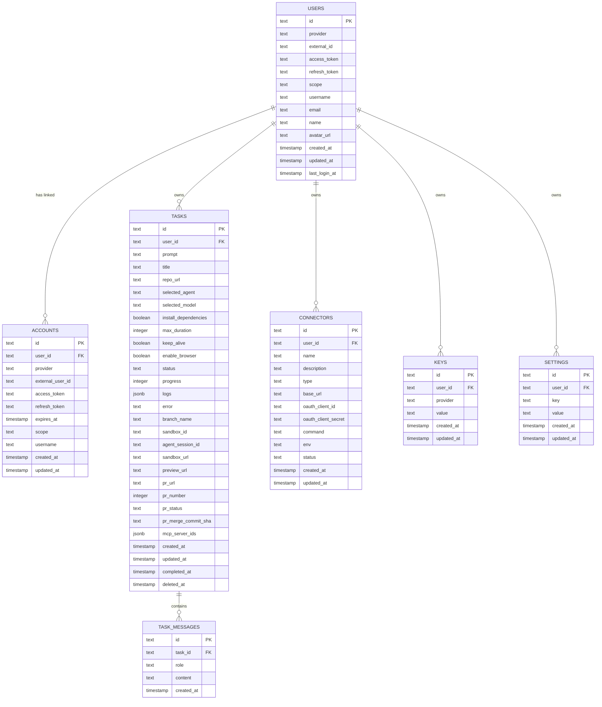

# Database Schema (Drizzle + Postgres)

This page is the field-level catalog of the seven tables declared in `lib/db/schema.ts` that back the entire application: the identity tables (`users`, `accounts`), the work-anchor table (`tasks`) and its conversation table (`task_messages`), and the three user-scoped resource tables (`connectors`, `keys`, `settings`). It is the single place that ties together the Drizzle table definitions, the per-table Zod `insert` and `select` validators, the foreign-key cascade behavior, the unique indexes that encode ownership invariants, the encrypted columns, and the helper modules (`lib/db/client.ts`, `lib/db/users.ts`, `lib/db/settings.ts`) that every route imports.

For how these tables get materialized into PostgreSQL, see [Database Migrations](../operations/database-migrations.md). For the lifecycle states on `tasks.status`, the append-only `logs` JSONB column, and the soft-delete semantics of `deletedAt`, see [Task Lifecycle & Status Model](../concepts/tasks-lifecycle.md). For the AES-256-CBC primitive that encrypts the `accessToken` / `refreshToken` / `value` / `oauthClientSecret` / `env` columns, see [Encryption & Log Redaction](../concepts/encryption-and-redaction.md). For how GitHub sign-in and account linking interact with the `users` + `accounts` tables, see [Authentication & Sessions](../concepts/auth-and-sessions.md).

## Drizzle configuration and the runtime client

The schema file is the single source of truth for both runtime queries and migration generation. `drizzle.config.ts` at the repository root pins the source path, the migration output directory, the SQL dialect, and the connection URL:

```ts
// drizzle.config.ts
import { defineConfig } from 'drizzle-kit'

export default defineConfig({
  schema: './lib/db/schema.ts',
  out: './lib/db/migrations',
  dialect: 'postgresql',
  dbCredentials: {
    url: process.env.POSTGRES_URL!,
  },
})
```

(`drizzle.config.ts`)

The runtime client in `lib/db/client.ts` is a lazy `Proxy` that defers opening the `postgres` connection until the first property access. On first access it reads `process.env.POSTGRES_URL`, throws `'POSTGRES_URL environment variable is required'` if the variable is unset, and otherwise constructs a Drizzle client with the full schema namespace. Every route, action, and helper imports `db` from this module; there is no other entry point.

```ts
// lib/db/client.ts
let _db: ReturnType<typeof drizzle> | null = null

export const db = new Proxy({} as ReturnType<typeof drizzle>, {
  get(target, prop) {
    if (!_db) {
      if (!process.env.POSTGRES_URL) {
        throw new Error('POSTGRES_URL environment variable is required')
      }
      const client = postgres(process.env.POSTGRES_URL)
      _db = drizzle(client, { schema })
    }
    return Reflect.get(_db, prop)
  },
})
```

(`lib/db/client.ts`)

The lazy initialization matters because the same module is imported by route handlers, server components, and the production migration script (`scripts/migrate-production.ts`) — any of which may execute in environments where the database is not immediately reachable. The proxy also means `db` itself never throws at import time; only the first query does.

## Entity-relationship overview

The seven tables fall into three groups: identity (`users`, `accounts`), work (`tasks`, `task_messages`), and per-user resources (`connectors`, `keys`, `settings`). All per-user resources cascade-delete with the owning `users` row, and the `tasks` → `task_messages` relationship cascade-deletes with the task.



*Diagram: the seven tables and their relationships. Every child of `users` uses `ON DELETE CASCADE`, so a single `DELETE FROM users WHERE id = ?` removes every row the user owns. `tasks.mcp_server_ids` and `tasks.logs` are JSONB columns — they reference connector IDs and log entries by value, not by foreign key, so deleting a connector never cascades into tasks that referenced it.*

## `users` — primary identity and OAuth token store

`users` is the canonical identity table. One row represents one person who has signed in via OAuth. The internal `id` (a 12-character `nanoid`) is the foreign key referenced by every other table in the schema. The OAuth tokens that prove the identity (`accessToken`, `refreshToken`) live here, encrypted with AES-256-CBC.

| Column | Type | Notes |
| --- | --- | --- |
| `id` | `text PRIMARY KEY` | Internal user ID — the value every other table's `userId` points at. |
| `provider` | `text NOT NULL` | Enum restricted to `'github' \| 'vercel'`. |
| `externalId` | `text NOT NULL` | The OAuth provider's user ID. |
| `accessToken` | `text NOT NULL` | Encrypted OAuth access token (never stored in plaintext). |
| `refreshToken` | `text NULL` | Encrypted OAuth refresh token, when the provider issues one. |
| `scope` | `text NULL` | The OAuth scope string returned by the provider. |
| `username` | `text NOT NULL` | The username from the OAuth profile (used as a display name). |
| `email` | `text NULL` | Profile email if the provider exposes one. |
| `name` | `text NULL` | Display name. |
| `avatarUrl` | `text NULL` | Profile picture URL. |
| `createdAt` / `updatedAt` / `lastLoginAt` | `timestamp NOT NULL` | All three default to `now()`. `lastLoginAt` is refreshed on every successful sign-in via `upsertUser`. |

(`lib/db/schema.ts`)

The unique index `users_provider_external_id_idx` on `(provider, externalId)` enforces the invariant that exactly one row exists per OAuth identity. A user can therefore appear twice in the system — once as a Vercel primary and once via the `accounts` table when they later connect GitHub — but only one row can match a given `(provider, externalId)` pair.

## `accounts` — additional linked OAuth providers

`accounts` stores the **secondary** OAuth identities a user has connected. The schema permits any provider, but only `'github'` is wired up today; the column is declared with `enum: ['github']` and a `default('github')`. A user signed in with Vercel connects GitHub by writing a row here; a user signed in with GitHub never needs to.

| Column | Type | Notes |
| --- | --- | --- |
| `id` | `text PRIMARY KEY` | Internal account ID, generated as a `nanoid()` at insert. |
| `userId` | `text NOT NULL` | FK to `users.id`, `ON DELETE CASCADE`. |
| `provider` | `text NOT NULL DEFAULT 'github'` | Only GitHub for now; reserved enum. |
| `externalUserId` | `text NOT NULL` | The upstream provider's user ID (GitHub numeric ID). |
| `accessToken` | `text NOT NULL` | Encrypted OAuth access token. |
| `refreshToken` | `text NULL` | Encrypted OAuth refresh token. |
| `expiresAt` | `timestamp NULL` | Token expiry — only the `accounts` row carries this, the `users` row does not. |
| `scope` | `text NULL` | The OAuth scope string. |
| `username` | `text NOT NULL` | The upstream username (GitHub login). |
| `createdAt` / `updatedAt` | `timestamp NOT NULL` | Both default to `now()`. |

(`lib/db/schema.ts`)

The unique index `accounts_user_id_provider_idx` on `(userId, provider)` enforces one connected account per provider per user — a user cannot link GitHub twice, and the schema generalizes to future providers without code changes beyond the enum.

The `accounts` table is the bridge that lets the system recognize "this GitHub identity already belongs to a user, even if they originally signed in with Vercel." That logic lives in `lib/db/users.ts` and is described below.

### Legacy alias: `userConnections` / `UserConnection`

The `accounts` table was previously named `user_connections` in the codebase. The schema keeps the old names alive as aliases so existing imports continue to work without a code-wide rename:

```ts
// lib/db/schema.ts (end of file)
// Keep legacy export for backwards compatibility during migration
export const userConnections = accounts
export type UserConnection = Account
export type InsertUserConnection = InsertAccount
```

(`lib/db/schema.ts`)

Three things follow from these aliases:

- `import { userConnections } from '@/lib/db/schema'` is the same table object as `accounts` — every reference in the code base resolves to the same Drizzle table instance.
- `UserConnection` is structurally identical to `Account`, and `InsertUserConnection` to `InsertAccount`. They are the same TypeScript types.
- These names do not appear anywhere else in the codebase (no other file imports `userConnections` or `UserConnection`), so the aliases exist purely as a safety net during the rename. New code should import the `Account` names; the legacy names will be removed once all references are gone.

## `tasks` — the central work anchor

`tasks` is the wide, central table that anchors every agent run. One row represents one prompt against one (optionally empty) repository. The row is created at the moment `POST /api/tasks` is called and may remain in `processing` for many minutes while the worker drives the sandbox. Every UI feature that depends on an agent run reads from this table.

The complete row layout and lifecycle semantics are documented in detail on the [Task Lifecycle & Status Model](../concepts/tasks-lifecycle.md) page. The condensed view:

| Group | Columns |
| --- | --- |
| **Identity & ownership** | `id` (PK, `nanoid`), `userId` (FK → `users.id`, cascade), `prompt` (the original user request, NOT NULL) |
| **Request knobs** | `title`, `repoUrl`, `selectedAgent` (enum: `claude \| codex \| copilot \| cursor \| gemini \| opencode`, default `claude`), `selectedModel`, `installDependencies` (default false), `maxDuration` (default `parseInt(process.env.MAX_SANDBOX_DURATION \|\| '300', 10)`), `keepAlive` (default false), `enableBrowser` (default false) |
| **Lifecycle & output** | `status` (enum: `pending \| processing \| completed \| error \| stopped`, default `pending`), `progress` (0–100), `logs` (`jsonb<LogEntry[]>`), `error` |
| **Sandbox & agent handles** | `branchName`, `sandboxId`, `agentSessionId`, `sandboxUrl`, `previewUrl` |
| **PR outcome** | `prUrl`, `prNumber`, `prStatus` (enum: `open \| closed \| merged`), `prMergeCommitSha` |
| **Connector references** | `mcpServerIds` (`jsonb<string[]>` — IDs of MCP connectors the agent was given) |
| **Timestamps** | `createdAt`, `updatedAt` (both `defaultNow()`), `completedAt` (only written on user-initiated stop or PR merge), `deletedAt` (soft-delete tombstone) |

(`lib/db/schema.ts`)

Two structural choices in the schema are worth highlighting:

- **`logs` is `jsonb<LogEntry[]>`.** The Drizzle column is typed as a JSONB column carrying an array of `LogEntry` objects (`type: 'info' | 'command' | 'error' | 'success'`, `message: string`, `timestamp?: Date`). Every writer routes through `lib/utils/task-logger.ts` and `lib/utils/logging.ts`; the column is read back to stream events to the UI. See [Task Lifecycle & Status Model](../concepts/tasks-lifecycle.md) for the append-only semantics.
- **`mcpServerIds` is `jsonb<string[]>`, not a foreign key.** The IDs are stored by value so a user can delete a connector without retroactively corrupting the task row that referenced it. At task-execution time, the worker reads the array and joins it against the `connectors` table.

## `task_messages` — the conversation transcript

`task_messages` is the per-task chat history. One row is one message, written either by the user (`role: 'user'`) or by the agent (`role: 'agent'`). The original `prompt` is also persisted as the first `role='user'` row.

| Column | Type | Notes |
| --- | --- | --- |
| `id` | `text PRIMARY KEY` | `nanoid()` at insert. |
| `taskId` | `text NOT NULL` | FK to `tasks.id`, `ON DELETE CASCADE`. |
| `role` | `text NOT NULL` | Enum: `'user' \| 'agent'`. |
| `content` | `text NOT NULL` | The message body. |
| `createdAt` | `timestamp NOT NULL` | `defaultNow()`. |

(`lib/db/schema.ts`)

Streaming agents update a single `task_messages` row in place rather than appending each token; the row is identified by the streaming `agentMessageId`. The conversation transcript therefore lives as a sequence of completed turns, not a token-level log.

## `connectors` — MCP server configurations

`connectors` holds the per-user MCP server definitions (both local commands and remote OAuth-protected servers) that the agent dispatcher wires into the sandbox at task time. The columns split cleanly by the connector type, with `type` selecting which fields are populated.

| Column | Type | Notes |
| --- | --- | --- |
| `id` | `text PRIMARY KEY` | `nanoid()` at insert. |
| `userId` | `text NOT NULL` | FK to `users.id`, `ON DELETE CASCADE`. |
| `name` | `text NOT NULL` | Display name. |
| `description` | `text NULL` | Free-form description. |
| `type` | `text NOT NULL DEFAULT 'remote'` | Enum: `'local' \| 'remote'`. |
| `baseUrl` | `text NULL` | Remote MCP server URL (`type='remote'`). |
| `oauthClientId` | `text NULL` | OAuth client ID for remote servers. |
| `oauthClientSecret` | `text NULL` | Encrypted OAuth client secret for remote servers. |
| `command` | `text NULL` | The launch command for local MCP servers (`type='local'`). |
| `env` | `text NULL` | Encrypted JSON blob of environment variables (both types). |
| `status` | `text NOT NULL DEFAULT 'disconnected'` | Enum: `'connected' \| 'disconnected'`. |
| `createdAt` / `updatedAt` | `timestamp NOT NULL` | Both default to `now()`. |

(`lib/db/schema.ts`)

The `env` column's Zod `insert` validator accepts a `Record<string, string>`, but the database column itself stores the encrypted form (`text`) of that record as a single `<iv_hex>:<ciphertext_hex>` string. The `select` validator therefore reads back a plain `string`; the worker decrypts and `JSON.parse`s it at task time. Encryption is documented in [Encryption & Log Redaction](../concepts/encryption-and-redaction.md).

## `keys` — per-user provider API keys

`keys` stores one row per `(userId, provider)` pair, holding an AES-256-CBC-encrypted provider credential. The five supported providers match the enum on `tasks.selectedAgent` plus the AI Gateway fallback: `anthropic`, `openai`, `cursor`, `gemini`, `aigateway`. Resolution order (user key wins, system env wins as fallback) and the `/api/api-keys` surface are documented on [API Keys Management](./api-keys-management.md).

| Column | Type | Notes |
| --- | --- | --- |
| `id` | `text PRIMARY KEY` | `nanoid()` at insert. |
| `userId` | `text NOT NULL` | FK to `users.id`, `ON DELETE CASCADE`. |
| `provider` | `text NOT NULL` | Enum: `'anthropic' \| 'openai' \| 'cursor' \| 'gemini' \| 'aigateway'`. |
| `value` | `text NOT NULL` | The encrypted API key (`<iv_hex>:<ciphertext_hex>`). |
| `createdAt` / `updatedAt` | `timestamp NOT NULL` | Both default to `now()`. |

(`lib/db/schema.ts`)

The unique index `keys_user_id_provider_idx` enforces the "one key per user per provider" invariant at the database level. Adding a sixth provider requires updating this enum in two places — the Drizzle `text('provider', { enum: [...] })` declaration and the Zod `insertKeySchema` / `selectKeySchema` validators — plus the switch in `lib/api-keys/user-keys.ts` that maps provider to env var.

## `settings` — per-user environment overrides

`settings` is a key-value store scoped to a user. One row overrides one environment-derived default for one user. There is no per-user default value, no expiration, and no constraint on the `key` text — the table is intentionally generic so the same row shape covers `maxMessagesPerDay`, `maxSandboxDuration`, and any future per-user knob.

| Column | Type | Notes |
| --- | --- | --- |
| `id` | `text PRIMARY KEY` | `nanoid()` at insert. |
| `userId` | `text NOT NULL` | FK to `users.id`, `ON DELETE CASCADE`. |
| `key` | `text NOT NULL` | The setting name (e.g., `'maxMessagesPerDay'`). |
| `value` | `text NOT NULL` | The setting value, always stored as text. |
| `createdAt` / `updatedAt` | `timestamp NOT NULL` | Both default to `now()`. |

(`lib/db/schema.ts`)

The unique index `settings_user_id_key_idx` on `(userId, key)` prevents duplicate rows for the same setting name and makes the `(userId, key)` pair an effective natural key.

### `lib/db/settings.ts` — the reader helpers

Four small wrappers in `lib/db/settings.ts` read this table with a constant fallback so callers do not have to know whether a per-user override exists. Each one is a thin `SELECT` from `settings` followed by a `??` against a module-level constant from `lib/constants.ts`:

- **`getSetting(key, userId, defaultValue?)`** — returns the `value` column as a `string` or the `defaultValue`. Returns `undefined` when `userId` is falsy.
- **`getNumericSetting(key, userId, defaultValue?)`** — calls `getSetting` and runs `parseInt(value, 10)`; returns `undefined` when the row is empty.
- **`getMaxMessagesPerDay(userId?)`** — wraps `getNumericSetting('maxMessagesPerDay', userId, MAX_MESSAGES_PER_DAY)` and falls back to the constant again if the inner call returns `undefined`. Used by `lib/utils/rate-limit.ts`.
- **`getMaxSandboxDuration(userId?)`** — wraps `getNumericSetting('maxSandboxDuration', userId, MAX_SANDBOX_DURATION)` the same way. Used by `app/api/tasks/route.ts`, `app/api/tasks/[taskId]/continue/route.ts`, and `app/api/tasks/[taskId]/start-sandbox/route.ts`.

(`lib/db/settings.ts`)

The helpers all take `userId?: string` so they can be called from contexts where the user is not yet known (rate-limit probes during sign-in); passing `undefined` short-circuits to the default.

## `lib/db/users.ts` — the upsert that merges GitHub identities

`lib/db/users.ts` is the only module outside `lib/db/schema.ts` that writes to `users`. It exposes four functions, of which `upsertUser` is the only one that mutates state. The whole module is `'server-only'`:

- **`upsertUser(userData)`** — the identity-merge upsert used by `lib/session/create.ts` (Vercel sign-in) and `lib/session/create-github.ts` (GitHub sign-in). It implements a three-step resolution: (1) look up the `users` row by `(provider, externalId)`; if found, update the tokens, profile fields, and `lastLoginAt` and return the existing `id`. (2) If the sign-in is GitHub and no `users` row matches, look up `accounts` by `(provider='github', externalUserId)`; if a linked account exists, refresh `lastLoginAt` on the owning `users` row and return its `id` — this is what prevents a duplicate user when someone connects GitHub and then later signs in directly with GitHub. (3) Otherwise generate a fresh `nanoid()` and insert a new `users` row with `createdAt`/`updatedAt`/`lastLoginAt = now()`.
- **`getUserById(userId)`** — single-row select by primary key, returns `null` if absent.
- **`getUserByExternalId(provider, externalId)`** — single-row select by the `(provider, externalId)` pair that backs the unique index.
- **`getUserByGitHubConnection(githubExternalId)`** — joins `accounts` to `users` and returns the `users` row that has a GitHub connection matching the supplied external ID. Used by the GitHub callback handler when checking whether an incoming GitHub identity is already linked somewhere.

(`lib/db/users.ts`)

The two-tier lookup (primary `users` first, then linked `accounts`) is what makes "sign in with Vercel, connect GitHub, later sign in with GitHub" converge on a single user row instead of creating two.

## Foreign keys, cascade behavior, and unique indexes in one view

The schema encodes its ownership rules in foreign keys and its uniqueness rules in indexes. The complete table:

| Constraint | Type | Source |
| --- | --- | --- |
| `accounts.user_id → users.id` | FK, `ON DELETE CASCADE` | `lib/db/schema.ts` |
| `keys.user_id → users.id` | FK, `ON DELETE CASCADE` | `lib/db/schema.ts` |
| `connectors.user_id → users.id` | FK, `ON DELETE CASCADE` | `lib/db/schema.ts` |
| `tasks.user_id → users.id` | FK, `ON DELETE CASCADE` | `lib/db/schema.ts` |
| `settings.user_id → users.id` | FK, `ON DELETE CASCADE` | `lib/db/schema.ts` |
| `task_messages.task_id → tasks.id` | FK, `ON DELETE CASCADE` | `lib/db/schema.ts` |
| `users (provider, external_id)` | UNIQUE index `users_provider_external_id_idx` | `lib/db/schema.ts` |
| `accounts (user_id, provider)` | UNIQUE index `accounts_user_id_provider_idx` | `lib/db/schema.ts` |
| `keys (user_id, provider)` | UNIQUE index `keys_user_id_provider_idx` | `lib/db/schema.ts` |
| `settings (user_id, key)` | UNIQUE index `settings_user_id_key_idx` | `lib/db/schema.ts` |

(`lib/db/schema.ts`, materialized in `lib/db/migrations/0010_concerned_exodus.sql`)

The cascade rules have two practical consequences:

1. **Deleting a user is a one-line operation.** A single `DELETE FROM users WHERE id = ?` removes every account, key, connector, task, and setting the user owns. The follow-on cascade into `task_messages` happens automatically through `tasks`.
2. **Deleting a connector does not touch tasks.** Because `tasks.mcp_server_ids` is a JSONB array of IDs rather than a foreign key, removing a connector leaves the historical task rows intact. The task may continue to reference a connector ID that no longer exists, but the only consequence is that the worker will resolve fewer `mcpServers` at execution time.

The four unique indexes are the database-level enforcement of the "one X per user" invariants that the application layer also relies on:

- `(users.provider, users.external_id)` — one `users` row per OAuth identity.
- `(accounts.user_id, accounts.provider)` — one linked account per provider per user.
- `(keys.user_id, keys.provider)` — one API key per provider per user.
- `(settings.user_id, settings.key)` — one value per setting name per user.

`tasks` and `task_messages` carry no unique indexes beyond the primary key — the same task can accumulate many `task_messages` rows, and the same `userId` can own many `tasks`.

## Encrypted columns at rest

The schema stores five kinds of secrets in plain `text` columns that are always encrypted on the way in and decrypted on the way out by `lib/crypto.ts` (AES-256-CBC, `<iv_hex>:<ciphertext_hex>` wire format). The encryption primitive and its key derivation are documented in [Encryption & Log Redaction](../concepts/encryption-and-redaction.md). The encrypted columns are:

| Table | Columns |
| --- | --- |
| `users` | `accessToken`, `refreshToken` |
| `accounts` | `accessToken`, `refreshToken` |
| `keys` | `value` |
| `connectors` | `oauthClientSecret`, `env` (JSON serialized, then encrypted as a single string) |

(`lib/db/schema.ts`)

There is no `ENCRYPTED` flag on the column declarations — the encryption convention is enforced by every write call site, not by the schema. A new caller writing to any of these columns without wrapping the value in `encrypt(...)` will silently leak plaintext. The [Encryption & Log Redaction](../concepts/encryption-and-redaction.md) page lists every call site that encrypts.

## Zod validators — `insert` and `select` per table

Every table is paired with two Zod schemas: an `insertXxxSchema` that validates payloads going **into** the database, and a `selectXxxSchema` that validates the shape of rows coming **out**. Together with the Drizzle column types, they produce the runtime-checked TypeScript types `User` / `InsertUser`, `Account` / `InsertAccount`, and so on.

The schemas live next to the table definitions in `lib/db/schema.ts` and the field-by-field declarations are:

- `insertUserSchema` / `selectUserSchema` → `User` / `InsertUser` ([`lib/db/schema.ts`](repo://lib/db/schema.ts#L41-L74))
- `insertTaskSchema` / `selectTaskSchema` → `Task` / `InsertTask` ([`lib/db/schema.ts`](repo://lib/db/schema.ts#L117-L182))
- `insertConnectorSchema` / `selectConnectorSchema` → `Connector` / `InsertConnector` ([`lib/db/schema.ts`](repo://lib/db/schema.ts#L213-L252))
- `insertAccountSchema` / `selectAccountSchema` → `Account` / `InsertAccount` ([`lib/db/schema.ts`](repo://lib/db/schema.ts#L285-L314))
- `insertKeySchema` / `selectKeySchema` → `Key` / `InsertKey` ([`lib/db/schema.ts`](repo://lib/db/schema.ts#L338-L357))
- `insertTaskMessageSchema` / `selectTaskMessageSchema` → `TaskMessage` / `InsertTaskMessage` ([`lib/db/schema.ts`](repo://lib/db/schema.ts#L372-L389))
- `insertSettingSchema` / `selectSettingSchema` → `Setting` / `InsertSetting` ([`lib/db/schema.ts`](repo://lib/db/schema.ts#L410-L429))
- `logEntrySchema` → `LogEntry` ([`lib/db/schema.ts`](repo://lib/db/schema.ts#L5-L11)) — the element type of `tasks.logs`

(`lib/db/schema.ts`)

Three patterns show up across the schemas and are worth knowing when reading them:

- **Insert schemas apply defaults that mirror the Drizzle column defaults.** `selectedAgent` defaults to `'claude'`, `maxDuration` defaults to `parseInt(process.env.MAX_SANDBOX_DURATION || '300', 10)`, `status` defaults to `'pending'`, `progress` defaults to `0`, `connector.type` defaults to `'remote'`, `connector.status` defaults to `'disconnected'`. The Drizzle-side defaults handle the raw SQL inserts; the Zod-side defaults make the same values appear when the route validates a parsed JSON body before passing it to Drizzle.
- **Select schemas mark every nullable column as `.nullable()`.** The `text` columns without `.notNull()` and the `boolean` / `integer` / `jsonb` columns without `.notNull()` come back as `string | null`, `boolean | null`, `number | null`, and `T | null` respectively. `id`, `userId`, `prompt`, `createdAt`, `updatedAt`, and `status` are the only fields that are guaranteed non-null on every task row.
- **`connectors.env` round-trips through a type change.** The `insert` schema accepts a `Record<string, string>` (the unencrypted form the connector dialog sends). The `select` schema returns `string | null` (the encrypted `<iv_hex>:<ciphertext_hex>` blob, exactly as it sits in the column). The round-trip is lossless because the application code decrypts and `JSON.parse`s it at read time.

The Zod validators are **not** applied automatically by Drizzle. Call sites either use them directly (`insertTaskSchema.parse(body)` in route handlers) or rely on TypeScript inference alone. There is no global request-validation middleware.

## Cross-cutting invariants

A few invariants are not stated by any single column or constraint but are critical to keeping the system correct:

- **OAuth tokens, API keys, and connector secrets are never stored in plaintext.** Every write to `users.accessToken`, `users.refreshToken`, `accounts.accessToken`, `accounts.refreshToken`, `keys.value`, `connectors.oauthClientSecret`, or `connectors.env` must go through `encrypt(...)` from `lib/crypto.ts`. The schema does not enforce this; the codebase's writing paths do.
- **The unique indexes on `(user_id, provider)` enforce "one row per provider"** for `accounts` and `keys`. This is what allows `POST /api/api-keys` to be implemented as a check-then-update-or-insert without an explicit database-level upsert — the lookup is keyed by the same pair the index enforces.
- **All user-owned child tables cascade-delete with `users`.** Deleting a user is one `DELETE FROM users`; no manual cleanup of `accounts`, `tasks`, `connectors`, `keys`, or `settings` is required.
- **`tasks.deletedAt` is the soft-delete tombstone.** It is the only difference between "stopped" (the task ran and was cancelled) and "removed from view" (the user deleted it from their list). Hard deletes by status (`DELETE /api/tasks?action=completed,failed,stopped`) bypass the tombstone. See [Task Lifecycle & Status Model](../concepts/tasks-lifecycle.md#soft-delete-vs-statusstopped) for the full read-path filter behavior.
- **`tasks.mcpServerIds` is a JSONB snapshot of connector IDs, not a live join.** A connector may be deleted after a task starts without corrupting the row; the worker just resolves fewer `mcpServers` at execution time.
- **`userConnections` is an alias for `accounts`, not a separate table.** Importing either name returns the same Drizzle table object; the rename is purely for source-code clarity.

## Adding a new table or column

The schema source is `lib/db/schema.ts`; the migration output directory is `lib/db/migrations`. The end-to-end workflow for a schema change is:

1. Edit `lib/db/schema.ts` to add the table (with paired `insertXxxSchema` and `selectXxxSchema`) or column.
2. Run `pnpm db:generate` to produce a new numbered SQL file under `lib/db/migrations`.
3. Review the generated SQL.
4. Commit the new migration file alongside the schema edit.
5. Run `pnpm db:migrate` to apply locally; in production, `scripts/migrate-production.ts` will apply it on the next deploy because `VERCEL_ENV === 'production'`.

The details of each step — the journal format, the `POSTGRES_URL` requirement, the production-only auto-apply gate — are documented on [Database Migrations](../operations/database-migrations.md).
