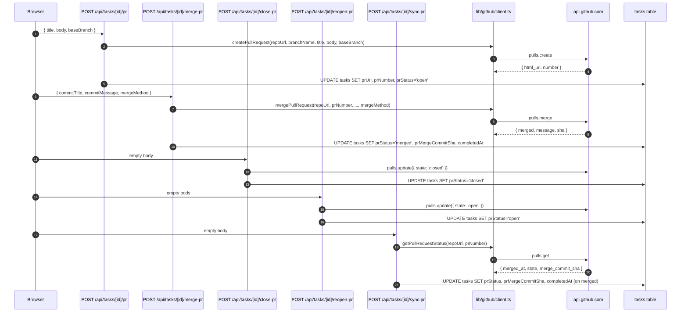

# GitHub Integration (Octokit & PR Workflow)

The GitHub integration is the surface through which the platform reaches `https://api.github.com` on behalf of the signed-in user. It is built on three layers: a token reader that knows about the dual-bucket `users`/`accounts` storage, a thin Octokit factory that turns that token into a REST client, and a set of Next.js route handlers and UI tabs that exercise a focused subset of Octokit's endpoints. Every outbound call in the codebase that needs a GitHub token goes through `getOctokit()` in `lib/github/client.ts`; every call that needs the bare plaintext token goes through `getUserGitHubToken()` in `lib/github/user-token.ts`.

For the OAuth handshake that produces the encrypted tokens, see [GitHub OAuth](../integrations/github-oauth.md). For the broader concept of how the `users` and `accounts` tables split identity between primary sign-in and linked accounts, see [Authentication & Sessions](../concepts/auth-and-sessions.md). For the encryption primitive used to protect stored tokens, see [Encryption & Log Redaction](../concepts/encryption-and-redaction.md).

## Component map

Five groups of files cooperate:

| Group | Files | Role |
| --- | --- | --- |
| Token reader | `lib/github/user-token.ts` | Resolves the session, then decrypts a GitHub token from `accounts` first, then `users`. |
| Octokit factory | `lib/github/client.ts` | Constructs an `Octokit` from the token, plus higher-level helpers (`getGitHubUser`, `createPullRequest`, `mergePullRequest`, `getPullRequestStatus`, `parseGitHubUrl`). |
| Repository management API | `app/api/github/{user,orgs,repos,repos/create,user-repos,verify-repo}/route.ts` | REST surface used by the "new repository" UI and home-page owner/repo pickers. |
| Repository browser API | `app/api/repos/[owner]/[repo]/{commits,issues,pull-requests}/route.ts` and the nested `pull-requests/[pr_number]/{close,check-task}/route.ts` | Tab content for the `/repos/[owner]/[repo]` shell. |
| PR workflow API | `app/api/tasks/[taskId]/{pr,merge-pr,close-pr,reopen-pr,sync-pr}/route.ts` | Task-scoped PR mutations and status syncs. |

The Octokit clients created by `getOctokit()` are short-lived (one per route handler invocation) and unauthenticated when the user has not connected GitHub; routes that require a token guard with `if (!octokit.auth) return 401`.

## The two-tier token lookup

Every call that needs a GitHub token starts at `getUserGitHubToken(req?)` in [`lib/github/user-token.ts`](repo://lib/github/user-token.ts). The function is the canonical reader for the platform's "GitHub can be either primary or linked" rule (see [Authentication & Sessions](../concepts/auth-and-sessions.md) for the full split). It always does the same three things in this order:

1. **Resolve the session.** When a `NextRequest` is supplied it calls `getSessionFromReq(req)`; otherwise it uses the cached `getServerSession()`. If no session, return `null`.
2. **Look in `accounts` (the linked path).** A `SELECT accessToken FROM accounts WHERE userId = session.user.id AND provider = 'github' LIMIT 1`. If a row exists, `decrypt(account.accessToken)` is the answer.
3. **Fall back to `users` (the primary path).** A `SELECT accessToken FROM users WHERE id = session.user.id AND provider = 'github' LIMIT 1`. If a row exists, decrypt it.

Both selects are bounded by the unique index `accounts_user_id_provider_idx` and the unique index `users_provider_external_id_idx`, so each lookup is at most one row. A thrown error from `decrypt` is caught and converted to `null`, so a corrupt ciphertext degrades to "GitHub not connected" rather than a 500.

<!-- openwiki: mermaid parse failed and this diagram was converted to a text fence so it does not break rendering. Fix the diagram source and restore the mermaid fence. Parser error: Heuristic: an unescaped angle bracket inside a label breaks rendering; rephrase the label. -->
```text
flowchart TD
    Caller["Caller<br/>route handler or sandbox injector"]
    S1["getSessionFromReq or<br/>getServerSession"]
    A["SELECT accounts.accessToken<br/>WHERE userId = session AND provider = github"]
    U["SELECT users.accessToken<br/>WHERE id = session AND provider = github"]
    D1["decrypt account.accessToken"]
    D2["decrypt users.accessToken"]
    Out["plaintext token or null"]
    Caller --> S1
    S1 -- "no session" --> Out
    S1 -- "have session" --> A
    A -- "row found" --> D1 --> Out
    A -- "no row" --> U
    U -- "row found" --> D2 --> Out
    U -- "no row" --> Out
```

*Diagram: the accounts-first, users-fallback lookup that `getUserGitHubToken` performs for every caller. The same shape is used by `lib/session/get-oauth-token.ts` for the more general provider-aware `getOAuthToken`.*

This is a wider surface than the simpler `getOAuthToken` in `lib/session/get-oauth-token.ts`: `getUserGitHubToken` is the function that callers use when they only want a GitHub token and want to skip the wrapper object (`{ accessToken, refreshToken, expiresAt }`). It is the function the agent dispatcher in `lib/sandbox/agents/index.ts` calls when it needs to inject a token into the sandbox for the `copilot` agent — the result is written into `process.env.GH_TOKEN` and `process.env.GITHUB_TOKEN` for the lifetime of that agent run.

## `getOctokit()` and its callers

[`lib/github/client.ts`](repo://lib/github/client.ts) is a thin layer over `@octokit/rest`. `getOctokit()` is a one-liner that asks `getUserGitHubToken` for the token and constructs `new Octokit({ auth: token || undefined })`. The `|| undefined` is what makes the result checkable as a boolean later — every caller that follows writes `if (!octokit.auth) return 401` to handle the "no token" case. When the token is missing the function emits a `console.warn` so server logs show that GitHub is not configured for the current session, but does not throw.

The same module exports five higher-level helpers that wrap specific Octokit endpoints and translate known status codes into domain-level error messages:

| Helper | Octokit call | Status code → error mapping |
| --- | --- | --- |
| `getGitHubUser()` | `octokit.rest.users.getAuthenticated()` | Returns `null` on any thrown error (used for the soft "do we have a connected user?" check, e.g. for git author config in `app/api/tasks/[taskId]/start-sandbox/route.ts`). |
| `createPullRequest({ repoUrl, branchName, title, body, baseBranch })` | `octokit.rest.pulls.create({ owner, repo, head, base, title, body })` after `parseGitHubUrl` | `422` → "Pull request already exists or branch does not exist"; `403` → "Permission denied"; `404` → "Repository not found or no access". |
| `mergePullRequest({ repoUrl, prNumber, commitTitle, commitMessage, mergeMethod })` | `octokit.rest.pulls.merge({ owner, repo, pull_number, commit_title, commit_message, merge_method })` (defaults `mergeMethod` to `'squash'`) | `405` → "Pull request is not mergeable"; `409` → "Merge conflict - cannot auto-merge"; `403` / `404` → permission / not found. |
| `getPullRequestStatus({ repoUrl, prNumber })` | `octokit.rest.pulls.get({ owner, repo, pull_number })` | Maps `merged_at` / `state` to `'merged' | 'closed' | 'open'`; returns `mergeCommitSha` from `merge_commit_sha`. |
<!-- openwiki: broken internal link [[\w-]+] file "[\w-]+" does not exist. Fix the href or restore the target, then delete this comment. -->
| `parseGitHubUrl(repoUrl)` | (no network) regex `/github\.com[/:]([\w-]+)\/([\w-]+?)(\.git)?$/` | Returns `{ owner, repo }` or `null`; matches both HTTPS and SSH forms. |

The five helpers are not used by every GitHub-touching route — many of the simpler read endpoints use raw `fetch` against `https://api.github.com/...` and only the PR workflow uses the Octokit wrapper. The choice is per-route: read endpoints that need pagination or custom headers (orgs, repo listing) reach for `fetch`, while write paths and the PR lifecycle use Octokit because its TypeScript types and error shapes are first-class.

`parseGitHubUrl` is intentionally permissive: the regex accepts both `https://github.com/owner/repo.git` and `git@github.com:owner/repo.git`, and tolerates the optional `.git` suffix. It is the same regex shape used in `lib/sandbox/port-detection.ts` (which has its own copy because the sandbox layer predates the helper) and in the task-API routes that have to extract `owner`/`repo` from a `task.repoUrl` without an Octokit instance.

## Repository management API

Six route handlers under `app/api/github/` form the "browse and create repos" surface that backs the "new repository" page (`app/repos/new/page.tsx`) and the home-page owner/repo pickers. All six go through `getUserGitHubToken(request)` first and return `401 { error: 'GitHub not connected' }` when the token is missing.

| Route | Method | Behavior |
| --- | --- | --- |
| [`app/api/github/user/route.ts`](repo://app/api/github/user/route.ts) | `GET` | `fetch https://api.github.com/user`; returns `{ login, name, avatar_url }`. |
| [`app/api/github/orgs/route.ts`](repo://app/api/github/orgs/route.ts) | `GET` | `fetch https://api.github.com/user/orgs`; maps to `{ login, name, avatar_url }`. |
| [`app/api/github/repos/route.ts`](repo://app/api/github/repos/route.ts) | `GET ?owner=X` | Resolves whether `owner` is the authenticated user, an org, or a third party; paginates the appropriate listing endpoint (`/user/repos`, `/orgs/{org}/repos`, or `/users/{owner}/repos`) at GitHub's `per_page=100` cap; deduplicates by `full_name`; sorts alphabetically. |
| [`app/api/github/user-repos/route.ts`](repo://app/api/github/user-repos/route.ts) | `GET ?page=&per_page=&search=` | When `search` is present, calls `https://api.github.com/search/repositories?q={q} in:name user:{login} fork:true` and returns `{ items, total_count, has_more }`. Otherwise paginates `/user/repos?visibility=all&affiliation=owner,organization_member` and re-slice into the UI's `per_page`. |
| [`app/api/github/repos/create/route.ts`](repo://app/api/github/repos/create/route.ts) | `POST` | Validates the name with `/^[a-zA-Z0-9._-]+$/`, then dispatches on `owner`: if `owner === users.getAuthenticated().login` it calls `octokit.repos.createForAuthenticatedUser`, else `octokit.repos.createInOrg`. A `404` on the org branch returns 403 "Organization not found or you do not have permission to create repositories". When a `template` is supplied, `populateRepoFromTemplate` recursively walks the source repo via `octokit.repos.getContent` and `octokit.repos.createOrUpdateFileContents` to seed the new repository. |
| [`app/api/github/verify-repo/route.ts`](repo://app/api/github/verify-repo/route.ts) | `GET ?owner=&repo=` | `fetch https://api.github.com/repos/{owner}/{repo}` and returns `{ accessible, owner, repo }` so the UI can show an inline validation error. A `404` becomes `200 { accessible: false, error: 'Repository not found' }` so the UI can branch on the boolean without parsing the status code. |

The `repos/create` route is the only one in this group that uses Octokit. The recursive template seeder at the top of the file is the most involved Octokit user: it walks the source tree via `octokit.repos.getContent({ path })` (returns an array, recurse for `type === 'dir'`, fetch + base64 encode + `createOrUpdateFileContents` for `type === 'file'`) and continues past per-file failures so a single bad file in a template does not abort the whole copy.

The Octokit `repos.getContent` call here is the one used to seed templates. It is the same call shape used (read-only) by `lib/sandbox/port-detection.ts` to read `package.json` for port detection — both are read-from-template paths that share the same `getContent` type.

## The repository browser tab pattern

The repository browser at `/repos/[owner]/[repo]` is a Next.js layout shell with three sibling routes, one per tab. The pattern is documented in `AGENTS.md` (Repository Page Structure) and implemented as:

```
app/repos/[owner]/[repo]/
├── layout.tsx                     # Shared layout (RepoLayout)
├── page.tsx                       # Redirects to /commits
├── commits/page.tsx
├── issues/page.tsx
└── pull-requests/page.tsx
```

<!-- openwiki: mermaid parse failed and this diagram was converted to a text fence so it does not break rendering. Fix the diagram source and restore the mermaid fence. Parser error: Heuristic: an unescaped angle bracket inside a label breaks rendering; rephrase the label. -->
```text
flowchart LR
    Layout["layout.tsx<br/>getServerSession, getGitHubStars<br/>RepoLayout owner, repo, user, authProvider, stars"]
    Default["page.tsx<br/>redirect to commits"]
    C["commits/page.tsx<br/>RepoCommits"]
    I["issues/page.tsx<br/>RepoIssues"]
    P["pull-requests/page.tsx<br/>RepoPullRequests"]
    Layout --> C
    Layout --> I
    Layout --> P
    Default -.302.-> C
```

*Diagram: the repository browser shell. `layout.tsx` loads the session and stars once; the three tab pages are independent server components that each render one client component, which then fetches its tab-specific API route.*

The shared layout in [`components/repo-layout.tsx`](repo://components/repo-layout.tsx) defines a single `tabs` array of `{ name, href }` pairs and renders each as a `next/link` `Link` whose `isActive` is computed by comparing `usePathname()` to the tab's `href`. There is no client-side tab state — each tab is a full route, and the browser URL always reflects what the user is looking at. The `+` button on the right side of the tab bar writes the current `owner` and `repo` into cookies via `setSelectedOwner` / `setSelectedRepo` and routes to `/`, which is how "create a new task with this repository" pre-fills the home page form.

Each tab page is a one-liner server component that instantiates a single client component:

| Tab | Page | Component | API | GitHub data |
| --- | --- | --- | --- | --- |
| Commits | `commits/page.tsx` | `RepoCommits` in `components/repo-commits.tsx` | `GET /api/repos/[owner]/[repo]/commits` | `octokit.rest.repos.listCommits({ per_page: 30 })` |
| Issues | `issues/page.tsx` | `RepoIssues` in `components/repo-issues.tsx` | `GET /api/repos/[owner]/[repo]/issues` | `octokit.rest.issues.listForRepo({ state: 'open', per_page: 30 })` filtered to drop `pull_request` items |
| Pull Requests | `pull-requests/page.tsx` | `RepoPullRequests` in `components/repo-pull-requests.tsx` | `GET /api/repos/[owner]/[repo]/pull-requests` plus per-PR task checks | `octokit.rest.pulls.list({ state: 'open', per_page: 30, sort: 'updated', direction: 'desc' })` |

All three client components share the same shape: `useEffect` to fetch their API, three render states (loading spinner, error card, empty card), and a per-item dropdown with a "create a task from this item" action that calls `POST /api/tasks`. The PR tab is the most decorated: it also calls `GET /api/repos/[owner]/[repo]/pull-requests/[pr_number]/check-task` for each open PR to mark rows that already have a task and hides the "Create Task" menu item accordingly, plus it exposes a "Close PR" action that calls `PATCH /api/repos/[owner]/[repo]/pull-requests/[pr_number]/close`.

The nested routes under `pull-requests/[pr_number]/` are the only non-tab endpoints in the repo browser:

- [`pull-requests/[pr_number]/close/route.ts`](repo://app/api/repos/[owner]/[repo]/pull-requests/[pr_number]/close/route.ts) — `PATCH` calls `octokit.rest.pulls.update({ state: 'closed' })`. Used by the PR-tab "Close PR" dropdown.
- [`pull-requests/[pr_number]/check-task/route.ts`](repo://app/api/repos/[owner]/[repo]/pull-requests/[pr_number]/check-task/route.ts) — `GET` returns `{ hasTask, taskId }` by `SELECT` from `tasks` where `userId`, `prNumber`, and `repoUrl` all match. Used by the PR-tab per-row pre-check.

### Adding a new tab

The pattern is fully standardized in `AGENTS.md`. To add a new tab (e.g. "Branches"):

1. Create `app/repos/[owner]/[repo]/branches/page.tsx` that renders a `<RepoBranches owner={owner} repo={repo} />` client component.
2. Add `components/repo-branches.tsx` that fetches `GET /api/repos/[owner]/[repo]/branches` and renders the list with the standard loading / error / empty states.
3. Add the API route at `app/api/repos/[owner]/[repo]/branches/route.ts`. The route calls `await getOctokit()`, returns `401` when `!octokit.auth`, and otherwise invokes the relevant `octokit.rest.*` method (here `octokit.rest.repos.listBranches`) and returns `{ branches }`.
4. Extend the `tabs` array in `components/repo-layout.tsx` with `{ name: 'Branches', href: \`/repos/${owner}/${repo}/branches\` }`. Active state is automatic because the `Link` compares against `usePathname()`.
5. If the new tab needs a write action (analogous to "Close PR"), add the nested `[branches]/[name]/[action]/route.ts` route and a menu item in the component that calls it via `fetch`.

Because the layout and tab pattern are fully generic, no other code in the repo browser has to change.

## The PR workflow

The task-scoped PR lifecycle is implemented by five endpoints under `app/api/tasks/[taskId]/`:



*Diagram: the five PR workflow endpoints. `create` and `merge` go through the high-level Octokit helpers in `lib/github/client.ts`; `close`, `reopen`, and `sync-pr` call `octokit.rest.pulls.update` and `getPullRequestStatus` directly.*

### Create: `POST /api/tasks/[taskId]/pr`

[`app/api/tasks/[taskId]/pr/route.ts`](repo://app/api/tasks/[taskId]/pr/route.ts) is the only place in the codebase that calls `createPullRequest`. It first looks up the task by `id` + `userId` + `deletedAt IS NULL`; if the task already has `prUrl` set, it short-circuits to `200 { alreadyExists: true }` so retries are safe. Otherwise it calls the helper with `repoUrl`, `branchName`, and the user-supplied `title`/`body`/`baseBranch` (default `'main'`), then writes the resulting `prUrl` and `prNumber` back to `tasks` and sets `prStatus = 'open'`.

### Merge: `POST /api/tasks/[taskId]/merge-pr`

[`app/api/tasks/[taskId]/merge-pr/route.ts`](repo://app/api/tasks/[taskId]/merge-pr/route.ts) is the only caller of `mergePullRequest`. On success it does three things in order: writes `prStatus = 'merged'`, `prMergeCommitSha = result.sha`, `completedAt = now` to the task; if the task has a `sandboxId`, it calls `Sandbox.get(...).stop()` and `unregisterSandbox(taskId)` to tear down the live sandbox; and finally clears `sandboxId` and `sandboxUrl` on the task row. The sandbox teardown is wrapped in a try/catch that logs but does not rethrow — a merge is considered successful even if the sandbox is already gone.

### Close and reopen: `POST /api/tasks/[taskId]/close-pr` and `POST /api/tasks/[taskId]/reopen-pr`

Both routes in [`app/api/tasks/[taskId]/close-pr/route.ts`](repo://app/api/tasks/[taskId]/close-pr/route.ts) and [`app/api/tasks/[taskId]/reopen-pr/route.ts`](repo://app/api/tasks/[taskId]/reopen-pr/route.ts) share the same shape: load the task, ensure it has `repoUrl` and `prNumber`, call `parseGitHubUrl(task.repoUrl)`, then call `octokit.rest.pulls.update({ state: 'closed' | 'open' })`. The DB write is one `UPDATE` that sets `prStatus` to the new value and bumps `updatedAt`. The `repo` page also has a `PATCH .../pull-requests/[pr_number]/close` route that does the same `pulls.update({ state: 'closed' })` call but is decoupled from any task — it is the row-level "Close PR" action on the PR tab.

### Sync: `POST /api/tasks/[taskId]/sync-pr`

[`app/api/tasks/[taskId]/sync-pr/route.ts`](repo://app/api/tasks/[taskId]/sync-pr/route.ts) is the only caller of `getPullRequestStatus`. It re-reads the PR's current state from GitHub, maps it to `{ open, closed, merged }`, and writes `prStatus`, `prMergeCommitSha`, and `updatedAt` back. When the new state is `merged`, it additionally sets `completedAt = now` — the same completion stamp the merge route writes, which is what lets the task lifecycle treat a merge detected after the fact the same as a merge done in-product.

### Octokit calls used by the PR workflow

The five endpoints above collectively use these Octokit methods:

- `octokit.rest.pulls.create` — open a new PR.
- `octokit.rest.pulls.merge` — merge an existing PR.
- `octokit.rest.pulls.get` — read the current state, `merged_at`, and `merge_commit_sha`.
- `octokit.rest.pulls.update({ state })` — close or reopen.

Outside the workflow, the same `pulls.update` and `pulls.get` methods are used by the repo-browser nested routes (`pull-requests/[pr_number]/close` and the per-PR `check-task` lookup). The full mapping of Octokit call sites is:

| Octokit method | Used by |
| --- | --- |
| `users.getAuthenticated` | `lib/github/client.ts` (`getGitHubUser`), `app/api/github/repos/create/route.ts` (owner check) |
| `repos.createForAuthenticatedUser` | `app/api/github/repos/create/route.ts` |
| `repos.createInOrg` | `app/api/github/repos/create/route.ts` |
| `repos.getContent` | `app/api/github/repos/create/route.ts` (template seeder), `lib/sandbox/port-detection.ts` (read `package.json`) |
| `repos.createOrUpdateFileContents` | `app/api/github/repos/create/route.ts` (template seeder) |
| `repos.listCommits` | `app/api/repos/[owner]/[repo]/commits/route.ts` |
| `issues.listForRepo` | `app/api/repos/[owner]/[repo]/issues/route.ts` |
| `pulls.list` | `app/api/repos/[owner]/[repo]/pull-requests/route.ts` |
| `pulls.get` | `lib/github/client.ts` (`getPullRequestStatus`) |
| `pulls.create` | `lib/github/client.ts` (`createPullRequest`) |
| `pulls.update` | `app/api/repos/[owner]/[repo]/pull-requests/[pr_number]/close/route.ts`, `app/api/tasks/[taskId]/close-pr/route.ts`, `app/api/tasks/[taskId]/reopen-pr/route.ts` |
| `pulls.merge` | `lib/github/client.ts` (`mergePullRequest`) |
| `checks.listForRef` | `app/api/tasks/[taskId]/check-runs/route.ts` |

## Failure and edge-case behavior

- **No connected GitHub.** Every API route under `app/api/github/**` and every nested `app/api/repos/[owner]/[repo]/**` returns 401 when `getUserGitHubToken` or `octokit.auth` is falsy. The UI surfaces the 401 by rendering the empty state for the tab.
- **Corrupt or missing encrypted token.** `getUserGitHubToken` catches the `decrypt` throw and returns `null`, which routes treat as "not connected".
- **GitHub rate limiting.** A 403 from GitHub typically surfaces as a 500 with the Octokit-derived `console.error`; the routes do not implement a backoff. Because every Octokit client is per-request, rate-limit recovery is automatic — the next call gets a fresh client and the user's actual quota.
- **PR already exists.** `createPullRequest` returns 422 from Octokit; the wrapper converts to `success: false, error: 'Pull request already exists or branch does not exist'`. The `POST /api/tasks/[taskId]/pr` route additionally pre-checks `task.prUrl` so a retry short-circuits before the Octokit round-trip.
- **PR not mergeable.** `mergePullRequest` returns the 405 → "Pull request is not mergeable" mapping; the route propagates it as 500 with that string. The same path handles 409 conflicts ("Merge conflict - cannot auto-merge") and 403 / 404.
- **Closing a PR with no `head` branch.** A `pulls.update({ state: 'closed' })` is idempotent on GitHub's side; the route is therefore safe to retry.
- **Sandbox stuck after merge.** `merge-pr`'s sandbox teardown is wrapped in try/catch — a failed `sandbox.stop()` does not roll back the merge DB write.
- **Per-PR "check-task" misses.** The PR-tab per-row pre-check silently swallows fetch errors so a transient `/check-task` failure does not blank the entire PR list.
- **Repository URL parsing.** `parseGitHubUrl` accepts both HTTPS and SSH forms; the regex rejects URLs with extra path segments. Routes that need to accept a `repoUrl` and fall back to a regex (e.g. `app/api/tasks/[taskId]/check-runs/route.ts`) use the same shape directly.

## Extension points

- **Adding a new high-level GitHub helper.** Drop a new `export async function` in `lib/github/client.ts` that calls `getOctokit()`, guards `!octokit.auth`, parses the URL, invokes the Octokit method, and maps known status codes to a `{ success: false, error: string }` envelope. Mirror the shape of `createPullRequest` so callers can branch uniformly.
- **Adding a new tab to the repository browser.** Follow the five-step recipe in `AGENTS.md` and replicated in the previous section: a new `app/repos/[owner]/[repo]/[tab]/page.tsx`, a `components/repo-[tab].tsx` client component, an API route that calls `getOctokit()` + one Octokit method, and one new entry in the `tabs` array of `components/repo-layout.tsx`.
- **Adding a new write action on an existing tab.** Add a nested route under the tab's API directory (e.g. `app/api/repos/[owner]/[repo]/pull-requests/[pr_number]/[action]/route.ts`), reuse `getOctokit()` + `parseGitHubUrl` for the Octokit call, and add a `DropdownMenuItem` in the tab's client component that calls it via `fetch`.
- **Adding a new PR workflow endpoint.** All five existing PR-workflow routes share the same `getServerSession → SELECT task WHERE id, userId, deletedAt IS NULL → parseGitHubUrl → octokit.rest.pulls.* → UPDATE tasks` skeleton. The merge-pr route additionally tears down the sandbox and the sync-pr route additionally sets `completedAt` on transition to `merged`. A new endpoint (e.g. `add-comment`) would slot in between sync-pr and reopen-pr without changing anything upstream.
- **Switching to GraphQL.** None of the current code paths need GraphQL; every requirement is satisfied by REST. The Octokit factory already returns a `@octokit/rest` instance, and switching a single caller to `octokit.graphql` is a one-line change because the same token is used.
- **Adding per-installation tokens.** Today every call is on behalf of a user. The `lib/github/user-token.ts` lookup could be extended with an installation lookup for repository-level operations that should not run under a user's personal token; the storage layer is the only piece that would change.
