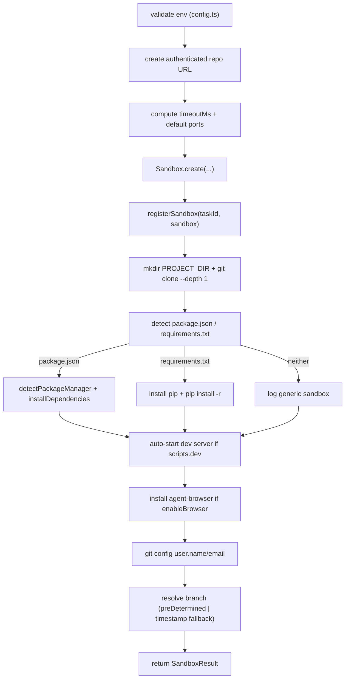

# Sandbox Orchestration

`lib/sandbox/` is the thin layer that sits between the task handlers (`app/api/tasks/...`) and the `@vercel/sandbox` SDK. It owns every step from "the request says create a VM" through "the repo is cloned, dependencies are installed, the dev server is up, and the agent has a place to write". This page documents that layer as a single owned module: the entry point (`createSandbox`), the command helpers, package-manager detection, port detection, the git push / shutdown helpers, and the in-memory registry that connects them inside one serverless execution.

For the per-phase narrative (creation → cloning → dependencies → dev server → agent → push → shutdown) see [Sandbox Lifecycle](../concepts/sandbox-lifecycle.md). For the SDK surface itself (`Sandbox.create`, `Sandbox.get`, `runCommand`, `domain`, `stop`) see [Integration: Vercel Sandbox](../integrations/vercel-sandbox.md). For how each agent wrapper uses this layer once the sandbox is ready, see [Agent Implementations](./agent-implementations.md).

## Module map

<!-- openwiki: mermaid parse failed and this diagram was converted to a text fence so it does not break rendering. Fix the diagram source and restore the mermaid fence. Parser error: Heuristic: an unescaped angle bracket inside a label breaks rendering; rephrase the label. -->
```text
flowchart TD
    subgraph Routes["Task routes — app/api/tasks/..."]
        R1["POST /api/tasks"]
        R2["POST /api/tasks/:id/start-sandbox"]
        R3["POST /api/tasks/:id/continue"]
        R4["PATCH /api/tasks/:id"]
        R5["All file ops, terminal, LSP, diff"]
    end

    subgraph Lib["lib/sandbox/ — this page"]
        CS["creation.ts<br/>createSandbox()"]
        CM["commands.ts<br/>runCommandInSandbox<br/>runInProject<br/>runStreamingCommandInSandbox"]
        CF["config.ts<br/>validateEnvironmentVariables<br/>createAuthenticatedRepoUrl<br/>createSandboxConfiguration"]
        PM["package-manager.ts<br/>detectPackageManager<br/>installDependencies"]
        PD["port-detection.ts<br/>detectPortFromRepo"]
        GR["git.ts<br/>pushChangesToBranch<br/>shutdownSandbox"]
        SR["sandbox-registry.ts<br/>registerSandbox<br/>getSandbox<br/>killSandbox"]
        TY["types.ts<br/>SandboxConfig<br/>SandboxResult<br/>AgentExecutionResult"]
    end

    SDK["@vercel/sandbox SDK<br/>Sandbox.create / Sandbox.get<br/>runCommand / domain / stop"]

    R1 --> CS
    R1 --> PD
    R2 --> CS
    R2 --> PD
    R3 --> CS
    R3 --> PD
    R4 --> SR
    R5 --> SR

    CS --> CM
    CS --> CF
    CS --> PM
    CS --> SR
    R3 --> GR
    R1 --> GR
    R2 --> CM
    R2 --> PM
    R5 --> CM
    R5 --> SR

    CS --> SDK
    CM --> SDK
    GR --> SDK
    SR --> SDK
```

*Diagram: how the routes under `app/api/tasks/` consume the `lib/sandbox/` modules. `createSandbox()` is the only builder; everything else is helpers around the SDK.*

The seven modules and what each one is responsible for:

| Module | Responsibility | Key exports |
| --- | --- | --- |
| [`creation.ts`](repo://lib/sandbox/creation.ts) | The canonical `createSandbox()` builder: env validation, `Sandbox.create`, registry write, cloning, dependency install, dev-server auto-start, browser install, git config, branch resolution | `createSandbox`, `runAndLogCommand` |
| [`commands.ts`](repo://lib/sandbox/commands.ts) | Three wrappers around `sandbox.runCommand`: positional, project-cwd, and streaming-with-JSON-line-parse. Defines the canonical `PROJECT_DIR`. | `PROJECT_DIR`, `runCommandInSandbox`, `runInProject`, `runStreamingCommandInSandbox`, `CommandResult`, `StreamingCommandOptions` |
| [`config.ts`](repo://lib/sandbox/config.ts) | Environment validation, GitHub-URL token embedding, the declarative `createSandboxConfiguration` payload builder | `validateEnvironmentVariables`, `createAuthenticatedRepoUrl`, `createSandboxConfiguration` |
| [`package-manager.ts`](repo://lib/sandbox/package-manager.ts) | Lock-file-based package-manager detection and the per-manager `install` command | `detectPackageManager`, `installDependencies`, `getDevCommandArgs` |
| [`port-detection.ts`](repo://lib/sandbox/port-detection.ts) | GitHub-API-based port picker (`5173` for Vite, `3000` otherwise), used **before** the sandbox exists | `detectPortFromRepo` |
| [`git.ts`](repo://lib/sandbox/git.ts) | The post-agent `git add/commit/push` helper and the best-effort `pkill`-based shutdown | `pushChangesToBranch`, `shutdownSandbox` |
| [`sandbox-registry.ts`](repo://lib/sandbox/sandbox-registry.ts) | The in-memory `Map<taskId, Sandbox>` that lets endpoints inside the same serverless execution share a live `Sandbox` reference, plus `killSandbox` for user-initiated stops | `registerSandbox`, `unregisterSandbox`, `getSandbox`, `killSandbox`, `getActiveSandboxCount` |
| [`types.ts`](repo://lib/sandbox/types.ts) | The `SandboxConfig` input shape (consumed by `createSandbox`), the `SandboxResult` output shape, and the `AgentExecutionResult` shape consumed by the dispatcher | `SandboxConfig`, `SandboxResult`, `AgentExecutionResult` |

## The command helpers — `lib/sandbox/commands.ts`

Every file operation, git command, dependency install, and dev-server start inside the sandbox flows through one of three wrappers. They exist because the SDK exposes two distinct `runCommand` signatures, and the wrappers normalize them into a single `CommandResult` shape that the rest of the codebase can rely on.

### `runCommandInSandbox(sandbox, command, args)` — positional form

Defined at [`lib/sandbox/commands.ts:21-63`](repo://lib/sandbox/commands.ts#L21-L63). Calls `sandbox.runCommand(command, args)` (the SDK's positional form), then awaits both `result.stdout()` and `result.stderr()` (which are functions returning `Promise<string>`, **not** strings), and returns:

```ts
{
  success: result.exitCode === 0,
  exitCode: result.exitCode,
  output: stdout,   // captured stdout
  error: stderr,    // captured stderr
  command: <rebuilt command line>,
}
```

Both stdout/stderr reads are wrapped in try/catch — the SDK occasionally returns a function that throws when invoked, and the wrappers treat that as an empty stream rather than failing the whole command. The thrown-exception branch at the bottom of the function returns the same shape with `success: false` and the caught error message.

### `runInProject(sandbox, command, args)` — cwd-prefixed form

Defined at [`lib/sandbox/commands.ts:66-76`](repo://lib/sandbox/commands.ts#L66-L76). Builds `sh -c "cd /vercel/sandbox/project && <command> <args>"` and delegates to `runCommandInSandbox`. The arguments are shell-escaped with a per-arg `'…'` wrapper that doubles internal single quotes (`'` → `'\''`), so file paths containing spaces are safe. `PROJECT_DIR = '/vercel/sandbox/project'` is the single source of truth for "where the repo lives inside the VM" and is exported from `commands.ts:4`. Every file route (`create-file`, `save-file`, `diff`, `files`, `terminal`, `lsp`, `sync-changes`, etc.) and every git/dependency command inside `createSandbox` and `pushChangesToBranch` imports it.

### `runStreamingCommandInSandbox(sandbox, command, args, options)` — streaming + JSON-line parse

Defined at [`lib/sandbox/commands.ts:78-147`](repo://lib/sandbox/commands.ts#L78-L147). Same plumbing as `runCommandInSandbox`, but with two streaming hooks:

- `options.onStdout(chunk)` — called once with the complete stdout after the process exits (the positional SDK form does not expose per-chunk callbacks, so this is a complete-buffer emission rather than a true stream).
- `options.onJsonLine(jsonData)` — called once per non-empty line that successfully `JSON.parse`s. This is the hook the Claude / Cursor / Copilot agent wrappers use to feed `stream-json` output line-by-line into the chat.

`options.onStderr(chunk)` is also accepted for symmetry but is only forwarded as a single complete-buffer emission.

### `PROJECT_DIR` — the canonical repo location

<!-- openwiki: broken internal link [#cloning-the-manual-clone-path] heading anchor "cloning-the-manual-clone-path" does not exist in /openwiki/systems/sandbox-orchestration.md. Fix the href or restore the target, then delete this comment. -->
`PROJECT_DIR = '/vercel/sandbox/project'` ([`commands.ts:4`](repo://lib/sandbox/commands.ts#L4)) is hard-coded across the codebase. The clone target, the cwd for every agent command, the prefix for every file route, and the launch directory for the detached dev server all reference this constant. The clone is performed with `mkdir -p /vercel/sandbox/project && git clone --depth 1 <authed-url> /vercel/sandbox/project` — see [Cloning](#cloning-the-manual-clone-path).

## `createSandbox()` — the canonical builder

`createSandbox(config, logger)` in [`lib/sandbox/creation.ts:47-996`](repo://lib/sandbox/creation.ts#L47-L996) is the only entry point that creates a new Vercel Sandbox from a route handler. It is called from two places:

- `app/api/tasks/route.ts` (`processTask`) when a new task starts — the `ports` array is computed by `detectPortFromRepo` first ([tasks/route.ts:444-457](repo://app/api/tasks/route.ts#L444-L457)).
- `app/api/tasks/[taskId]/continue/route.ts` when a follow-up arrives and `Sandbox.get()` did not yield a live sandbox ([continue/route.ts:192-243](repo://app/api/tasks/[taskId]/continue/route.ts#L192-L243)).

The `app/api/tasks/[taskId]/start-sandbox/route.ts` endpoint **does not call `createSandbox`** — it replicates the same steps inline so it can pass `source` to `Sandbox.create` (which the new-task path does not, because it needs to embed the GitHub PAT in the clone URL).

The `SandboxConfig` input shape ([`types.ts:4-32`](repo://lib/sandbox/types.ts#L4-L32)) threads everything the builder needs without requiring the caller to know the SDK payload format:

```ts
interface SandboxConfig {
  taskId: string
  repoUrl: string
  githubToken?: string | null
  gitAuthorName?: string
  gitAuthorEmail?: string
  apiKeys?: { OPENAI_API_KEY?, GEMINI_API_KEY?, CURSOR_API_KEY?, ANTHROPIC_API_KEY?, AI_GATEWAY_API_KEY? }
  timeout?: string        // e.g. '60m', parsed as minutes
  ports?: number[]
  runtime?: string        // default 'node22'
  resources?: { vcpus?: number }
  taskPrompt?: string
  selectedAgent?: string  // claude | cursor | codex | gemini | copilot | opencode
  selectedModel?: string
  installDependencies?: boolean   // default true
  keepAlive?: boolean
  enableBrowser?: boolean
  preDeterminedBranchName?: string
  onProgress?: (progress: number, message: string) => Promise<void>
  onCancellationCheck?: () => Promise<boolean>
}
```

`onProgress` is called with monotonically-increasing percentages (20, 25, 30, 35, 37, 42, 44, 50, ...) that line up with the milestones the route handler maps to `logger.updateProgress`. `onCancellationCheck` is invoked at five points inside the builder — before validation, after `Sandbox.create`, after dependency install, before git config, and the worker also checks it after `createSandbox` returns. Returning `true` from any of them short-circuits the builder to `{ success: false, cancelled: true }` without throwing.

The `SandboxResult` output shape ([`types.ts:34-41`](repo://lib/sandbox/types.ts#L34-L41)) is what the caller persists and uses:

```ts
interface SandboxResult {
  success: boolean
  sandbox?: Sandbox
  domain?: string             // sandbox.domain(devPort)
  branchName?: string         // preDeterminedBranchName | agent/<timestamp>-<id>
  error?: string
  cancelled?: boolean
}
```

### High-level shape



*Diagram: the seven phases inside `createSandbox()`. Each phase has at least one `onCancellationCheck` checkpoint; cancellation returns `{ success: false, cancelled: true }` without throwing.*

### Phase 1 — Env validation and authenticated URL

[`creation.ts:63-72`](repo://lib/sandbox/creation.ts#L63-L72) calls `validateEnvironmentVariables(config.selectedAgent, config.githubToken, config.apiKeys)` ([`config.ts:1-67`](repo://lib/sandbox/config.ts#L1-L67)) and throws the joined error string if validation fails. The check is per-agent:

- `claude` requires `AI_GATEWAY_API_KEY` (from `apiKeys` or `process.env`).
- `cursor` requires `CURSOR_API_KEY`.
- `codex` requires `AI_GATEWAY_API_KEY`.
- `gemini` requires `GEMINI_API_KEY`.
- `opencode` requires either `AI_GATEWAY_API_KEY` or `ANTHROPIC_API_KEY`.
- `githubToken` is required unconditionally — there is no public-repo fast path.
- `SANDBOX_VERCEL_TEAM_ID`, `SANDBOX_VERCEL_PROJECT_ID`, and `SANDBOX_VERCEL_TOKEN` are required for `Sandbox.create` to succeed.

After validation, `createAuthenticatedRepoUrl(repoUrl, githubToken)` ([`config.ts:69-86`](repo://lib/sandbox/config.ts#L69-L86)) embeds the GitHub PAT as the URL username and `x-oauth-basic` as the password for `github.com` URLs only; non-GitHub URLs are returned unchanged. This is the URL the manual `git clone` later uses — the SDK's `source.git.url` parameter does not accept a tokenized URL, which is why the repo is cloned manually instead of via `Sandbox.create({ source })`.

### Phase 2 — Provision the VM

<!-- openwiki: broken internal link [#port-detection] heading anchor "port-detection" does not exist in /openwiki/systems/sandbox-orchestration.md. Fix the href or restore the target, then delete this comment. -->
[`creation.ts:75-104`](repo://lib/sandbox/creation.ts#L75-L104). The timeout is parsed from `config.timeout` as minutes (defaulting to 60 minutes); the comment at lines 73-75 is the canonical statement that `keepAlive` does **not** affect this number — `keepAlive` only controls whether the worker tears the sandbox down after the agent finishes. The default ports are `[3000, 5173]` when the caller does not pass `config.ports`; the route handler overrides this with the single port returned by `detectPortFromRepo` (see [Port detection](#port-detection)).

`Sandbox.create(...)` is wrapped in `try/catch`:

```ts
const sandboxConfig = {
  teamId: process.env.SANDBOX_VERCEL_TEAM_ID!,
  projectId: process.env.SANDBOX_VERCEL_PROJECT_ID!,
  token: process.env.SANDBOX_VERCEL_TOKEN!,
  timeout: timeoutMs,
  ports: defaultPorts,
  runtime: config.runtime || 'node22',
  resources: { vcpus: config.resources?.vcpus || 4 },
}
```

The catch ([`creation.ts:140-163`](repo://lib/sandbox/creation.ts#L140-L163)) maps `error.code === 'ETIMEDOUT'`, `error.name === 'TimeoutError'`, or an error message containing `'timeout'` to a specific "Sandbox creation timed out after 5 minutes" log + thrown error; anything else logs `'Sandbox creation failed'` and rethrows.

The **first thing** the success path does after `Sandbox.create` resolves is `registerSandbox(config.taskId, sandbox, config.keepAlive || false)` ([`creation.ts:103`](repo://lib/sandbox/creation.ts#L103)) — populating the in-memory `Map` *before* the clone runs. This is intentional: even if a later phase throws, the registry holds a live reference that `killSandbox(taskId)` can stop.

### Phase 3 — Cloning (the manual clone path)

[`creation.ts:111-134`](repo://lib/sandbox/creation.ts#L111-L134). The sandbox is created **without** `source` attached at the SDK level, so `lib/sandbox/creation.ts` instead runs:

```bash
mkdir -p /vercel/sandbox/project
git clone --depth 1 <authenticatedRepoUrl> /vercel/sandbox/project
```

The `--depth 1` is what keeps the clone fast — the full git history is not needed because every agent run ends with a fresh `git push` and a deterministic branch name. A clone failure logs `'Failed to clone repository'` and throws `'Failed to clone repository to project directory'`.

### Phase 4 — Dependencies (project-type branching)

[`creation.ts:165-324`](repo://lib/sandbox/creation.ts#L165-L324). When `installDependencies !== false`, the builder probes for both `package.json` and `requirements.txt` (`test -f …`) inside `PROJECT_DIR`, then takes the corresponding branch. The supported project types are:

| Project marker | Install path | Fallback |
| --- | --- | --- |
| `package.json` | `detectPackageManager` → `installDependencies` with detected manager | If `pnpm`/`yarn` not installed, `npm install -g pnpm` / `npm install -g yarn`; if installation fails, retry with `npm` ([creation.ts:185-249](repo://lib/sandbox/creation.ts#L185-L249)) |
| `requirements.txt` | `python3 -m pip install -r requirements.txt`; pip bootstrapped from `get-pip.py` if missing | If `get-pip.py` fails, `apt-get install -y python3-pip` ([creation.ts:260-304](repo://lib/sandbox/creation.ts#L260-L304)) |
| Neither | No install step; the builder reports a generic "Sandbox available" ([creation.ts:494-497](repo://lib/sandbox/creation.ts#L494-L497)) | n/a |

The Python path never aborts the build on failure — pip failures are logged with `'Warning: Failed to install Python dependencies, but continuing with sandbox setup'`. The Node path is similar for npm failures, but non-npm primary managers also get one explicit `npm` fallback retry.

### Phase 5 — Dev server (Vite / Next.js quirks)

[`creation.ts:326-470`](repo://lib/sandbox/creation.ts#L326-L470). If `package.json` has a `scripts.dev` entry, the dev server is auto-started in **detached mode** with captured `stdout`/`stderr` streams. The build is one of the most subtle pieces of the whole system, because two framework-specific patches have to land before the command runs.

<!-- openwiki: broken internal link [#port-detection] heading anchor "port-detection" does not exist in /openwiki/systems/sandbox-orchestration.md. Fix the href or restore the target, then delete this comment. -->
**Port selection.** The dev port starts at `3000`. If `package.json.dependencies.vite` or `package.json.devDependencies.vite` is present, the port switches to `5173` ([`creation.ts:340-345`](repo://lib/sandbox/creation.ts#L340-L345)). The same decision is made **before** `createSandbox` is called, in `detectPortFromRepo` (see [Port detection](#port-detection)) — the port passed in `config.ports` determines which port is exposed to the public `sandbox.domain()` URL.

**Vite host-check patch.** Vite's dev server blocks requests from hosts it does not know about, and the sandbox's public domain is one it does not know. The builder performs two mutations, in order:

1. Add `vite.config.*` to `~/.gitignore_global` and point `core.excludesfile` at it, so any subsequent modification of `vite.config.js` cannot accidentally end up in the agent's commit ([`creation.ts:358-364`](repo://lib/sandbox/creation.ts#L358-L364)).
2. If `vite.config.js` exists, patch it with a `sed` script that either inserts `host: true,` after the existing `server: {` block or appends a new `server: { host: true },` block to the `defineConfig` call ([`creation.ts:367-394`](repo://lib/sandbox/creation.ts#L367-L394)). The original file is backed up to `vite.config.js.backup` in the same step. (The `start-sandbox` path uses a different strategy — it writes a separate `vite.sandbox.config.js` that calls `mergeConfig(userConfig, { server: { host: '0.0.0.0', strictPort: false, allowedHosts: undefined } })` and passes `--config vite.sandbox.config.js --host 0.0.0.0` to the dev command.)

After the patch, the dev command is rebuilt with `--host` appended: `npm run dev -- --host` for npm, or `<pm> dev --host` for pnpm/yarn ([`creation.ts:397-402`](repo://lib/sandbox/creation.ts#L397-L402)).

**Next.js 16 `--webpack` flag.** If `package.json` declares a `next` dependency whose version string starts with `16.` / `^16.` / `~16.`, the dev command is rebuilt with `--webpack` appended ([`creation.ts:405-417`](repo://lib/sandbox/creation.ts#L405-L417)). The rationale lives in the agent wrappers: Next 16 ships Turbopack by default, which does not behave reliably inside the Vercel Sandbox VM, so the wrapper forces webpack to keep dev-server startup deterministic.

**Detached launch with log capture.** [`creation.ts:448-454`](repo://lib/sandbox/creation.ts#L448-L454) launches the dev command via `sandbox.runCommand({ cmd: 'sh', args: ['-c', 'cd /vercel/sandbox/project && <devCommand>'], detached: true, stdout, stderr })` — the SDK's **options-object** form, not the positional one. Two `Writable` streams ([`creation.ts:422-446`](repo://lib/sandbox/creation.ts#L422-L446)) split each chunk on `\n`, prefix `[SERVER]`, and forward every non-empty line to `TaskLogger.info`. The same pattern is used by the streaming agent wrappers (Claude, Cursor, Copilot).

**Domain resolution.** After a 3-second `setTimeout`, `domain = sandbox.domain(devPort)` is called and stored on the result. The same call is repeated at [`creation.ts:472-475`](repo://lib/sandbox/creation.ts#L472-L475) when no dev server was started (so a Python or generic project still gets a domain on the default port).

### Phase 6 — Optional `agent-browser` install

[`creation.ts:505-772`](repo://lib/sandbox/creation.ts#L505-L772). When `config.enableBrowser` is true:

1. `sudo dnf clean all` clears the package cache.
2. System Chromium dependencies are installed via `sudo dnf install -y …` in three groups: `criticalDeps = ['nss', 'nspr']`, `displayDeps + xDeps + graphicsDeps + otherDeps` with `--skip-broken`. The critical group retries with `--allowerasing` on failure.
3. `sudo ldconfig` refreshes the library cache.
4. `npm install -g agent-browser` installs the CLI.
5. `agent-browser install` downloads the Chromium binary.
6. A skill file describing the agent-browser commands is written to a per-agent location:
   - `claude` → `/home/vercel-sandbox/.claude/skills/agent-browser/SKILL.md` (full Claude skill content with `allowed-tools: Bash(agent-browser:*)`).
   - `gemini` → `/home/vercel-sandbox/.gemini/AGENTS.md` (generic instructions).
   - `cursor` → `/home/vercel-sandbox/.cursor/rules/agent-browser.mdc` (YAML front matter + generic instructions).
   - `codex` → `/home/vercel-sandbox/AGENTS.md`.
   - `copilot` → `/home/vercel-sandbox/.github/copilot-instructions.md`.
   - `opencode` → `/home/vercel-sandbox/AGENTS.md`.

A failure in any of the dnf, npm-install, agent-browser-install, or skill-write steps is logged with `'Warning: …'` and the build continues — a missing browser never blocks the sandbox from being usable for non-browser tasks.

### Phase 7 — Git config and branch resolution

[`creation.ts:774-978`](repo://lib/sandbox/creation.ts#L774-L978).

- `git config user.name` / `git config user.email` are set from `config.gitAuthorName` / `config.gitAuthorEmail`, falling back to `'Coding Agent'` / `'agent@example.com'`.
- `git rev-parse --git-dir` confirms the clone produced a git repo; if it didn't, `git init` runs.
- If `git rev-parse HEAD` fails (empty repo), the builder synthesizes a `README.md` with the repo name (extracted from `repoUrl` via regex `/\/([^\/]+?)(\.git)?$/`), commits it, and pushes `main` to `origin`.
- The working branch is resolved as follows:
  - If `config.preDeterminedBranchName` is set, the builder probes `git show-ref --verify --quiet refs/heads/<name>` (local) → `git ls-remote --heads origin <name>` (remote). Existing branches are checked out (`git checkout` or `git fetch origin <name>:<name>` + `git checkout`); missing branches are created with `git checkout -b <name>`.
  - If not, the builder falls back to `agent/<timestamp>-<id>` where `timestamp = ISO date minus punctuation` and `id = generateId()`. `generateId` is imported from `lib/utils/id`.

If `preDeterminedBranchName` is not yet known when the route handler calls `createSandbox` (typical when the AI branch-name step has not finished), `processTask` simply omits the field and lets the fallback path generate a deterministic-but-unique name — see the route-level pattern at [`app/api/tasks/route.ts:434-477`](repo://app/api/tasks/route.ts#L434-L477).

## The `runAndLogCommand` helper

`runAndLogCommand(sandbox, command, args, logger, cwd?)` ([`creation.ts:13-45`](repo://lib/sandbox/creation.ts#L13-L45)) is `createSandbox`'s local wrapper around `runCommandInSandbox` that also writes the command (redacted) into the task log and pipes the result back through the logger. It is the only place inside `createSandbox` that does `logger.command(...)`. The redaction goes through `redactSensitiveInfo` (from `lib/utils/logging.ts`) so URLs containing the GitHub PAT or Vercel tokens do not leak into persisted logs.

The `cwd` argument, when provided, prefixes the command with `cd <cwd> && …` so the existing `runCommandInSandbox` does not have to be re-implemented. `createSandbox` always passes `PROJECT_DIR` as `cwd` when it wants the command to run inside the cloned repo; the post-clone branch-resolution steps all use this helper.

## Package-manager detection — `lib/sandbox/package-manager.ts`

`detectPackageManager(sandbox, logger)` ([`package-manager.ts:6-29`](repo://lib/sandbox/package-manager.ts#L6-L29)) probes for lock files inside `PROJECT_DIR` in priority order and returns one of `'pnpm' | 'yarn' | 'npm'`:

```ts
const pnpmLockCheck  = await runInProject(sandbox, 'test', ['-f', 'pnpm-lock.yaml'])
if (pnpmLockCheck.success)  return 'pnpm'
const yarnLockCheck   = await runInProject(sandbox, 'test', ['-f', 'yarn.lock'])
if (yarnLockCheck.success)   return 'yarn'
const npmLockCheck    = await runInProject(sandbox, 'test', ['-f', 'package-lock.json'])
if (npmLockCheck.success)    return 'npm'
return 'npm'  // default when no lock file is found
```

`installDependencies(sandbox, packageManager, logger)` ([`package-manager.ts:32-83`](repo://lib/sandbox/package-manager.ts#L32-L83)) then runs the right install command:

| Package manager | Install command | Notes |
| --- | --- | --- |
| `pnpm` | `pnpm install --frozen-lockfile` | First calls `pnpm config set store-dir /tmp/pnpm-store` so the global cache does not bloat `PROJECT_DIR` |
| `yarn` | `yarn install --frozen-lockfile` | No extra config |
| `npm` | `npm install --no-audit --no-fund` | Default fallback when no lock file is found |

Failures are logged with `'Package manager install failed'` plus `exitCode`, `stdout`, `stderr` placeholders; the result is returned as `{ success: false, error: stderr }` so the caller can decide whether to fall back. `createSandbox` falls back to `npm` exactly once when a non-npm manager fails ([`creation.ts:236-249`](repo://lib/sandbox/creation.ts#L236-L249)).

`getDevCommandArgs(_sandbox, packageManager)` ([`package-manager.ts:89-91`](repo://lib/sandbox/package-manager.ts#L89-L91)) returns `['run', 'dev']` for npm and `['dev']` for pnpm/yarn. The `_sandbox` parameter is unused — the helper exists for symmetry with the rest of the API surface and to make the npm vs. non-npm distinction explicit at call sites.

### Global install of pnpm / yarn

If `detectPackageManager` returns `pnpm` or `yarn` and `which pnpm` (or `which yarn`) inside `PROJECT_DIR` fails, `createSandbox` installs the manager globally via `npm install -g <pm>` ([`creation.ts:185-219`](repo://lib/sandbox/creation.ts#L185-L219)). A failure here logs `'Failed to install <pm> globally, falling back to npm'` and runs `installDependencies(sandbox, 'npm', logger)` instead — so the worst-case behavior is "we install with npm, not the lockfile's manager".

## Port detection — `lib/sandbox/port-detection.ts`

`detectPortFromRepo(repoUrl, githubToken)` ([`port-detection.ts:11-68`](repo://lib/sandbox/port-detection.ts#L11-L68)) runs **before** the sandbox exists. It uses the GitHub REST API (via Octokit) to fetch `package.json` from the repo, parses it, and returns `5173` when `vite` is in `dependencies` or `devDependencies`, or `3000` otherwise. Non-GitHub URLs, missing files, unparseable JSON, or any Octokit error all fall back to `3000`.

The function is called from three places:

- `app/api/tasks/route.ts:444` — new-task path.
- `app/api/tasks/[taskId]/start-sandbox/route.ts:87` — keep-alive rehydration path.
- `app/api/tasks/[taskId]/continue/route.ts:198` — continue path when a fresh sandbox is needed.

The single port it returns is passed as `config.ports: [port]` to `createSandbox`. Inside `createSandbox`, the same Vite-aware port logic runs against the *cloned* `package.json` and decides which port the auto-started dev server should bind to (`devPort = 5173` for Vite, `3000` otherwise). `sandbox.domain(devPort)` is then called once after the dev server has had 3 seconds to come up.

Because port detection runs against GitHub and the dev-port decision runs against the cloned file, the two paths can in principle disagree — e.g. when the GitHub fetch returns a `package.json` from the default branch that does not match what was actually cloned (different branch, force-pushed, race). In practice they are the same file because the clone is `--depth 1` of the same default branch.

## Git push and shutdown — `lib/sandbox/git.ts`

### `pushChangesToBranch(sandbox, branchName, commitMessage, logger)`

Defined at [`git.ts:5-73`](repo://lib/sandbox/git.ts#L5-L73). Runs four steps inside `PROJECT_DIR`:

1. `git status --porcelain`. If the output is empty, the function returns `{ success: true }` immediately (no-op).
2. `git add .`.
3. `git commit -m <commitMessage>`.
4. `git push origin <branchName>`.

A push failure that contains `Permission`, `access_denied`, or `403` in stderr is logged with a note about repository permissions, but the function still returns `{ success: true, pushFailed: true }`. The local commit is preserved; the caller decides what to do — typically `processTask` sets `status='error'` and surfaces "Unable to push changes to repository" to the user. Other push failures (network, etc.) return `{ success: true, pushFailed: true }` for the same reason: the work was completed, the push is the only thing that failed.

Add/commit failures are fatal — they return `{ success: false }`. The outer try/catch returns `{ success: false }` for any thrown error, including the case where `runInProject` itself throws.

### `shutdownSandbox(sandbox?)`

Defined at [`git.ts:75-100`](repo://lib/sandbox/git.ts#L75-L100). Best-effort: runs `pkill -f node|python|npm|yarn|pnpm` inside the sandbox to take down the dev server and any leftover agent processes. There is **no** SDK-level `sandbox.stop()` here — the comment in the function is explicit: *"Vercel Sandbox automatically shuts down after timeout / No explicit shutdown method available in current SDK."* Real teardown relies on the SDK's GC, and on Path C (`Sandbox.get + sandbox.stop()`) in the stop-sandbox / merge-pr routes. The function returns `{ success: true }` on the happy path and `{ success: false, error }` only if the wrapper itself throws.

## The in-memory sandbox registry — `lib/sandbox/sandbox-registry.ts`

The registry ([`sandbox-registry.ts:9-63`](repo://lib/sandbox/sandbox-registry.ts#L9-L63)) is a deliberately minimal `Map<taskId, Sandbox>`. The header comment states the contract:

> Simplified sandbox registry since we now use `Sandbox.get()` to reconnect. This registry is only used for immediate operations within the same serverless execution.

| Function | Behavior |
| --- | --- |
| `registerSandbox(taskId, sandbox, _keepAlive)` | `activeSandboxes.set(taskId, sandbox)`. The `_keepAlive` parameter is kept for backward compatibility but ignored — persistence happens via `tasks.sandboxId` in the DB, not here. |
| `unregisterSandbox(taskId)` | `activeSandboxes.delete(taskId)`. Called by every shutdown path. |
| `getSandbox(taskId)` | `activeSandboxes.get(taskId)`. Used as the fast path by terminal, file ops, LSP, autocomplete, project-files, save-file before falling back to `Sandbox.get(...)`. |
| `killSandbox(taskId)` | Removes the entry, then `await sandbox.stop()`. If `stop()` rejects, the error is swallowed as "Sandbox may already be stopped". If `taskId` is not in the map and the map is non-empty, the **first** (oldest) entry is killed as a fallback — a comment explains this handles "Try Again" cases where a new task ID was minted but the previous sandbox is still registered. |
| `getActiveSandboxCount()` | `activeSandboxes.size`, for diagnostics. |

The two-store pattern (in-memory `Map` + DB columns `tasks.sandboxId` / `tasks.sandboxUrl`) is documented in detail in [Sandbox Lifecycle → The dual persistence model](../concepts/sandbox-lifecycle.md#the-dual-persistence-model). The registry is consulted first inside the same serverless execution, and `Sandbox.get(sandboxId)` is the cross-execution reconnect path used by every other route.

## Configuration objects — `lib/sandbox/config.ts`

[`config.ts`](repo://lib/sandbox/config.ts) exports three functions that the orchestration layer composes but the rest of the codebase does not usually call directly:

- **`validateEnvironmentVariables(selectedAgent, githubToken, apiKeys)`** — see [Phase 1](#phase-1--env-validation-and-authenticated-url). Returns `{ valid, error }`. Per-agent required-key rules are the only place this is encoded.
- **`createAuthenticatedRepoUrl(repoUrl, githubToken)`** — embeds the PAT as username + `x-oauth-basic` as password for `github.com` URLs. Non-GitHub URLs are returned unchanged. URL parse failures fall back to the original string.
- **`createSandboxConfiguration(config)`** — declarative builder that returns the `Sandbox.create` payload with the defaults this app uses (`template: 'node'`, `git.url + git.branch: 'main'`, `timeout: '20m'`, `ports: [3000]`, `runtime: 'node22'`, `resources: { vcpus: 4 }`). **This helper is not actually used** by `createSandbox` (which builds the same payload inline at [`creation.ts:82-90`](repo://lib/sandbox/creation.ts#L82-L90) so it can read `process.env` directly), but it is exported and remains part of the module's contract.

## Where each piece is wired into routes

| Route / caller | Uses |
| --- | --- |
| `app/api/tasks/route.ts` (new task) | `createSandbox` + `detectPortFromRepo` + `pushChangesToBranch` + `shutdownSandbox` + `unregisterSandbox` + `detectPackageManager` + `runCommandInSandbox` / `runInProject` / `PROJECT_DIR` |
| `app/api/tasks/[taskId]/continue/route.ts` | `createSandbox` + `detectPortFromRepo` + `pushChangesToBranch` + `shutdownSandbox` + `unregisterSandbox` |
| `app/api/tasks/[taskId]/start-sandbox/route.ts` | `registerSandbox` + `unregisterSandbox` + `runCommandInSandbox` / `runInProject` / `PROJECT_DIR` + `detectPackageManager` + `installDependencies` + `detectPortFromRepo` (does **not** call `createSandbox` — replicates the SDK payload inline so it can pass `source` to `Sandbox.create`) |
| `app/api/tasks/[taskId]/stop-sandbox/route.ts` | `unregisterSandbox` |
| `app/api/tasks/[taskId]/merge-pr/route.ts` | `unregisterSandbox` |
| `app/api/tasks/[taskId]/route.ts` (PATCH / stop) | `killSandbox` |
| `app/api/tasks/[taskId]/restart-dev/route.ts` | `runCommandInSandbox` / `runInProject` / `PROJECT_DIR` + `detectPackageManager` |
| `app/api/tasks/[taskId]/terminal/route.ts` | `getSandbox` + `PROJECT_DIR` |
| `app/api/tasks/[taskId]/{files,file-content,save-file,create-file,create-folder,delete-file,file-operation,project-files,discard-file-changes,reset-changes,sync-changes,diff,lsp,autocomplete}/route.ts` | `getSandbox` + `PROJECT_DIR` (file ops) / `getSandbox` only (LSP / autocomplete) |

## Extension points

- **New port to expose.** Add it to the `ports` array passed to `Sandbox.create` (default `[3000, 5173]` in `creation.ts:79`; explicit `[port]` from `detectPortFromRepo` in the route handlers). If the port is conditional on project type, extend `detectPortFromRepo` ([`lib/sandbox/port-detection.ts`](repo://lib/sandbox/port-detection.ts)) and mirror the decision inside `createSandbox` so the dev-server `devPort` matches.
- **New package manager.** Add a lock-file check to `detectPackageManager` ([`package-manager.ts:6-29`](repo://lib/sandbox/package-manager.ts#L6-L29)) and a `case` to `installDependencies` ([`package-manager.ts:32-83`](repo://lib/sandbox/package-manager.ts#L32-L83)). If the manager is not on the sandbox image, add a `which <pm>` + `npm install -g <pm>` path in `createSandbox` ([`creation.ts:185-219`](repo://lib/sandbox/creation.ts#L185-L219)).
- **New framework that needs host patching.** Extend the dev-server setup block ([`creation.ts:326-470`](repo://lib/sandbox/creation.ts#L326-L470)) with the same shape used for Vite: detect the framework from `package.json`, patch the config file (with a global-gitignore exclusion so the patch never leaks into a commit), and append the right CLI flag. Next.js 16's `--webpack` is the same pattern in miniature — see [`creation.ts:405-417`](repo://lib/sandbox/creation.ts#L405-L417).
- **New long-lived interaction that needs the sandbox.** Add the `getSandbox(taskId) ?? Sandbox.get(...)` preamble at the top of the new route handler so it works both inside the original execution and across reconnects. The pattern is reused verbatim by terminal, files, diff, lsp, autocomplete, project-files, save-file, restart-dev, sync-changes, sandbox-health, and merge-pr.
- **New per-agent environment.** Add the per-agent rule to `validateEnvironmentVariables` ([`config.ts:14-42`](repo://lib/sandbox/config.ts#L14-L42)) and a `case` in the agent dispatcher ([`lib/sandbox/agents/index.ts`](repo://lib/sandbox/agents/index.ts)). Then, if the agent has a non-standard skill location, add a new branch to the agent-browser skill-writing block ([`creation.ts:692-764`](repo://lib/sandbox/creation.ts#L692-L764)).
- **New shutdown path that needs full teardown.** Use the `Sandbox.get + sandbox.stop()` pattern from `stop-sandbox/route.ts` and `merge-pr/route.ts`. The in-memory `Map` is only useful while the same serverless execution is alive; for anything cross-execution, the SDK's `stop()` is the only real teardown.
