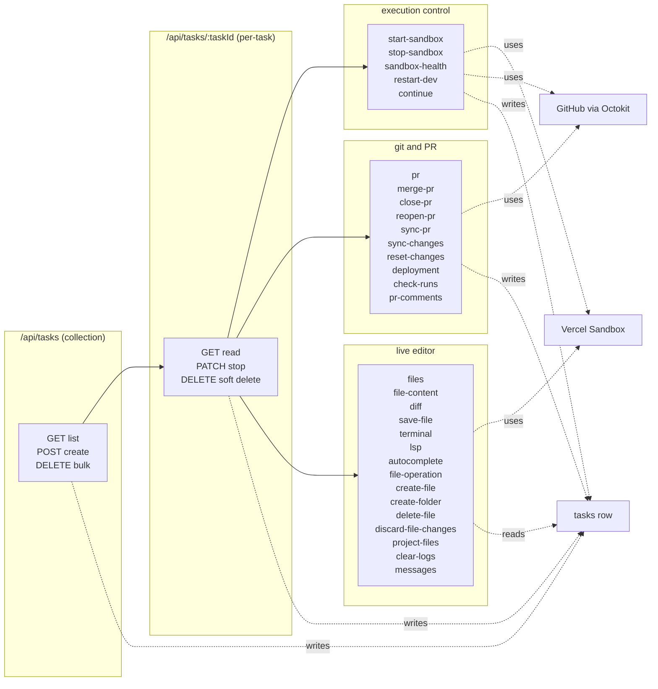

# Task API Surface

The `/api/tasks` namespace is the public HTTP surface that the React client uses to drive every phase of a coding-agent run — task creation, status polling, follow-up messages, sandbox lifecycle, PR creation/merge, in-browser file editing, terminal commands, and LSP-driven code intelligence. Every route is a Next.js App-Router file under `app/api/tasks/`, every task-scoped route shares the same auth/ownership preamble (`getServerSession` + `eq(userId, session.user.id)` + `isNull(deletedAt)`), and every route that touches the running sandbox shares a second preamble (`getSandbox(taskId)` then `Sandbox.get({ sandboxId, teamId, projectId, token })`). The pages most directly related to the topics below are [Task Lifecycle & Status Model](../concepts/tasks-lifecycle.md) for the row-level state machine, [Sandbox Lifecycle](../concepts/sandbox-lifecycle.md) for the in-VM phases and the reconnect pattern, and [Live Editor Surface](./live-editor-surface.md) for the client-side components the editor routes back.

This page is a catalogue, not a tour. Each route is named, its HTTP method is given, the body or query it accepts is described, and the auth/ownership/status-code story is stated. Sections are grouped by purpose, and the table at the end gives the full inventory in one place.

## Top-level shape



*Diagram: how the four route groups hang off the per-task routes, and which external systems each group talks to. The collection routes own the `tasks` row, the per-task routes own user-visible state transitions, the execution-control and editor routes talk to the live sandbox, and the PR/deployment routes talk to GitHub.*

## Auth, ownership, and soft-delete — the shared preamble

Every per-task route in `app/api/tasks/[taskId]/` runs the same opening block. The pattern is best illustrated by [`app/api/tasks/[taskId]/route.ts#L17-L37`](repo://app/api/tasks/[taskId]/route.ts#L17-L37), and is repeated in every editor, PR, and execution-control route:

```ts
const session = await getServerSession()
if (!session?.user?.id) {
  return NextResponse.json({ error: 'Unauthorized' }, { status: 401 })
}

const { taskId } = await params
const [task] = await db
  .select()
  .from(tasks)
  .where(and(eq(tasks.id, taskId), eq(tasks.userId, session.user.id), isNull(tasks.deletedAt)))
  .limit(1)

if (!task) {
  return NextResponse.json({ error: 'Task not found' }, { status: 404 })
}
```

Three failure modes are encoded in this block:

- `401 Unauthorized` — no session, or `session.user.id` is missing.
- `404 Task not found` — the task does not exist, belongs to a different user, **or** has been soft-deleted. A `deletedAt != null` row is deliberately indistinguishable from a row that never existed; the client cannot enumerate other users' tasks.
- `403 Forbidden` — almost never returned. The exception is the routes that do an explicit `if (task.userId !== session.user.id) return 403` instead of the implicit ownership filter: `start-sandbox` ([L32-L35](repo://app/api/tasks/[taskId]/start-sandbox/route.ts#L32-L35)), `stop-sandbox` ([L25-L28](repo://app/api/tasks/[taskId]/stop-sandbox/route.ts#L25-L28)), and `restart-dev` ([L27-L30](repo://app/api/tasks/[taskId]/restart-dev/route.ts#L27-L30)). These three are the only place in the namespace where the 403 is reachable; every other route collapses the 403 into a 404 so cross-user existence cannot be probed.

The `messages` route ([`messages/route.ts#L17-L26`](repo://app/api/tasks/[taskId]/messages/route.ts#L17-L26)) is the only one that enforces the ownership check with a `limit(1)` followed by `.length` — semantically identical, just verbose.

A handful of routes require a `sandboxId` to be useful. They return `400` with wording like `Sandbox not available` / `Task does not have an active sandbox` / `No sandbox found for this task` rather than 404, because the task itself is valid — only the runtime handle is missing. See the table below for the exact wording per route.

The collection routes (`/api/tasks` itself) have a different shape: `GET` returns only the calling user's tasks, `POST` requires a `checkRateLimit` pass before doing any work, and `DELETE` is a bulk hard-delete filtered by status. The per-task `DELETE` is a soft delete that sets `deletedAt`. Both kinds of delete are documented in [Task Lifecycle & Status Model → Soft delete vs. `status='stopped'`](../concepts/tasks-lifecycle.md#soft-delete-vs-statusstopped).

## Lifecycle routes

### `GET /api/tasks` — list the current user's tasks

[`app/api/tasks/route.ts#L26-L46`](repo://app/api/tasks/route.ts#L26-L46). Returns `{ tasks: Task[] }` ordered by `desc(createdAt)`. The query applies `eq(userId, session.user.id)` and `isNull(deletedAt)`, so other users' tasks and soft-deleted tasks are both invisible.

### `POST /api/tasks` — create a task and hand it to the worker

[`app/api/tasks/route.ts#L48-L250`](repo://app/api/tasks/route.ts#L48-L250). The only mutating collection endpoint. The handler is a thin shell that:

1. Verifies the session — `401` if missing.
2. Calls `checkRateLimit(session.user.id)` — `429` with `{ error, message, remaining, total, resetAt }` if the user has hit the daily cap.
3. Parses the body through `insertTaskSchema` (a Zod schema) — `400` if it does not match.
4. Inserts a row at `status='pending'`, `progress=0`, `logs=[]`. The `id` may be client-provided or generated with `generateId(12)`.
5. Schedules **three** `next/server` `after()` callbacks before returning. `after()` is the Next.js primitive that keeps the worker alive after the response is sent — it is the reason a multi-minute task can live inside a route handler:
   - [`L94-L155`](repo://app/api/tasks/route.ts#L94-L155) — AI branch name via `lib/utils/branch-name-generator.ts`, with `createFallbackBranchName(taskId)` on failure.
   - [`L158-L211`](repo://app/api/tasks/route.ts#L158-L211) — AI title via `lib/utils/title-generator.ts`, with `createFallbackTitle(prompt)` on failure.
   - [`L223-L243`](repo://app/api/tasks/route.ts#L223-L243) — the real worker: `processTaskWithTimeout(...)`.
6. Snapshots `userApiKeys`, `userGithubToken`, and `githubUser` before the `after()` block because `getServerSession` is not available once the callback is running asynchronously.
7. Resolves `maxDuration` from the request, falling back to `getMaxSandboxDuration(session.user.id)`.
8. Returns `{ task: newTask }` — the inserted row, with `status='pending'`.

The full `processTask` pipeline (branch-name wait, sandbox creation, agent execution, push, optional shutdown) is documented in [Runtime Flow: Request → Sandbox → Agent → Push](../architecture/runtime-flow.md) and [Sandbox Lifecycle](../concepts/sandbox-lifecycle.md). The `processTaskWithTimeout` wrapper ([`L252-L332`](repo://app/api/tasks/route.ts#L252-L332)) races the pipeline against a `setTimeout(maxDuration minutes)` reject; a timeout writes `status='error'` and a one-minute-before-deadline warning is scheduled and cleared on completion.

### `DELETE /api/tasks?action=completed,failed,stopped` — bulk hard delete

[`app/api/tasks/route.ts#L738-L815`](repo://app/api/tasks/route.ts#L738-L815). The only `DELETE` on the collection. The `action` query parameter is parsed against the allow-list `['completed', 'failed', 'stopped']` (any other value → `400`). The handler maps the input to a SQL `OR(...)` over the corresponding `tasks.status` values (`'failed'` maps to `status='error'`), filters by `userId`, runs `db.delete(tasks).where(...).returning()`, and returns `{ message, deletedCount }`. This is the only place in the codebase that hard-deletes rows from `tasks`; the per-task `DELETE` is a soft delete that sets `deletedAt`. See [Task Lifecycle & Status Model → `DELETE /api/tasks?action=...`](../concepts/tasks-lifecycle.md#delete-apitasksactioncompletedfailedstopped).

### `GET /api/tasks/:taskId` — read one task

[`app/api/tasks/[taskId]/route.ts#L15-L38`](repo://app/api/tasks/[taskId]/route.ts#L15-L38). Returns `{ task }` with the standard ownership + soft-delete filter. `404` if not found.

### `PATCH /api/tasks/:taskId` — stop a running task

[`app/api/tasks/[taskId]/route.ts#L40-L117`](repo://app/api/tasks/[taskId]/route.ts#L40-L117). The only `PATCH` body the route accepts today is `{ action: 'stop' }`. The handler:

1. Rejects with `400 Task can only be stopped when it is in progress` if `existingTask.status !== 'processing'`. This is the only place where the `PATCH` endpoint enforces a status precondition.
2. Writes `status='stopped'`, `error='Task was stopped by user'`, `completedAt = new Date()`, `updatedAt = new Date()`.
<!-- openwiki: broken internal link [../concepts/sandbox-lifecycle.md#path-a--patch-apitasksid-statusstopped] heading anchor "path-a--patch-apitasksid-statusstopped" does not exist in "../concepts/sandbox-lifecycle.md". Fix the href or restore the target, then delete this comment. -->
3. Calls `killSandbox(taskId)` from the in-memory registry — `lib/sandbox/sandbox-registry.ts` — and logs `success` / `error` accordingly. The DB write is the authoritative stop signal; the sandbox kill is best-effort and the worker's own `isTaskStopped` checkpoints are what actually unwind the agent. See [Sandbox Lifecycle → Path A — `PATCH /api/tasks/:id` (status=stopped)](../concepts/sandbox-lifecycle.md#path-a--patch-apitasksid-statusstopped) and [Task Lifecycle & Status Model → `PATCH /api/tasks/:taskId` with `action: 'stop'`](../concepts/tasks-lifecycle.md#patch-apitaskstaskid-with-action-stop).

Any other `body.action` returns `400 { error: 'Invalid action' }`.

### `DELETE /api/tasks/:taskId` — soft delete a single task

[`app/api/tasks/[taskId]/route.ts#L119-L150`](repo://app/api/tasks/[taskId]/route.ts#L119-L150). Sets `deletedAt = new Date()` and returns `{ message: 'Task deleted successfully' }`. The row stays in the database; every task-scoped read adds `isNull(tasks.deletedAt)` to its `WHERE` clause, so a soft-deleted task is invisible to `GET /:taskId`, all `PATCH`/`DELETE`/`POST` follow-ups, the editor routes, and the rate-limit counts.

### `POST /api/tasks/:taskId/continue` — rewind and follow up

[`app/api/tasks/[taskId]/continue/route.ts`](repo://app/api/tasks/[taskId]/continue/route.ts). The follow-up endpoint for any non-`pending` row. The handler is a `POST` that takes `{ message: string }`:

1. Verifies the session, runs `checkRateLimit`, and validates the message — `401` / `429` / `400` respectively.
2. Loads the task — `404` if missing or soft-deleted, `400 { error: 'Task does not have a branch to continue from' }` if `branchName` is null.
3. Persists the user's message into `taskMessages` and rewinds the row to `status='processing'`, `progress=0`, `completedAt=null`, `updatedAt=now()`.
4. Schedules the actual `continueTask(...)` work in `after()` and returns `{ success: true }`.

The `continueTask` worker tries to reconnect to the existing sandbox first if `task.keepAlive` and `task.sandboxId` are set ([`L169-L190`](repo://app/api/tasks/[taskId]/continue/route.ts#L169-L190)). On a `Sandbox.get` failure it falls back to `createSandbox(...)` with `preDeterminedBranchName: task.branchName` ([`L192-L243`](repo://app/api/tasks/[taskId]/continue/route.ts#L192-L243)) so the follow-up commit lands on the same branch as the original. The agent is invoked with `isResumedSandbox=true` and `currentTask.agentSessionId` (when present) so the CLI's `--resume` flag can pick up where the previous run left off. The `keepAlive` flag is re-consulted on the success path: a follow-up that ends with `pushChangesToBranch` either keeps the sandbox alive or calls `unregisterSandbox + shutdownSandbox`. The full flow is documented in [Workflow: Continue & Keep Alive](../workflows/follow-up-and-keep-alive.md).

### `GET /api/tasks/:taskId/messages` — read the conversation log

[`app/api/tasks/[taskId]/messages/route.ts#L7-L42`](repo://app/api/tasks/[taskId]/messages/route.ts#L7-L42). Returns `{ success: true, messages: TaskMessage[] }` ordered by `asc(createdAt)`. The ownership check uses a slightly different shape (`.limit(1)` then `.length` rather than `[0]`) but is semantically equivalent to the standard preamble. This is the endpoint the chat panel polls to render the `taskMessages` stream written by `processTask` and `continueTask` (`role: 'user' | 'agent'`).

### `POST /api/tasks/:taskId/clear-logs` — reset the `logs` JSONB column

[`app/api/tasks/[taskId]/clear-logs/route.ts`](repo://app/api/tasks/[taskId]/clear-logs/route.ts). The only mutating log route. Sets `tasks.logs = []` and returns `{ success: true, message: 'Logs cleared successfully' }`. The `logs` column is the append-only JSONB event stream written by `TaskLogger` ([`lib/utils/task-logger.ts`](repo://lib/utils/task-logger.ts)); clearing it is irreversible. See [Task Lifecycle & Status Model → The `logs` column](../concepts/tasks-lifecycle.md#the-logs-column).

## Execution-control routes

These four routes are the only places outside `processTask` / `continueTask` that can change the sandbox state. They are the user-facing counterparts to the worker's `unregisterSandbox` / `shutdownSandbox` calls.

### `POST /api/tasks/:taskId/start-sandbox` — rehydrate a keep-alive sandbox

[`app/api/tasks/[taskId]/start-sandbox/route.ts`](repo://app/api/tasks/[taskId]/start-sandbox/route.ts). The narrow second entry point for sandbox creation. The handler:

1. `401` if no session; `404` if the task does not exist; `403` if it belongs to another user.
2. Rejects with `400 'Keep-alive is not enabled for this task'` if `task.keepAlive` is false. The keep-alive flag is the only way the user can spin up a second sandbox; non-keep-alive tasks do not get this path.
3. If `task.sandboxId && task.sandboxUrl`, probes the existing sandbox with `Sandbox.get` + `runCommandInSandbox('echo', ['test'])`. A successful probe returns `400 'Sandbox is already running'`; a failure clears the DB columns via `unregisterSandbox` + `tasks` update so the route can create a fresh one.
4. Calls `Sandbox.create({ teamId, projectId, token, source: { type: 'git', url: task.repoUrl, revision: task.branchName, depth: 1 }, timeout: maxDurationMinutes * 60_000, ports: [port], runtime: 'node22', resources: { vcpus: 4 } })` — note the `source` field, which the `createSandbox` helper in `lib/sandbox/creation.ts` does not pass.
5. Configures git (`user.name` / `user.email` from `getGitHubUser()` with `Coding Agent` / `agent@example.com` fallbacks).
6. Probes for `package.json` and `requirements.txt`. Node projects run `detectPackageManager` + `installDependencies` with an `npm` fallback; Python projects bootstrap `pip` if needed and `pip install -r requirements.txt`.
7. If a `dev` script exists, detects Vite vs Next.js vs Next.js 16, writes `vite.sandbox.config.js` that calls `mergeConfig(userConfig, { server: { host: '0.0.0.0', strictPort: false, allowedHosts: undefined } })` for Vite, and starts the dev server detached with two `Writable` streams that prefix every line with `[SERVER]` (logged via `TaskLogger.info`). `sandboxUrl` is set to `sandbox.domain(port)` after a 3-second wait.

<!-- openwiki: broken internal link [./sandbox-orchestration.md#start-sandbox] heading anchor "start-sandbox" does not exist in "./sandbox-orchestration.md". Fix the href or restore the target, then delete this comment. -->
The full step list is also captured in [Sandbox Lifecycle → Phase 1 — Creation](../concepts/sandbox-lifecycle.md#phase-1--creation) and [Sandbox Orchestration](./sandbox-orchestration.md#start-sandbox).

### `POST /api/tasks/:taskId/stop-sandbox` — explicit sandbox teardown

[`app/api/tasks/[taskId]/stop-sandbox/route.ts`](repo://app/api/tasks/[taskId]/stop-sandbox/route.ts). The only place outside the worker that performs a full, deliberate shutdown of a kept-alive sandbox:

1. `401` / `404` / `403` per the standard preamble (with the explicit 403 ownership check).
2. Rejects with `400 'Sandbox is not active'` if `task.sandboxId` is null.
3. Reconnects with `Sandbox.get(...)`, calls `sandbox.stop()`, then `unregisterSandbox(taskId)`, and writes `sandboxId = null`, `sandboxUrl = null`, `updatedAt = now()`. The `keepAlive` flag is **not** consulted; the user has explicitly asked for the sandbox to die, so the route honors the request even if the task was opted into keep-alive.
4. Returns `{ success: true, message: 'Sandbox stopped successfully' }`. The task's `status` is left as-is — this endpoint only kills the VM, it does not transition the task to `stopped`.

See [Sandbox Lifecycle → Path C — Explicit endpoint (`POST /api/tasks/:taskId/stop-sandbox`)](../concepts/sandbox-lifecycle.md#path-c--explicit-endpoint-post-apitaskstaskidstop-sandbox).

### `GET /api/tasks/:taskId/sandbox-health` — is the dev server reachable?

[`app/api/tasks/[taskId]/sandbox-health/route.ts`](repo://app/api/tasks/[taskId]/sandbox-health/route.ts). The status endpoint the editor's "Sandbox is not running" alert polls. The handler returns one of five states by combining `Sandbox.get` with a 5-second `AbortSignal.timeout(5000)` GET against `task.sandboxUrl`:

| State | When |
| --- | --- |
| `not_found` | Task is missing or soft-deleted. The route is the only one that does **not** return an error JSON in this case — it returns `200 { status: 'not_found' }` so the client can render the right UI. |
| `not_available` | `sandboxId` or `sandboxUrl` is null (sandbox was never created, or has been stopped). |
| `stopped` | `Sandbox.get` threw, **or** the URL fetch returned `410` / `502` / a non-timeout network error. |
| `starting` | URL fetch returned `200` with an empty body, `404`, `503`, or timed out without throwing a non-timeout error. |
| `running` | URL fetch returned `200` with a non-empty body. |
| `error` | URL fetch returned a 5xx other than `502` / `503`. |

The auth check is the standard preamble (no explicit 403 path). A `410` is treated as a soft signal that the sandbox has been garbage-collected by Vercel — the client uses it to show the rehydration UI.

### `POST /api/tasks/:taskId/restart-dev` — kill and re-launch the dev server

[`app/api/tasks/[taskId]/restart-dev/route.ts`](repo://app/api/tasks/[taskId]/restart-dev/route.ts). Re-runs the dev-server start path against the running sandbox. The handler:

1. Reconnects via `Sandbox.get`; rejects with `400 'Sandbox is not active'` if `task.sandboxId` is null, `400 'No package.json found in sandbox'` if `package.json` is missing, `400 'No dev script found in package.json'` if `scripts.dev` is missing.
2. Kills the process bound to the dev port with `lsof -ti:<port> | xargs -r kill -9`, waits 1 second.
3. Re-applies the Vite (`vite.sandbox.config.js` + `--config vite.sandbox.config.js --host 0.0.0.0`) and Next.js 16 (`--webpack`) detection logic from `start-sandbox`.
4. Re-launches the dev server in detached mode with the same `[SERVER]` stream capture as `start-sandbox`.

Unlike `start-sandbox`, this route does not create a new sandbox — it reuses the existing one. There is no explicit 403 path; the auth uses `task.userId !== session.user.id`.

### `POST /api/tasks/:taskId/check-runs` — GitHub Checks for the branch head

[`app/api/tasks/[taskId]/check-runs/route.ts`](repo://app/api/tasks/[taskId]/check-runs/route.ts). Although this is grouped with the editor-adjacent reads, it is in fact a PR/CI surface — the route exports `dynamic = 'force-dynamic'` and:

1. `401` if no session, `404` if the task is missing, `400 'Task does not have a branch'` if `branchName` or `repoUrl` is missing.
2. Rejects with `400 'Invalid repository URL'` if the URL does not match `github.com/<owner>/<repo>`.
3. `401 'GitHub authentication required'` if the user has no connected GitHub account.
4. Calls `octokit.rest.repos.getBranch(...)`. A `404` returns `{ success: true, checkRuns: [] }` so a still-being-created branch does not show as an error.
5. Calls `octokit.rest.checks.listForRef({ ref: commitSha })` and returns a flattened shape: `{ id, name, status, conclusion, html_url, started_at, completed_at }`.

## GitHub PR and deployment routes

These are the routes that talk to GitHub on the user's behalf (via `getOctokit()`, which returns a per-user instance backed by the decrypted GitHub token from `lib/github/user-token.ts`). They share a precondition: `task.repoUrl` and (depending on the route) `task.prNumber` must be set, and the user's GitHub account must be connected (else `401 'GitHub authentication required'`).

### `POST /api/tasks/:taskId/pr` — open a pull request

[`app/api/tasks/[taskId]/pr/route.ts`](repo://app/api/tasks/[taskId]/pr/route.ts). Body is `{ title, body, baseBranch = 'main' }`. The handler:

1. `401` / `404` per the standard preamble.
2. `400 'PR title is required'` if `title` is empty; `400 'Task does not have repository or branch information'` if `repoUrl` or `branchName` is missing.
3. **Idempotency**: if `task.prUrl` is already set, the handler returns `200 { success: true, data: { prUrl, prNumber, alreadyExists: true } }` without calling the GitHub API. Re-opening the same task does not create a second PR.
4. Calls `createPullRequest({ repoUrl, branchName, title, body, baseBranch })` (from `lib/github/client.ts`).
5. On success, writes `prUrl`, `prNumber`, `prStatus='open'`, `updatedAt = now()` to the `tasks` row and returns `{ success: true, data: { prUrl, prNumber, task: updatedTask } }`. On failure, `500` with the upstream error message.

See [Workflow: Open Pull Request](../workflows/open-pull-request.md) for the broader context.

### `POST /api/tasks/:taskId/merge-pr` — squash-merge (default) the PR

[`app/api/tasks/[taskId]/merge-pr/route.ts`](repo://app/api/tasks/[taskId]/merge-pr/route.ts). Body is `{ commitTitle, commitMessage, mergeMethod = 'squash' }`. The handler:

1. `401` / `404` per the standard preamble.
2. `400 'Task does not have repository or PR information'` if `repoUrl` or `prNumber` is missing.
3. Calls `mergePullRequest({ repoUrl, prNumber, commitTitle, commitMessage, mergeMethod })`. The supported merge methods are whatever the GitHub REST API accepts — `merge`, `squash`, `rebase`.
<!-- openwiki: broken internal link [../concepts/sandbox-lifecycle.md#path-d--merge-triggered-teardown] heading anchor "path-d--merge-triggered-teardown" does not exist in "../concepts/sandbox-lifecycle.md". Fix the href or restore the target, then delete this comment. -->
4. After a successful merge, **stops the sandbox** via `Sandbox.get + sandbox.stop() + unregisterSandbox` (errors are logged and swallowed — the merge has already happened and is the source of truth). This is the only endpoint that combines a sandbox teardown with `completedAt`; the `keepAlive` flag is intentionally not consulted. See [Sandbox Lifecycle → Path D — Merge-triggered teardown](../concepts/sandbox-lifecycle.md#path-d--merge-triggered-teardown).
5. Writes `prStatus='merged'`, `prMergeCommitSha = result.sha || null`, `sandboxId = null`, `sandboxUrl = null`, `completedAt = new Date()`, `updatedAt = new Date()` to the `tasks` row.
6. Returns `{ success: true, data: { merged, message, sha } }`.

### `POST /api/tasks/:taskId/close-pr` and `POST /api/tasks/:taskId/reopen-pr` — state-only PR mutations

[`close-pr/route.ts`](repo://app/api/tasks/[taskId]/close-pr/route.ts) and [`reopen-pr/route.ts`](repo://app/api/tasks/[taskId]/reopen-pr/route.ts). Two thin wrappers over `octokit.rest.pulls.update({ state: 'closed' | 'open' })`. Both require `repoUrl` and `prNumber` (`400` otherwise) and a connected GitHub account (`401 'GitHub authentication required.'` otherwise). Upstream errors are translated to `404 { error: 'Pull request not found' }` / `403 { error: 'Permission denied. Check repository access' }` when the SDK reports matching status codes; everything else collapses to `500`. On success, the handler writes `prStatus='closed'` or `prStatus='open'` and returns `{ success: true, message }`.

### `POST /api/tasks/:taskId/sync-pr` — pull the PR status from GitHub

[`app/api/tasks/[taskId]/sync-pr/route.ts`](repo://app/api/tasks/[taskId]/sync-pr/route.ts). The route the UI uses to refresh a task card after the user has been away. The handler calls `getPullRequestStatus({ repoUrl, prNumber })`, validates the response, and writes `prStatus`, `prMergeCommitSha`, and `updatedAt`. If the new status is `'merged'`, `completedAt = new Date()` is also written — this is one of the three places `completedAt` is set (alongside `PATCH` stop and the merge endpoint itself). The response is `{ success: true, data: { status, mergeCommitSha } }`.

### `POST /api/tasks/:taskId/sync-changes` — commit and push local edits

[`app/api/tasks/[taskId]/sync-changes/route.ts`](repo://app/api/tasks/[taskId]/sync-changes/route.ts). The "Sync" button on the live editor's bottom bar. The handler reconnects to the sandbox (with the standard 400 on missing `sandboxId` / `branchName`) and runs four git operations in `cwd: PROJECT_DIR`:

1. `git add .`.
2. `git status --porcelain` to detect any changes — if the output is empty, returns `{ success: true, committed: false, pushed: false, message: 'No changes to sync' }` without committing.
3. `git commit -m <commitMessage || 'Sync local changes'>`.
4. `git push origin <branchName>`.

Each step returns `500` with the captured `stderr` on failure. A `410` from the SDK (sandbox expired) is mapped to `410 { success: false, error: 'Sandbox is not running' }` so the client can prompt the user to rehydrate.

### `POST /api/tasks/:taskId/reset-changes` — discard local edits and reset to remote

[`app/api/tasks/[taskId]/reset-changes/route.ts`](repo://app/api/tasks/[taskId]/reset-changes/route.ts). The "Reset" button, which is the destructive counterpart to `sync-changes`. The handler:

1. `git status --porcelain` to detect local changes. If present, `git add .` then `git commit -m <commitMessage || 'Checkpoint before reset'>` so the changes are recoverable from the local branch (this is the only thing keeping "Reset" from being catastrophic).
2. `git ls-remote --heads origin <branchName>` to check whether the remote branch exists.
3. If yes, `git fetch origin <branchName>` and `git reset --hard FETCH_HEAD`.
4. If no, `git reset --hard HEAD`.
5. `git clean -fd` to remove untracked files and directories. A failure here is logged but not surfaced to the client — the reset itself is the operation that matters.

The response is `{ success: true, message, hadLocalChanges }` so the UI can show a confirmation. Like `sync-changes`, a `410` maps to a 410 response.

### `GET /api/tasks/:taskId/deployment` — find the Vercel preview URL

[`app/api/tasks/[taskId]/deployment/route.ts`](repo://app/api/tasks/[taskId]/deployment/route.ts). The deployment lookup has three fallback strategies, in order:

1. **Cache.** If `task.previewUrl` is already set, return it (and run it through `convertFeedbackUrlToDeploymentUrl`, which rewrites `vercel.live/open-feedback/<id>` to `https://<id>`).
2. **GitHub Checks.** `octokit.rest.checks.listForRef` for the branch head, looking for an `app.slug === 'vercel'` check named `Vercel Preview Comments` or `Vercel`. The route extracts the first `https?://[^\s\)\]<]+\.vercel\.app` URL from the check's `output.summary` or `output.text` and stores it in `task.previewUrl`.
3. **GitHub Deployments.** `octokit.rest.repos.listDeployments` filtered to `environment === 'Preview' | 'preview'` or descriptions containing "vercel", then `listDeploymentStatuses` for the most recent `state === 'success'` status. The first `environment_url` / `target_url` is stored in `task.previewUrl`.
4. **Commit statuses.** `octokit.rest.repos.listCommitStatusesForRef` for the branch head, looking for any `context` containing "vercel" with `state === 'success'`.

If none of these find a deployment, the response is `{ success: true, data: { hasDeployment: false, message: 'No successful Vercel deployment found' } }`. The handler is deliberately non-throwing: a 404 from GitHub returns the same `hasDeployment: false` shape rather than an error, so a missing or still-being-created branch does not show as a failure.

### `GET /api/tasks/:taskId/pr-comments` — read PR conversation + review comments

[`app/api/tasks/[taskId]/pr-comments/route.ts`](repo://app/api/tasks/[taskId]/pr-comments/route.ts). Returns `{ success: true, comments: [...] }` sorted by `created_at` ascending. The route issues two GitHub calls in parallel via `Promise.all`:

- `octokit.rest.issues.listComments({ issue_number: prNumber })` — general PR conversation comments.
- `octokit.rest.pulls.listReviewComments({ pull_number: prNumber })` — line-anchored review comments.

The two arrays are flattened into one shape `{ id, user: { login, avatar_url }, body, created_at, html_url }`. The endpoint requires `prNumber` and `repoUrl`; missing either returns `400`.

## Live-editor routes

These routes back the in-sandbox editor surface — the file tree, the Monaco editor, the diff viewer, the terminal, the autocomplete, and the LSP bridge. They are documented in detail in [Live Editor Surface](./live-editor-surface.md). The shape they share is: `getServerSession` + `getServerSession + ownership + isNull(deletedAt) + task.sandboxId` + `getSandbox(taskId) ?? Sandbox.get({ sandboxId, teamId, projectId, token })` + a single `sandbox.runCommand(...)` or `sandbox.runCommand(...) + read stdout`. They are listed here in the same order they appear in [Live Editor Surface](./live-editor-surface.md).

### `GET /api/tasks/:taskId/files?mode=...` — file-tree listing

[`app/api/tasks/[taskId]/files/route.ts`](repo://app/api/tasks/[taskId]/files/route.ts). The `mode` query parameter selects the source of truth:

| Mode | Source | When the sandbox is missing |
| --- | --- | --- |
| `local` | `git status --porcelain` + `git diff --numstat origin/<branch>` (or `HEAD` if the remote branch does not exist), with `wc -l` for untracked files | `410 Sandbox is not running` (and the DB columns are cleared on a 410 from the SDK) |
| `all-local` | `find . -type f` joined with `git status --porcelain` to color new/modified entries | `410 Sandbox is not running` (same DB cleanup) |
| `all` | `octokit.rest.git.getTree` recursive on `task.branchName` | n/a (uses GitHub) |
| `remote` (default) | `octokit.rest.repos.compareCommits` against `main` (with a `master` fallback) | n/a (uses GitHub) |

All four modes end with a recursive `addToFileTree` pass that produces a nested `{ children: { ... } }` tree for the file browser, and every response sets `Cache-Control: no-store, no-cache, must-revalidate` because the listing changes frequently. The `local` modes are the only two editor routes that proactively clear the DB columns on a 410 — the rest leave the cleanup to the next `start-sandbox` call.

### `GET /api/tasks/:taskId/file-content?filename=...&mode=...` — file body

[`app/api/tasks/[taskId]/file-content/route.ts`](repo://app/api/tasks/[taskId]/file-content/route.ts). The `'all'` / `'all-local'` counterpart to `diff`. The contract is `{ data: { filename, oldContent, newContent, language, isBinary, isImage, isBase64? } }`:

- `mode=local` — `oldContent` from `octokit.repos.getContent` on `task.branchName`, `newContent` from `cat` in the sandbox.
- Default — `oldContent = ''` and `newContent` from `octokit.repos.getContent` on `task.branchName` (with a `sandbox.cat` fallback for files that exist locally but have not been pushed yet). Files containing `/node_modules/` are always read from the sandbox (GitHub does not store them), and `FileEditor` renders them with an amber "Read-only: node_modules file" banner.
- Image files return `isBase64: true` plus the base64 payload, wrapped in `data:<mime>;base64,...` by the client.
- Non-image binary files short-circuit with `isBinary: true` and empty content.

The same `getLanguageFromFilename` map (`ts`, `tsx`, `py`, `json`, `md`, …) exists here as in `diff/route.ts` and must be kept in sync — the server's language ID is what Monaco consumes.

### `GET /api/tasks/:taskId/diff?filename=...&mode=...` — file diff payload

[`app/api/tasks/[taskId]/diff/route.ts`](repo://app/api/tasks/[taskId]/diff/route.ts). The only route with both a default (PR) and a `mode=local` branch:

- **Default.** When `task.prNumber` is set, the route calls `octokit.rest.pulls.get` and uses `pr.base.sha` / `pr.head.sha` as the base/head refs (so the diff is anchored to PR creation time, not to current `main`). Without a `prNumber`, the base ref is `'main'` with a `'master'` fallback. Each side is fetched with `octokit.rest.repos.getContent`; 404s on a base ref are tolerated (the file may be new). If the PR is merged and `task.prMergeCommitSha` is empty, the handler writes the PR's `merge_commit_sha` back to the DB.
- **`mode=local`.** The handler runs `git fetch origin <branchName>` (errors are tolerated — the branch may never have been pushed), then `git rev-parse --verify origin/<branchName>`. If the remote branch is missing, the comparison is against `HEAD`; if it is present, the route runs `git diff origin/<branchName> -- <file>` for the diff text and `git show origin/<branchName>:<file>` / `cat <file>` for the old and new content. A `410` from the SDK maps to `410 { error: 'Sandbox is not running' }`.

### `POST /api/tasks/:taskId/save-file` — write a file to the sandbox

[`app/api/tasks/[taskId]/save-file/route.ts`](repo://app/api/tasks/[taskId]/save-file/route.ts). Writes a file via `sh -c "echo '<base64>' | base64 -d > '<escaped-filename>'"` in `cwd: PROJECT_DIR`. The content is base64-encoded and the filename is shell-escaped with the standard `'\''` trick so that special characters in either input cannot break out of the command. The base64 path exists specifically because heredocs (`cat > file << EOF`) would let a content like `EOF\nrm -rf /\nEOF` redefine the terminator — the comment in the source is explicit on this. There is no path-traversal guard; the file browser only ever calls this with a path the user selected from the tree, and the `sandboxId` reconnect check is the gate against calling into a torn-down VM.

### `POST /api/tasks/:taskId/terminal` — run a shell command

[`app/api/tasks/[taskId]/terminal/route.ts`](repo://app/api/tasks/[taskId]/terminal/route.ts). The terminal endpoint. The handler reconnects to the sandbox (returns `400 'No sandbox found for this task'` if `task.sandboxId` is null, `500 'Sandbox credentials not configured'` if the `SANDBOX_VERCEL_*` env vars are missing) and runs the user's command via `sh -c <command>` in `cwd: PROJECT_DIR`. The response is `{ success: true, data: { exitCode, stdout, stderr } }`. `await result.stdout()` and `await result.stderr()` are wrapped in `try/catch` so a stream that throws does not surface as a 500.

### `POST /api/tasks/:taskId/lsp` — TypeScript language service over HTTP

[`app/api/tasks/[taskId]/lsp/route.ts`](repo://app/api/tasks/[taskId]/lsp/route.ts). The single editor route that depends on a different transport. The route exports `runtime = 'nodejs'` and `maxDuration = 60` so the 60-second Vercel function budget is allocated to a single in-flight LSP request. The handler reconnects to the sandbox and switches on the `method` field:

- `textDocument/definition` — the full pipeline: build an `.lsp-helper.mjs` script with the requested `filename` and `(line, character)` baked in as string literals, write it to the sandbox, run it with `node`, parse the trailing `JSON.stringify(...)` from stdout, `rm` the helper, and return `{ definitions: [{ uri: 'file://<path>', range: { start, end } }] }`. The helper uses `ts.createLanguageService` with a host backed by `ts.sys.readFile` / `fileExists` / `directoryExists` and `ts.parseJsonConfigFileContent` (walking up from `process.cwd()` to find the closest `tsconfig.json`).
- `textDocument/hover` and `textDocument/completion` — currently return `{ hover: null }` and `{ completions: [] }` respectively; the same switch shape is in place for the planned `vscode-jsonrpc` over WebSocket implementation.
- Any other method → `400 { error: 'Unsupported LSP method' }`.

### `POST /api/tasks/:taskId/autocomplete` — terminal tab completion

[`app/api/tasks/[taskId]/autocomplete/route.ts`](repo://app/api/tasks/[taskId]/autocomplete/route.ts). Body is `{ partial, cwd }`. The handler:

1. Reconnects to the sandbox and asks it for its real `pwd` via `sh -c 'pwd'`. The request-side `cwd` is only used if the `pwd` query fails.
2. Splits `partial` on whitespace, takes the last token, and resolves the prefix to complete and the directory to scan. Absolute paths use the path part directly, `~/...` is expanded to `/home/vercel-sandbox/...`, relative paths are joined with the resolved `cwd`.
3. Runs `cd <escaped-dir> 2>/dev/null && ls -1ap 2>/dev/null` in the sandbox. The directory is shell-escaped with the same `'\''` trick as `save-file`. The `-F` flag turns directories into `name/`, which the client uses to set `isDirectory`.
4. Returns `{ completions: [{ name, isDirectory }], prefix }` filtered by case-insensitive `startsWith(prefix)`.

### `POST /api/tasks/:taskId/file-operation` — copy / move inside the sandbox

[`app/api/tasks/[taskId]/file-operation/route.ts`](repo://app/api/tasks/[taskId]/file-operation/route.ts). Body is `{ operation: 'copy' | 'cut', sourceFile, targetPath? }`. The handler:

- `copy` → `cp -r <sourceFile> <targetPath || ./<basename>>` in `cwd: PROJECT_DIR`.
- `cut` → `mv <sourceFile> <targetPath || ./<basename>>`.
- Anything else → `400 { success: false, error: 'Invalid operation' }`.

The `targetDir` defaults to `'.'` and the target file is built as `targetPath + '/' + sourceFile.split('/').pop()`. Failures map to `500 { success: false, error: 'Failed to copy file' | 'Failed to move file' }` with the captured `stderr` logged but not surfaced.

### `POST /api/tasks/:taskId/create-file` — `touch` a new file

[`app/api/tasks/[taskId]/create-file/route.ts`](repo://app/api/tasks/[taskId]/create-file/route.ts). Body is `{ filename }`. The handler splits the path on `/`, runs `mkdir -p <parent>` if the path has more than one segment, then `touch <filename>` — both in `cwd: PROJECT_DIR`. A `410` from the SDK maps to `410 { success: false, error: 'Sandbox is not running' }`.

### `POST /api/tasks/:taskId/create-folder` — `mkdir -p` a directory

[`app/api/tasks/[taskId]/create-folder/route.ts`](repo://app/api/tasks/[taskId]/create-folder/route.ts). Body is `{ foldername }`. Single `mkdir -p <foldername>` in `cwd: PROJECT_DIR`. Same 410 mapping as `create-file`.

### `DELETE /api/tasks/:taskId/delete-file` — `rm` a file

[`app/api/tasks/[taskId]/delete-file/route.ts`](repo://app/api/tasks/[taskId]/delete-file/route.ts). Body is `{ filename }`. Single `rm <filename>` in `cwd: PROJECT_DIR`. Same 410 mapping as `create-file`.

### `POST /api/tasks/:taskId/discard-file-changes` — revert one file

[`app/api/tasks/[taskId]/discard-file-changes/route.ts`](repo://app/api/tasks/[taskId]/discard-file-changes/route.ts). Body is `{ filename }`. The handler probes `git ls-files <path>` to distinguish tracked from untracked files:

- Tracked → `git checkout HEAD -- <path>` to revert the file to its last-committed state.
- Untracked → `rm <path>` to delete the file.

The response message is `'Changes discarded successfully'` or `'New file deleted successfully'`. Same 410 mapping as `create-file`.

### `GET /api/tasks/:taskId/project-files` — pre-load all project files for Monaco (legacy)

[`app/api/tasks/[taskId]/project-files/route.ts`](repo://app/api/tasks/[taskId]/project-files/route.ts). Returns `{ success: true, files: [] }`. The comment in the route is explicit: with the LSP bridge running in the sandbox, Monaco no longer pre-loads project files — the LSP has direct access to `node_modules` and the `tsconfig.json` graph and resolves types on demand. The "too many open files" error that the previous implementation hit is now sidestepped. The route is kept because the client still calls it; the response is the empty `files` array.

## The sandbox reconnect preamble

Every route that talks to a running sandbox — `start-sandbox` and `stop-sandbox` (which use `Sandbox.get` directly), and `sandbox-health`, `restart-dev`, `terminal`, `lsp`, `autocomplete`, `files`, `file-content`, `diff`, `save-file`, `create-file`, `create-folder`, `delete-file`, `discard-file-changes`, `reset-changes`, `sync-changes`, `file-operation`, `project-files` — opens with the same five lines, illustrated by [`save-file/route.ts#L41-L69`](repo://app/api/tasks/[taskId]/save-file/route.ts#L41-L69):

```ts
let sandbox = getSandbox(taskId)
if (!sandbox) {
  try {
    sandbox = await Sandbox.get({
      sandboxId: task.sandboxId,
      teamId: process.env.SANDBOX_VERCEL_TEAM_ID!,
      projectId: process.env.SANDBOX_VERCEL_PROJECT_ID!,
      token: process.env.SANDBOX_VERCEL_TOKEN!,
    })
  } catch (error) {
    return NextResponse.json({ error: 'Failed to connect to sandbox' }, { status: 500 })
  }
}
if (!sandbox) {
  return NextResponse.json({ error: 'Sandbox not available' }, { status: 400 })
}
```

<!-- openwiki: broken internal link [../concepts/sandbox-lifecycle.md#persistence-model] heading anchor "persistence-model" does not exist in "../concepts/sandbox-lifecycle.md". Fix the href or restore the target, then delete this comment. -->
<!-- openwiki: broken internal link [../integrations/vercel-sandbox.md#reconnect-pattern-sandboxget] heading anchor "reconnect-pattern-sandboxget" does not exist in "../integrations/vercel-sandbox.md". Fix the href or restore the target, then delete this comment. -->
The first lookup (`getSandbox(taskId)`) is the in-memory `Map<taskId, Sandbox>` populated by `registerSandbox` during the original worker execution. The second (`Sandbox.get({ sandboxId })`) is the cross-execution fallback that works after the worker has returned. The dual persistence model is documented in detail in [Sandbox Lifecycle → Persistence model](../concepts/sandbox-lifecycle.md#persistence-model) and [Vercel Sandbox → Reconnect pattern](../integrations/vercel-sandbox.md#reconnect-pattern-sandboxget). A `Sandbox.get` failure is fatal in every editor route: there is no shared retry helper, and the client is expected to call `start-sandbox` to rehydrate.

## Status code conventions

The full table of HTTP status codes that the namespace can return:

| Status | Where | Meaning |
| --- | --- | --- |
| `200` | All `GET`s, all `POST`s with `success: true`, `DELETE /api/tasks/:taskId` (soft), `DELETE /api/tasks?action=...` (bulk) | Successful read or mutation |
| `400` | `POST /api/tasks` (Zod parse), `POST /api/tasks/:taskId/continue` (missing message / no branch), all `POST` editor routes (missing filename / content / sandbox), all `POST` PR routes (missing repoUrl / prNumber / title), `start-sandbox` (no keep-alive), `stop-sandbox` (no sandbox), `restart-dev` (no package.json / dev script), `sandbox-health` and `lsp` (unsupported method) | Bad request or missing precondition |
| `401` | Every route when `getServerSession` returns no user, plus `files` / `file-content` / `diff` / `check-runs` / `pr` / `pr-comments` / `close-pr` / `reopen-pr` when the user's GitHub account is not connected | No session, or no connected GitHub account for routes that need Octokit |
| `403` | `start-sandbox`, `stop-sandbox`, `restart-dev` when `task.userId !== session.user.id` | Explicit ownership mismatch (every other route collapses this to 404) |
| `404` | Every per-task route when the task is missing or soft-deleted; `file-content` when the file is not in branch or sandbox; `close-pr` / `reopen-pr` when GitHub returns 404 for the PR | Task / file / PR not found |
| `410` | `files?mode=local|all-local`, `save-file` / `create-file` / `create-folder` / `delete-file` / `discard-file-changes` / `reset-changes` / `sync-changes` / `diff?mode=local` when the SDK reports the sandbox has expired | Sandbox is gone — the client should call `start-sandbox` |
| `429` | `POST /api/tasks`, `POST /api/tasks/:taskId/continue` | Daily message cap hit |
| `500` | Every route's catch block | Internal error (with a route-specific `error` string) |

## Full inventory

The complete list of routes, grouped by purpose. The "Auth / ownership" column encodes the preamble each route uses; the "Failure modes" column lists the non-200 statuses it can return beyond the standard 404-on-missing-task.

| Route | Method | Purpose | Auth / ownership | Failure modes |
| --- | --- | --- | --- | --- |
| `/api/tasks` | `GET` | List current user's tasks | session + userId + isNull(deletedAt) | 401 |
| `/api/tasks` | `POST` | Create a task and start the worker | session + checkRateLimit + insertTaskSchema | 401, 429, 400, 500 |
| `/api/tasks` | `DELETE` | Bulk hard delete by status | session + userId | 401, 400, 500 |
| `/api/tasks/:taskId` | `GET` | Read one task | session + userId + isNull(deletedAt) | 401, 404, 500 |
| `/api/tasks/:taskId` | `PATCH` | Stop a running task (`{ action: 'stop' }`) | session + userId + isNull(deletedAt) | 401, 404, 400, 500 |
| `/api/tasks/:taskId` | `DELETE` | Soft delete (`deletedAt = now()`) | session + userId + isNull(deletedAt) | 401, 404, 500 |
| `/api/tasks/:taskId/messages` | `GET` | Read the `taskMessages` log | session + userId + isNull(deletedAt) | 401, 404, 500 |
| `/api/tasks/:taskId/clear-logs` | `POST` | Reset `tasks.logs = []` | session + userId + isNull(deletedAt) | 401, 404, 500 |
| `/api/tasks/:taskId/continue` | `POST` | Follow-up message; rewind the row and re-run the agent | session + checkRateLimit + userId + isNull(deletedAt) | 401, 429, 400, 404, 500 |
| `/api/tasks/:taskId/start-sandbox` | `POST` | Rehydrate a keep-alive sandbox | session + explicit 403 ownership check | 401, 403, 404, 400 (no keep-alive / already running), 500 |
| `/api/tasks/:taskId/stop-sandbox` | `POST` | Tear down a kept-alive sandbox | session + explicit 403 ownership check | 401, 403, 404, 400 (no sandbox), 500 |
| `/api/tasks/:taskId/sandbox-health` | `GET` | Probe whether the dev server is reachable | session + userId + isNull(deletedAt) | 401, 200 with `status` (not_found / not_available / stopped / starting / running / error) |
| `/api/tasks/:taskId/restart-dev` | `POST` | Kill and re-launch the dev server | session + explicit 403 ownership check | 401, 403, 404, 400 (no sandbox / no package.json / no dev script), 500 |
| `/api/tasks/:taskId/pr` | `POST` | Open a pull request | session + userId + isNull(deletedAt) + connected GitHub | 401, 404, 400 (no title / no repo), 500 |
| `/api/tasks/:taskId/merge-pr` | `POST` | Merge the PR (default `squash`) | session + userId + isNull(deletedAt) | 401, 404, 400 (no PR), 500 |
| `/api/tasks/:taskId/close-pr` | `POST` | Close the PR | session + userId + isNull(deletedAt) + connected GitHub | 401, 404, 400, 403 (upstream), 500 |
| `/api/tasks/:taskId/reopen-pr` | `POST` | Reopen the PR | session + userId + isNull(deletedAt) + connected GitHub | 401, 404, 400, 403 (upstream), 500 |
| `/api/tasks/:taskId/sync-pr` | `POST` | Pull the PR status from GitHub | session + userId + isNull(deletedAt) | 401, 404, 400, 500 |
| `/api/tasks/:taskId/sync-changes` | `POST` | `git add` + `git commit` + `git push` | session + userId + isNull(deletedAt) + sandbox | 401, 404, 400 (no sandbox / no branch), 500, 410 |
| `/api/tasks/:taskId/reset-changes` | `POST` | Commit (optional) and `git reset --hard` to remote | session + userId + isNull(deletedAt) + sandbox | 401, 404, 400, 500, 410 |
| `/api/tasks/:taskId/check-runs` | `GET` | GitHub Checks for the branch head | session + userId + isNull(deletedAt) + connected GitHub | 401, 404, 400, 500 |
| `/api/tasks/:taskId/pr-comments` | `GET` | Issue + review comments on the PR | session + userId + isNull(deletedAt) + connected GitHub | 401, 404, 400, 500 |
| `/api/tasks/:taskId/deployment` | `GET` | Vercel preview URL via Checks / Deployments / commit statuses | session + userId + isNull(deletedAt) | 401, 404, 200 with `hasDeployment: false` |
| `/api/tasks/:taskId/files` | `GET` | File-tree listing (`mode=local|all-local|all|remote`) | session + userId + isNull(deletedAt) + (sandbox for local modes) + connected GitHub for `remote`/`all` | 401, 404, 400, 500, 410 |
| `/api/tasks/:taskId/file-content` | `GET` | File body for a path | session + userId + isNull(deletedAt) + connected GitHub + sandbox (for `node_modules`) | 401, 404, 400, 500 |
| `/api/tasks/:taskId/diff` | `GET` | File diff payload (`mode=local|undefined`) | session + userId + isNull(deletedAt) + connected GitHub (default) / sandbox (mode=local) | 401, 404, 400, 500, 410 |
| `/api/tasks/:taskId/save-file` | `POST` | Write a file to the sandbox (base64-encoded, shell-escaped) | session + userId + isNull(deletedAt) + sandbox | 401, 404, 400, 500 |
| `/api/tasks/:taskId/terminal` | `POST` | Run a shell command in the sandbox | session + userId + isNull(deletedAt) + sandbox | 401, 404, 400, 500 |
| `/api/tasks/:taskId/lsp` | `POST` | TypeScript language service bridge (definition / hover / completion) | session + userId + sandbox | 401, 404, 400, 500 |
| `/api/tasks/:taskId/autocomplete` | `POST` | Tab completion via `ls -1ap` in the sandbox | session + userId + isNull(deletedAt) + sandbox | 401, 404, 400, 500 |
| `/api/tasks/:taskId/file-operation` | `POST` | `cp -r` or `mv` inside the sandbox | session + userId + isNull(deletedAt) + sandbox | 401, 404, 400, 500 |
| `/api/tasks/:taskId/create-file` | `POST` | `mkdir -p <parent> && touch` a new file | session + userId + isNull(deletedAt) + sandbox | 401, 404, 400, 500, 410 |
| `/api/tasks/:taskId/create-folder` | `POST` | `mkdir -p` a directory | session + userId + isNull(deletedAt) + sandbox | 401, 404, 400, 500, 410 |
| `/api/tasks/:taskId/delete-file` | `DELETE` | `rm` a file | session + userId + isNull(deletedAt) + sandbox | 401, 404, 400, 500, 410 |
| `/api/tasks/:taskId/discard-file-changes` | `POST` | `git checkout HEAD --` (tracked) or `rm` (untracked) | session + userId + isNull(deletedAt) + sandbox | 401, 404, 400, 500, 410 |
| `/api/tasks/:taskId/project-files` | `GET` | Pre-load all project files for Monaco (legacy — always returns `{ files: [] }`) | session + userId + isNull(deletedAt) + sandbox | 401, 404, 400, 500 |

## Security and redaction notes

- **No decrypted secrets are returned.** The `connectors.env` and `connectors.oauthClientSecret` columns are decrypted only in the worker (`app/api/tasks/route.ts` and `app/api/tasks/[taskId]/continue/route.ts`) to build the `mcpServers` payload, never in an API response. The `keys` table is similarly server-side only. See [Encryption & Redaction](../concepts/encryption-and-redaction.md) for the full story.
- **`save-file` and `autocomplete` use shell escaping deliberately.** The `save-file` comment explains the heredoc-vs-base64 trade-off; `autocomplete` shell-escapes the directory with the same `'\''` trick.
- **`file-operation` does not validate `sourceFile` / `targetPath` paths.** A user with a live sandbox can `cp -r` or `mv` any path the sandbox process can read. The sandbox is per-task and short-lived, so this is treated as the user's own scratch space, not a cross-tenant attack surface.
- **No optimistic concurrency on `save-file`.** The editor always wins; `discard-file-changes` is the only sanctioned revert, and it operates on `HEAD` rather than the last edit.
- **The user's GitHub token is never returned to the client.** All GitHub calls go through the per-user `getOctokit()` helper, which builds a fresh Octokit instance from the decrypted token on each request. The token stays in the server process.

## Extension points

- **New lifecycle phase.** Add a new `after()` callback in `POST /api/tasks` and a corresponding checkpoint in `processTask` (the pattern is `waitForBranchName` → `tasks.branchName`). Persist any new artifacts on the `tasks` row and update the rate-limit / soft-delete / status transition tables in [Task Lifecycle & Status Model](../concepts/tasks-lifecycle.md).
- **New editor route.** Add a sibling under `app/api/tasks/[taskId]/<verb>/route.ts`, copy the `getServerSession + ownership + sandboxId + reconnect preamble` shape, and update [Live Editor Surface](./live-editor-surface.md) so the page that documents the editor surface stays accurate. The 410-vs-clear-DB-columns split (used by `files?mode=local|all-local` vs. every other editor route) is the convention to follow for read-vs-write routes.
- **New PR / deployment operation.** Add the route under `app/api/tasks/[taskId]/<verb>/route.ts` with the standard `userId + isNull(deletedAt)` preamble, an `octokit.rest.<endpoint>({ owner, repo, ... })` call, and an error-translation layer for upstream `404` / `403` / `5xx`. Update [Workflow: Open Pull Request](../workflows/open-pull-request.md) if the operation is part of the PR flow.
- **New file-tree action.** Add a `DropdownMenuItem` to the file browser's context menu and a new server route. Follow the same shell-injection-aware patterns as `save-file` and `autocomplete` (base64 encode content, escape paths with `'\''`).
- **New LSP method.** Add a new `case 'textDocument/...':` to the switch in [`lsp/route.ts#L78-L230`](repo://app/api/tasks/[taskId]/lsp/route.ts#L78-L230). `textDocument/definition` is the reference implementation for the helper-script pattern; `textDocument/hover` and `textDocument/completion` are stubs ready to be filled in. If a method needs more than `ts.createLanguageService` can give, switch to the `vscode-jsonrpc + typescript-language-server over ws` model — the dependencies are already in [`package.json`](repo://package.json).
