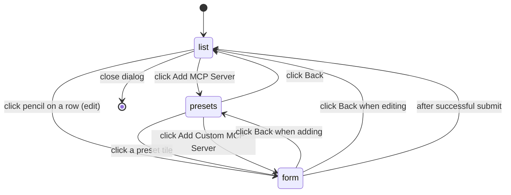

# Add an MCP Server

This page follows a single Model Context Protocol server from the moment a user clicks **Add MCP Server** in the task-form toolbar all the way to the moment its secrets are decrypted inside the Vercel sandbox and translated into the agent CLI's native MCP registration command. It is the workflow complement to [Connectors (MCP Servers)](../systems/connectors-mcp.md) (which describes the storage and read paths) and [Agent System & MCP Connectors](../concepts/agent-system.md) (which describes the dispatcher and per-CLI translation contract).

The two endpoints of the workflow — the form-submit side and the agent-run side — are joined by a row in the `connectors` table whose `oauthClientSecret` and `env` columns are encrypted at rest with AES-256-CBC and only decrypted at the two read sites (`GET /api/connectors` and the task worker).

## Overview

```mermaid
sequenceDiagram
    autonumber
    participant U as User
    participant UI as ConnectorDialog<br/>components/connectors/manage-connectors.tsx
    participant SA as createConnector<br/>lib/actions/connectors.ts
    participant CR as lib/crypto.ts<br/>AES-256-CBC
    participant DB as connectors table<br/>lib/db/schema.ts#L184-L211
    participant TW as Task worker<br/>app/api/tasks/route.ts
    participant CR2 as lib/crypto.ts<br/>decrypt
    participant DSP as executeAgentInSandbox<br/>lib/sandbox/agents/index.ts
    participant W as Per-CLI wrapper<br/>lib/sandbox/agents/&lt;name&gt;.ts
    participant CLI as Agent CLI<br/>claude / copilot / ...

    U->>UI: click "Add MCP Server" (Cable icon)
    UI->>UI: view list → presets → form
    U->>UI: submit form (preset or custom)
    UI->>SA: formData with type, baseUrl/command, env JSON, oauthClientSecret
    SA->>SA: insertConnectorSchema.parse (Zod)
    SA->>CR: encrypt oauthClientSecret if present
    SA->>CR: encrypt JSON.stringify(env) if present
    CR-->>SA: iv_hex:ciphertext_hex
    SA->>DB: INSERT row with encrypted columns
    SA-->>UI: { success: true, message }
    UI->>UI: refreshConnectors() and reset to list view

    Note over TW,DB: Later — when the user submits a task
    TW->>DB: SELECT WHERE userId AND status equals connected
    DB-->>TW: rows with encrypted env and oauthClientSecret
    TW->>CR2: decrypt env and oauthClientSecret
    CR2-->>TW: plaintext env JSON and secret
    TW->>DB: UPDATE tasks SET mcpServerIds
    TW->>DSP: executeAgentInSandbox(..., mcpServers)
    DSP->>W: dispatch to wrapper with mcpServers
    W->>CLI: claude mcp add or --additional-mcp-config
```

*Diagram: the full add-an-MCP-server workflow. The same row crosses the encryption boundary twice — encrypted on write by `createConnector`, decrypted on read by the task worker before reaching the agent CLI.*

## Step 1 — Trigger: the Cable button on the task form

The entry point is the **MCP Servers** icon button in the right-hand toolbar of [components/task-form.tsx](repo://components/task-form.tsx#L637-L660). The button uses the `Cable` icon, shows a green dot when MCP is relevant, and displays a small badge with the count of `connectors` whose status is `'connected'`:

```tsx
const connectedCount = connectors.filter((c) => c.status === 'connected').length
// ...
{connectedCount > 0 && (
  <Badge>{connectedCount}</Badge>
)}
```

The `connectors` array comes from [`useConnectors()`](repo://components/connectors-provider.tsx#L14-L20), the hook on the [`ConnectorsProvider`](repo://components/connectors-provider.tsx) context that fetches `GET /api/connectors` once on mount and exposes `refreshConnectors()` to consumers. The task form itself never opens the dialog directly; clicking the button sets `showMcpServersDialog`, which mounts a `<ConnectorDialog open={showMcpServersDialog} onOpenChange={setShowMcpServersDialog} />` instance.

## Step 2 — The dialog's three-view state machine

`ConnectorDialog` in [components/connectors/manage-connectors.tsx](repo://components/connectors/manage-connectors.tsx) is a single `Dialog` (`w-[800px]`, `max-h-[80vh]`) with three views, driven by the Jotai state machine in [lib/atoms/connector-dialog.ts](repo://lib/atoms/connector-dialog.ts):



*Diagram: the three views reachable from the task form. `form` is reached from both `presets` (when adding) and `list` (when editing).*

### 2a. List view

The first view shows one `Card` per connector with an icon, name, optional description, a pencil for edit, and a `Switch` that toggles `connector.status` between `'connected'` and `'disconnected'`. Three render states:

- **Loading.** Three skeleton cards animate with `bg-muted animate-pulse`.
- **Empty.** A single `Card` with the text *"No MCP servers configured yet."*
- **Populated.** One row per connector. The icon is selected by `getConnectorIcon` from the preset list (Browserbase, Context7, Convex, Figma, Hugging Face, Linear, Notion, Playwright, Supabase), falling back to a generic `Server` icon. The `Switch`'s `disabled` prop is bound to a per-id `Set` of in-flight IDs so a rapid double-click cannot race.

The footer holds a single **Add MCP Server** button that dispatches `startAddingConnectorAtom` and switches the view to `presets`.

### 2b. Presets view

A 3-column grid of nine preset tiles, plus a full-width **Add Custom MCP Server** button. The `PRESETS` array in [components/connectors/manage-connectors.tsx#L75-L122](repo://components/connectors/manage-connectors.tsx#L75-L122) ships these nine:

| Preset | Type | Transport | Required env keys |
| --- | --- | --- | --- |
| Browserbase | local | `npx @browserbasehq/mcp` | `BROWSERBASE_API_KEY`, `BROWSERBASE_PROJECT_ID` |
| Context7 | remote | `https://mcp.context7.com/mcp` | — |
| Convex | local | `npx -y convex@latest mcp start` | — |
| Figma | remote | `https://mcp.figma.com/mcp` | — |
| Hugging Face | remote | `https://hf.co/mcp` | — |
| Linear | remote | `https://mcp.linear.app/sse` | — |
| Notion | remote | `https://mcp.notion.com/mcp` | — |
| Playwright | local | `npx -y @playwright/mcp@latest` | — |
| Supabase | remote | `https://mcp.supabase.com/mcp` | — |

Clicking a tile dispatches `selectPresetAction`, which sets the `selectedPreset` atom, sets `serverType` from the preset, pre-fills `envVarsAtom` with one row per `preset.envKeys` (with empty values), and switches to `form`. Clicking **Add Custom MCP Server** dispatches `addCustomServerAtom` and lands on `form` with no preset.

### 2c. Form view

A single `<form action={formAction}>` with these sections ([components/connectors/manage-connectors.tsx#L436-L693](repo://components/connectors/manage-connectors.tsx#L436-L693)):

1. **Selected-preset chip.** If a preset is selected, a banner with the preset's icon, *"Configuring <name>"*, and an `X` to clear it (via `clearPresetAction`).
2. **Name.** Free-text `<Input id="name" required>`. Pre-filled with the preset name when adding from presets, or the existing connector's name when editing.
3. **Server type.** A `RadioGroup` for `remote` / `local`. Hidden when a preset is selected (the preset dictates the type) or when editing (type is read-only on edit).
4. **Transport-specific field.** A `<Input name="baseUrl" type="url" required>` for remote, or a `<Input name="command" required>` for local. Both are `disabled` while a preset is selected so the URL or command cannot be edited away from the preset value — the submit handler explicitly copies the preset's `command` or `url` back into the `FormData` to defeat the disabled-field omission.
5. **Environment variables.** A dynamic key/value list. Each row has an `<Input>` for the key, a password-style `<Input>` for the value (with an `Eye`/`EyeOff` toggle to reveal one), and an `X` to remove the row. When the row's key is in `preset.envKeys`, the key field is `disabled` and the row cannot be removed — these are the keys the preset *requires* the user to fill in.
6. **OAuth (remote only).** An `Accordion` titled *"Advanced Settings"* with `<Input name="oauthClientId">` and `<Input name="oauthClientSecret" type="password">`. Both optional; either can be left blank to use the upstream server's unauthenticated surface.

The footer holds a destructive **Delete** button (editing only, opens a confirmation `AlertDialog`), a **Back** button, and the primary submit (**Add MCP Server** / **Save Changes**).

### The submit closure

The form's `action` is a closure over the Jotai state that assembles the `FormData` before invoking the React server action. It appends `id` (when editing), `type`, the preset's `command`/`baseUrl` if needed, and a `JSON.stringify` of the env-var map:

```tsx
action={(formData) => {
  if (editingConnector) formData.append('id', editingConnector.id)
  formData.append('type', serverType)
  if (selectedPreset) {
    if (selectedPreset.type === 'local' && selectedPreset.command) {
      formData.set('command', selectedPreset.command)
    } else if (selectedPreset.type === 'remote' && selectedPreset.url) {
      formData.set('baseUrl', selectedPreset.url)
    }
  }
  const envObj = envVars.reduce((acc, { key, value }) => {
    if (key && value) acc[key] = value
    return acc
  }, {} as Record<string, string>)
  if (Object.keys(envObj).length > 0) {
    formData.append('env', JSON.stringify(envObj))
  }
  formAction(formData)
}}
```

`useActionState` decides which server action to call:

```tsx
const [createState, createAction, createPending] = useActionState(createConnector, initialState)
const [updateState, updateAction, updatePending] = useActionState(updateConnector, initialState)
const state = isEditing ? updateState : createState
const formAction = isEditing ? updateAction : createAction
```

After the action returns, a `useEffect` watches `state.success` and `state.message`. On success it dispatches a toast, calls `refreshConnectors()` so the context refetches, and dispatches `onSuccessAction()` (which resets every Jotai atom to defaults and returns to `list`). On failure it toasts the message and renders the per-field `errors` map inline under the relevant `<Input>`.

## Step 3 — The server action: `createConnector`

The destination of the form submit is [`createConnector` in `lib/actions/connectors.ts`](repo://lib/actions/connectors.ts#L18-L100). It is a `'use server'` action that returns a `FormState` to the React 19 form state contract:

1. **`getServerSession()`.** Reject with `{ success: false, message: 'Unauthorized' }` when no user is signed in.
2. **Parse the FormData.** Pull `name`, `description`, `type` (defaulting to `'remote'`), `baseUrl`, `oauthClientId`, `oauthClientSecret`, `command`, and the JSON-serialized `env` blob.
3. **Validate.** Assemble the object and call `insertConnectorSchema.parse(...)` from [lib/db/schema.ts#L213-L230](repo://lib/db/schema.ts#L213-L230). `ZodError` is caught, flattened into a `Record<string, string>` keyed by the first path element, and returned as `{ success: false, message: 'Validation failed', errors }`.
4. **Encrypt the secret fields.** This is the encryption boundary on the write side. Two calls:
   ```ts
   oauthClientSecret: validatedData.oauthClientSecret
     ? encrypt(validatedData.oauthClientSecret)
     : null,
   env: validatedData.env
     ? encrypt(JSON.stringify(validatedData.env))
     : null,
   ```
   Both fields go through the AES-256-CBC primitive in `lib/crypto.ts`, whose wire format is `<iv_hex>:<ciphertext_hex>` and whose key is `process.env.ENCRYPTION_KEY` (a 64-character hex string).
5. **Insert.** `nanoid()` for the `id`. `status` is hard-coded to `'connected'` — the user has just typed credentials, so the new row is expected to be live.
6. **Revalidate.** `revalidatePath('/')` so the next render refetches the connectors context.
7. **Return** `{ success: true, message: 'Connector created successfully', errors: {} }`.

`updateConnector` follows the same shape but writes with an `and(eq(connectors.id, …), eq(connectors.userId, …))` filter so a caller can never touch another user's row, and only re-encrypts a secret field when the form supplied a non-empty value (an empty `oauthClientSecret` on edit leaves the existing ciphertext as-is).

## Step 4 — The connector is now queryable

After `createConnector` returns, the row is in the `connectors` table at [lib/db/schema.ts#L184-L211](repo://lib/db/schema.ts#L184-L211). The schema:

| Column | Type | Notes |
| --- | --- | --- |
| `id` | `text PRIMARY KEY` | nanoid |
| `user_id` | `text NOT NULL` | FK to `users.id` with `ON DELETE CASCADE` |
| `name` | `text NOT NULL` | display name |
| `description` | `text` | optional |
| `type` | `text NOT NULL` | `'local' \| 'remote'`, default `'remote'` |
| `base_url` | `text` | URL when present |
| `oauth_client_id` | `text` | optional |
| `oauth_client_secret` | `text` | encrypted `iv:ciphertext` |
| `command` | `text` | local STDIO executable + args |
| `env` | `text` | encrypted JSON of `Record<string, string>` |
| `status` | `text NOT NULL` | `'connected' \| 'disconnected'` |
| `created_at` / `updated_at` | `timestamp` | default `now()` |

The dialog's `refreshConnectors()` issues another `GET /api/connectors`, which calls [`app/api/connectors/route.ts`](repo://app/api/connectors/route.ts) — a thin wrapper that selects every row with `eq(connectors.userId, session.user.id)`, decrypts `oauthClientSecret` and `env` (the latter through `JSON.parse(decrypt(...))`), and returns the array. The browser receives the secret in plaintext, and the dialog renders env values into a `<Input type="password">` so a screen recording or over-the-shoulder view does not leak them.

## Step 5 — At task-run time: read, decrypt, dispatch

The second half of the workflow starts when the user submits a task. The task worker in [app/api/tasks/route.ts#L536-L578](repo://app/api/tasks/route.ts#L536-L578) collects the user's connected MCP servers after the sandbox is up:

```ts
let mcpServers: Connector[] = []

try {
  const session = await getServerSession()
  if (session?.user?.id) {
    const userConnectors = await db
      .select()
      .from(connectors)
      .where(
        and(
          eq(connectors.userId, session.user.id),
          eq(connectors.status, 'connected'),
        ),
      )

    mcpServers = userConnectors.map((connector) => {
      const decryptedEnv = connector.env ? JSON.parse(decrypt(connector.env)) : null
      return {
        ...connector,
        env: decryptedEnv,
        oauthClientSecret: connector.oauthClientSecret ? decrypt(connector.oauthClientSecret) : null,
      }
    })

    if (mcpServers.length > 0) {
      await db
        .update(tasks)
        .set({
          mcpServerIds: JSON.parse(JSON.stringify(mcpServers.map((s) => s.id))),
          updatedAt: new Date(),
        })
        .where(eq(tasks.id, taskId))
    }
  }
} catch (mcpError) {
  console.error('Failed to fetch MCP servers:', mcpError)
  await logger.info('Warning: Could not fetch MCP servers, continuing without them')
}
```

Three properties of this block matter:

- **The `status === 'connected'` gate.** A row the user has paused via the toggle does not reach the sandbox. Toggling a connector to `'disconnected'` removes it from the next task run without deleting the row.
- **The ID-only persistence.** After decrypting and forwarding the `Connector[]`, the worker writes `mcpServerIds = mcpServers.map((s) => s.id)` to `tasks`. The decrypted secrets are never persisted; the IDs are what the task-details page later uses to render the *"N MCP Servers"* tooltip.
- **Silent failure.** Any decryption error is caught, logged with the literal message *"Warning: Could not fetch MCP servers, continuing without them"*, and the dispatcher is invoked with an empty `mcpServers` array. The agent then runs without MCP tools.

The decrypted `mcpServers: Connector[]` is passed as the seventh argument to `executeAgentInSandbox` in [lib/sandbox/agents/index.ts](repo://lib/sandbox/agents/index.ts). The dispatcher is deliberately thin: it does not transform the array. It only threads it through to the per-CLI wrapper selected by `agentType`.

## Step 6 — Per-CLI translation

Each agent wrapper translates the common `Connector[]` into its CLI's native MCP registration dialect. The contract all wrappers share is documented in [Agent System & MCP Connectors → From `Connector` to per-CLI MCP config](../concepts/agent-system.md#from-connector-to-per-cli-mcp-config); the two wrappers relevant to this page are Claude and Copilot.

### Claude: `claude mcp add` via `installClaudeCLI`

[installClaudeCLI](repo://lib/sandbox/agents/claude.ts#L63-L186) is called from `executeClaudeInSandbox` once the Claude CLI binary is downloaded and authenticated against Vercel AI Gateway. The MCP block runs only when `mcpServers` is non-empty:

```ts
if (mcpServers && mcpServers.length > 0) {
  await logger.info('Adding MCP servers')

  for (const server of mcpServers) {
    const serverName = server.name.toLowerCase().replace(/[^a-z0-9]/g, '-')

    if (server.type === 'local') {
      const envPrefix = `ANTHROPIC_API_KEY="${apiKey}" ANTHROPIC_BASE_URL="${baseUrl}"`
      let addMcpCmd = `${envPrefix} claude mcp add "${serverName}" -- ${server.command}`

      if (server.env && Object.keys(server.env).length > 0) {
        const envVars = Object.entries(server.env)
          .map(([key, value]) => `--env ${key}="${value}"`)
          .join(' ')
        addMcpCmd = addMcpCmd.replace(' --', ` ${envVars} --`)
      }

      const addResult = await runCommandInSandbox(sandbox, 'sh', ['-c', addMcpCmd])
      // ...
    } else {
      const envPrefix = `ANTHROPIC_API_KEY="${apiKey}" ANTHROPIC_BASE_URL="${baseUrl}"`
      let addMcpCmd = `${envPrefix} claude mcp add --transport http "${serverName}" "${server.baseUrl}"`

      if (server.oauthClientSecret) {
        addMcpCmd += ` --header "Authorization: Bearer ${server.oauthClientSecret}"`
      }

      if (server.oauthClientId) {
        addMcpCmd += ` --header "X-Client-ID: ${server.oauthClientId}"`
      }

      const addResult = await runCommandInSandbox(sandbox, 'sh', ['-c', addMcpCmd])
      // ...
    }
  }
}
```

Two things to notice:

- **The `ANTHROPIC_API_KEY` / `ANTHROPIC_BASE_URL` prefix is mandatory for `claude mcp add`.** Claude CLI requires the API key (here the `AI_GATEWAY_API_KEY` reused for Anthropic auth through Vercel AI Gateway) and base URL (`https://ai-gateway.vercel.sh`) on the same line as the `claude mcp add` invocation. Without this prefix, the `claude mcp add --header` command for a remote MCP server will reject the auth-header values. The `apiKey` and `baseUrl` values come from `process.env.AI_GATEWAY_API_KEY` and the literal `'https://ai-gateway.vercel.sh'`, set up earlier in `installClaudeCLI` when it writes `$HOME/.config/claude/config.json`.
- **The server-name normalization.** `server.name.toLowerCase().replace(/[^a-z0-9]/g, '-')` collapses any non-alphanumeric character to a hyphen so the resulting CLI identifier is a valid shell token. *"Notion MCP"* becomes `notion-mcp`; *"Browserbase (dev)"* becomes `browserbase--dev-` (collapsed hyphens are not deduplicated, which is a known cosmetic quirk).

The wrapper then continues with the model and config-file writes that authenticate Claude CLI against the gateway. After `installClaudeCLI` returns, `executeClaudeInSandbox` resumes with `claude mcp list` as a smoke check (`mcpList` result is logged) and proceeds to invoke `claude --dangerously-skip-permissions --output-format stream-json --verbose "<instruction>"`. The MCP servers registered in the previous step are now part of Claude CLI's persistent store for the duration of this sandbox.

### Copilot: `--additional-mcp-config @<path>`

Copilot's wrapper at [lib/sandbox/agents/copilot.ts](repo://lib/sandbox/agents/copilot.ts#L103-L164) takes a different approach. Instead of running `claude mcp add` per server, it assembles a JSON config object in memory, writes it to `~/.copilot/mcp-config.json`, and passes the path to the Copilot CLI through a CLI flag:

```ts
const mcpConfigPath = '/root/.copilot/mcp-config.json'
// ...
const additionalMcpConfig =
  mcpServers && mcpServers.length > 0
    ? ` --additional-mcp-config @${mcpConfigPath}`
    : ''
// invoked later as part of the full command:
['--additional-mcp-config', `@${mcpConfigPath}`]
```

The JSON shape is:

```json
{
  "mcpServers": {
    "<normalized-name>": {
      "type": "stdio",
      "command": "<executable>",
      "args": [...],
      "env": { ... }
    }
  }
}
```

for local servers, and `{ "type": "http", "url": "<baseUrl>", "headers": { ... } }` for remote servers. `oauthClientSecret` becomes `headers.Authorization: Bearer <secret>` and `oauthClientId` becomes `headers.X-Client-ID`. The wrapper does not need an `ANTHROPIC_API_KEY` prefix because Copilot CLI is authenticated by GitHub OAuth via the `GH_TOKEN`/`GITHUB_TOKEN` env vars set by the dispatcher's temp-env-var pattern.

### Other wrappers (for completeness)

The same `Connector[]` is consumed differently by the other four agents, none of which require `ANTHROPIC_API_KEY` for MCP registration:

- **Codex** writes a TOML block into `~/.codex/config.toml` (`[mcp_servers.<name>]`), flipping `experimental_use_rmcp_client = true` when any remote server is present.
- **Cursor** writes `~/.cursor/mcp.json` with a top-level `mcpServers` map.
- **Gemini** writes `~/.gemini/settings.json` with the same `mcpServers` map shape.
- **OpenCode** writes `~/.opencode/config.json` with a typed discriminator (`type: 'local' | 'remote'`) and a `command: string[]` (rather than separate `command` and `args`).

See [Agent Implementations](../systems/agent-implementations.md) for the per-CLI JSON or TOML shapes.

## Step 7 — The agent uses the registered MCP servers

Once the wrapper has finished its MCP setup, it returns up through the dispatcher to the task worker, which proceeds with the rest of the agent invocation. From this point on the agent CLI sees the MCP servers as ordinary tools: when Claude (or any other CLI) decides a user prompt requires the Notion or Browserbase API, it calls the corresponding MCP tool over the transport that was registered (STDIO for local, HTTP/SSE for remote), and the upstream server replies with structured tool output. The agent then incorporates that output into its file edits, shell commands, and final response.

A subtle but important consequence: the MCP registration only persists for the lifetime of the sandbox. A resumed sandbox (`keepAlive: true`) starts a new Claude CLI invocation but the same `~/.config/claude` directory, so the servers from the previous run are still in Claude CLI's store; `installClaudeCLI` short-circuits its installer step if `which claude` already succeeds and re-runs the `claude mcp add` loop on every fresh task. Toggle a connector to `'disconnected'` before the next task, and it is silently skipped by the `WHERE status = 'connected'` filter.

## Failure and edge-case behavior

- **`ENCRYPTION_KEY` missing or wrong length.** `encrypt` and `decrypt` throw. `createConnector` surfaces the throw as `{ success: false, message: error.message }`. The task worker's catch logs *"Warning: Could not fetch MCP servers, continuing without them"* and the agent runs without MCP tools — this is the only failure mode that is silently absorbed by the runtime.
- **Decrypt failure on an existing row.** A row encrypted with a previous `ENCRYPTION_KEY` will fail to decrypt. The management dialog's context fetch returns `data: []`, so the row simply disappears from the list with no error. The task worker logs the warning and runs the agent without MCP tools. There is no automatic re-encryption; rotating `ENCRYPTION_KEY` requires the user to re-save every connector.
- **Empty `mcpServers`.** A valid value. Each per-CLI wrapper guards its MCP block with `if (mcpServers && mcpServers.length > 0)`, so an empty array skips config-file generation entirely and the CLI runs without MCP tools.
- **Zod validation failure.** `createConnector` flattens `ZodError.issues` into `Record<string, string>` keyed by the first path element. The dialog renders each error inline under the relevant `<Input>`.
- **Preset mismatch.** The submit handler explicitly copies the preset's `command` or `url` back into the `FormData`, so the form cannot accidentally persist a partial remote URL while a preset is selected.
- **Delete of a referenced connector.** `deleteConnector` removes the row unconditionally. `tasks.mcpServerIds` retains the now-dangling ID; the task-details page filters by the live `/api/connectors` response, so the deleted server silently disappears from the rendered list.
- **Rapid toggles.** The `Switch`'s `disabled` is bound to a per-id `Set` of in-flight IDs during the request. The server-side `toggleConnectorStatus` is not transactional, but the resulting state is always one of `'connected'` or `'disconnected'`, never an intermediate value.

## Extension points

- **Add a new preset.** Append a `PresetConfig` literal to the `PRESETS` array at [components/connectors/manage-connectors.tsx#L75-L122](repo://components/connectors/manage-connectors.tsx#L75-L122). If the preset has a recognizable icon, add a `case` to `getConnectorIcon` at the same file and import the SVG component from `components/icons/`. No schema or server-action change is needed.
- **Add a new transport.** The two-transport split (`'local'` / `'remote'`) is hard-coded into `insertConnectorSchema`, both server actions, the dialog's `RadioGroup`, and every per-CLI wrapper's `if (server.type === 'local') ... else ...` block. Adding a third transport requires touching all five sites.
- **Add bulk import.** Add a new exported async function in `lib/actions/connectors.ts` with the same session check and `AND (id, userId)` filter. Encrypted fields must go through `encrypt(...)`; most bulk imports will bypass the dialog and call the action directly.
- **Replace the cipher.** The single point of change is `lib/crypto.ts`. All four call sites (create, update, the API read, the task worker read) follow the same `encrypt`/`decrypt` contract and pick up the change without modification.
- **Add a new agent.** Add the string to the `AgentType` union, add a `case` to the dispatcher's `switch`, and add an `execute<Type>InSandbox` that consumes `mcpServers: Connector[]` and translates it into the new CLI's native MCP registration command. The contract every wrapper must honor is documented in [Agent System & MCP Connectors](../concepts/agent-system.md#from-connector-to-per-cli-mcp-config).

## What to read next

- [Connectors (MCP Servers)](../systems/connectors-mcp.md) — the storage surface, the read API, the dialog UI in detail, and the encryption boundary.
- [Agent System & MCP Connectors](../concepts/agent-system.md) — the dispatcher signature and the temp-env-var pattern, plus the contract every per-CLI wrapper honors.
- [Encryption & Log Redaction](../concepts/encryption-and-redaction.md) — the AES-256-CBC primitive, the `ENCRYPTION_KEY` environment variable, and the `redactSensitiveInfo` pass that scrubs decrypted values out of the log stream.
- [Runtime Flow: Request → Sandbox → Agent → Push](../architecture/runtime-flow.md) — the broader task lifecycle into which the MCP add path fits.
