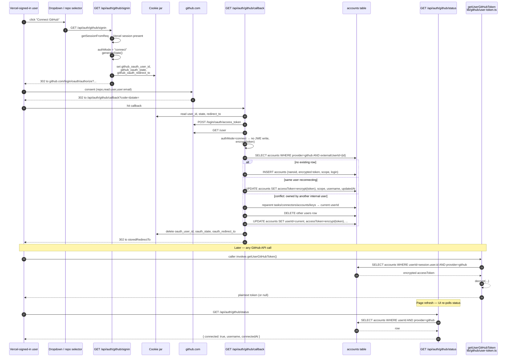

# Connect GitHub to a Vercel-Signed-In User

This page follows a single Vercel-authenticated user from the moment they click **Connect GitHub** in the avatar dropdown (or the "Reconfigure GitHub" button on the empty repo selector) to the moment their first outbound GitHub API call — driven by `getUserGitHubToken` from [`lib/github/user-token.ts`](repo://lib/github/user-token.ts) — returns the linked token. It is the workflow complement to [GitHub OAuth](../integrations/github-oauth.md) (which describes the broader sign-in/connect route surface), [Authentication & Sessions](../concepts/auth-and-sessions.md) (which describes the `users`/`accounts` split and the JWE session cookie), and [Auth API Surface](../systems/auth-flow.md) (which catalogs every route under `app/api/auth/`).

The flow is a *secondary* identity attach: the Vercel session remains primary (the `_user_session_` cookie is untouched), and the new GitHub identity lands in the `accounts` table at [lib/db/schema.ts#L254-L283](repo://lib/db/schema.ts#L254-L283) with `provider = 'github'`. Once that row exists, [getUserGitHubToken](repo://lib/github/user-token.ts#L21-L57) picks it up via its "accounts-first, users-fallback" lookup, and every caller that needed a GitHub token (Octokit, the agent dispatcher, the task worker, the verify-repo endpoint) starts working without any other change.

## Overview



*Diagram: the secondary connect flow. The Vercel session is unchanged; the new identity lands on the `accounts` row whose encrypted token is the source that `getUserGitHubToken` decrypts on every subsequent GitHub call.*

## Step 1 — Trigger: the Connect button

There are two user-visible entry points, both gated on a current Vercel session:

**Avatar dropdown.** [`components/auth/sign-out.tsx`](repo://components/auth/sign-out.tsx#L148-L166) renders a *Connect* menu item (or a *Disconnect* item if already connected) only when the user is on a Vercel session (`authProvider === 'vercel'`) and GitHub is an enabled provider (`getEnabledAuthProviders().github`). The click handler is the simplest possible navigation:

```tsx
<DropdownMenuItem
  onClick={() => (window.location.href = '/api/auth/github/signin')}
  className="cursor-pointer"
>
  <GitHubIcon className="h-4 w-4 mr-2" />
  Connect
</DropdownMenuItem>
```

**Empty repo selector.** [`components/home-page-content.tsx`](repo://components/home-page-content.tsx#L207-L218) exposes the same navigation in two places: `handleConnectGitHub` (the primary button) and `handleReconfigureGitHub` (the fallback that first tries to open `https://github.com/settings/connections/applications/{client_id}` in a new tab when the OAuth client ID is known, then falls back to the same `'/api/auth/github/signin'` navigation if it is not). Both call `window.location.href = '/api/auth/github/signin'`.

Both navigations target the *legacy* entrypoint — `app/api/auth/github/signin` (singular prefix) — rather than the unified `app/api/auth/signin/github` route. The legacy route is preserved precisely so back-compat client code (the dropdown menu, the repo selector) keeps working without a coordinated redeploy of both halves of the connect path. The unified route does the same thing for new clients and is documented in [Auth API Surface → The unified entrypoint](../systems/auth-flow.md#the-unified-entrypoint-get-apiauthsigningithub).

## Step 2 — The legacy entrypoint: `GET /api/auth/github/signin`

The handler at [`app/api/auth/github/signin/route.ts`](repo://app/api/auth/github/signin/route.ts#L7-L54) is the load-bearing first hop of the connect flow. It is `GET`-only at the click path; the file also exports a `POST` variant for callers that need the authorize URL as JSON, but no UI uses it today. The body is short enough to read whole:

```ts
export async function GET(req: NextRequest): Promise<Response> {
  // Vercel session must already exist — no session → /  (the home page, which prompts sign-in)
  const session = await getSessionFromReq(req)
  if (!session?.user) {
    return Response.redirect(new URL('/', req.url))
  }

  const clientId = process.env.NEXT_PUBLIC_GITHUB_CLIENT_ID
  const redirectUri = `${req.nextUrl.origin}/api/auth/github/callback`

  if (!clientId) {
    return Response.redirect(new URL('/?error=github_not_configured', req.url))
  }

  const state = generateState()
  const store = await cookies()
  const redirectTo = isRelativeUrl(req.nextUrl.searchParams.get('next') ?? '/')
    ? (req.nextUrl.searchParams.get('next') ?? '/')
    : '/'

  // Three cookies, all HttpOnly / SameSite=Lax / Secure-in-production / 10-min TTL
  for (const [key, value] of [
    [`github_oauth_redirect_to`, redirectTo],
    [`github_oauth_state`, state],
    [`github_oauth_user_id`, session.user.id],
  ]) {
    store.set(key, value, {
      path: '/',
      secure: process.env.NODE_ENV === 'production',
      httpOnly: true,
      maxAge: 60 * 10,
      sameSite: 'lax',
    })
  }

  // Build and 302 to GitHub's authorize URL with the same scopes as sign-in
  const params = new URLSearchParams({
    client_id: clientId,
    redirect_uri: redirectUri,
    scope: 'repo,read:user,user:email',
    state: state,
  })
  return Response.redirect(`https://github.com/login/oauth/authorize?${params.toString()}`)
}
```

Four things matter here:

- **Session is the precondition.** `getSessionFromReq` is the JWE decryptor for the `_user_session_` cookie. If there is no session, the route sends the user back to `/` (the home page's sign-in dialog), not to GitHub. This is what distinguishes the *connect* variant from the sign-in variant — connect requires a primary identity, sign-in requires none.
- **The cookie trio carries the handshake across the redirect.** `github_oauth_state` is the CSRF token; `github_oauth_redirect_to` is the validated post-auth target (the `?next=` query parameter, or `/`); `github_oauth_user_id` is the *internal* `users.id` of the connecting user. The callback uses the third to know which `users` row to attach the new `accounts` row to.
- **No `github_auth_mode` cookie.** The legacy entrypoint always writes the legacy `github_oauth_*` set and never sets `github_auth_mode`. The callback detects this absence and reads the legacy cookies in place of the unified `github_auth_*` ones — see [Step 4](#step-4--the-callback-dispatch-on-authmodeconnect-vs-authmodesignin).
- **Scopes are hard-coded.** `'repo,read:user,user:email'` matches the unified entrypoint byte-for-byte so the same OAuth app can serve both. `repo` is what lets the agent push branches and open PRs; `read:user` is what the connect callback uses to read the GitHub profile; `user:email` is unused by the connect flow but kept identical to the sign-in flow because both share one OAuth app.

The 10-minute TTL on the three cookies is the safety net for users who start the dance and never finish it: the cookies self-destruct even if the callback never runs, so a stale `github_oauth_user_id` cannot leak the connecting user's identity across sessions.

## Step 3 — GitHub authorize

The browser follows the 302 to `https://github.com/login/oauth/authorize?...`, where GitHub's UI prompts the user to consent to the three scopes and authenticate if they are not already signed in to GitHub. After consent, GitHub 302s the browser to:

```
${ORIGIN}/api/auth/github/callback?code=<auth_code>&state=<state>
```

The `state` query parameter must equal the value stashed in `github_oauth_state`; the callback enforces that check before doing anything else. The `code` is the one-time authorization code that the callback exchanges for an access token at `https://github.com/login/oauth/access_token`.

## Step 4 — The callback: dispatch on `authMode=connect` vs `authMode=signin`

[`app/api/auth/github/callback/route.ts`](repo://app/api/auth/github/callback/route.ts#L10-L233) is the only route that handles both flows. The disambiguation happens at the top of the handler:

```ts
const authMode = cookieStore.get(`github_auth_mode`)?.value ?? null
const isSignInFlow = authMode === 'signin'
const isConnectFlow = authMode === 'connect'
```

The presence of `github_auth_mode` is what distinguishes the new unified flow from the legacy connect flow. When the cookie is absent — which is exactly the case for the connect path entered through `GET /api/auth/github/signin` — the callback falls back to the legacy cookie names:

```ts
const storedState = cookieStore.get(authMode ? `github_auth_state` : `github_oauth_state`)?.value ?? null
const storedRedirectTo =
  cookieStore.get(authMode ? `github_auth_redirect_to` : `github_oauth_redirect_to`)?.value ?? null
const storedUserId = cookieStore.get(`github_oauth_user_id`)?.value ?? null
```

The validation gate ([L27-L46](repo://app/api/auth/github/callback/route.ts#L27-L46)) requires different things per mode:

- **Sign-in** needs `code`, matching `state`, and `redirect_to`.
- **Connect** (including the legacy no-`auth_mode` path) additionally needs `storedUserId` — the connecting user's internal `users.id`. The legacy route is what writes it, and a missing value means the original signin entry never ran successfully or the 10-minute TTL expired.

A missing or mismatched field returns `400 Invalid OAuth state` without deleting the cookies, so a retry from the same start route has a chance to succeed.

After validation, the callback exchanges the code at `https://github.com/login/oauth/access_token` (JSON body, JSON response). A non-OK response, or an OK response without `access_token`, returns `400` with the upstream `error_description` when present. The token response is logged with `console.log('[GitHub Callback] Token data received, has access_token:', ...)` to aid debugging of misconfigured OAuth apps.

Then the callback fetches the GitHub profile at `https://api.github.com/user` with the bearer token, capturing `login` and the numeric `id`. From here the two modes diverge completely.

### The sign-in branch (sketch — full detail in [GitHub OAuth](../integrations/github-oauth.md))

When `authMode === 'signin'`, the callback calls `createGitHubSession(tokenData.access_token, tokenData.scope)` from [`lib/session/create-github.ts`](repo://lib/session/create-github.ts#L18-L81). That helper fetches `/user` (and `/user/emails` as a fallback), calls `upsertUser({ provider: 'github', externalId, accessToken: encrypt(accessToken), ... })` from [`lib/db/users.ts`](repo://lib/db/users.ts#L15-L90), and returns a `Session`. The callback then calls `saveSession(response, session)`, which appends the `_user_session_` JWE cookie and a 302 to `storedRedirectTo`, and deletes the three `github_auth_*` cookies.

### The connect branch: this page's focus

When `authMode !== 'signin'` (the connect branch covers both `authMode === 'connect'` and the legacy `authMode === null` path), the callback encrypts the new token with `encrypt(...)` from [`lib/crypto.ts`](repo://lib/crypto.ts#L20-L35) and runs one of three sub-cases against the `accounts` table at [lib/db/schema.ts#L258-L283](repo://lib/db/schema.ts#L258-L283):

```ts
const encryptedToken = encrypt(tokenData.access_token)

const existingAccount = await db
  .select()
  .from(accounts)
  .where(and(eq(accounts.provider, 'github'), eq(accounts.externalUserId, `${githubUser.id}`)))
  .limit(1)

if (existingAccount.length > 0) {
  const connectedUserId = existingAccount[0].userId

  if (connectedUserId !== storedUserId) {
    // Conflict: account-merge path — see Step 4c
    // ...
  } else {
    // Same user, just update the token
    await db.update(accounts).set({
      accessToken: encryptedToken,
      scope: tokenData.scope,
      username: githubUser.login,
      updatedAt: new Date(),
    }).where(eq(accounts.id, existingAccount[0].id))
  }
} else {
  // No existing row — insert a fresh accounts row
  await db.insert(accounts).values({
    id: nanoid(),
    userId: storedUserId!,
    provider: 'github',
    externalUserId: `${githubUser.id}`,
    accessToken: encryptedToken,
    scope: tokenData.scope,
    username: githubUser.login,
  })
}
```

The unique index `accounts_user_id_provider_idx` on `(userId, provider)` (declared at [lib/db/schema.ts#L281](repo://lib/db/schema.ts#L281)) is what makes this lookup trustworthy: there can be at most one `accounts` row per `(userId, 'github')` pair, and the `provider` enum is hard-coded to `'github'` so the database itself rejects any other value.

After the database work, the callback deletes the per-flow cookies (`github_oauth_state`, `github_oauth_redirect_to`, `github_oauth_user_id`, and — when `authMode` is set — the `github_auth_*` trio) and 302s to `storedRedirectTo`.

### Step 4a — Fresh link (most common case)

The lookup returns no row. The callback inserts a new row with `id = nanoid()`, the connecting user's `users.id`, the encrypted access token, the granted scope string, and the GitHub `login` as `username`. The `externalUserId` is the GitHub numeric `id` cast to a string (stored as `text` per the schema). The `provider` and `refreshToken` and `expiresAt` columns are set to `'github'`, `null`, and `null` respectively — GitHub's standard OAuth flow does not issue refresh tokens, and the schema's `expiresAt` column is left for future use.

### Step 4b — Same user reconnecting

The lookup matches a row whose `userId` equals the connecting user's `users.id`. This is the "I revoked the GitHub token and want to re-link" path — the user re-runs the OAuth dance and the callback rewrites `accessToken`, `scope`, `username`, and `updatedAt` in place. No other table is touched.

### Step 4c — Conflict: GitHub identity belongs to another internal user

The lookup matches a row whose `userId` is a *different* `users.id`. This is the account-merge path. The callback runs four reparenting `UPDATE`s — one each on `tasks`, `connectors`, `accounts`, and `keys` — to move every row owned by the other user onto the connecting user's `users.id`, then deletes the now-empty old `users` row, then updates the existing `accounts` row's `userId` and token:

```ts
await db.update(tasks).set({ userId: storedUserId! }).where(eq(tasks.userId, connectedUserId))
await db.update(connectors).set({ userId: storedUserId! }).where(eq(connectors.userId, connectedUserId))
await db.update(accounts).set({ userId: storedUserId! }).where(eq(accounts.userId, connectedUserId))
await db.update(keys).set({ userId: storedUserId! }).where(eq(keys.userId, connectedUserId))

await db.delete(users).where(eq(users.id, connectedUserId))

await db.update(accounts).set({
  userId: storedUserId!,
  accessToken: encryptedToken,
  scope: tokenData.scope,
  username: githubUser.login,
  updatedAt: new Date(),
}).where(eq(accounts.id, existingAccount[0].id))
```

The merge is destructive and irreversible: the previous internal user is deleted after its child rows are reparented. The previous user's own `users.accessToken` is never touched (their primary identity, typically Vercel, is unaffected). This is the same merge that `upsertUser` reasons about from the sign-in direction — together they guarantee that one real-world GitHub identity maps to at most one internal user.

## Step 5 — Token storage and at-rest encryption

The connect branch's only writes are:

| Column | Value | Source |
| --- | --- | --- |
| `accounts.id` | `nanoid()` | fresh-link case only |
| `accounts.userId` | `users.id` of the connecting user | from `github_oauth_user_id` cookie |
| `accounts.provider` | `'github'` | hard-coded by the callback |
| `accounts.externalUserId` | `${githubUser.id}` | stringified GitHub numeric ID |
| `accounts.accessToken` | `encrypt(tokenData.access_token)` | AES-256-CBC at [lib/crypto.ts#L20-L35](repo://lib/crypto.ts#L20-L35) |
| `accounts.scope` | `tokenData.scope` | the granted scope string |
| `accounts.username` | `githubUser.login` | GitHub profile login |

The encryption primitive is the same `lib/crypto.ts` AES-256-CBC used for Vercel tokens and MCP server secrets: 16-byte random IV per call, 32-byte key from `process.env.ENCRYPTION_KEY` (a 64-character hex string), wire format `<iv_hex>:<ciphertext_hex>`. The full primitive and its failure modes are in [Encryption & Log Redaction](../concepts/encryption-and-redaction.md); for this page, the only invariant worth naming is that the connect branch's `encrypt(token)` runs *after* the code exchange but *before* the database write, so the plaintext token never lands on disk.

`refreshToken` is always `undefined` for GitHub because GitHub's standard OAuth app does not issue refresh tokens. The schema column is nullable, so the absence is represented by SQL `NULL` rather than an empty ciphertext.

## Step 6 — The status endpoint reflects the link

`GET /api/auth/github/status` at [`app/api/auth/github/status/route.ts`](repo://app/api/auth/github/status/route.ts#L7-L61) is the route that flips the UI from *Connect* to *Disconnect*. It runs the same two-bucket check that [`lib/github/user-token.ts`](repo://lib/github/user-token.ts#L21-L57) uses, but exposes only the parts the UI needs:

```ts
// 1. Check the connected-account bucket
const account = await db
  .select({ username: accounts.username, createdAt: accounts.createdAt })
  .from(accounts)
  .where(and(eq(accounts.userId, session.user.id), eq(accounts.provider, 'github')))
  .limit(1)

if (account.length > 0) {
  return Response.json({ connected: true, username: account[0].username, connectedAt: account[0].createdAt })
}

// 2. Fall back to the primary bucket (sign-in-with-GitHub users)
const user = await db
  .select({ username: users.username, createdAt: users.createdAt })
  .from(users)
  .where(and(eq(users.id, session.user.id), eq(users.provider, 'github')))
  .limit(1)

if (user.length > 0) {
  return Response.json({ connected: true, username: user[0].username, connectedAt: user[0].createdAt })
}

return Response.json({ connected: false })
```

The two-bucket check is what lets the UI render the same *"Connected as …"* badge whether the user is a Vercel-primary with a linked GitHub account or a GitHub-primary user. The endpoint never returns the access token; the shape is `{ connected: boolean; username?: string; connectedAt?: Date }`, fed into the `githubConnectionAtom` Jotai state at [`lib/atoms/github-connection.ts`](repo://lib/atoms/github-connection.ts#L3-L10).

`components/auth/session-provider.tsx` polls `/api/auth/github/status` every 60 seconds and on every `window.focus` event ([L30-L40](repo://components/auth/session-provider.tsx#L30-L40)). The next poll *after* the connect callback 302s back will see the new `accounts` row and flip the atom, which causes the avatar dropdown to switch from *Connect* to *Disconnect* and the repo selector to start populating owners.

There is no server-pushed notification of the connect; the UI's polling loop is the only thing that observes the new row. A user who lands on a page right after the callback returns may see one render of the *Connect* button before the next poll fires.

## Step 7 — `getUserGitHubToken` serves the linked token

The most consequential consequence of writing the `accounts` row is that [`getUserGitHubToken`](repo://lib/github/user-token.ts#L21-L57) starts returning a plaintext token where it previously returned `null`:

```ts
export async function getUserGitHubToken(req?: NextRequest): Promise<string | null> {
  const session = req ? await getSessionFromReq(req) : await getServerSession()
  if (!session?.user?.id) return null

  // 1. Look in accounts (linked path)
  const account = await db
    .select({ accessToken: accounts.accessToken })
    .from(accounts)
    .where(and(eq(accounts.userId, session.user.id), eq(accounts.provider, 'github')))
    .limit(1)

  if (account[0]?.accessToken) {
    return decrypt(account[0].accessToken)
  }

  // 2. Fall back to users (primary path)
  const user = await db
    .select({ accessToken: users.accessToken })
    .from(users)
    .where(and(eq(users.id, session.user.id), eq(users.provider, 'github')))
    .limit(1)

  if (user[0]?.accessToken) {
    return decrypt(user[0].accessToken)
  }

  return null
}
```

The "accounts-first, users-fallback" order is the single rule that makes a linked GitHub account behave identically to a primary one for downstream callers. The thin string return type is what lets [`lib/github/client.ts`'s `getOctokit()`](repo://lib/github/client.ts) feed the token directly into `@octokit/rest`'s `auth` field without unpacking a structured object.

The callers are the twelve-or-so places that need to act on the user's behalf toward GitHub:

- **Repo discovery and creation:** [`app/api/github/user/route.ts`](repo://app/api/github/user/route.ts), [`app/api/github/orgs/route.ts`](repo://app/api/github/orgs/route.ts), [`app/api/github/repos/route.ts`](repo://app/api/github/repos/route.ts), [`app/api/github/user-repos/route.ts`](repo://app/api/github/user-repos/route.ts), [`app/api/github/verify-repo/route.ts`](repo://app/api/github/verify-repo/route.ts), [`app/api/github/repos/create/route.ts`](repo://app/api/github/repos/create/route.ts).
- **Task lifecycle:** [`app/api/tasks/route.ts`](repo://app/api/tasks/route.ts) (the POST that creates a task — the token lets the sandbox clone the repo), [`app/api/tasks/[taskId]/continue/route.ts`](repo://app/api/tasks/[taskId]/continue/route.ts) (the follow-up route), [`app/api/tasks/[taskId]/start-sandbox/route.ts`](repo://app/api/tasks/[taskId]/start-sandbox/route.ts) (the sandbox resume).
- **Agent runtime:** [`lib/sandbox/agents/index.ts`](repo://lib/sandbox/agents/index.ts) injects the token into the sandbox env (as `GITHUB_TOKEN` / `GH_TOKEN`) so the agent CLI can commit, push, and open PRs.
- **Self-heal:** [`app/api/api-keys/check/route.ts`](repo://app/api/api-keys/check/route.ts) uses the token to check the user's GitHub rate-limit budget.

None of these callers care whether the token came from `accounts` (a link) or `users` (a primary) — they only see the plaintext string.

`getUserGitHubToken` is the *GitHub-specific* reader. The provider-general sibling [`getOAuthToken(userId, provider)`](repo://lib/session/get-oauth-token.ts#L17-L84) does the same lookup but returns the structured `{ accessToken, refreshToken, expiresAt }` and is used by the OAuth revoke routes, `/api/auth/info`, and `/api/vercel/teams`. For GitHub specifically, the thin string return type is sufficient because GitHub never has a refresh token or expiry.

## Step 8 — Disconnecting

The mirror of connect is [`POST /api/auth/github/disconnect`](repo://app/api/auth/github/disconnect/route.ts#L7-L38), which deletes the `accounts` row whose `userId` matches the current session and whose `provider` is `'github'`:

```ts
await db.delete(accounts).where(
  and(eq(accounts.userId, session.user.id), eq(accounts.provider, 'github'))
)
```

Two safeguards:

1. **Session guard.** The route refuses with `400 Cannot disconnect primary authentication method` when `session.authProvider === 'github'` — the connecting identity in this case is on `users.accessToken`, not `accounts`, and removing it would leave the user with no underlying identity. The component layer only renders the *Disconnect* menu item when `authProvider === 'vercel'`, so this guard is a second line of defense rather than a user-facing rule.
2. **No token revocation at the upstream.** The handler does not call GitHub's revoke endpoint (`DELETE /applications/:client_id/token`). A future improvement could revoke the upstream token; today the row simply disappears from the database and the upstream token lingers until its natural expiry.

After disconnect, `getUserGitHubToken` falls through to its `users`-bucket lookup; for a Vercel-primary user that returns `null`, so every GitHub API call starts failing with 401. `components/repo-selector.tsx` watches for this — when `/api/github/user` or `/api/github/orgs` returns 401/403, it self-heals by POSTing to `/api/auth/github/disconnect` and setting `githubConnection.connected = false` ([L130-L149](repo://components/repo-selector.tsx#L130-L149)).

## Invariants and lifecycle

- **One GitHub link per internal user.** Enforced by the unique index `accounts_user_id_provider_idx` on `(userId, provider)` declared at [lib/db/schema.ts#L281](repo://lib/db/schema.ts#L281). The callback's same-user reconnect sub-case relies on this to safely `UPDATE` in place; the conflict sub-case relies on this to safely reparent the row's `userId`.
- **Vercel sessions are immutable during the connect flow.** The callback never writes the `_user_session_` cookie in `connect` mode (it only writes it in `signin` mode via `saveSession`). The connect branch's 302 to `storedRedirectTo` carries no `Set-Cookie` for the session, so the user's Vercel identity persists unchanged across the round-trip.
- **Encrypted at rest.** Both write sites in the connect flow go through `encrypt(...)` before any SQL `INSERT`/`UPDATE`. There is no code path that writes a plaintext GitHub token to the `accounts` table.
- **No other route mutates `accounts` rows for GitHub.** A grep across the codebase shows that `app/api/auth/github/callback/route.ts` (connect branch) is the only writer, and `app/api/auth/github/disconnect/route.ts` is the only deleter. Every other caller (`getUserGitHubToken`, `getOAuthToken`, `status`) reads.
- **One real-world GitHub identity, one internal user.** The same conflict-merge logic that runs in the callback also runs from `upsertUser` when a GitHub-primary user signs in. Together, the two paths guarantee that any user who connects a GitHub account to a Vercel user, then later signs in with that GitHub account, lands back on the same Vercel user rather than creating a duplicate.
- **Token self-heal.** `components/repo-selector.tsx` is the only place that auto-disconnects on a 401/403 from GitHub; no other component handles the "stale token" case.

## Failure and edge-case behavior

- **No Vercel session at the entrypoint.** `GET /api/auth/github/signin` 302s to `/`. The user lands on the home page with the sign-in dialog open and has not lost any state.
- **Missing `NEXT_PUBLIC_GITHUB_CLIENT_ID`.** The entrypoint 302s to `/?error=github_not_configured`. The callback returns `500 GitHub OAuth not configured` if either `NEXT_PUBLIC_GITHUB_CLIENT_ID` or `GITHUB_CLIENT_SECRET` is unset.
- **Mismatched or missing state.** The callback returns `400 Invalid OAuth state` for every mode (signin, unified connect, legacy connect). The connect path additionally requires `github_oauth_user_id`. Cookies are preserved on the 400 so a retry from the same start route has a chance to succeed.
- **Bad token exchange.** A non-OK from `https://github.com/login/oauth/access_token`, or an OK response without `access_token`, returns `400`. The error body includes `tokenData.error_description` when present.
- **Missing profile data.** The callback does not call `/user` for a second time; it relies on the in-handler fetch whose result it already has. A non-OK `/user` response causes the JSON parse to fail and the handler returns 500.
- **Account merge failure.** If any of the four reparenting `UPDATE`s or the subsequent `DELETE FROM users` throws, the catch block at [L226-L233](repo://app/api/auth/github/callback/route.ts#L226-L233) logs the stack and returns 500. The destructive merge is not transactional, so a partial failure leaves the database in an inconsistent state. This is acceptable in practice because the entire sequence runs in a single request and is unlikely to fail mid-flight on a healthy Postgres.
- **Disconnecting the primary.** `/api/auth/github/disconnect` returns `400 Cannot disconnect primary authentication method` when `session.authProvider === 'github'`. The UI also hides the *Disconnect* menu item in this case.
- **Decryption failure.** `decrypt` throws if `accounts.accessToken` is not a valid `<iv_hex>:<ciphertext_hex>` string. `getUserGitHubToken` catches the throw, logs it, and returns `null`. The caller sees an empty result and treats the user as unconnected rather than as a 500.
- **Stale cookies across a deploy.** The legacy route's `github_oauth_*` cookies and the unified route's `github_auth_*` cookies have independent names, but the callback reads either set based on the presence of `github_auth_mode`. A browser mid-OAuth during a deploy — having a legacy cookie set but the callback code expecting unified — will fail with a state mismatch and a 400; the user can re-click the *Connect* button to start fresh under the new code.

## Extension points

- **Migrate the UI to the unified entrypoint.** Replace `'/api/auth/github/signin'` with `'/api/auth/signin/github'` in `components/auth/sign-out.tsx`, `components/home-page-content.tsx`, and any third caller. Once no consumer references the legacy URL, delete the `app/api/auth/github/signin/route.ts` file and the legacy `github_oauth_*` branches in the callback. The unified mode is the long-term path; the legacy entrypoint exists only for back-compat.
- **Add a second linked provider.** Extend the `accounts.provider` enum at [lib/db/schema.ts#L265-L269](repo://lib/db/schema.ts#L265-L269) past `'github'`, add a parallel entrypoint route analogous to `/api/auth/github/signin`, and generalize the connect branch of the callback to dispatch on `provider` instead of hard-coding `'github'`. The cookie contract (`github_oauth_state`, `github_oauth_redirect_to`, `github_oauth_user_id`) is provider-agnostic and can be reused.
- **Revoke the upstream token at disconnect.** Call `DELETE https://api.github.com/applications/{client_id}/token` with HTTP Basic auth built from `NEXT_PUBLIC_GITHUB_CLIENT_ID:GITHUB_CLIENT_SECRET` and a JSON body of `{ access_token }` inside `app/api/auth/github/disconnect/route.ts` before the database delete. Revoke failures should be logged but not propagated; the row deletion should succeed regardless. (This is the same revoke call used by `/api/auth/signout` — see [Auth API Surface → Disconnect and sign-out](../systems/auth-flow.md#disconnect-and-sign-out).)
- **Add refresh-token support for GitHub.** If the OAuth app is reconfigured to issue refresh tokens, thread `refresh_token` through the callback's `tokenData` into `accounts.refreshToken`. `getOAuthToken` already decrypts `accounts.refreshToken` when present, but `getUserGitHubToken` would need a refresh-on-401 loop to use it.
- **Use the `authMode=connect` path's `?github_connected=true` toast.** The unified entrypoint appends that query parameter to the post-auth URL on connect ([app/api/auth/signin/github/route.ts#L32](repo://app/api/auth/signin/github/route.ts#L32)); [`components/home-page-content.tsx`](repo://components/home-page-content.tsx#L86-L94) reads it on mount and shows the *"GitHub account connected successfully!"* toast. The legacy entrypoint does not append it, so users who connect via `'/api/auth/github/signin'` see no toast. Adding the same `searchParams.set('github_connected', 'true')` to the legacy GET handler would unify the UX.

## What to read next

- [GitHub OAuth](../integrations/github-oauth.md) — the per-provider integration details: app registration, scopes, the cookie contract, the sign-in variant of the callback, and the storage surface.
- [Authentication & Sessions](../concepts/auth-and-sessions.md) — the JWE session cookie, the `users`/`accounts` split, the three-stage dedup in `upsertUser`, and the dual-cookie model.
- [Auth API Surface](../systems/auth-flow.md) — the full inventory of routes under `app/api/auth/`, the unified vs legacy cookie sets, the `/api/auth/info` rehydration loop, and the sign-out flow.
- [Encryption & Log Redaction](../concepts/encryption-and-redaction.md) — the AES-256-CBC primitive, the `ENCRYPTION_KEY` environment variable, and the redaction pass that scrubs decrypted values out of the log stream.
