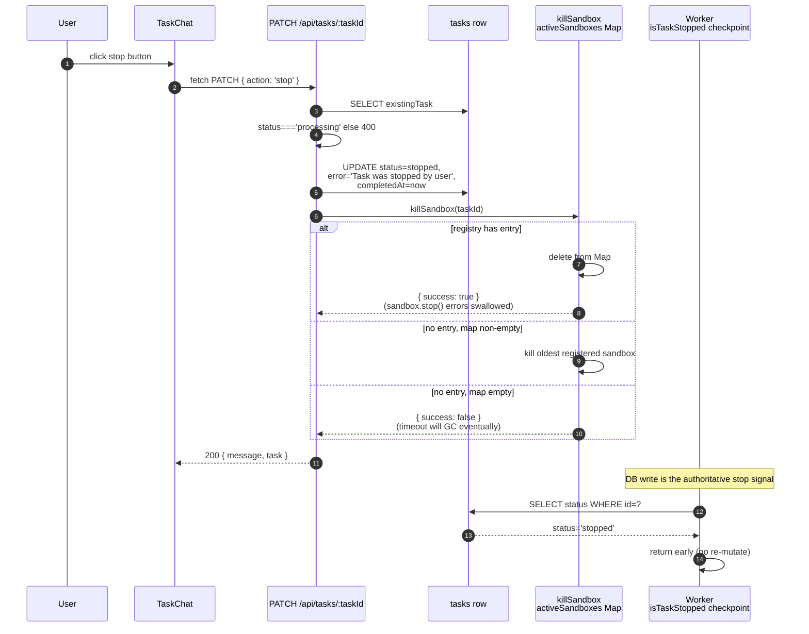

# Follow-up Messages and Keep-Alive

A task is not a one-shot. After the agent pushes a branch the user often wants to send a "actually, also fix X" message; after a stop the user often wants to resume against the same VM; after a merge the user often wants to start fresh against a new sandbox. This page is the single place that ties together the follow-up HTTP endpoint (`POST /api/tasks/:taskId/continue`), the keep-alive sandbox lifecycle (`POST /:taskId/start-sandbox` + `POST /:taskId/stop-sandbox`), the user-initiated stop (`PATCH /:taskId` with `action: 'stop'`), and the rate-limit envelope that gates all of them.

The companion pages are [Sandbox Lifecycle](../concepts/sandbox-lifecycle.md) (the in-VM phases, the dual persistence model, the `keepAlive` flag's exact effects), [Task API Surface → execution-control routes](../systems/task-api.md#execution-control-routes) (the route catalog), [Task Lifecycle & Status Model → POST /:taskId/continue](../concepts/tasks-lifecycle.md#post-apitaskstaskidcontinue) (the row-rewind transition), and [Agent Implementations → resume per agent](../systems/agent-implementations.md) (what `--resume` actually means per CLI).

## Overview

The follow-up surface is four HTTP endpoints and one React component:

<!-- openwiki: mermaid parse failed and this diagram was converted to a text fence so it does not break rendering. Fix the diagram source and restore the mermaid fence. Parser error: Heuristic: an unescaped angle bracket inside a label breaks rendering; rephrase the label. -->
```text
flowchart LR
  subgraph "Chat panel"
    TC["TaskChat<br/>components/task-chat.tsx"]
  end
  subgraph "Per-task routes"
    CONT["POST /api/tasks/:taskId/continue"]
    SS["POST /api/tasks/:taskId/start-sandbox"]
    XS["POST /api/tasks/:taskId/stop-sandbox"]
    STP["PATCH /api/tasks/:taskId<br/>action=stop"]
  end
  subgraph "Server-side"
    CT["continueTask<br/>continue/route.ts"]
    CR["createSandbox<br/>lib/sandbox/creation.ts"]
    SDK["Sandbox.get<br/>@vercel/sandbox"]
    REG["activeSandboxes<br/>Map<taskId, Sandbox>"]
    DB[("tasks row<br/>sandboxId, sandboxUrl,<br/>keepAlive, status")]
  end

  TC -->|fetch POST { message }| CONT
  TC -->|fetch POST start| SS
  TC -->|fetch POST stop| XS
  TC -->|fetch PATCH stop| STP
  CONT --> CT
  CT -->|task.sandboxId && task.keepAlive| SDK
  CT -->|else| CR
  SDK -. rehydrates .-> REG
  CR -->|registerSandbox| REG
  SS --> SDK
  XS --> SDK
  STP --> REG
  SDK -. read/write .-> DB
  CR -. write sandboxId/Url .-> DB
  STP -. status=stopped .-> DB
  CONT -. status=processing<br/>completedAt=NULL .-> DB
```

*Diagram: the four per-task routes and the chat panel that drives them. The `continue` route is the only one that always runs the agent again; `start-sandbox` and `stop-sandbox` manage the kept-alive VM without touching the agent; `PATCH stop` is the hard-cancel path.*

The four routes have different "what state does the row end up in" stories:

| Route | Pre-state | Post-state | Effect on sandbox | Effect on rate limit |
| --- | --- | --- | --- | --- |
| `POST /:taskId/continue` | any non-`pending` row | `status='processing'`, `progress=0`, `completedAt=NULL`, new `taskMessages(role='user')` row | Reconnects via `Sandbox.get` if `keepAlive && sandboxId`; otherwise fresh `createSandbox` with the same `branchName` | **Counts.** Every follow-up is a `taskMessages(role='user')` row, included in `userMessagesToday`. |
| `POST /:taskId/start-sandbox` | `keepAlive=true`, no live VM | unchanged (still `completed` / `error` / etc.) | Creates a new `Sandbox.create(...)` and registers it | Does not count (no new `taskMessages`). |
| `POST /:taskId/stop-sandbox` | any state with a `sandboxId` | `sandboxId=NULL`, `sandboxUrl=NULL` | `sandbox.stop() + unregisterSandbox` | Does not count. |
| `PATCH /:taskId` (`action: 'stop'`) | `status='processing'` only (otherwise `400`) | `status='stopped'`, `error='Task was stopped by user'`, `completedAt=now` | `killSandbox(taskId)` (registry only) | Does not count. |

The two big invariants across all four:

1. **`keepAlive` does not extend the SDK timeout.** The `timeout` passed to `Sandbox.create` is `maxDuration * 60_000` regardless of `keepAlive`. What `keepAlive` controls is whether the worker calls `unregisterSandbox + shutdownSandbox` after a successful push; the VM is still bounded by `maxDuration`. See [Sandbox Lifecycle → The `keepAlive` flag](../concepts/sandbox-lifecycle.md#the-keepalive-flag).
2. **Every follow-up counts against the daily cap.** `checkRateLimit` is called at the top of the `continue` handler (before the auth/branch-existence checks), and the cap is the **combined** `tasksToday + userMessagesToday` total. A user that creates a task and sends two follow-ups has used three of their daily slots; a fourth — task or follow-up — returns `429` until the next UTC midnight. See [Task Lifecycle → Rate limit](../concepts/tasks-lifecycle.md#rate-limit-daily-ceiling).

## Step 1 — The follow-up message

`TaskChat` in [`components/task-chat.tsx`](repo://components/task-chat.tsx) is the only UI entry point for a follow-up. The chat input is wired to the `taskChatInputAtomFamily(taskId)` Jotai atom so the in-progress text survives tab switches, and `handleSendMessage` ([`task-chat.tsx#L463-L500`](repo://components/task-chat.tsx#L463-L500)) fires on `Enter` (no `Shift`) or on the up-arrow button:

```ts
const response = await fetch(`/api/tasks/${taskId}/continue`, {
  method: 'POST',
  headers: { 'Content-Type': 'application/json' },
  body: JSON.stringify({ message: messageToSend }),
})
```

Two optimistic-UI tricks make this feel instant:

- The message is **cleared from the input the moment the click happens** (`setNewMessage('')`), not after the response. If the request fails the text is restored from the local `messageToSend` snapshot.
- The chat panel polls `GET /api/tasks/:taskId/messages` every 3 seconds ([`task-chat.tsx#L264-L273`](repo://components/task-chat.tsx#L264-L273)). The `continue` handler inserts the new user message into `taskMessages` **synchronously** before scheduling the worker, so the next poll paints the bubble before the agent has done anything.

The same component also handles retry (`handleRetryMessage`, [`L520-L550`](repo://components/task-chat.tsx#L520-L550)) and the "Send as Follow-Up" path from a PR review comment (`handleSendCommentAsFollowUp`, [`L593-L605`](repo://components/task-chat.tsx#L593-L605)), which formats the comment as a prompt and sets it into the input instead of submitting directly. Both end up calling the same `continue` endpoint.

## Step 2 — `POST /api/tasks/:taskId/continue` (synchronous part)

[`app/api/tasks/[taskId]/continue/route.ts#L22-L116`](repo://app/api/tasks/[taskId]/continue/route.ts#L22-L116) is the HTTP shell. It is intentionally thin — the heavy lifting lives in `continueTask` inside `after()`. The synchronous block does six things in order, all before sending the response:

1. **Authenticate.** `getServerSession()` → `401 Unauthorized` if no session.
2. **Rate-limit.** `checkRateLimit(session.user.id)` → `429 { error, message, remaining, total, resetAt }` if over the daily cap. The message names the user-facing combined count ("You have reached the daily limit of N messages (tasks + follow-ups)"). See [Task Lifecycle → Rate limit](../concepts/tasks-lifecycle.md#rate-limit-daily-ceiling).
3. **Validate.** `message` required, non-empty after `.trim()` → `400 { error: 'Message is required' }`.
4. **Load + ownership.** `SELECT tasks WHERE id=? AND userId=? AND isNull(deletedAt)` → `404 Task not found` otherwise.
5. **Branch precondition.** `400 'Task does not have a branch to continue from'` if `task.branchName` is null. A row without a `branchName` was never built up enough to be a continuation — there is nothing for `Sandbox.get` to clone from and no `--resume` target for the CLI.
6. **Persist + rewind.** `INSERT taskMessages(role='user', content: message.trim())`, then `UPDATE tasks SET status='processing', progress=0, completedAt=NULL, updatedAt=now()`. This is the **rewind transition** documented in [Task Lifecycle → State transitions](../concepts/tasks-lifecycle.md#state-transitions); the row moves from `completed` / `error` / `stopped` / `processing` back to `processing`, and the previous `completedAt` (if any) is cleared because the work is no longer "finished".
7. **Snapshot credentials.** `getUserApiKeys`, `getUserGitHubToken`, `getGitHubUser`, `getMaxSandboxDuration(userId)`. This must happen **before** `after()` because cookies are not available inside the callback — same constraint as `POST /api/tasks` (see [Workflow: Create and Run a Task → Step 3](../workflows/create-and-run-task.md#step-3--post-apitasks-synchronous-returns-within-milliseconds)).
8. **Schedule the worker.** `after(() => continueTask(taskId, message.trim(), task.repoUrl, task.branchName, task.maxDuration, task.selectedAgent, task.selectedModel, task.installDependencies, userApiKeys, userGithubToken, githubUser))`.
9. **Return.** `200 { success: true }` immediately.

The shape of the response is deliberately minimal — the row update flows through the standard `useTask` poll loop (5-second cadence), so the client does not need a richer payload. The `TaskChat` 3-second `messages` poll picks up the just-inserted user row on the next tick.

## Step 3 — `continueTask`: the two sandbox paths

[`continueTask`](repo://app/api/tasks/[taskId]/continue/route.ts#L118-L471) is the follow-up counterpart to `processTask`. Its job is the same — run the agent, push the result — but with one critical difference: it has to decide whether to **reuse** the existing sandbox or **build a new one**.

The decision is at [`L162-L190`](repo://app/api/tasks/[taskId]/continue/route.ts#L162-L190):

```ts
if (currentTask.sandboxId && currentTask.keepAlive) {
  try {
    const reconnectedSandbox = await Sandbox.get({
      sandboxId: currentTask.sandboxId,
      teamId: process.env.SANDBOX_VERCEL_TEAM_ID!,
      projectId: process.env.SANDBOX_VERCEL_PROJECT_ID!,
      token: process.env.SANDBOX_VERCEL_TOKEN!,
    })
    if (reconnectedSandbox) {
      sandbox = reconnectedSandbox
      isResumedSandbox = true
    }
  } catch (error) {
    // fall through to createSandbox below
  }
}

if (!sandbox) {
  // Detect port, run createSandbox(...) with preDeterminedBranchName: branchName
  // Persist the new sandboxId/sandboxUrl back to the row.
}
```

Three observations that matter:

- **The in-memory `Map<taskId, Sandbox>` is not consulted here.** A different serverless execution is hosting this request, so the `activeSandboxes` entry from the original worker has been frozen out. The reconnect goes through `Sandbox.get(sandboxId)` directly. (For routes that run inside the original worker — `terminal`, `save-file`, etc. — `getSandbox(taskId)` is the fast path; `Sandbox.get` is the cross-execution fallback. The `continue` route is one of the few that is always cross-execution.) See [Sandbox Lifecycle → Phase 5 — Reconnect](../concepts/sandbox-lifecycle.md#phase-5--reconnect-sandboxget).
- **The reconnect is only attempted when `keepAlive` is true.** A `keepAlive=false` task whose sandbox was `unregisterSandbox`'d at the end of the worker is gone; even if `sandboxId` is somehow still set (it shouldn't be — the worker also writes `null` to the column), the SDK's garbage collection will have torn the VM down. The continue handler treats `keepAlive` as the gate, then `Sandbox.get` as the probe; a failed probe drops straight into the create path.
- **On a failed `Sandbox.get`, the handler creates a fresh sandbox with `preDeterminedBranchName: task.branchName`.** This is the only way the follow-up commit lands on the same branch as the original — `createSandbox` checks out the AI-generated or `agent/<timestamp>-<id>` name that the first run wrote. Without that argument the new VM would be on `main` and the push would fail.

Once a sandbox is in hand (either way), `continueTask` does the standard pipeline. The branch is the most interesting difference from `processTask`:

<!-- openwiki: mermaid parse failed and this diagram was converted to a text fence so it does not break rendering. Fix the diagram source and restore the mermaid fence. Parser error: Heuristic: an unescaped angle bracket inside a label breaks rendering; rephrase the label. -->
```text
sequenceDiagram
    autonumber
    participant U as User
    participant TC as TaskChat<br/>task-chat.tsx
    participant API as POST /:taskId/continue
    participant DB as tasks + taskMessages
    participant AFT as after()
    participant CT as continueTask
    participant SB as Sandbox.get OR createSandbox
    participant VS as Vercel Sandbox SDK
    participant AG as executeAgentInSandbox<br/>agents/index.ts
    participant GIT as pushChangesToBranch

    U->>TC: type message + Enter
    TC->>API: fetch { message }
    API->>API: checkRateLimit (429 if over)
    API->>DB: INSERT taskMessages (role=user)
    API->>DB: UPDATE tasks SET status=processing,<br/>progress=0, completedAt=NULL
    API->>API: snapshot userApiKeys + token + GH user
    API->>AFT: after(() => continueTask(...))
    API-->>TC: 200 { success: true }
    Note over TC: TaskChat polls /messages every 3s;<br/>user bubble appears on next tick

    AFT->>CT: continueTask(taskId, message, repoUrl,<br/>branchName, maxDuration, agent, model, ...)
    CT->>DB: SELECT currentTask (sandboxId, keepAlive, agentSessionId)

    alt task.sandboxId && task.keepAlive
        CT->>VS: Sandbox.get(sandboxId, team, project, token)
        alt Sandbox.get returns a Sandbox
            VS-->>CT: existing Sandbox
            CT->>CT: isResumedSandbox = true
        else Sandbox.get throws
            CT->>CT: log "Could not reconnect to sandbox"
        end
    end

    alt no live sandbox
        CT->>SB: createSandbox({ ..., preDeterminedBranchName: branchName })
        SB->>VS: Sandbox.create + clone + git checkout branch
        SB-->>CT: { sandbox, domain, branchName }
        CT->>DB: UPDATE sandboxId/sandboxUrl
    end

    CT->>CT: assemble prompt with last-5-messages context<br/>(skip when isResumedSandbox)
    CT->>CT: load + decrypt MCP connectors
    CT->>AG: executeAgentInSandbox(sandbox, prompt,<br/>agentType, ..., isResumedSandbox,<br/>currentTask.agentSessionId, ...)
    AG->>VS: install CLI (skip if already present)
    AG-->>CT: { success, sessionId, agentResponse }
    CT->>DB: UPDATE agentSessionId (if returned)

    alt agentResult.success
        CT->>GIT: pushChangesToBranch(sandbox, branchName, commitMsg)
        GIT-->>CT: { success, pushFailed? }
        alt currentTask.keepAlive
            CT->>CT: log "Sandbox kept alive for follow-up messages"
        else
            CT->>DB: unregisterSandbox(taskId) + shutdownSandbox(sandbox)
        end
        alt pushFailed
            CT->>DB: status=error
        else
            CT->>DB: status=completed
        end
    else agent failed
        CT->>DB: log + status=error + error=message
        alt keepAlive
            CT->>CT: log "Sandbox kept alive despite error"
        else
            CT->>DB: unregisterSandbox + shutdownSandbox
        end
    end
```

*Diagram: a single follow-up from the user typing in the chat box to the DB row settling back to `completed` (or `error`). The decision point is `task.sandboxId && task.keepAlive`: on a yes, `Sandbox.get` rehydrates the same VM and `--resume` picks up the agent's previous session; on a no, `createSandbox` builds a fresh VM and clones the existing branch.*

## Step 4 — Conversation history vs. agent session resume

This is the subtle bit. `continueTask` does two things that look contradictory but together define the follow-up model:

1. **Build a last-5-messages prefix** ([`continue/route.ts#L248-L284`](repo://app/api/tasks/[taskId]/continue/route.ts#L248-L284)):

   ```ts
   const previousMessages = await db.select().from(taskMessages)
     .where(eq(taskMessages.taskId, taskId))
     .orderBy(asc(taskMessages.createdAt))
     .limit(10) // get last 10 to ensure we have at least 5 before the current one

   const contextMessages = previousMessages.slice(-6, -1) // 5 messages, excluding the very last (just-inserted) one

   if (contextMessages.length > 0 && !isResumedSandbox) {
     const conversationHistory = '\n\n---\n\nFor context, here is the conversation history from this session:\n\n'
     contextMessages.forEach((msg) => {
       const role = msg.role === 'user' ? 'User' : 'A'
       const sanitizedContent = msg.content.length > 500
         ? msg.content.substring(0, 500) + '...'
         : msg.content
       // shell-sanitize: backticks → ', strip $, strip \, prefix leading -
       conversationHistory += `${role}: ${sanitizedContent}\n\n`
     })
     promptWithContext = `${sanitizedPrompt}${conversationHistory}`
   }
   ```

   The last-5-messages prefix is **only** added when `!isResumedSandbox` — when a fresh sandbox was created. When the original VM was reattached via `Sandbox.get`, the per-agent CLI's `--resume` flag (or equivalent) already carries the full conversation, so adding a textual prefix would be redundant.

2. **Pass `isResumedSandbox=true` and `currentTask.agentSessionId` to `executeAgentInSandbox`** ([`continue/route.ts#L324-L337`](repo://app/api/tasks/[taskId]/continue/route.ts#L324-L337)). The dispatcher in `lib/sandbox/agents/index.ts` threads these through to the per-CLI wrappers, each of which uses a different `--resume`-style flag:

   | Agent | Resume behavior | Source |
   | --- | --- | --- |
   | `claude` | `--resume SESSION_ID` if `sessionId`, bare `--resume` otherwise | [`lib/sandbox/agents/claude.ts#L280-L293`](repo://lib/sandbox/agents/claude.ts#L280-L293) |
   | `codex` | `codex resume --last` (ignores `sessionId`) | [`lib/sandbox/agents/codex.ts#L281-L292`](repo://lib/sandbox/agents/codex.ts#L281-L292) |
   | `copilot` | `--resume SESSION_ID` if `sessionId` | [`lib/sandbox/agents/copilot.ts#L277-L292`](repo://lib/sandbox/agents/copilot.ts#L277-L292) |
   | `cursor` | `--resume SESSION_ID` if `sessionId` | [`lib/sandbox/agents/cursor.ts#L287-L288`](repo://lib/sandbox/agents/cursor.ts#L287-L288) |
   | `gemini` | No resume — relies on the textual prefix instead | [`lib/sandbox/agents/gemini.ts`](repo://lib/sandbox/agents/gemini.ts) |
   | `opencode` | `--session SESSION_ID` if `sessionId`, bare `--continue` otherwise | [`lib/sandbox/agents/opencode.ts#L331-L344`](repo://lib/sandbox/agents/opencode.ts#L331-L344) |

   `currentTask.agentSessionId` is the value persisted by the previous run's wrapper — Claude extracts it from a `type: 'result'` stream-json event ([`claude.ts#L278-L293`](repo://lib/sandbox/agents/claude.ts#L278-L293)), Cursor from its own `session_id` field ([`cursor.ts#L324-L428`](repo://lib/sandbox/agents/cursor.ts#L324-L428)), Codex from a stdout regex (`Session: <id>`), and so on. If the wrapper could not extract a session ID the column is null and the next `--resume` becomes a "continue most recent" rather than a "continue specific" call.

The practical consequence: a kept-alive Claude or Cursor task continues the same conversation; a kept-alive Codex task continues the most-recent Codex conversation (regardless of session ID); a non-kept-alive task or a Gemini task starts fresh, with the previous turns condensed into the prompt as text. This is documented per-agent in [Agent Implementations → resume per agent](../systems/agent-implementations.md).

## Step 5 — Push and the second `keepAlive` decision

The end of `continueTask` mirrors `processTask`: generate a commit message (AI Gateway or fallback), push, then re-consult `keepAlive`:

- **`keepAlive=true`** — log "Sandbox kept alive for follow-up messages" and return. `sandboxId` / `sandboxUrl` stay on the row; the next follow-up can reattach via `Sandbox.get`.
- **`keepAlive=false`** — `unregisterSandbox(taskId) + shutdownSandbox(sandbox)`. The dev server is `pkill`'d (best-effort); Vercel garbage-collects the VM after its SDK-side timeout.

On a `pushFailed`, the row settles to `status='error'` regardless of `keepAlive`. The same `keepAlive`-conditional cleanup applies in the error branch ([`continue/route.ts#L442-L457`](repo://app/api/tasks/[taskId]/continue/route.ts#L442-L457)) so a failed follow-up can be retried against the same VM by the user.

## Step 6 — `POST /api/tasks/:taskId/start-sandbox`

The second of the four keep-alive endpoints. [`app/api/tasks/[taskId]/start-sandbox/route.ts`](repo://app/api/tasks/[taskId]/start-sandbox/route.ts) creates a fresh sandbox for a `keepAlive=true` task that does not currently have a live one. The handler:

1. Standard auth/ownership (`401` / `404` / `403`).
2. Rejects with `400 'Keep-alive is not enabled for this task'` if `task.keepAlive === false` ([L38-L40](repo://app/api/tasks/[taskId]/start-sandbox/route.ts#L38-L40)). The endpoint is the only way to spawn an extra sandbox for a task; non-keep-alive tasks do not get this path.
3. Probes the existing `Sandbox.get + runCommandInSandbox('echo', ['test'])` pair. A success returns `400 'Sandbox is already running'`; a failure clears `sandboxId` / `sandboxUrl` from the row and falls through to the create path.
4. Creates a fresh sandbox via `Sandbox.create({ source: { type: 'git', url: task.repoUrl, revision: task.branchName, depth: 1 }, timeout: maxDurationMinutes * 60_000, ports: [port], runtime: 'node22', resources: { vcpus: 4 } })`. Note the `source` field — this is the only place in the codebase that asks the SDK to clone the repo at create time; the regular `createSandbox` helper does the clone manually so it can run setup steps before git.
5. Configures git (`user.name` / `user.email` from the connected GitHub user), installs Node or Python dependencies, and starts the dev server in detached mode with `[SERVER]` log capture (see [Sandbox Lifecycle → Phase 4 — Dev server](../concepts/sandbox-lifecycle.md#phase-4--dev-server)). After a 3-second wait, `sandboxUrl = sandbox.domain(port)`.
6. Persists `sandboxId`, `sandboxUrl` back to the row and returns `{ success: true, sandboxId, sandboxUrl }`.

The endpoint does **not** run the agent. It exists to recover from a sandbox that the SDK has garbage-collected (because `maxDuration` elapsed) so the user can pick up where they left off — open the file browser, run commands in the terminal, send another follow-up.

## Step 7 — `POST /api/tasks/:taskId/stop-sandbox`

The explicit teardown. [`app/api/tasks/[taskId]/stop-sandbox/route.ts`](repo://app/api/tasks/[taskId]/stop-sandbox/route.ts) is the only endpoint outside the worker that calls `sandbox.stop()` on the SDK directly:

```ts
const sandbox = await Sandbox.get({
  sandboxId: task.sandboxId,
  teamId: process.env.SANDBOX_VERCEL_TEAM_ID!,
  projectId: process.env.SANDBOX_VERCEL_PROJECT_ID!,
  token: process.env.SANDBOX_VERCEL_TOKEN!,
})
await sandbox.stop()
unregisterSandbox(taskId)
await db.update(tasks).set({
  sandboxId: null,
  sandboxUrl: null,
  updatedAt: new Date(),
}).where(eq(tasks.id, taskId))
```

The standard preamble rejects with `400 'Sandbox is not active'` if `sandboxId` is null. The `keepAlive` flag is **not** consulted — if the user is asking for the sandbox to die, it dies, even if the task was opted into keep-alive at creation time. The task's `status` is left as-is (it is not transitioned to `stopped`); the endpoint only kills the VM and clears the two pointer columns. See [Sandbox Lifecycle → Path C — Explicit endpoint](../concepts/sandbox-lifecycle.md#path-c--explicit-endpoint-post-apitaskstaskidstop-sandbox).

This is the counterpart to `start-sandbox`: a kept-alive sandbox can be rehydrated or torn down on demand without changing the row's status.

## Step 8 — `PATCH /api/tasks/:taskId` with `action: 'stop'`

The hard cancel. [`app/api/tasks/[taskId]/route.ts#L40-L117`](repo://app/api/tasks/[taskId]/route.ts#L40-L117) is the only writer of `status='stopped'`:

1. Standard auth/ownership (`401` / `404`).
2. **Status precondition.** `400 'Task can only be stopped when it is in progress'` unless `existingTask.status === 'processing'`. The rationale is that there is nothing to stop for a `pending`, `completed`, `error`, or already-`stopped` row — the worker is either not yet started, already done, or already unwinding. See [Task Lifecycle → PATCH stop](../concepts/tasks-lifecycle.md#patch-apitaskstaskid-with-action-stop).
3. `UPDATE tasks SET status='stopped', error='Task was stopped by user', completedAt=now, updatedAt=now WHERE id=?`.
4. `killSandbox(taskId)` from the in-memory registry ([`lib/sandbox/sandbox-registry.ts#L25-L60`](repo://lib/sandbox/sandbox-registry.ts#L25-L60)). This pops the entry from `activeSandboxes`, calls `sandbox.stop()`, and falls back to killing the **oldest** registered sandbox if no entry exists for this `taskId` — a comment in the function explains this handles "Try Again" flows where a new task id is created but the old sandbox is still registered.
5. Logs three entries: `info('Stop request received...')`, then either `success('Sandbox killed successfully')` or `error('Failed to kill sandbox')`, then `error('Task execution stopped by user')`. The stop path's log ends with two `error` entries even on success; this is intentional — stop is an abnormal termination.

The PATCH response is `200 { message: 'Task stopped successfully', task: updatedTask }` and is consumed by the chat panel's stop button ([`task-chat.tsx#L552-L577`](repo://components/task-chat.tsx#L552-L577)). The actual unwinding of the agent happens at the worker's `isTaskStopped` checkpoints (the DB write is the authoritative signal); `killSandbox` is best-effort and only useful while the original execution still holds the live reference. After the worker has finished, a stop request just flips the row to `stopped` — there is no VM to kill, and the SDK timeout is what eventually frees the resources. See [Sandbox Lifecycle → Path B — User-initiated stop](../concepts/sandbox-lifecycle.md#path-b--user-initiated-stop-killsandbox).



*Diagram: the user clicks stop, the PATCH flips the row and asks the registry to kill the sandbox, and the worker's next `isTaskStopped` checkpoint unwinds. When the registry is empty (the worker has already released the sandbox), the DB write is the only effect — Vercel garbage-collects the VM after its SDK timeout.*

## Configuration and operations

Three configuration knobs matter for the follow-up surface; all three are documented in detail elsewhere.

- **`MAX_SANDBOX_DURATION`** (env, default `300`) — fallback for `task.maxDuration`. Multiplied by `60_000` to compute the SDK `timeout`, which is the absolute upper bound on a kept-alive VM's lifetime. The follow-up surface does not extend this.
- **`MAX_MESSAGES_PER_DAY`** (env, default `5`) — fallback for the per-user `getMaxMessagesPerDay(userId)` cap. Counts tasks + follow-ups in one bucket, reset at UTC midnight. The `429` body on `continue` includes the combined `total`, the `remaining`, and `resetAt` so the client can show "you have N left today".
- **`keepAlive`** (per-task boolean, default `false`) — the only thing the user controls at task creation that affects the follow-up surface. Once `true`, the row keeps a `sandboxId` / `sandboxUrl` after each successful push and the `start-sandbox` endpoint becomes available.

The two privilege boundaries are the same as for `POST /api/tasks`: `getServerSession()` (`401`) and `checkRateLimit(userId)` (`429`). The third gate is `task.branchName != null` (`400`); without a branch the follow-up has nothing to clone or `--resume` from.

## Failure modes

The follow-up surface can degrade at any of the following points; each has a well-defined recovery:

- **`POST /:taskId/continue` returns `429`** — the chat panel shows the `error.message` from the response in a toast and restores the message to the input ([`task-chat.tsx#L489-L497`](repo://components/task-chat.tsx#L489-L497)). The optimistic UI roll-back matters here — the user does not lose their text.
- **`POST /:taskId/continue` returns `400 'Task does not have a branch to continue from'`** — the original task ended before a `branchName` was written (early sandbox-creation failure, AI Gateway outage). The UI toasts the error; there is no follow-up to send. The user has to start a new task.
- **`Sandbox.get(sandboxId)` throws** — the continue handler catches ([`continue/route.ts#L186-L189`](repo://app/api/tasks/[taskId]/continue/route.ts#L186-L189)), logs "Could not reconnect to sandbox, will create new one", and falls through to `createSandbox(...)` with `preDeterminedBranchName: branchName`. The user sees no error; the follow-up just took the slow path.
- **`createSandbox` fails on the fallback path** — `continueTask` throws and the catch block ([`L429-L471`](repo://app/api/tasks/[taskId]/continue/route.ts#L429-L471)) writes `status='error'` + `error=<message>`. The user sees the error via the next `useTask` poll.
- **`patchResult.pushFailed === true` on the follow-up** — `status='error'`, `error='Task failed to continue'`. The user can retry by sending another follow-up.
- **The follow-up's agent crashed and `keepAlive=false`** — `unregisterSandbox + shutdownSandbox` runs in the error branch ([`L447-L453`](repo://app/api/tasks/[taskId]/continue/route.ts#L447-L453)). The next follow-up creates a fresh VM via the slow path.
- **User clicks stop after the worker has already finished** — `killSandbox(taskId)` returns `{ success: false, error: 'No active sandbox found for this task' }`. The DB write of `status='stopped'` still happens, so the practical effect is just the status flip. The error is logged but not surfaced to the client.
- **`start-sandbox` for a `keepAlive=false` task** — `400 'Keep-alive is not enabled for this task'`. The UI button that calls this endpoint should not be rendered for non-keep-alive tasks; if it is, this is the error the user sees.
- **`start-sandbox` when the VM is already alive** — `400 'Sandbox is already running'` after a successful `Sandbox.get + echo test` probe.

## Cross-cutting concerns

- **`Sandbox.get()` is the cross-execution pivot.** The in-memory `Map<taskId, Sandbox>` populated by `registerSandbox` during the original worker is frozen once that execution ends; every subsequent request (continue, terminal, file ops, restart-dev) uses `Sandbox.get(sandboxId)` to rehydrate the SDK handle. The DB columns `tasks.sandboxId` / `tasks.sandboxUrl` are the durable link. See [Sandbox Lifecycle → Phase 5 — Reconnect](../concepts/sandbox-lifecycle.md#phase-5--reconnect-sandboxget).
- **`isResumedSandbox` toggles the prompt-context prefix.** When `Sandbox.get` succeeds and `--resume` carries the conversation, the textual last-5-messages prefix is skipped (it would duplicate content the CLI already has). When a fresh sandbox is created, the prefix is the only way to carry context across; for Gemini, which has no `--resume` at all, the prefix is always the path. See [Step 4](#step-4--conversation-history-vs-agent-session-resume) above and [Agent Implementations → resume per agent](../systems/agent-implementations.md).
- **The DB row is the source of truth.** Every state change — `status`, `progress`, `logs`, `sandboxId`, `sandboxUrl`, `agentSessionId`, `error`, `completedAt` — is written to the `tasks` row by `TaskLogger` or by the handlers themselves. The polling client (`useTask` at 5 seconds, `TaskChat.messages` at 3 seconds) reads from the same row. There is no in-memory coupling between the worker and the client.
- **Optimistic UI in the chat.** `handleSendMessage` clears the input the moment the request fires and restores it on error. The 3-second `messages` poll paints the new user bubble before the agent has done anything. The stop button uses a similar pattern with an `isStopping` flag to prevent double-clicks.
- **`killSandbox` is local-only.** Because it operates on the in-memory `Map`, it cannot reach a sandbox the worker has already released. The practical effect of a stop request after the worker has finished is just to flip `status='stopped'`; the SDK timeout bounds the VM's lifetime.
- **The conversation history is shell-sanitized.** Backticks → single quotes, `$` and `\` stripped, lines starting with `-` get a leading space. This is the same sanitization `processTask` runs on the original prompt — it prevents the user-supplied text from breaking out of the shell-quoted command the wrapper runs. See [Workflow: Create and Run a Task → Step 5](../workflows/create-and-run-task.md#step-5--processtaskwithtimeout--processtask).

## What to read next

- [Workflow: Create and Run a Task](../workflows/create-and-run-task.md) — the initial-task counterpart; the `after()` pattern, the credential snapshot, and the worker pipeline are shared.
- [Sandbox Lifecycle](../concepts/sandbox-lifecycle.md) — the in-VM phases, the dual persistence model, the `keepAlive` flag's exact effects, and the four shutdown paths.
- [Task Lifecycle & Status Model](../concepts/tasks-lifecycle.md) — the row schema, the rewind transition that `continue` triggers, the rate-limit envelope, and the soft-delete vs. `status='stopped'` split.
- [Task API Surface](../systems/task-api.md) — the route catalog under `/api/tasks`, including the four keep-alive endpoints with their status-code tables.
- [Agent Implementations](../systems/agent-implementations.md) — the per-CLI resume behavior, the streaming patterns, and the `sessionId` extraction that powers `--resume`.
