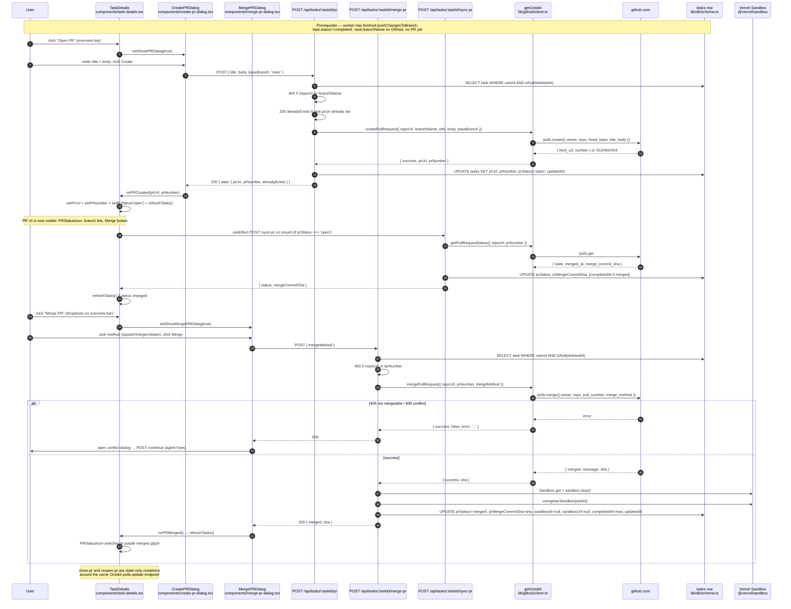
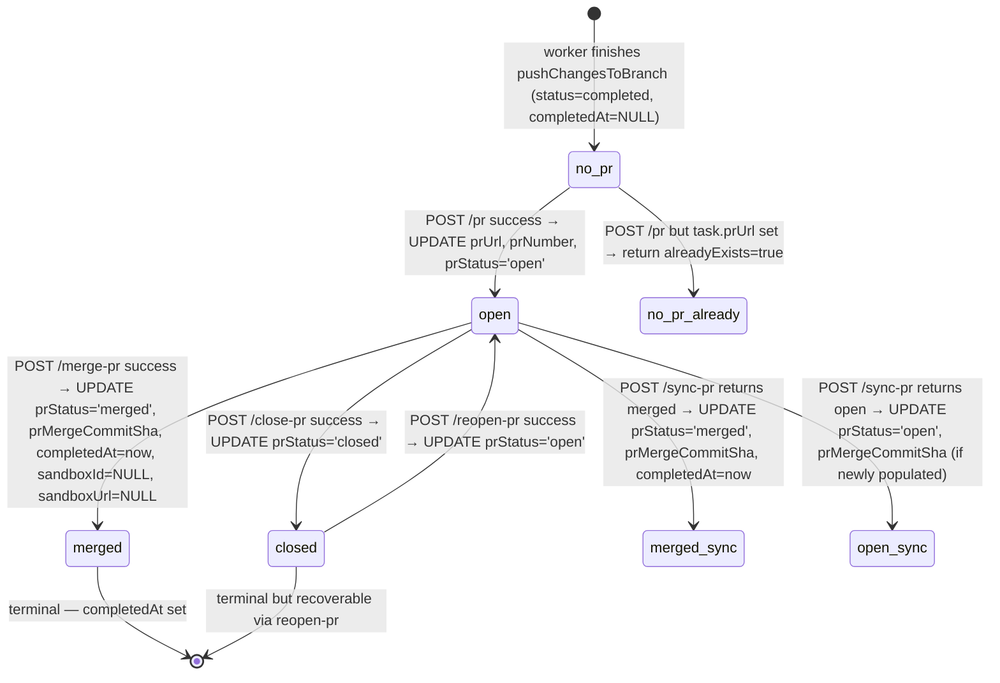

# Open, Review, and Merge a Pull Request

This page follows a single pull request from the moment the agent worker finishes `pushChangesToBranch` and writes `status='completed'` to the moment the PR is merged into `main`, the sandbox is torn down, and `completedAt` is set on the `tasks` row. It is the workflow complement to [GitHub Integration (Octokit & PR Workflow)](../systems/github-integration.md) (the `getOctokit()` factory and PR helpers), [Task Lifecycle & Status Model](../concepts/tasks-lifecycle.md) (the row schema and the special rule that `completedAt` is *only* set when a PR is merged), [Task API Surface](../systems/task-api.md) (the per-route catalog under `/api/tasks`), and [Create and Run a Task](./create-and-run-task.md) (the upstream workflow that ends with the branch on GitHub).

The shape that holds everything together is the `tasks` row's PR columns — `prUrl`, `prNumber`, `prStatus`, `prMergeCommitSha` — and the five POST endpoints that mutate them: `pr`, `merge-pr`, `close-pr`, `reopen-pr`, `sync-pr`. A sixth endpoint, `sync-changes`, is the in-editor companion that lets the user push additional local edits between PR creation and merge; a pair of GET endpoints (`check-runs`, `pr-comments`) reads CI status and PR conversation back from GitHub.

## Overview



*Diagram: the push → create-pr → UI → merge → `prStatus='merged'` lifecycle. The merge endpoint is the only one that combines a sandbox teardown with `completedAt`, and the only one whose side effects are intentional even after `keepAlive=true`. `sync-pr` is the reconciliation path used on mount and after the user has been away; `sync-changes` is the in-editor companion that pushes additional local edits between PR creation and merge.*

## Step 1 — Prerequisite: the branch is already on GitHub

This workflow starts where [Create and Run a Task → Step 7](./create-and-run-task.md) ends. The agent has finished, `pushChangesToBranch` in [lib/sandbox/git.ts](repo://lib/sandbox/git.ts#L5-L73) has committed and pushed to the branch, and `processTask` has called `logger.updateStatus('completed')` + `logger.updateProgress(100, 'Task completed successfully')` ([app/api/tasks/route.ts#L691-L693](repo://app/api/tasks/route.ts#L691-L693)). Crucially, **the `completed` status does not set `completedAt`** — see [Task Lifecycle & Status Model → When `completedAt` is written](../concepts/tasks-lifecycle.md#when-completedat-is-written) and the explicit comment at [lib/utils/task-logger.ts#L105](repo://lib/utils/task-logger.ts#L105): *"completedAt is only set when PR is merged, not when status changes to 'completed'."* The row at this point has `branchName` set and `prUrl` / `prNumber` / `prStatus` still `null` / `null` / `null`.

Two preconditions are enforced by the UI before the PR buttons appear, both at [components/task-details.tsx#L1414-L1416](repo://components/task-details.tsx#L1414-L1416):

- `currentStatus === 'completed'` — the overview bar renders the PR controls only after the worker has marked the task done.
- `task.repoUrl && task.branchName` — the server-side handlers also enforce this (`400 'Task does not have repository or branch information'` from [`pr/route.ts#L41-L43`](repo://app/api/tasks/[taskId]/pr/route.ts#L41-L43)).

When both are true and `!prUrl && prStatus !== 'merged' && prStatus !== 'closed'`, the **Open PR** button renders. When `prUrl` is set and `prStatus === 'open'`, the split button — **Merge PR** on the left, **Close PR** in a `DropdownMenu` on the right — replaces it. When `prStatus === 'closed'`, the **Reopen PR** button appears.

## Step 2 — Trigger: clicking "Open PR"

The overview bar lives at [components/task-details.tsx#L1405-L1567](repo://components/task-details.tsx#L1405-L1567). The handler `handleOpenPR` ([L1175-L1183](repo://components/task-details.tsx#L1175-L1183)) is two lines — a branch on whether a PR already exists:

```ts
const handleOpenPR = () => {
  if (prUrl) {
    handleOpenMergeDialog()
  } else {
    setShowPRDialog(true)
  }
}
```

This is also the button the sidebar exposes: the merge affordance is always routed through `handleOpenPR`, so a re-click on the same control after the PR exists opens the merge dialog rather than trying to create a second PR (the server has its own idempotency guard at [`pr/route.ts#L46-L58`](repo://app/api/tasks/[taskId]/pr/route.ts#L46-L58), but the client avoids the round-trip entirely).

The PR row is also reflected in the sidebar ([components/task-sidebar.tsx#L546-L570](repo://components/task-sidebar.tsx#L546-L570)): each task card shows a `PRStatusIcon` for `prStatus` overlaid with a `PRCheckStatus` indicator that lights up yellow/green/red/blue based on the GitHub Checks state.

## Step 3 — `CreatePRDialog`: the title/body form

[components/create-pr-dialog.tsx](repo://components/create-pr-dialog.tsx) is a `Dialog` (`sm:max-w-[600px]`) with two fields — a required `title` `Input` and an optional `body` `Textarea` — plus Cancel / Create Pull Request buttons. The component receives `defaultTitle={(task.title || task.prompt).slice(0, 255)}` and `defaultBody=""` from the parent ([L2646-L2653](repo://components/task-details.tsx#L2646-L2653)). The mobile-detection `useEffect` ([L41-L51](repo://components/create-pr-dialog.tsx#L41-L51)) disables `autoFocus` on narrow viewports so the iOS keyboard does not auto-pop.

`handleSubmit` ([L53-L97](repo://components/create-pr-dialog.tsx#L53-L97)) POSTs to `/api/tasks/${taskId}/pr` with `{ title, body, baseBranch: 'main' }` — `baseBranch` is hard-coded to `'main'` from the client and not currently a user choice. Three response shapes:

- `result.data.alreadyExists === true` — the server found `task.prUrl` already set; the dialog closes with an *info* toast.
- `result.data.prUrl && result.data.prNumber` — fresh creation; `onPRCreated(prUrl, prNumber)` fires.
- Anything else — an error toast.

`onPRCreated` ([components/task-details.tsx#L1185-L1190](repo://components/task-details.tsx#L1185-L1190)) writes the three new columns to local state and calls `refreshTasks()` so the sidebar reconciles without waiting for the next 5-second poll. The overview bar switches from "Open PR" to the merged "Merge PR + dropdown" control.

## Step 4 — `POST /api/tasks/:taskId/pr` (the create endpoint)

[app/api/tasks/[taskId]/pr/route.ts](repo://app/api/tasks/[taskId]/pr/route.ts) is a thin wrapper around `createPullRequest` from [lib/github/client.ts](repo://lib/github/client.ts#L91-L162). The full flow:

1. `getServerSession()` → `401 Unauthorized` if missing.
2. `db.select().from(tasks).where(and(eq(tasks.id, taskId), eq(tasks.userId, session.user.id), isNull(tasks.deletedAt))).limit(1)` → `404 Task not found` if the row is absent, soft-deleted, or owned by another user.
3. `400 'PR title is required'` if the request body lacks `title`.
4. `400 'Task does not have repository or branch information'` if `task.repoUrl` or `task.branchName` is missing.
5. **Idempotency check** — if `task.prUrl` is already set, return `200 { success: true, data: { prUrl, prNumber, alreadyExists: true } }` without calling GitHub. This is what makes re-opening a task safe: the user can navigate back to the task page, click the merge control, and the dialog either opens the merge flow or short-circuits with the *info* toast in Step 3.
6. `createPullRequest({ repoUrl, branchName, title, body, baseBranch })` — the helper itself:
   - Calls `getOctokit()`. A `null` token short-circuits with `success: false, error: 'GitHub account not connected'`.
   - `parseGitHubUrl(repoUrl)` extracts `{ owner, repo }`; a malformed URL returns `success: false, error: 'Invalid GitHub repository URL'`.
   - `octokit.rest.pulls.create({ owner, repo, title, body, head: branchName, base: baseBranch })` — this is the Octokit call that reaches `https://api.github.com/repos/{owner}/{repo}/pulls`.
   - On `422` → `'Pull request already exists or branch does not exist'`; `403` → `'Permission denied. Check repository access'`; `404` → `'Repository not found or no access'`.
7. On success, `db.update(tasks).set({ prUrl, prNumber, prStatus: 'open', updatedAt }).where(eq(tasks.id, taskId)).returning()` writes the new columns. The route returns `{ success: true, data: { prUrl, prNumber, task: updatedTask } }`. Any throw from the GitHub call or the DB write is caught by the bottom `try/catch` and returned as `500 { error: 'Failed to create pull request' }`.

## Step 5 — The PR UI surface

Once `prUrl`, `prNumber`, and `prStatus='open'` are on the row, three places in the React tree light up:

- **Overview bar — branch + PR link.** [components/task-details.tsx#L1590-L1621](repo://components/task-details.tsx#L1590-L1621) renders a coloured glyph plus a link to the PR (`href={prUrl}`, target `_blank`). The glyph comes from `PRStatusIcon` ([components/pr-status-icon.tsx](repo://components/pr-status-icon.tsx)): a green `octicon` for `open`, a red `GitPullRequest` from `lucide-react` for `closed`, a purple `octicon` for `merged`. These three SVG paths are inlined in `PRStatusIcon`, so the rendering does not depend on any external icon font.
- **Overview bar — the merge/close split button.** [L1428-L1491](repo://components/task-details.tsx#L1428-L1491) renders a `Button` ("Merge PR", `GitPullRequest` icon) with a sibling `DropdownMenuTrigger` (`ChevronDown`) that opens a `DropdownMenuContent` with one `DropdownMenuItem` ("Close PR", `XCircle`). Both fire `handleClosePR` / `handleOpenMergeDialog` respectively. The button label flips to "Closing..." / "Merging..." based on `isClosingPR` / `isMergingPR` so the user sees the spinner without a separate toast.
- **Sidebar card — check-run overlay.** [components/task-sidebar.tsx#L548-L553](repo://components/task-sidebar.tsx#L548-L553) renders `PRStatusIcon` wrapped in a `relative` div with `PRCheckStatus` overlaid at `-bottom-0.5 -right-0.5`. `PRCheckStatus` ([components/pr-check-status.tsx](repo://components/pr-check-status.tsx)) fetches `/api/tasks/${taskId}/check-runs` on mount and re-polls every 30 seconds (see Step 9 below), then renders a colour-coded dot — red (failure / cancelled), yellow pulsing (`in_progress` / `queued`), blue (neutral), green checkmark (all `success`). Failures are checked before in-progress so they are always visible.

A `useEffect` on the task page also runs `sync-pr` on mount ([L903-L934](repo://components/task-details.tsx#L903-L934)) when `task.prStatus === 'open' || !task.prStatus` so that a PR that was merged or closed by the user on github.com while they were away from the page gets reconciled on the next visit. See Step 7 below.

## Step 6 — `MergePRDialog`: the merge-method picker

[components/merge-pr-dialog.tsx](repo://components/merge-pr-dialog.tsx) is a `Dialog` (`sm:max-w-[500px]`) with a `Select` for merge method — `squash` (default), `merge`, `rebase` — plus Cancel / Merge Pull Request buttons. The dialog renders only when `prUrl && prNumber` are set ([L2656-L2666](repo://components/task-details.tsx#L2656-L2666)) because the two `prUrl`/`prNumber` props feed both the dialog header text ("This will merge PR #N into the main branch") and the parent task-page's local state.

`handleMergePR` ([L42-L85](repo://components/merge-pr-dialog.tsx#L42-L85)) does three notable things:

1. Calls `onMergeInitiated()` immediately (which sets `isMergingPR` to `true` on the parent) so the button shows the spinner without waiting for the network round-trip.
2. POSTs `/api/tasks/${taskId}/merge-pr` with `{ mergeMethod }`. There is no client-side `commitTitle` / `commitMessage` — those are server-side optional fields, currently left `undefined` in the UI.
3. On a successful `result.success`, calls `onPRMerged()` (which `refreshTasks()`s) and closes the dialog. **The success toast is not shown here** — the parent renders it via a separate `useEffect` when `prStatus === 'merged'` flips ([L888-L892](repo://components/task-details.tsx#L888-L892)), avoiding the "toast before the row actually updated" race.

### The conflict-resolution dialog

When `result.error` contains `'conflict'` or `'mergeable'` — the two strings the server's error mapper emits for GitHub `409` and `405` ([lib/github/client.ts#L242-L253](repo://lib/github/client.ts#L242-L253)) — the dialog flips to a second `Dialog` titled "Merge Conflict Detected" ([L168-L207](repo://components/merge-pr-dialog.tsx#L168-L207)) with a single action: **Fix with Agent**. `handleAgentFixConflict` ([L87-L118](repo://components/merge-pr-dialog.tsx#L87-L118)) sends the task a follow-up message via `POST /api/tasks/${taskId}/continue`:

```ts
message:
  'Fix merge conflicts in the current branch and prepare it for merging. ' +
  'Review the conflicting changes carefully and resolve them intelligently, ' +
  'preserving the intent of both sets of changes where possible.'
```

This is the only place the `continue` endpoint is invoked from a button — the others are follow-up chat messages from the user. See [Workflow: Continue & Keep Alive](./follow-up-and-keep-alive.md) for the deeper mechanics of how the agent reconnects to the sandbox, runs the conflict resolution, and pushes the result back to the same branch.

## Step 7 — `POST /api/tasks/:taskId/merge-pr` (the merge endpoint)

[app/api/tasks/[taskId]/merge-pr/route.ts](repo://app/api/tasks/[taskId]/merge-pr/route.ts) is the only endpoint in this workflow that mutates `completedAt`. The flow:

1. Standard preamble — `401` / `404` / `400 'Task does not have repository or PR information'` if `repoUrl` or `prNumber` is missing.
2. `mergePullRequest({ repoUrl, prNumber, commitTitle, commitMessage, mergeMethod })` from [lib/github/client.ts#L195-L273](repo://lib/github/client.ts#L195-L273). The default `mergeMethod` is `'squash'` (matching the dialog's default). Status-code translations: `405` → `'Pull request is not mergeable'`, `409` → `'Merge conflict - cannot auto-merge'`, `403` → `'Permission denied. Check repository access'`, `404` → `'Pull request not found'`. Any other throw returns `{ success: false, error: 'Failed to merge pull request' }`.
3. **Sandbox teardown, best-effort.** If `task.sandboxId` is set, the handler reconnects via `Sandbox.get({ sandboxId, teamId, projectId, token })` and calls `sandbox.stop()` + `unregisterSandbox(taskId)`. Errors are caught and logged but do not roll back the merge — once GitHub has accepted the merge, the local state must reflect it.
4. **Row update with the special rule.** The single SQL `UPDATE` is what makes `completedAt` meaningful:

```ts
await db.update(tasks).set({
  prStatus: 'merged',
  prMergeCommitSha: result.sha || null,
  sandboxId: null,
  sandboxUrl: null,
  completedAt: new Date(),
  updatedAt: new Date(),
}).where(eq(tasks.id, taskId))
```

This is the canonical write of `completedAt` — *not* the worker's `logger.updateStatus('completed')`, which explicitly does not write it. The `tasks` row now unambiguously means "the work has shipped to `main`", and any later query that wants to filter "truly done" tasks uses `completedAt IS NOT NULL`.

5. **Returns** `{ success: true, data: { merged: response.data.merged, message: response.data.message, sha: response.data.sha } }` so the dialog's success branch can pick the right copy.

<!-- openwiki: broken internal link [../concepts/sandbox-lifecycle.md#path-d--merge-triggered-teardown] heading anchor "path-d--merge-triggered-teardown" does not exist in "../concepts/sandbox-lifecycle.md". Fix the href or restore the target, then delete this comment. -->
The `keepAlive` flag is **intentionally not consulted** here — the merge is treated as terminal, and any sandbox that was being preserved for a follow-up is released. This is documented in the [Task API Surface](../systems/task-api.md) summary and in [Sandbox Lifecycle → Path D — Merge-triggered teardown](../concepts/sandbox-lifecycle.md#path-d--merge-triggered-teardown).

## Step 8 — `close-pr` / `reopen-pr` (state-only mutations)

[app/api/tasks/[taskId]/close-pr/route.ts](repo://app/api/tasks/[taskId]/close-pr/route.ts) and [app/api/tasks/[taskId]/reopen-pr/route.ts](repo://app/api/tasks/[taskId]/reopen-pr/route.ts) are nearly identical — both are thin wrappers over `octokit.rest.pulls.update({ owner, repo, pull_number, state: 'closed' | 'open' })`. They share the same shape:

1. Standard preamble → `400 'Task does not have a pull request'` if `repoUrl` or `prNumber` is missing.
2. `getOctokit()` → `401 'GitHub authentication required. Please connect your GitHub account.'` if `octokit.auth` is falsy.
3. `parseGitHubUrl(task.repoUrl)` → `400 'Invalid GitHub repository URL'` if the regex doesn't match.
4. `octokit.rest.pulls.update({ owner, repo, pull_number, state })`.
5. Status-code translations: `404` → `'Pull request not found'`, `403` → `'Permission denied. Check repository access'`, anything else → `500`.
6. `db.update(tasks).set({ prStatus: 'closed' | 'open', updatedAt }).where(eq(tasks.id, task.id))` — note that **neither route sets `completedAt`**. Closing is not an end state; reopening is not a fresh start; both are reversible operations on the same row.

The client-side handlers `handleClosePR` ([L1244-L1268](repo://components/task-details.tsx#L1244-L1268)) and `handleReopenPR` ([L1218-L1242](repo://components/task-details.tsx#L1218-L1242)) set the `isClosingPR` / `isReopeningPR` flags so the overview bar can show the spinner, fire the POST, then call `refreshTasks()`. The actual toast (`'Pull request closed successfully!'` / `'Pull request reopened successfully!'`) is rendered by the `useEffect` at [L878-L887](repo://components/task-details.tsx#L878-L887) when `prStatus` actually flips — the same race-avoidance pattern as `handlePRMerged`.

## Step 9 — `sync-pr`: reconcile the row with GitHub

[app/api/tasks/[taskId]/sync-pr/route.ts](repo://app/api/tasks/[taskId]/sync-pr/route.ts) is the single endpoint the client uses to *catch up* — re-reading the PR's actual state from GitHub. The route calls `getPullRequestStatus({ repoUrl, prNumber })` from [lib/github/client.ts#L278-L349](repo://lib/github/client.ts#L278-L349), which maps `merged_at` / `state` to `'merged' | 'closed' | 'open'` and returns `mergeCommitSha` from `merge_commit_sha`.

The row update has two cases:

- **`status !== 'merged'`** — writes `{ prStatus, prMergeCommitSha, updatedAt }`.
- **`status === 'merged'`** — also writes `completedAt: new Date()`. This is the second of the three places `completedAt` is set (the other two being `PATCH /api/tasks/:taskId` with `action: 'stop'` and `POST /api/tasks/:taskId/merge-pr`). The comment at [sync-pr/route.ts#L50](repo://app/api/tasks/[taskId]/sync-pr/route.ts#L50) is explicit: *"Set completedAt when PR is merged."*

The client calls it in two situations:

1. On mount, from the task page's `useEffect` at [components/task-details.tsx#L903-L934](repo://components/task-details.tsx#L903-L934), whenever the local `task.prStatus === 'open' || !task.prStatus`. This catches merges/closes the user performed on github.com while the app was closed.
2. Implicitly — the polling-driven `useTask` re-reads the row, and any change to `prStatus` from `sync-pr` propagates through `refreshTasks()` ([L920-L922](repo://components/task-details.tsx#L920-L922)) and the next 5-second `GET /api/tasks/:taskId` poll.

## Step 10 — `sync-changes`: push additional local edits

[app/api/tasks/[taskId]/sync-changes/route.ts](repo://app/api/tasks/[taskId]/sync-changes/route.ts) is the in-editor companion to the PR workflow. Where `merge-pr` talks to GitHub, `sync-changes` talks to the sandbox. The handler reconnects to the sandbox (via the standard `getSandbox(taskId) ?? Sandbox.get({ sandboxId, ... })` pattern with the `410 'Sandbox is not running'` mapping for an expired VM) and runs four `git` commands in `cwd: PROJECT_DIR`:

1. `git add .` — `500 'Failed to add changes'` on non-zero exit.
2. `git status --porcelain` — if the trimmed output is empty, returns `{ success: true, committed: false, pushed: false, message: 'No changes to sync' }` *without* committing.
3. `git commit -m <commitMessage || 'Sync local changes'>` — `500 'Failed to commit changes'` on non-zero exit.
4. `git push origin <task.branchName>` — `500 'Failed to push changes'` on non-zero exit.

Each step captures `stderr` and returns it in the `500` body for the client to display. The route does **not** touch `prStatus` or `completedAt` — pushing new commits onto the PR branch is orthogonal to whether the PR is open / closed / merged. This is what makes "edit a file in the editor, click Sync, then click Merge PR" a coherent loop.

This is functionally the same path that `pushChangesToBranch` ([lib/sandbox/git.ts#L5-L73](repo://lib/sandbox/git.ts#L5-L73)) takes during the worker's normal completion; the difference is that the worker calls it once with an AI-generated commit message and stops, while `sync-changes` is user-driven and re-runnable.

## Step 11 — `check-runs` and `pr-comments` (read-side companions)

Two GET endpoints complement the PR row by reading GitHub-side state. They are not part of the mutation flow but are what the sidebar's `PRCheckStatus` overlay and the chat-side PR comments UI consume.

### `GET /api/tasks/:taskId/check-runs` — CI status for the branch head

[app/api/tasks/[taskId]/check-runs/route.ts](repo://app/api/tasks/[taskId]/check-runs/route.ts) exports `dynamic = 'force-dynamic'` and resolves the branch's head commit via `octokit.rest.repos.getBranch({ owner, repo, branch: task.branchName })`, then calls `octokit.rest.checks.listForRef({ ref: commitSha })`. The shape returned to the client is flattened: `{ id, name, status, conclusion, html_url, started_at, completed_at }`. A `404` on `getBranch` is not an error — the branch may still be propagating on GitHub — and the route returns `{ success: true, checkRuns: [] }` instead. `PRCheckStatus` consumes this and renders:

- `hasFailed` (`conclusion === 'failure' | 'cancelled'`) — red dot, always shown first so failures are never masked by in-progress siblings.
- `hasInProgress` (`status === 'in_progress' | 'queued'`) — yellow pulsing dot.
- `hasNeutral` (`conclusion === 'neutral'`) — blue dot.
- `allPassed` (every run's `status === 'completed' && conclusion === 'success'`) — green checkmark.

The component is silent (renders `null`) for non-`open` PRs, while loading, or when the array is empty — so a freshly created PR that hasn't started CI yet does not show an empty indicator.

### `GET /api/tasks/:taskId/pr-comments` — flatten issue + review comments

[app/api/tasks/[taskId]/pr-comments/route.ts](repo://app/api/tasks/[taskId]/pr-comments/route.ts) issues two Octokit calls in parallel via `Promise.all`:

- `octokit.rest.issues.listComments({ issue_number: prNumber })` — general PR conversation.
- `octokit.rest.pulls.listReviewComments({ pull_number: prNumber })` — line-anchored review comments.

The two arrays are flattened into one shape `{ id, user: { login, avatar_url }, body, created_at, html_url }` and sorted ascending by `created_at` so the client can render a single chronological thread.

## Lifecycle, invariants, and failure modes

### Lifecycle of the PR columns



*Diagram: the five states of the `prStatus` enum (`null` / `open` / `closed` / `merged`) and the four writes that move between them. `completedAt` is set on exactly two transitions: the merge endpoint itself, and `sync-pr` observing a merge the user performed on github.com. Reopen and close never touch `completedAt`.*

### Invariants

The PR columns are governed by a handful of invariants that fall out of the way these routes are written:

- **`prStatus='merged'` ⇔ `completedAt IS NOT NULL`** (modulo a window where `merge-pr` has not yet committed). The merge route writes both in the same `UPDATE`; `sync-pr` writes both when it observes a merge; nothing else writes `completedAt`. There is no code path that sets `prStatus='merged'` without also setting `completedAt`.
- **`sandboxId = NULL` ⇔ `prStatus='merged'`** is **not** a hard invariant — `sandboxId` is cleared by the merge route but can be `NULL` for many other reasons (worker never created a sandbox, sandbox timed out, manual stop). It is, however, a useful operational signal: "no sandbox and `prStatus='merged'`" is the steady state of a completed task.
- **`task.prUrl IS NOT NULL ⇔ task.prNumber IS NOT NULL`**. The four writes that set `prUrl` also set `prNumber` (the `pr` route's `createPullRequest` helper returns them together), and nothing in the codebase sets one without the other.
- **`sync-pr` is idempotent.** It always overwrites `prStatus`, `prMergeCommitSha`, and conditionally `completedAt` with values derived from the current GitHub state; running it twice in a row yields the same row.
- **No route except `merge-pr` (and indirectly `sync-pr` on observation of a merge) stops the sandbox.** Closing or reopening a PR leaves the sandbox alone — the user can keep editing the branch.
- **`getOctokit()` failing is a 401, never a 500.** Every PR route that uses Octokit gates on `octokit.auth` and returns `401 'GitHub authentication required'` rather than letting the SDK throw.

### Failure modes

- **`pr/route.ts` returns `500`** — the client (`CreatePRDialog`) toasts the error and the dialog stays open with the title/body preserved so the user can retry.
- **`merge-pr` returns `500` because of a conflict (`409`) or non-mergeable state (`405`)** — the dialog flips to the *Fix with Agent* dialog. The agent's follow-up message via `/api/tasks/:taskId/continue` produces a new commit; the user re-clicks Merge PR once it resolves.
- **`merge-pr` returns `500` because GitHub is unreachable** — the client toasts the error; the user retries. Because the merge is atomic on GitHub's side, a transient network failure during the API call never leaves the PR in a half-merged state.
- **`merge-pr` succeeds but `sandbox.stop()` throws** — the error is logged (`'Error stopping sandbox after merge'`) and the merge still commits. The route comment is explicit: *"Log error but don't fail the merge."* The sandbox is then cleaned up by the SDK's own timeout the next time the serverless execution ends.
- **`sync-pr` returns `500`** — the client silently swallows it (`console.error('Failed to sync PR status:', error)`). The next 5-second poll will retry, and the user-facing UI is not blocked on the sync.
- **`sync-changes` returns `410`** — the SDK reports the sandbox is no longer running. The client can prompt the user to start a fresh sandbox with `POST /api/tasks/:taskId/start-sandbox` so they can keep editing before merging.
- **`check-runs` returns `404` from `repos.getBranch`** — the route deliberately maps this to `{ success: true, checkRuns: [] }` so a still-being-created branch does not flicker an error in the sidebar.
- **The `pr` endpoint is called twice for the same task** — the idempotency check at [L46-L58](repo://app/api/tasks/[taskId]/pr/route.ts#L46-L58) returns the existing `prUrl`/`prNumber` without contacting GitHub. This is also the recovery path for a network failure between GitHub's `201 Created` and the local `UPDATE`: on the next click, the existing PR is surfaced and the merge flow proceeds.
- **The user clicks Merge PR before the merge conflict fix has produced a push** — the merge endpoint fails again with the same conflict mapping. The client offers the same `Fix with Agent` retry; there is no infinite-loop guard because the agent's fix either succeeds (PR is now mergeable) or fails for a different reason.

## Cross-cutting concerns

- **`tasks.logs` is not touched by any PR endpoint.** The PR endpoints write only to `prUrl` / `prNumber` / `prStatus` / `prMergeCommitSha` / `sandboxId` / `sandboxUrl` / `completedAt` / `updatedAt`. The worker's logs and the live editor's logs are unaffected by PR lifecycle events.
- **The DB row is the only shared state between worker and client.** No in-memory coupling exists; `useTask` polls every 5 seconds and `refreshTasks()` is the explicit reconcile trigger. PR transitions are visible to the UI only after the row is updated and the next poll (or `refreshTasks()`) reads it.
- **`Octokit` instances are short-lived.** `getOctokit()` constructs a fresh `new Octokit({ auth: token || undefined })` per call; the token comes from `getUserGitHubToken()` which decrypts from `accounts.accessToken` or `users.accessToken` on every invocation. There is no module-level Octokit singleton.
- **All five POST endpoints share the `getServerSession + eq(userId) + isNull(deletedAt)` preamble.** No PR endpoint returns `403`; the implicit ownership filter collapses cross-user probing into `404` so a non-owner cannot enumerate PR URLs.
- **The merge endpoint's sandbox teardown is irreversible.** The `sandbox.stop()` call has no rollback; once the SDK reports success, the VM is gone. Any "I want to keep editing after merging" intent must be expressed *before* the merge click — either by finishing edits and clicking Sync first, or by simply not merging yet.
- **`mergeMethod` is the only PR field the user can choose on the client.** `title`, `body`, `baseBranch`, `commitTitle`, and `commitMessage` are all server-only or dialog-defaulted. Adding new client-side fields means a new dialog or a new prop on `MergePRDialog`.

## What to read next

- [Create and Run a Task](./create-and-run-task.md) — the upstream workflow that ends with `pushChangesToBranch` and `status='completed'`, leaving the row ready for this workflow.
- [Continue & Keep Alive](./follow-up-and-keep-alive.md) — the agent-reconnect loop used by `MergePRDialog`'s *Fix with Agent* action.
- [Task Lifecycle & Status Model](../concepts/tasks-lifecycle.md) — the full row schema, the five `status` values, and the special rule for `completedAt` that the merge endpoint is the canonical writer of.
- [Sandbox Lifecycle](../concepts/sandbox-lifecycle.md) — what `sandbox.stop()` + `unregisterSandbox` actually do, and why `keepAlive=true` is ignored by `merge-pr`.
- [GitHub Integration (Octokit & PR Workflow)](../systems/github-integration.md) — the `getOctokit()` factory, the two-tier `getUserGitHubToken()` lookup, and the `createPullRequest` / `mergePullRequest` / `getPullRequestStatus` helpers that the routes call into.
- [Task API Surface](../systems/task-api.md) — the full per-route catalog under `/api/tasks`, including the `pr-comments` and `deployment` GET endpoints that read additional GitHub state.
